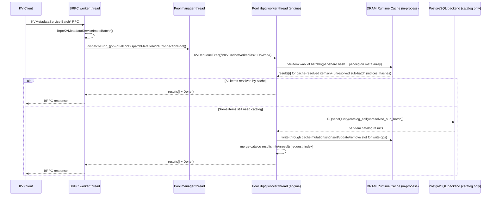

# FalconFS KV Cache Memory Pool Design (v6 Full)

## Document Info

| Item | Value |
|---|---|
| Version | v6.4 full design |
| Date | 2026-05-09 |
| Status | Full implementation design |
| Transport | BRPC only |
| Proto files | `kv_common.proto`, `kv_metadata_service.proto`, `kv_data_service.proto` |
| Scope | FalconFS KV cache metadata + memory pool + Store data path + vLLM integration |

This document is self-contained. It does not depend on any previous design document.

### Changelog (v6.1)

1. Service hosting model clarified: DN BRPC runs **inside** the PostgreSQL extension and dispatches jobs to the existing PG connection-pool workers, mirroring `BrpcMetaServiceImpl` → `PGConnectionPool::DispatchMetaServiceJob`.
2. Transaction lifecycle made explicit: catalog access uses `BeginInternalSubTransaction` / `ReleaseCurrentSubTransaction` exactly like `FalconCreateHandle`, and reuses `BATCH_OPERATION_GROUP_SIZE = 8` for the inner sub-batch.
3. Bitmap and lease map (legacy auxiliary state) moved to **PostgreSQL shared memory** (LWLock-protected, like `ShardTableShmemInit`) where still used by older hooks; v6.4 runtime cache is in-process in the pool worker (see changelog v6.4).
4. Recovery rules differentiated: DN restart preserves Store DRAM (rollback `EVICTING -> STORED` is valid), while Store restart loses DRAM (DRAM-only blocks must transition to `FAILED`).
5. vLLM integration aligned with the upstream `OffloadingManager` API surface: external methods stay singular (`lookup`, `prepare_load`, `complete_load`, `prepare_store`, `complete_store`, `touch`); batching happens inside the C++ client.
6. Reader race against eviction explicitly closed: hot-path lookups must use `renew_lease_on_hit=true`.
7. Added GUC plan, init sequencing, and a code-mapping appendix tying every component to existing FalconFS files (BRPC server, perf macros, shard table cache, connection pool, etc.).

### Changelog (v6.2)

1. Lease semantics corrected: leases protect DRAM blocks from eviction during access and are **not client-owned**. Removed `owner_client_id` / owner-claim semantics from the design.
2. Concurrent tuple update handling made explicit: `CatalogTupleUpdateWithInfo` may raise a PostgreSQL concurrent-update error; handlers convert it into retryable `CAS_CONFLICT` for the client.
3. Store registration redesigned: each Store partitions its DRAM pool into per-DN continuous regions and registers one region with each DN. DN bitmaps manage only the region assigned to that DN.
4. Epoch semantics clarified: epochs fence stale metadata/location/lease observations after DN or Store restart; they are not ownership markers.
5. Store failure handling expanded: heartbeat-based drain/offline/quarantine states temporarily remove slow or failed Stores from allocation while recovery/restart proceeds.

### Changelog (v6.3)

1. Metadata runtime model aligned with implementation: durable block rows remain in `falcon_kvblock_table`, while DRAM-resident per-block runtime state (status mirror, lease token/expiry, CLOCK `ref_bit`) is kept in PG shared memory (`KVDramMeta*`).
2. Eviction candidate source updated from process-local LRU abstraction to shared `KVDramMetaColdCandidates` CLOCK scan over the DRAM-meta hash table.
3. Eviction lifecycle clarified: successful `EVICTING -> EVICTED` removes DRAM-meta entry and frees bitmap slot; persistent catalog row remains and records `EVICTED` state/path.
4. Runtime wiring clarified: `KVMetadataEngine` prefers `KVShmemRuntimeOps.dram_meta_*`; legacy `lease_*` hooks are fallback-only when full DRAM-meta ops are unavailable.
5. Added `falcon_kv.dram_meta_max_entries` sizing guidance (current max 100,000,000; high values require large add-in shared memory budget).

### Changelog (v6.4)

This release re-architects the metadata engine to **cleanly decouple DRAM runtime state from persistent catalog state**, and to **co-locate DRAM runtime state with the libpq worker pool** so all worker threads share it as plain in-process memory rather than through PG shared memory + LWLocks.

Summary of the shift:

1. **Two metadata tiers, explicitly separated**:
   - **DRAM Runtime Cache** (volatile): bitmap + per-block meta entry + per-shard hash index + lease + CLOCK `ref_bit`. Lives **inside the BackgroundPoolManager process** that hosts the BRPC server and the libpq connection pool. Owned and mutated by pool-worker threads using C++ atomics / `std::shared_mutex` / striped locks. Indexes only blocks that are currently in DRAM.
   - **Persistent Catalog** (durable): `falcon_kvblock_table` rows. Indexes **every** block (DRAM-resident, EVICTED to SSD, FAILED). Mutated only through libpq SQL calls into PG backends.
2. **DRAM cache is a write-through cache before the catalog**: every cache-side mutation (insert / status update / free) is paired with a catalog mutation issued through libpq; the cache mutation only commits if the catalog mutation succeeds.
3. **Each meta entry represents exactly one DRAM block**. When the block is evicted to SSD (`EVICTING -> EVICTED`), its meta entry is freed and its bitmap bit is cleared in the same critical section. Catalog row remains and records `EVICTED` + `evicted_path`.
4. **Per registered DRAM region**: one fixed bitmap of `total_blocks` bits and one fixed meta array of `total_blocks` entries, sharing the same index space (bit `i` ↔ slot `i`). No allocator metadata fragmentation; the bitmap is the meta-slot allocator.
5. **Per catalog shard**: one concurrent hash map `block_hash -> (region_id, slot_idx)` that is the only block-hash → DRAM-slot index. Sharded so different shards do not contend.
6. **Recovery is parallel by shard**: pool-worker threads each scan one shard via libpq and repopulate their own per-shard hash maps and the per-region meta arrays/bitmaps. Recovery completes before BRPC starts accepting requests.
7. **CLOCK LRU recycles DRAM blocks and meta space together**: candidate scan is per-region over the dense meta array; eviction success releases the bitmap bit, the meta slot, and the per-shard hash map entry atomically.
8. **Lookup/update path**:
   - Lookup hit (per-shard hash map finds slot): pool-worker returns directly without touching the PG backend.
   - Lookup miss: pool-worker issues a libpq `SELECT` against `falcon_kvblock_table`; an `EVICTED` row returns the SSD path and stays out of DRAM cache; a missing row returns `NOT_FOUND`.
   - Insert/update: pool-worker first reserves bitmap+slot or finds the existing slot, then issues the catalog SQL (INSERT/UPDATE with CAS on `version`); on catalog success the cache mirror is finalized; on catalog failure the cache reservation is rolled back.
9. **Removed**: PG-shmem `KVDramMeta*` hash, `KVLease*` shmem hash, and `KVBitmap*` shmem segment. `falcon_kv_metadata_call_by_serialized_shmem_internal` is reduced to a thin **catalog-only RPC** (the engine no longer runs in the PG backend at all).
10. **Process model invariant**: there is exactly one BackgroundPoolManager process per DN; therefore exactly one DRAM cache instance per DN. Multiple PG backends remain as catalog executors but do not own runtime cache state.
11. **Per-item split-and-combine for mixed-hit/miss batches**: handlers with a catalog fast-path — `BatchLookupWithLease` **and `BatchAllocateWithLease`** — first walk each item over the in-process cache and write resolved-by-cache results into their original `results[i]` slot. Only the unresolved items are collected into a single libpq sub-batch (preserving each item's original index), dispatched to the PG backend in one libpq round-trip, and merged back into `results[]`. **`BatchRenewLease`** is **not** in this set: it is **DRAM-only** per §11.3 (no catalog `SELECT` on miss; miss ⇒ `LEASE_EXPIRED(retryable=true)` and the client refreshes via `BatchLookupWithLease`). The response is returned in the original request order. The catalog SQL function therefore receives a sub-batch whose size is `<= request_items`, never larger, and cache-resolved items pay zero PG round-trip cost. For `BatchAllocateWithLease` specifically: an item whose `block_hash` is already present in the cache (because a prior allocate or recovery seeded it) does **not** re-reserve a bitmap slot and does **not** re-issue a catalog `INSERT`; it returns the existing slot/lease with `reused_existing_allocation = true`.
12. **Conflict semantics on the same logical block hash**: the metadata DN treats the per-shard hash index as the single source of truth for *which* DRAM slot holds a given `block_hash`, and uses it to make concurrent operations on the same hash idempotent rather than fatal. Two race classes are explicitly defined (full pseudocode in §7.11):
    - **Lookup races allocate/store**: a `BatchLookupWithLease` may see `NOT_FOUND` (no row yet), `ALLOCATED` (catalog row + DRAM reservation exist, **committed bytes not yet visible** for readers), `STORED` (bytes committed and safe for `BatchReadBlock`), `EVICTING` (in-flight evict), or `EVICTED` (durable row on SSD with `evicted_path`). For **tensor load (`prepare_load`)**: treat **`STORED` and `EVICTED` as usable byte hits** (DRAM vs SSD leg of `LoadStoreSpec` respectively); treat **`ALLOCATED` as not a DRAM read hit** — return an **empty / no-DRAM** load spec so clients never call `BatchReadBlock` on a slot that can still be empty or torn until `ALLOCATED → STORED`. For **prefix existence only** (`lookup` returning a boolean), `ALLOCATED` may still be considered “present” so a caller can wait or coordinate; it must not imply safe DRAM reuse. **`EVICTED` is not the same as `NOT_FOUND`**: bytes exist on SSD and are loaded via `BatchReadFromSSD`, not recomputed from the prompt. The DN never lies about state (§7.3, §7.11.2, §12.3.1).
    - **Allocate races allocate (same `block_hash`)**: at most one allocate wins the bitmap+catalog `INSERT`. Concurrent losers fold onto the winner's slot via the per-shard hash index (cache pre-step) or via the catalog primary key (catalog pre-step), free their reserved bitmap bit, and return `reused_existing_allocation = true` with the winner's `(store_node_id, pool_offset, lease_token, version)`. The DN never returns two distinct DRAM slots for the same `block_hash`.
    - **Store races store (same `block_hash`)**: because KV blocks are immutable after `ALLOCATED -> STORED`, the *second* `BatchUpdateBlockStatus(ALLOCATED -> STORED)` on a row that is already `STORED` is treated as a no-op success when the request sets `allow_noop_if_already_target=true`; the corresponding `BatchWriteBlock` byte payload from the redundant client is dropped at the OffloadingManager (§16) before it reaches the Store. From vLLM's perspective: identical content + identical `block_hash` ⇒ at most one Store write actually lands.
    - **Lookup vs allocate is OK; concurrent stores must be deduplicated**: lookup is allowed to return `null`/`NOT_FOUND` so vLLM may recompute; redundant stores of the same `block_hash` are dropped client-side (§16.1, §13.2) so the cluster never absorbs two payloads for one logical block.
13. **`ALLOCATED` vs `STORED` vs `EVICTED` for reads**: `BatchLookupWithLease` / cache pass must not treat `ALLOCATED` as a `BatchReadBlock` hit; `EVICTED` is an SSD read hit for `prepare_load`, not a prompt recompute. **`BatchReadFromSSD`** stays metadata-neutral; rehydration to DRAM `STORED` is an explicit DN + Store sequence (§12.3.1).
14. **Promote-on-read for `EVICTED` blocks**: hot blocks drift back into DRAM via an **asynchronous, best-effort** promote pipeline owned by the OffloadingManager (§12.3.2 / §12.3.3 / §13.4). Foreground load reads SSD via **FalconFS Direct I/O on `evicted_path`** (or `BatchReadFromSSD`) and returns immediately; a background worker pool then issues the standard `BatchAllocateWithLease(hint=PROMOTE_FROM_EVICTED) + BatchWriteBlock + BatchUpdateBlockStatus(ALLOCATED → STORED)` triple to repopulate DRAM with catalog transition `EVICTED → ALLOCATED → STORED` and a fresh `version`. Promote is bounded (drop-on-full queue, no infinite retry), gated by an admission policy (hot-key sketch + DRAM-pressure watermark + per-DN inflight cap), and never extends foreground latency. New GUCs: `falcon_kv.promote_enabled`, `falcon_kv.promote_queue_capacity`, `falcon_kv.promote_max_inflight`, `falcon_kv.promote_min_access_count`, `falcon_kv.promote_when_pressure_below`, `falcon_kv.promote_via_falconfs_direct_io`.

### Changelog (v6.4 implementation lock-in)

The §4.1.1 / §4.1.3 / §4.2 / §4.2.1 / §4.7 prose now matches the actual code in `falcon/connection_pool/`, `falcon/metadb/`, `falcon/brpc_comm_adapter/`, and `vllm_kv_cache/src/metadata/`. Locked-in implementation choices (subset that diverged from earlier drafts of this document):

1. **Catalog SQL surface is `falcon_kv_metadata_catalog_call(int method, bytea payload) RETURNS bytea`**, not a shmem-shift handle. The whole sub-batch fits in one `bytea` parameter; `PQexecParams` with binary format issues exactly one PG-protocol message per sub-batch. The earlier draft `falcon_kv_metadata_catalog_call_by_serialized_shmem_internal(method, shmem_shift, request_size, signature)` was dropped because the BRPC plugin is the only catalog client and does not need cross-process shmem visibility into FalconShmemAllocator (FalconFS-meta `SingleWorkerTask` / `BatchWorkerTask` keep using their existing shmem path).
2. **Wire format is POD struct arrays defined in `kv_catalog_wire.h`**, not protobuf. This keeps `falcon.so` free of KV protobuf descriptors so duplicate descriptor registration (which crashes the bgworker at plugin load) is structurally impossible. Plugin-side packers/unpackers are in `falcon/brpc_comm_adapter/kv_runtime_register.cpp`.
3. **Engine ↔ pool worker hand-off is one C function pointer**, registered at plugin startup via `FalconKVSetProcessJob` (declared in `falcon/include/connection_pool/falcon_kv_runtime_bridge.h`, exported from `falcon.so` with default visibility). The pool worker (`falcon.so`) calls the pointer with its own `PGconn`; the implementation (`libbrpcplugin.so`) does protobuf parsing, engine call, catalog round-trip, response serialization. There is no protobuf in `falcon.so` and no engine code in `falcon.so`.
4. **`PGConnectionPool` carries a dedicated `kvTaskList`** and `KVDequeueExec` dispatches each KV job to a distinct `PGConnection` worker. Concurrent KV BRPC calls therefore execute against different PG backends in parallel — not serialized through one shared libpq connection.
5. **Catalog accessor is `falcon/metadb/kvblock_table.{c,h}`** with C functions `FalconKVBlockBatchLookup` / `FalconKVBlockBatchInsertAllocated` / `FalconKVBlockBatchCASStatusUpdate` / `FalconKVBlockBatchDelete`. They use PG internal APIs (`table_open`, `systable_beginscan` with `F_BYTEAEQ`, `heap_modify_tuple`, `CatalogTupleInsertWithInfo`, `CatalogTupleUpdateWithInfo`, `simple_heap_delete`). No raw SQL on the hot path; the only SQL the plugin emits is the call to `falcon_kv_metadata_catalog_call`.
6. **`falcon_kvblock_table` is one table per DN**, not sharded by `range_point`. The schema is created by `pg_catalog.falcon_create_kvblock_table()` (`falcon/distributed_backend/distributed_backend_falcon.c`, idempotent), invoked once per DN by the plugin at startup. Only the `(status, updated_at_ms)` btree index is materialized; `(store_node_id, pool_offset)` is not, because runtime resolution goes through the DRAM shard hash index (§7.1).
7. **Recovery driver and `EVICTING` reconcile scan are deferred.** `ScanShardForRecovery` / `ScanEvictingForReconcile` (§4.2 originally listed) are not yet implemented; an empty-cache restart is the current behavior. §15 still describes the intended design and the same module (`kvblock_table.c`) is where they will land.

The remainder of this document is rewritten where the architecture changed; sections that were unaffected (proto contract, error model, vLLM integration) are unchanged.

---

## 1. Goals, Non-Goals, and Core Decisions

### 1.1 Goals

1. Provide a FalconFS-backed external KV cache for vLLM prefix/offloading workflows.
2. Keep common cache-hit load path to two network RTTs:
   - Client -> Metadata DN for metadata and lease.
   - Client -> Store for block bytes.
3. Keep allocation fast by managing bitmap state inside the Metadata DN.
4. Support batch-first APIs for lookup, allocation, lease renewal, status update, read, write, and SSD readback.
5. Preserve correctness under partial write failure, retry, timeout, DN restart, Store restart, and failover.
6. Align implementation with existing FalconFS metadata patterns:
   - shard grouping,
   - relation/index opened once per group,
   - bounded batch group size,
   - shared-cache invalidation/reload,
   - fine-grained latency instrumentation.

### 1.2 Non-Goals

1. The KV cache path does not require cross-DN distributed transactions.
2. CN is not in the hot path for normal KV cache lookup/load/store.
3. Strong global ordering across unrelated KV blocks is not required.
4. Persistent lease storage is optional; the default design reconstructs leases on recovery.

### 1.3 Core Decisions

1. **BRPC only** for both metadata and data service RPCs.
2. **Client direct-to-DN routing** based on `block_hash`.
3. **Metadata DN splits state into two tiers**: a **DRAM Runtime Cache** (volatile, in pool-worker process memory) and a **Persistent Catalog** (durable, in PG `falcon_kvblock_table`). Allocation, lease, and CLOCK decisions are taken on the cache; durability comes from the catalog.
4. **DRAM cache is write-through to the catalog**: every cache mutation that changes block identity or status is paired with a libpq SQL mutation. Cache state is committed only after catalog state is committed.
5. **One meta entry per DRAM-resident block**: the cache only indexes blocks currently in DRAM. Eviction to SSD frees the meta entry and its bitmap bit; the catalog row stays as `EVICTED`.
6. **Bitmap is the meta-slot allocator**: bit `i` in a region's bitmap directly identifies meta slot `i` in that region's meta array. No separate allocator state.
7. **Per-shard hash index**: each catalog shard owns one concurrent hash map `block_hash -> (region_id, slot_idx)`. Recovery scans shards in parallel.
8. **Store owns bytes only** and does not decide allocation.
9. **Every batch response is per-item**, never implicitly all-or-nothing.
10. **Mutating APIs are safe under retry** without a server-side response cache: catalog `INSERT`/CAS `UPDATE`/`DELETE`, per-block `expected_version`, `reused_existing_allocation` on duplicate `block_hash`, and optional `deduplicate_in_request` cover correctness; `request_id` is for tracing only.
11. **Status updates use CAS** by `expected_version`.
12. **Eviction is two-phase**: `STORED -> EVICTING -> EVICTED`.
13. **Lease tokens include epoch semantics** to fence stale metadata/location observations after DN or Store restart/failover.

---

## 2. System Architecture

### 2.1 Logical Components

```
vLLM Scheduler / Block Manager
        |
        v
FalconFS KV OffloadingManager (Python)
        |
        | BRPC metadata calls
        v
+-----------------------------------------------------+
| Metadata DN (PostgreSQL extension)                   |
|                                                      |
|  +---------------------------------------------+     |
|  | BackgroundPoolManager process (1 per DN)    |     |
|  |  - BRPC server (KV metadata service)        |     |
|  |  - libpq connection pool (N worker threads) |     |
|  |  - DRAM Runtime Cache (in-process)          |     |
|  |      * per-region bitmap (1 bit / block)    |     |
|  |      * per-region meta array (1 slot/block) |     |
|  |      * per-shard hash index                 |     |
|  |      * per-region CLOCK hand                |     |
|  |      * leases (inside meta slot)            |     |
|  |  - Eviction coordinator (background thread) |     |
|  +---------------------------------------------+     |
|                  ^         |                         |
|                  | libpq   | libpq SQL on            |
|                  |         v falcon_kvblock_table    |
|  +---------------------------------------------+     |
|  | PostgreSQL backend(s) (catalog executors)   |     |
|  |  - falcon_kvblock_table (durable rows)      |     |
|  |  - shard table / OID cache                  |     |
|  |  - per-call sub-transaction lifecycle       |     |
|  +---------------------------------------------+     |
+-----------------------------------------------------+
        |
        | BRPC data calls
        v
Falcon Store
  - DRAM block pool
  - SSD spill files
  - Batch read/write service
```

Component ownership rules (v6.4):

1. **DRAM Runtime Cache, bitmaps, leases, CLOCK, and eviction coordinator** all live in the BackgroundPoolManager process and are shared across its libpq pool worker threads using C++ concurrency primitives.
2. **Catalog state** lives in `falcon_kvblock_table` and is touched only via libpq SQL.
3. **PG shared memory** is no longer used for KV cache runtime state. The only PG shmem we keep is the existing FalconFS shard cache (`ShardTableShmemInit`) for hash → DN routing.
4. The pool-worker thread that handles a request does the engine work itself: cache lookup/mutation, then issuing libpq SQL when a catalog touch is required.

### 2.2 Client Responsibilities

The Python OffloadingManager:

1. receives vLLM block hashes,
2. groups requests by target DN,
3. calls DN BRPC metadata APIs,
4. groups returned locations by Store,
5. calls Store BRPC data APIs,
6. updates metadata status only for successful writes,
7. maintains a local lease-aware cache.

### 2.3 Metadata DN Responsibilities

The DN is the metadata authority for its shard range. Internally it is split into two subsystems:

**BackgroundPoolManager (cache tier)**

1. hosts the KV BRPC service and dispatches each batch into a libpq pool-worker thread,
2. owns the DRAM Runtime Cache: per-region bitmap, per-region meta array, per-shard hash index, per-region CLOCK hand,
3. allocates DRAM offsets by setting bitmap bits (which simultaneously claim the meta slot),
4. grants and renews anti-eviction leases inside the meta slot,
5. maintains CLOCK eviction hints (`ref_bit`) in the meta slot,
6. runs the eviction coordinator,
7. drives recovery after DN restart by issuing parallel per-shard libpq scans.

**PostgreSQL backend(s) (catalog tier)**

1. stores durable KV block metadata in `falcon_kvblock_table`,
2. executes catalog SQL invoked from pool-worker threads via libpq (`SELECT`, `INSERT`, CAS-style `UPDATE`, recovery scans),
3. enforces row-level concurrency through sub-transactions and `CatalogTupleUpdateWithInfo`,
4. exposes batch-friendly internal helpers usable from a `falcon_kv_metadata_catalog_*` SQL surface (catalog-only; no runtime state).

This split is the key invariant of v6.4: the cache tier never blocks on the catalog tier inside a hot lookup-hit path, and the catalog tier never holds DRAM cache locks.

### 2.4 Store Responsibilities

The Store:

1. owns the DRAM memory region,
2. reads/writes block payloads at DN-assigned offsets,
3. spills DRAM blocks to SSD on eviction,
4. validates size/checksum,
5. returns per-item success/failure.

### 2.5 Normal Hot Path

Cache hit load:

```
Client -> DN:    BatchLookupWithLease(keys)
DN -> Client:    status/location/lease/version
Client -> Store: BatchReadBlock(offsets) or BatchReadFromSSD(paths)
Store -> Client: block payloads
```

Store path:

```
Client -> DN:    BatchAllocateWithLease(keys)
DN -> Client:    store_id/pool_offset/lease/version
Client -> Store: BatchWriteBlock(payloads)
Store -> Client: per-key write result
Client -> DN:    BatchUpdateBlockStatus(success_keys, ALLOCATED -> STORED)
```

---

## 3. Persistent Metadata Model

### 3.0 Distribution Model

`falcon_kvblock_table` is created on **every DN** (not on CN). Routing is computed client-side from `block_hash`, identical to how `falcon/metadb/shard_table.c` (`SearchShardInfoByShardValue` / `SearchShardInfoByHashValue`) routes inode operations:

1. CN owns DDL and shard-table maintenance. CN runs the equivalent of `falcon_build_shard_table` and propagates DDL to every worker.
2. Each DN owns its slice of `falcon_kvblock_table` rows (rows whose `block_hash` hashes into one of that DN's shards).
3. Hot-path KV cache requests never go through CN. They go from the Python client directly to the target DN, the same way `falcon_client/src/router.cpp` routes file-system requests through `Router::GetWorkerConnByPath`.

### 3.1 KV Block Table

Table name: `pg_catalog.falcon_kvblock_table` (one per DN).

The schema below is what `pg_catalog.falcon_create_kvblock_table()` produces in
the implementation. The function is declared in `falcon/falcon--1.0.sql` and
constructs the SQL via `ConstructCreateKvblockTableCommand` in
`falcon/metadb/kvblock_table.c`:

```sql
CREATE TABLE falcon.falcon_kvblock_table (
    block_hash      BYTEA  PRIMARY KEY,
    kv_group_idx    INT    NOT NULL DEFAULT 0,
    layer_mask      INT    NOT NULL DEFAULT 0,
    status          SMALLINT NOT NULL,
    store_node_id   INT    NOT NULL,
    pool_offset     BIGINT NOT NULL,
    evicted_path    TEXT,
    version         BIGINT NOT NULL,
    updated_at_ms   BIGINT NOT NULL
);
CREATE INDEX falcon_kvblock_status_time_idx
    ON falcon.falcon_kvblock_table USING btree(status, updated_at_ms);
ALTER TABLE falcon.falcon_kvblock_table SET SCHEMA pg_catalog;
GRANT SELECT ON pg_catalog.falcon_kvblock_table TO public;
ALTER EXTENSION falcon ADD TABLE falcon_kvblock_table;
```

Notes (matches implementation):

1. The table is moved into `pg_catalog` after creation, identical to how
   `falcon_kvmeta_table` is handled today (`falcon/metadb/kvmeta_table.c`).
2. The PK index name `falcon_kvblock_table_pkey` is what
   `KvblockRelationIndexId()` looks up (see §4.3 / §4.4).
3. Only the `(status, updated_at_ms)` btree index is created. The eviction
   coordinator (§14) walks this index when scanning candidate
   `STORED`/`EVICTING` rows; no separate `(store_node_id, pool_offset)` index
   is needed because the runtime path resolves location through the DRAM
   shard hash index, not the catalog.

### 3.2 Status Values

The database status values should match the proto enum values excluding `UNSPECIFIED`:

| DB value | Proto enum | Meaning |
|---:|---|---|
| 1 | `BLOCK_STATUS_ALLOCATED` | metadata and DRAM slot allocated, bytes not committed |
| 2 | `BLOCK_STATUS_STORED` | bytes exist in Store DRAM |
| 3 | `BLOCK_STATUS_EVICTING` | eviction in progress |
| 4 | `BLOCK_STATUS_EVICTED` | bytes moved to SSD path |
| 5 | `BLOCK_STATUS_FAILED` | unrecoverable or quarantined block |

`BLOCK_STATUS_UNSPECIFIED = 0` must never be persisted.

### 3.3 Required Invariants

1. `STORED` requires readable DRAM bytes at `(store_node_id, pool_offset)`.
2. `EVICTED` requires non-empty, sanitized `evicted_path`.
3. `ALLOCATED`, `STORED`, and `EVICTING` occupy bitmap slots.
4. `EVICTED` does not occupy DRAM bitmap slots after eviction finalization.
5. `version` increments on every successful metadata state mutation.
6. All updates that change status use `(block_hash, expected_version)` CAS.

---

## 4. PostgreSQL Internal API Design

### 4.1 Why Internal API

The Metadata DN is already a PostgreSQL process/extension. Using PostgreSQL internal APIs avoids SQL parse/plan overhead on the hot path.

Preferred pattern (matches `falcon/metadb/meta_handle.c`):

1. group items by local shard,
2. open relation/index once,
3. scan/insert/update multiple items inside a **sub-transaction** (`BeginInternalSubTransaction`),
4. commit (`ReleaseCurrentSubTransaction`) or roll back (`RollbackAndReleaseCurrentSubTransaction`) per sub-batch,
5. close relation/index once.

### 4.1.1 Service Hosting Model (BRPC inside the PG extension, engine in pool-worker process)

The DN BRPC service is hosted **inside the BackgroundPoolManager process** (a PostgreSQL background worker registered by the falcon extension). The same process owns:

1. the BRPC server thread(s) (`falcon/brpc_comm_adapter/falcon_brpc_server.cpp`, `StartFalconCommunicationServer` / `FalconBrpcServer::Run`),
2. the FalconFS connection pool (`falcon/connection_pool/pg_connection_pool.cpp`) — N `PGConnection` workers, each owning one dedicated libpq connection to its own PG backend, and
3. the DRAM Runtime Cache (`KVMetadataServiceImpl` + `KVMetadataEngine` from `vllm_kv_cache/src/metadata/`) shared by all pool-worker threads as plain process memory.

`falcon.so` (the PG extension) and `libbrpcplugin.so` (dlopened by the bgworker) are linked together at runtime. KV cache + protobuf descriptors live ONLY in `libbrpcplugin.so`; `falcon.so` carries the connection pool and the catalog accessor (`falcon/metadb/kvblock_table.c`). The two halves communicate through a single C function pointer registered at plugin start time (see §4.1.3).

Lifecycle of one KV metadata request (matches implementation):

1. `BrpcKVMetadataServiceImpl::Batch*` (BRPC worker thread, `falcon/brpc_comm_adapter/brpc_kv_service_imp.cpp`) parses the BRPC request, builds `BrpcKVCacheServiceJob` carrying the serialized request bytes + the `FalconKVServiceMethod` enum + the BRPC closure, and calls `dispatchFunc(job)`. The handler does **not** touch the cache.
2. `FalconDispatchMetaJob2PGConnectionPool` (`falcon/connection_pool/pg_connection_pool.cpp`) checks `job->IsKVCacheServiceJob()`. KV jobs are routed onto `PGConnectionPool::kvTaskList` via `EnqueueKVCacheJob`. Meta-service jobs continue to use `DispatchMetaServiceJob` (existing FalconFS path).
3. The pool-manager thread (`PGConnectionPool::BackgroundPoolManager`) drains both queues every tick; KV jobs go through `KVDequeueExec`, which dequeues up to `FalconConnectionPoolBatchSize` jobs and **dispatches each one to a distinct `PGConnection`** (`conn->Exec(make_shared<KVCacheWorkerTask>(...))`). Multiple in-flight KV BRPC calls therefore run on different PGConnection threads with different libpq connections, so catalog round-trips fan out across many PG backends in parallel — no single shared connection bottleneck (§4.1.3).
4. The PGConnection thread runs `KVCacheWorkerTask::DoWork(PGconn *conn, ...)` (`falcon/connection_pool/falcon_worker_task.cpp`). It looks up the registered process-job callback via `FalconKVGetProcessJob()` and calls it with the worker's own `PGconn` pointer.
5. Inside the registered callback (`FalconKVProcessJobImpl` in `falcon/brpc_comm_adapter/kv_runtime_register.cpp`, only present in `libbrpcplugin.so`), the request bytes are deserialized into the matching protobuf message and the engine's `KVMetadataServiceImpl::Batch*SplitForPoolWorker(req, resp, run_catalog_sub_batch)` entry point is invoked **for the whole batch**. The engine walks every item against the in-process DRAM cache.
6. **Per-item split** (lookup): items that resolve from the cache (hit, `EVICTING`, expired-lease miss-fence, etc.) are written directly into the matching `results[i]` slot. Items that miss the cache and need catalog state get their `(request_index, block_hash)` appended to a sub-batch. **`BatchRenewLease`** does not participate in catalog split-merge: each item is handled entirely in the DRAM pass (§11.3) and the callback is never invoked.
7. **Catalog dispatch**: if the sub-batch is non-empty, the engine invokes `run_catalog_sub_batch(serialized_sub_batch)`. The callback packs the items into the v6.4 wire format defined by `falcon/include/connection_pool/kv_catalog_wire.h` (POD struct array, see §4.2.1) and issues **one** libpq round-trip:
   ```
   SELECT pg_catalog.falcon_kv_metadata_catalog_call($1, $2)
   ```
   `$1` is the `FalconKVServiceMethod`-derived catalog method id (`KV_CATALOG_METHOD_LOOKUP` / `_INSERT_ALLOCATED` / `_CAS_STATUS_UPDATE` / `_DELETE`); `$2` is the binary `bytea` payload. The call is made via `PQexecParams` with binary parameters and binary result, so the entire sub-batch travels in a single PG-protocol message.
8. **Catalog tier** (PG backend): the SQL function (`falcon_kv_metadata_catalog_call` in `falcon/connection_pool/kv_backend_rpc.c`) wraps the call in `BeginInternalSubTransaction` + `PG_TRY/PG_CATCH` and dispatches to `FalconKVBlockBatch{Lookup,InsertAllocated,CASStatusUpdate,Delete}` (§4.2). Those C functions use PG internal APIs only — `table_open` / `systable_beginscan` with `F_BYTEAEQ` on `block_hash` / `heap_modify_tuple` / `CatalogTupleUpdateWithInfo` / `CatalogTupleInsertWithInfo` / `simple_heap_delete`. **No raw SQL on the hot path.**
9. **Combine**: the catalog returns the response `bytea`. The plugin-side callback unpacks the POD result array back into the matching protobuf response type, the engine merges those results into `results[request_index]`, and applies any final cache mutation (e.g. `CommitAllocatePass1AfterCatalogInsert` for allocate, `ApplyUpdateStatusAfterCatalogSuccess` for update). The final `results[]` array preserves the original request order.
10. **Write-style handlers** (`BatchAllocateWithLease`, `BatchUpdateBlockStatus`, `BatchFreeAllocated`) always need the catalog tier per item. They still build a single sub-batch of all items, run the cache pre-step per item (bitmap reservation in `AllocatePass1ReserveBitmap`, slot lookup in shard index), dispatch one libpq query, and then commit/rollback the cache mutation per item depending on the catalog answer (see §7.4–§7.6).
11. `KVCacheWorkerTask::DoWork` writes the serialized response back into the job (`SetSerializedResponse`) and calls `job->Done()`. `BrpcKVCacheServiceJob::Done` parses the bytes into the BRPC response message and runs the BRPC closure, releasing the connection back to the pool.

Per-thread sequence (v6.4):



**Method mapping (BRPC → service-job method → engine entry point → catalog method)**

`FalconKVServiceMethod` is defined in `falcon/include/base_comm_adapter/base_kv_cache_service_job.h`. The catalog-side method ids live in `falcon/include/connection_pool/kv_catalog_wire.h` and are passed as the first parameter of `falcon_kv_metadata_catalog_call`.

| BRPC handler (`BrpcKVMetadataServiceImpl`) | `FalconKVServiceMethod` | Engine entry point (in pool worker) | Catalog method id (`kv_catalog_wire.h`) | Catalog action |
|---|---|---|---|---|
| `BatchLookupWithLease` | `BATCH_LOOKUP_WITH_LEASE` | `KVMetadataServiceImpl::BatchLookupWithLeaseSplitForPoolWorker` | `KV_CATALOG_METHOD_LOOKUP` | catalog `SELECT` only on miss |
| `BatchAllocateWithLease` | `BATCH_ALLOCATE_WITH_LEASE` | `KVMetadataServiceImpl::BatchAllocateWithLeaseSplitForPoolWorker` | `KV_CATALOG_METHOD_INSERT_ALLOCATED` | catalog `INSERT` always (write-through) |
| `BatchRenewLease` | `BATCH_RENEW_LEASE` | `KVMetadataServiceImpl::BatchRenewLeaseSplitForPoolWorker` | — | DRAM only; miss ⇒ `LEASE_EXPIRED` (§11.3), no catalog round-trip |
| `BatchUpdateBlockStatus` | `BATCH_UPDATE_BLOCK_STATUS` | `KVMetadataServiceImpl::BatchUpdateBlockStatusSplitForPoolWorker` | `KV_CATALOG_METHOD_CAS_STATUS_UPDATE` | catalog CAS `UPDATE` always |
| `BatchFreeAllocated` | `BATCH_FREE_ALLOCATED` | `KVMetadataServiceImpl::BatchFreeAllocatedSplitForPoolWorker` | `KV_CATALOG_METHOD_DELETE` | catalog DELETE (with optional version CAS) always |

Why this is safer and faster than v6.3:

1. The hot lookup-hit path no longer pays for `PQsendQuery`/parse/plan or for opening a sub-transaction in a PG backend; cache hits never leave `libbrpcplugin.so`.
2. Pool-worker threads share a single in-process engine + cache; no LWLock serialization across separate PG backend processes.
3. PG backends become stateless catalog executors — easier to restart, easier to reason about, no shmem layout concerns.
4. The single catalog SQL function (`falcon_kv_metadata_catalog_call`) wraps the entire sub-batch in `BeginInternalSubTransaction` and converts any per-item PostgreSQL error into a per-item result field, so a longjmp out of the C boundary cannot leave runtime cache state inconsistent.
5. Multiple PG backends drive multiple catalog round-trips in parallel because each PGConnection worker holds its own libpq connection. There is **no single shared connection** between the BRPC plugin and the catalog tier.

### 4.1.2 Transaction Lifecycle for Mutating Calls (catalog tier)

Mutating catalog calls run inside the PG backend reached over libpq from a pool-worker thread, and follow the FalconFS sub-transaction pattern (see `FalconCreateHandle` in `falcon/metadb/meta_handle.c`, sub-batch loop around `BeginInternalSubTransaction` ... `ReleaseCurrentSubTransaction` / `RollbackAndReleaseCurrentSubTransaction`):

```cpp
for each shard_group:
    open relation/index once
    for each chunk of BATCH_OPERATION_GROUP_SIZE items in shard_group:
        BeginInternalSubTransaction(NULL);
        PG_TRY();
        {
            for each item in chunk:
                process item;  // may set per-item errorCode, no longjmp escape
            ReleaseCurrentSubTransaction();
        }
        PG_CATCH();
        {
            FlushErrorState();
            RollbackAndReleaseCurrentSubTransaction();
            // mark items in this chunk as retryable CAS_CONFLICT/INTERNAL_ERROR
        }
        PG_END_TRY();
    close index/table
```

Notes:

1. `BATCH_OPERATION_GROUP_SIZE = 8` is the existing FalconFS constant. We keep that for the **inner** sub-batch to limit rollback blast radius. The **outer** request batch (e.g. 64 keys) is decomposed into 8-sized sub-batches.
2. Read-only handlers (catalog miss path of `BatchLookupWithLease`, recovery scans) can use a single sub-transaction over the whole shard group, since rollback is rare.
3. Per-item errors must not throw: convert PostgreSQL errors into per-item `ItemResultMeta` so the rest of the chunk continues, exactly like `MetaProcessInfo::errorCode` + `CHECK_ERROR_CODE_WITH_CONTINUE` in `meta_handle.c`.
4. The catalog SQL function does **not** touch the DRAM cache. It returns catalog state to the pool-worker, and the pool-worker decides which cache mutation to apply (see write-through rules in §7).

### 4.1.3 Runtime Bridge between `falcon.so` and `libbrpcplugin.so`

`falcon.so` carries the connection pool, the SQL functions, and the catalog accessor. `libbrpcplugin.so` carries the BRPC server, the protobuf descriptors, and the in-process engine + DRAM cache. The pool-worker thread (in `falcon.so` address space) needs to invoke the engine (in `libbrpcplugin.so` address space) without `falcon.so` linking against any KV cache C++ symbol. Implementation:

- `falcon/include/connection_pool/falcon_kv_runtime_bridge.h` declares two C entry points exported from `falcon.so` with default visibility:
  ```c
  typedef int (*FalconKVProcessJobFn)(int method,
                                      const char *req_buf, int req_size,
                                      char **out_resp, int *out_resp_size,
                                      void *pg_conn_opaque);
  void                  FalconKVSetProcessJob(FalconKVProcessJobFn fn);
  FalconKVProcessJobFn  FalconKVGetProcessJob(void);
  ```
- At plugin startup (`FalconBrpcServer::Run`), `KVRuntimeRegister::Install(impl)` constructs the engine, retains a process-shared `std::shared_ptr<KVMetadataServiceImpl>`, and registers `FalconKVProcessJobImpl` via `FalconKVSetProcessJob`. The plugin is dlopened with `RTLD_LAZY | RTLD_GLOBAL` so the registry symbols in `falcon.so` are resolvable from the plugin.
- `KVCacheWorkerTask::DoWork(PGconn *conn, ...)` looks up the callback once per task, hands it the worker's `PGconn` pointer + the serialized request bytes, and propagates the returned response back to the BRPC closure. The `PGconn` pointer is valid only for the duration of the call.
- Inside the callback, `run_catalog_sub_batch` is the closure `[conn](const std::string& payload) { return CallCatalog(conn, method, payload); }`. `CallCatalog` uses `PQexecParams` with binary `bytea` to send exactly one libpq round-trip per sub-batch.
- The bridge has zero protobuf surface inside `falcon.so`. The wire format crossing the boundary in BOTH directions is `(int method, bytea payload)`; the protobuf parsing happens only inside the plugin.

### 4.2 Catalog Accessor Module (PG backend, catalog-only)

Module: `falcon/metadb/kvblock_table.{c,h}`. Lives entirely in the PG backend (in `falcon.so`) and is invoked from the SQL function `falcon_kv_metadata_catalog_call`. It owns no runtime state, registers no protobuf descriptors, and has no link-time dependency on `libbrpcplugin.so`.

Responsibilities (each is a C function exported from `kvblock_table.h`):

1. `FalconKVBlockBatchLookup(req_buf, req_size, resp_buf, resp_size)` — looks up rows by `block_hash` (used on cache miss). Per item: `table_open(KvblockRelationId(), AccessShareLock)` + `systable_beginscan` with `F_BYTEAEQ` against `KvblockRelationIndexId()` (the `falcon_kvblock_table_pkey` index) + `heap_deform_tuple` into the result struct.
2. `FalconKVBlockBatchInsertAllocated(req_buf, req_size, resp_buf, resp_size)` — inserts new rows in `ALLOCATED` state with the worker-reserved `(store_node_id, pool_offset)` from §7.4. Pre-checks for a duplicate row by `block_hash` and returns `inserted=0` (engine surfaces `CAS_CONFLICT`) instead of letting `CatalogTupleInsertWithInfo` raise a unique-constraint error that would tear down the sub-transaction.
3. `FalconKVBlockBatchCASStatusUpdate(req_buf, req_size, resp_buf, resp_size)` — `(expected_from_status, expected_version) -> (to_status, version+1)` with optional `evicted_path`. Implementation: fetch row by PK + verify CAS + `heap_modify_tuple` + `CatalogTupleUpdateWithInfo`. The result struct echoes `(current_status, current_version)` so the engine can fold v6.4 §7.11.4 noop-on-target into success.
4. `FalconKVBlockBatchDelete(req_buf, req_size, resp_buf, resp_size)` — `simple_heap_delete`, with optional version CAS check. Used by `FreeAllocated` and reconciliation paths.

Helpers:

- `Oid KvblockRelationId(void)` — caches `RelnameGetRelid("falcon_kvblock_table")`.
- `Oid KvblockRelationIndexId(void)` — caches `RelnameGetRelid("falcon_kvblock_table_pkey")`.
- `void ConstructCreateKvblockTableCommand(StringInfo, const char *)` — builds the v6.4 §3.1 schema; called by `falcon_create_kvblock_table()` (`falcon/distributed_backend/distributed_backend_falcon.c`) the first time the plugin starts on a DN.

Recovery scans (`ScanShardForRecovery`, `ScanEvictingForReconcile`) are not yet wired in this release; recovery currently re-seeds an empty engine and accepts traffic against a fresh DRAM cache. They are scheduled for the same module — see §15.

Important properties:

- The accessor never calls into the DRAM cache. The pool-worker thread decides cache effects after the catalog call returns.
- Per-item errors are surfaced through fields in the corresponding `KVCatalog{Lookup,Insert,CAS,Delete}Result` struct (success / not_found / conflict / current_version / current_status / evicted_path / inserted). They are never raised as PostgreSQL `ERROR`s out of the handler.
- The whole sub-batch executes inside one `BeginInternalSubTransaction` opened by `falcon_kv_metadata_catalog_call`; on PG_CATCH the response buffer is zeroed and the caller surfaces a retryable `INTERNAL_ERROR` per item.

### 4.2.1 Wire format crossing the catalog boundary

The wire format used by the BRPC plugin (`falcon/brpc_comm_adapter/kv_runtime_register.cpp`) and the PG backend (`falcon/metadb/kvblock_table.c`) is defined in `falcon/include/connection_pool/kv_catalog_wire.h`. It is a flat POD struct array — no protobuf, no FlatBuffers — chosen so `falcon.so` does NOT need to link the protobuf descriptors that live in `libbrpcplugin.so`.

```c
/* Method id passed as $1 to falcon_kv_metadata_catalog_call. */
enum KVCatalogMethod {
    KV_CATALOG_METHOD_LOOKUP            = 1,
    KV_CATALOG_METHOD_INSERT_ALLOCATED  = 2,
    KV_CATALOG_METHOD_CAS_STATUS_UPDATE = 3,
    KV_CATALOG_METHOD_DELETE            = 4,
};

/* $2 (request bytea) layout:
 *   [uint32_t count][KVCatalog<Op>Item * count]
 * Response bytea layout:
 *   [uint32_t count][KVCatalog<Op>Result * count]
 *
 * Each struct is __attribute__((packed)) so layout is compiler-stable across
 * the two ELF objects in the same process. */

#define KV_CATALOG_BLOCK_HASH_MAX_LEN   64
#define KV_CATALOG_EVICTED_PATH_MAX_LEN 256

typedef struct __attribute__((packed)) KVCatalogLookupItem {
    uint16_t block_hash_len;
    uint8_t  block_hash[KV_CATALOG_BLOCK_HASH_MAX_LEN];
} KVCatalogLookupItem;

typedef struct __attribute__((packed)) KVCatalogLookupResult {
    uint8_t  found;             /* 0 or 1 */
    uint8_t  status;            /* KV_CATALOG_STATUS_* */
    int32_t  store_node_id;
    int64_t  pool_offset;
    int64_t  version;
    int64_t  updated_at_ms;
    uint16_t evicted_path_len;
    char     evicted_path[KV_CATALOG_EVICTED_PATH_MAX_LEN];
} KVCatalogLookupResult;

/* …KVCatalogInsertItem / KVCatalogInsertResult,
 *   KVCatalogCASItem    / KVCatalogCASResult,
 *   KVCatalogDeleteItem / KVCatalogDeleteResult … */
```

Properties:

1. **Single round-trip per sub-batch.** `count` is the number of items in the sub-batch; everything fits in one `bytea`.
2. **Order preserved.** The response is index-aligned with the request; the engine writes catalog answers into `results[unresolved[k]]` and never reorders.
3. **No protobuf in `falcon.so`.** The PG backend never parses a `BatchLookupRequest` etc. — that protobuf parsing happens once per request inside `libbrpcplugin.so` before the catalog hop and once again on the way back, both inside the plugin.
4. **Stable layout.** Each item struct has fixed size; `KVCatalogResponseSize(method, count)` returns the exact response buffer size, which `falcon_kv_metadata_catalog_call` `palloc`s once and writes into directly.

### 4.3 Lookup Pseudocode

This pseudocode runs inside a PG backend executing `falcon_kv_metadata_catalog_call`, which has already opened a sub-transaction. It is the per-item body of `FalconKVBlockBatchLookup` in `falcon/metadb/kvblock_table.c` and mirrors the `SearchAndUpdateInodeTableInfo`-style scans in `falcon/metadb/meta_handle_helper.c`.

```cpp
bool LookupKVBlockMeta(const KVCatalogLookupItem* item, KVCatalogLookupResult* out) {
    // Caller (falcon_kv_metadata_catalog_call) is already inside
    // BeginInternalSubTransaction() / PG_TRY().

    Relation rel = table_open(KvblockRelationId(), AccessShareLock);

    bytea *key_bytea = MakeByteaFromBlockHash(item->block_hash, item->block_hash_len);
    ScanKeyData key[1];
    ScanKeyInit(&key[0],
                Anum_falcon_kvblock_table_block_hash,
                BTEqualStrategyNumber,
                F_BYTEAEQ,
                PointerGetDatum(key_bytea));

    // KvblockRelationIndexId() returns RelnameGetRelid("falcon_kvblock_table_pkey").
    SysScanDesc scan = systable_beginscan(
        rel, KvblockRelationIndexId(), true /*indexOK*/, GetActiveSnapshot(), 1, key);

    HeapTuple tuple = systable_getnext(scan);
    bool found = HeapTupleIsValid(tuple);
    if (found) {
        Datum datums[Natts_falcon_kvblock_table];
        bool  isnulls[Natts_falcon_kvblock_table];
        heap_deform_tuple(tuple, RelationGetDescr(rel), datums, isnulls);
        out->found         = 1;
        out->status        = (uint8_t) DatumGetInt16(datums[Anum_falcon_kvblock_table_status - 1]);
        out->store_node_id = DatumGetInt32(datums[Anum_falcon_kvblock_table_store_node_id - 1]);
        out->pool_offset   = DatumGetInt64(datums[Anum_falcon_kvblock_table_pool_offset - 1]);
        out->version       = DatumGetInt64(datums[Anum_falcon_kvblock_table_version - 1]);
        out->updated_at_ms = DatumGetInt64(datums[Anum_falcon_kvblock_table_updated_at_ms - 1]);
        CopyEvictedPathField(datums, isnulls,
                             out->evicted_path, &out->evicted_path_len);
    } else {
        out->found = 0;
    }

    systable_endscan(scan);
    table_close(rel, AccessShareLock);
    return found;
}
```

Important correctness notes:

- `block_hash` is `BYTEA`. Scan operator must match (`F_BYTEAEQ`). Never pass a text datum for a bytea column. This is the analog of `cstring_to_text_with_len` mistakes seen in earlier drafts.
- Use `GetActiveSnapshot()` inside the open sub-transaction. `GetTransactionSnapshot()` is acceptable when the worker explicitly manages snapshots, but `GetActiveSnapshot()` is the safer default once the outer `StartTransactionCommand` has run.
- For destructive update paths, fetch the tuple inside the same sub-transaction as the update, and update it via `heap_modify_tuple` + `CatalogTupleUpdateWithInfo` (same pattern as `falcon_update_shard_table` in `shard_table.c`). See §4.4.

### 4.4 CAS Status Update

The CAS update is implemented as fetch + verify + `heap_modify_tuple` + `CatalogTupleUpdateWithInfo`, all inside the same sub-transaction. This is the per-item body of `FalconKVBlockBatchCASStatusUpdate` in `falcon/metadb/kvblock_table.c`.

Pseudocode:

```cpp
// Inside BeginInternalSubTransaction() ... ReleaseCurrentSubTransaction()

Relation rel = table_open(KvblockRelationId(), RowExclusiveLock);
CatalogIndexState istate = CatalogOpenIndexes(rel);
TupleDesc tupdesc = RelationGetDescr(rel);

ScanKeyData k[1];
ScanKeyInit(&k[0],
            Anum_falcon_kvblock_table_block_hash,
            BTEqualStrategyNumber,
            F_BYTEAEQ,
            PointerGetDatum(block_hash));

SysScanDesc scan = systable_beginscan(rel, KvblockRelationIndexId(),
                                      true, GetActiveSnapshot(), 1, k);
HeapTuple cur = systable_getnext(scan);
bool ok = false;
if (HeapTupleIsValid(cur)) {
    int16 cur_status = DatumGetInt16(...);
    int64 cur_version = DatumGetInt64(...);

    if (cur_status == expected_from_status && cur_version == expected_version) {
        Datum   values[Natts];
        bool    nulls[Natts]   = {false};
        bool    repl[Natts]    = {false};

        values[Anum_status - 1]        = Int16GetDatum(to_status);
        values[Anum_version - 1]       = Int64GetDatum(cur_version + 1);
        values[Anum_updated_at_ms - 1] = Int64GetDatum(now_ms);
        if (evicted_path != NULL) {
            values[Anum_evicted_path - 1] = CStringGetTextDatum(evicted_path);
        }
        repl[Anum_status - 1]        = true;
        repl[Anum_version - 1]       = true;
        repl[Anum_updated_at_ms - 1] = true;
        if (evicted_path != NULL) repl[Anum_evicted_path - 1] = true;

        HeapTuple new_tuple = heap_modify_tuple(cur, tupdesc, values, nulls, repl);
        PG_TRY();
        {
            CatalogTupleUpdateWithInfo(rel, &new_tuple->t_self, new_tuple, istate);
            ok = true;
        }
        PG_CATCH();
        {
            // PostgreSQL may raise "tuple concurrently updated" or a related
            // serialization/update conflict. Convert it to per-item CAS_CONFLICT.
            FlushErrorState();
            ok = false;
            item_result.error_code = CAS_CONFLICT;
            item_result.retryable = true;
        }
        PG_END_TRY();
    }
    // else: CAS conflict, return current status/version to caller for diagnostics.
}
systable_endscan(scan);
CatalogCloseIndexes(istate);
table_close(rel, RowExclusiveLock);
```

Concurrency rules:

1. Two backends racing on the same row may either observe a version mismatch before update or hit PostgreSQL's `"tuple concurrently updated"` error during `CatalogTupleUpdateWithInfo`.
2. Both cases are surfaced to clients as `CAS_CONFLICT` with `retryable=true`. The client must re-run `BatchLookupWithLease` or retry the state transition with the newer version.
3. We do **not** rely on `SnapshotDirty` here, because the sub-transaction provides a consistent read; if a racing update lands first, `expected_version` mismatch or the concurrent-update error detects it.
4. `RowExclusiveLock` on the table is the same lock level used by `CatalogTupleUpdateWithInfo` callers in FalconFS today.

### 4.5 Batch Grouping

Batch metadata handlers follow the same structure as `FalconCreateHandle` in `meta_handle.c`:

```cpp
Group items by shard_id (HTAB keyed by shardId, like `batchMetaProcessInfoListPerShard`).
For each shard group:
    open relation/index once.
    For each chunk of size BATCH_OPERATION_GROUP_SIZE in the group:
        BeginInternalSubTransaction();
        PG_TRY:
            process items in the chunk.
            ReleaseCurrentSubTransaction();
        PG_CATCH:
            FlushErrorState();
            RollbackAndReleaseCurrentSubTransaction();
            mark items in this chunk as retryable failure.
    close relation/index.
```

Sizes:

| Knob | Value | Reason |
|---|---|---|
| External batch size (per RPC) | up to 64–128 | Bounds RPC payload and worker latency. |
| `BATCH_OPERATION_GROUP_SIZE` | `8` | Reuses existing FalconFS constant (`falcon/metadb/meta_handle.c:34`). Keeps sub-transaction rollback small. |
| Outer shard group size | unbounded inside one RPC | Naturally bounded by the external batch size. |

Reason:

- reduces table/index open-close overhead,
- bounds sub-transaction rollback blast radius to 8 items,
- matches the existing FalconFS code so reviewers see one pattern.

### 4.6 Schema Distribution and DDL

DDL strategy (matches implementation):

1. `CREATE EXTENSION falcon` (already done by `scripts/falcon_distributed_test.sh start_all`) registers the KV cache extension metadata, including the SQL functions `pg_catalog.falcon_kv_metadata_catalog_call(int, bytea) RETURNS bytea` and `pg_catalog.falcon_create_kvblock_table()` declared in `falcon/falcon--1.0.sql`.
2. The first time the BRPC plugin starts on a DN, `FalconBrpcServer::Run` opens a one-shot libpq connection back to local PG and calls `pg_catalog.falcon_create_kvblock_table()`. The function is idempotent — `FalconCreateKvblockTable()` (`falcon/distributed_backend/distributed_backend_falcon.c`) returns early when the table already exists, otherwise it runs `ConstructCreateKvblockTableCommand` via SPI to build the v6.4 §3.1 schema and `ALTER EXTENSION falcon ADD TABLE`.
3. `falcon_kvblock_table` is **one row table per DN**, not sharded by `range_point` like `inode_table` or `kvmeta_table`. v6.4 §3.0 client-side routing places each row on the DN that owns its `block_hash` shard; that DN's local table holds it.
4. Per-backend OID caching: `KvblockRelationId()` and `KvblockRelationIndexId()` (`falcon/metadb/kvblock_table.c`) cache the result of `RelnameGetRelid("falcon_kvblock_table")` and `RelnameGetRelid("falcon_kvblock_table_pkey")` respectively, so the catalog call only pays the lookup cost once per backend.

### 4.7 Implementation file map

For reviewers, the v6.4 KV cache code is split between `falcon.so` (PG extension) and `libbrpcplugin.so` (BRPC plugin) along the lines below. The split exists so the dlopened plugin carries all KV cache + protobuf descriptors in exactly ONE ELF object — having them in both objects has been observed to crash the bgworker via duplicate descriptor registration during plugin static-init.

| Concern | File | Lives in |
|---|---|---|
| Wire format (POD, shared) | `falcon/include/connection_pool/kv_catalog_wire.h` | falcon.so include path; both ELF objects compile against it |
| Job class hierarchy | `falcon/include/base_comm_adapter/base_kv_cache_service_job.h` | both |
| BRPC subclass | `falcon/include/brpc_comm_adapter/brpc_kv_cache_service_job.h` | libbrpcplugin.so |
| BRPC service handlers | `falcon/brpc_comm_adapter/brpc_kv_service_imp.{cpp,h}` | libbrpcplugin.so |
| Engine + DRAM cache + LRU | `vllm_kv_cache/src/metadata/*` | libbrpcplugin.so only |
| Engine entry registration | `falcon/brpc_comm_adapter/kv_runtime_register.{cpp,h}` (`KVRuntimeRegister::Install`) | libbrpcplugin.so |
| Runtime bridge (C function-pointer registry) | `falcon/include/connection_pool/falcon_kv_runtime_bridge.h`, `.c` | falcon.so (default-visibility) |
| Pool-worker task | `falcon/connection_pool/falcon_worker_task.cpp` (`KVCacheWorkerTask::DoWork`) | falcon.so |
| Pool dispatch | `falcon/connection_pool/pg_connection_pool.cpp` (`kvTaskList`, `EnqueueKVCacheJob`, `KVDequeueExec`, `FalconDispatchMetaJob2PGConnectionPool` branch) | falcon.so |
| SQL function | `falcon/connection_pool/kv_backend_rpc.c` (`falcon_kv_metadata_catalog_call`) | falcon.so |
| Catalog accessor | `falcon/metadb/kvblock_table.{c,h}` (`FalconKVBlockBatch*`) | falcon.so |
| Schema DDL helper | `falcon/distributed_backend/distributed_backend_falcon.c` (`FalconCreateKvblockTable`) | falcon.so |
| SQL declarations | `falcon/falcon--1.0.sql` | falcon.so |

---

## 5. Store Registration and Affinity Allocation

### 5.1 Store Registry

The DN needs a local view of available Store regions. A Store does **not** register its entire DRAM pool to every DN. Instead, each Store partitions its DRAM pool into continuous regions and registers one region with each DN.

```cpp
struct StoreInfo {
    int32_t store_node_id;
    std::string hostname;
    std::string brpc_address;
    uint64_t block_size;
    int64_t store_epoch;
    bool healthy;
    bool accepting_allocations;
    int64_t last_heartbeat_ms;
};

struct StoreRegionInfo {
    int32_t store_node_id;
    int32_t owner_dn_id;
    uint64_t base_offset;       // continuous region start in Store DRAM pool
    uint64_t region_bytes;      // continuous region size
    uint64_t block_size;
    uint64_t total_blocks;
    int64_t store_epoch;
    bool healthy;
    int64_t last_heartbeat_ms;
};
```

### 5.2 Registration Flow

Store startup:

1. Store allocates one large DRAM pool: `[0, dram_pool_bytes)`.
2. Store fetches the current DN/shard membership from the FalconFS shard table (or from a KV Store registry table maintained by CN).
3. Store partitions its DRAM pool into continuous per-DN regions. Example:

   ```
   Store DRAM pool:
     [0, 256 GiB)

   DN0 region: [0,        64 GiB)
   DN1 region: [64 GiB,  128 GiB)
   DN2 region: [128 GiB, 192 GiB)
   DN3 region: [192 GiB, 256 GiB)
   ```

4. Store sends `RegisterStoreRegion(store_node_id, store_epoch, base_offset, region_bytes, block_size, brpc_address)` to each owner DN.
5. Each DN creates/updates one `StoreRegionInfo` and initializes a bitmap only for the region assigned to that DN.
6. DN allocations return absolute `pool_offset = base_offset + block_idx * block_size`.
7. Store read/write validates that incoming offsets belong to a registered region for the requesting DN.

Region ownership invariant:

- A `(store_node_id, pool_offset)` belongs to exactly one DN at a time.
- DN bitmaps never overlap for the same Store.
- If DN membership changes, CN first marks affected regions `DRAINING`, waits for migration/expiry, then installs the new region map.

### 5.2.1 Store State Machine

Store region state per DN:

| State | Meaning | Allocation | Reads |
|---|---|---|---|
| `HEALTHY` | heartbeat fresh, region usable | allowed | allowed |
| `DRAINING` | being removed/rebalanced | disallowed | allowed |
| `SUSPECT` | missed heartbeat threshold | disallowed | best-effort |
| `OFFLINE` | store failed or unreachable | disallowed | fail fast |
| `QUARANTINED` | restarted, reconciliation in progress | disallowed | disallowed until scan finishes |

Heartbeat policy:

1. Store sends heartbeat to every DN that owns one of its regions.
2. DN marks region `SUSPECT` after `falcon_kv.store_suspect_ms` without heartbeat.
3. DN marks region `OFFLINE` after `falcon_kv.store_offline_ms`.
4. `SUSPECT`, `OFFLINE`, and `QUARANTINED` regions are removed from allocation immediately.
5. Existing blocks on `OFFLINE` regions are not marked failed immediately. A separate reconciliation job decides whether to wait, retry, or fail them based on operator policy.

### 5.3 Affinity Allocation

Allocation priority:

1. preferred Store region if `HEALTHY`, owned by this DN, and has space,
2. same-host Store region as client hostname,
3. least-used healthy Store region owned by this DN,
4. fallback allowed only if `allow_fallback_store=true`.

If no Store can allocate:

- return `THROTTLED` if transient pressure or all suitable regions are temporarily `SUSPECT`/`DRAINING`,
- return non-retryable storage exhaustion code if cluster capacity exhausted.

---

## 6. Bitmap Allocator (in-process)

### 6.1 Storage Location

The bitmap lives in **process memory of the BackgroundPoolManager**, not in PG shared memory.

Rationale:

1. There is exactly one BackgroundPoolManager process per DN. Pool-worker threads share its address space, so a process-local bitmap is naturally shared by every thread that runs the engine.
2. PG backends no longer touch runtime state, so they do not need access to the bitmap. This simplifies recovery and removes a class of shmem-init bugs.
3. Process-local bitmaps can be guarded with C++ atomics + a striped `std::shared_mutex`, which scales with thread count better than a single LWLock and avoids the round-trip cost of cross-process shared memory.

### 6.2 Layout per Store region

For each registered region (one `(store_node_id, owner_dn_id)` pair) the cache owns a `KVRegion` instance:

```cpp
struct KVRegion {
    // Identity
    int32_t  store_node_id;
    int32_t  owner_dn_id;
    uint64_t base_offset;             // start of this DN's continuous Store region
    uint64_t region_bytes;
    uint64_t block_size;
    uint64_t total_blocks;            // = region_bytes / block_size
    int64_t  store_epoch;             // bumped on Store restart

    // Bit-level allocator: 1 = occupied, 0 = free. Indexed by block_idx in [0, total_blocks).
    std::vector<std::atomic<uint64_t>> bitmap_words; // size = ceil(total_blocks / 64)

    // Meta array: meta[i] is the runtime state of bitmap slot i.
    // Allocated in a single contiguous chunk; never resized after registration.
    std::unique_ptr<DramMetaSlot[]> meta;            // length = total_blocks

    // Allocation hint (CLOCK head for both alloc and eviction).
    std::atomic<uint64_t> alloc_hint{0};
    std::atomic<uint64_t> clock_hand{0};

    // Counters.
    std::atomic<uint64_t> free_blocks;               // = total_blocks at init

    // Striped lock used for write-side serialization on per-word bitmap mutations
    // when atomic CAS alone is insufficient (e.g., cross-slot invariants).
    std::array<std::shared_mutex, 64> stripe_locks;
};
```

The pool maintains a `std::unordered_map<RegionKey, std::unique_ptr<KVRegion>>` plus a `std::shared_mutex` that is taken in shared mode for hot-path lookups and exclusive mode only when a Store registers/unregisters. `RegionKey = (store_node_id, owner_dn_id)`.

### 6.3 Allocate

Allocate is the joint claim of a bitmap bit and its co-indexed meta slot. The bit is the source of truth.

```text
1. Choose Region by affinity policy (§5.3).
2. From Region.alloc_hint, scan bitmap_words for the first 0 bit using
   atomic fetch_or on the 64-bit word.
3. If fetch_or returns a value with the chosen bit already set (race), retry next free bit.
4. On success:
     slot_idx = found bit index;
     pool_offset = base_offset + slot_idx * block_size;
5. Initialize meta[slot_idx] with state = ALLOCATED, ref_bit = true,
   lease_token = new_token, lease_expire_ms = now + ttl,
   block_hash = request.block_hash, version = 1, dn_epoch, store_epoch.
6. free_blocks.fetch_sub(1);
   alloc_hint.store(slot_idx + 1, relaxed);
7. Return (region, slot_idx, pool_offset, lease_token).
```

Step 5 is the cache-side write; step 1 of the catalog write-through (`INSERT` into `falcon_kvblock_table`) follows in §7. If the catalog `INSERT` fails (e.g., duplicate `block_hash`), the cache reservation is rolled back: clear the bitmap bit, zero the meta slot, increment `free_blocks`.

Optional optimization (deferred): two-level bitmap (group-of-words summary bits) for very large pools.

### 6.4 Free

Free is invoked when:

1. an allocation rolls back due to catalog conflict,
2. an `EVICTING -> EVICTED` transition succeeds and DRAM is given back,
3. an explicit `BatchFreeAllocated` call cleans an `ALLOCATED`/`FAILED` row.

Algorithm:

```text
1. Validate base_offset <= offset < base_offset + region_bytes.
2. slot_idx = (offset - base_offset) / block_size.
3. Atomic fetch_and(~bit) on bitmap_words[slot_idx / 64].
   If the prior value already had the bit cleared, log a corruption warning
   and return (do not double-free).
4. Wipe meta[slot_idx] (state = FREE, lease_token = 0, ref_bit = false, ...).
5. free_blocks.fetch_add(1).
```

The per-shard hash index entry is removed by the engine before calling Free (see §7.5).

### 6.5 Recovery

On DN startup or failover, recovery is driven from the BackgroundPoolManager process, not from the PG backend:

1. As Stores register their regions (BRPC `RegisterStoreRegion`), the pool allocates the corresponding `KVRegion` with all bits clear and all meta slots zeroed.
2. The pool then schedules **per-shard parallel recovery jobs** on its worker threads. Each job runs `ScanShardForRecovery(shard_id)` over libpq and, for every returned row in `ALLOCATED` / `STORED` / `EVICTING`:
   - resolve `(store_node_id, pool_offset)` to `(region, slot_idx)`,
   - atomic fetch_or to mark bitmap bit (if it was already set, the later row is marked `FAILED` via a follow-up CAS on the catalog — corruption quarantine, like inode "wrong shard" handling),
   - initialize `meta[slot_idx]` with status mirror, `ref_bit = false`, `version`, fresh `dn_epoch`, current `store_epoch`, no lease,
   - insert `(block_hash) -> (region_id, slot_idx)` into the per-shard hash index (§7.3).
3. After all shard recovery jobs complete, the pool flips the BRPC server from "warming" to "ready". Until then, KV BRPC handlers reject requests with `THROTTLED`.

Recovery can be restarted idempotently: clearing the bitmap and meta array first, then re-running the per-shard scans, produces the same final state.

---

## 7. DRAM Runtime Cache (in-process)

Runtime purpose:

The DRAM Runtime Cache is the **single source of truth for runtime state of DRAM-resident blocks**: bitmap, lease, status mirror, CLOCK `ref_bit`. It is owned by the BackgroundPoolManager process and shared by all libpq pool-worker threads.

A meta entry exists **iff the block is currently in DRAM**. Catalog rows for blocks with status `EVICTED` or `FAILED` have **no** corresponding meta entry; they are reachable only via a libpq `SELECT` against `falcon_kvblock_table`.

A lease is **not an ownership lock** and does not contain `owner_client_id`. Multiple clients may hold or renew protection for the same block. This is intentional because KV cache blocks are immutable after `ALLOCATED -> STORED`; there is no writer ownership to protect. The only safety property required from a lease is eviction exclusion.

### 7.1 Cache Layout: per region + per shard

The cache has two indexing planes:

1. **Per-region dense plane (allocator + meta state)**: each `KVRegion` (§6.2) carries a fixed-length `meta[]` array sized to `total_blocks`, paired 1:1 with the `bitmap_words[]`. Slot `i` is allocated iff bit `i` is set; `meta[i]` is then the runtime state of that DRAM block.
2. **Per-shard sparse plane (hash index)**: for each catalog shard owned by this DN we keep one striped concurrent hash map `block_hash -> (region_id, slot_idx)`. This map is the only block-hash → meta-slot index. It is populated on insert and erased on free/evict.

```cpp
struct DramMetaSlot {
    std::atomic<uint8_t>  state;         // FREE/ALLOCATED/STORED/EVICTING/FAILED
    std::atomic<uint8_t>  ref_bit;       // CLOCK second-chance
    uint16_t              shard_id;
    uint8_t               block_hash[BLOCK_HASH_LEN]; // copy of key for back-mapping
    std::atomic<uint64_t> lease_token;
    std::atomic<int64_t>  lease_expire_ms;
    int64_t               version;       // catalog version mirror
    int64_t               dn_epoch;
    int64_t               store_epoch;
};

struct ShardHashIndex {
    // Striped: N stripes, each holding a std::unordered_map and a std::shared_mutex.
    // Stripe selected by hash(block_hash) % N.
    static constexpr int kStripes = 64;
    struct Stripe {
        std::shared_mutex mu;
        std::unordered_map<BlockHashKey, SlotRef, BlockHashKeyHash> map;
    };
    std::array<Stripe, kStripes> stripes;
};

struct KVDramCache {
    std::shared_mutex region_table_mu;
    std::unordered_map<RegionKey, std::unique_ptr<KVRegion>> regions;
    std::vector<std::unique_ptr<ShardHashIndex>> shard_index;  // length = num_shards_on_this_dn
    // ... CLOCK ticker, eviction worker handle, metrics ...
};
```

`SlotRef` is a small struct `{ region_id, slot_idx }`. `BlockHashKey` is the fixed-size byte array of the block hash.

The per-region dense plane bounds total DRAM-resident meta entries to `sum(total_blocks)`. The per-shard sparse plane is only an index into the dense plane; entries in shard maps and bitmap bits are 1:1.

### 7.2 Write-Through Semantics

The cache is a write-through cache before the catalog. Every mutation that creates or destroys identity follows this order:

| Op | Cache pre-step | Catalog step (libpq) | Cache commit |
|---|---|---|---|
| Insert allocated | reserve slot via fetch_or; write `meta[i]` with `ALLOCATED`, lease | `INSERT` into `falcon_kvblock_table` | insert `block_hash → (region, slot_idx)` into shard hash index |
| Status update | locate slot via shard hash index; check expected status/version | CAS `UPDATE` on `falcon_kvblock_table` | mirror new status/version into `meta[i]` |
| Free | locate slot via shard hash index; mark intent | `UPDATE` (mark FAILED) or `DELETE` row | erase shard hash index entry; clear bitmap bit; wipe `meta[i]` |
| Evict (`STORED → EVICTING → EVICTED`) | CAS `meta.state` to `EVICTING` | catalog CAS `STORED → EVICTING`; spill to SSD; catalog CAS `EVICTING → EVICTED` with `evicted_path` | erase shard hash index entry; clear bitmap bit; wipe `meta[i]` |

Failure handling rules:

1. If the catalog step fails after a cache pre-step (e.g. `INSERT` violates a unique constraint, or CAS returns `CAS_CONFLICT`), the pool-worker thread **rolls back** the cache pre-step before returning the error, so no stale slot or hash index entry remains.
2. The catalog tier is the durable truth. After a crash, recovery reseeds the cache from the catalog (§15), so any cache change that did not commit a catalog mutation is lost — this is acceptable because the cache is volatile by design.
3. The cache pre-step holds only the bitmap bit and the per-slot atomics. It does not hold a stripe lock across the libpq round-trip; the shard index entry is published only on catalog success.

### 7.3 Lookup

A lookup batch is processed as one **per-item cache pass** followed by **one** catalog sub-batch round-trip for the items the cache could not answer. The two passes write results back into the same `results[]` array indexed by the original request position, so the final response order is identical to the request order.

```text
// Per-item probe of the in-process cache. Sets out_result[i] when the cache
// can resolve item i; otherwise appends i to misses[] for catalog dispatch.
Engine::TryLookupFromCache(items, out_results, /*out*/ misses):
    for i in 0 .. items.size():
        item   = items[i]
        shard  = ShardFor(item.block_hash)
        stripe = shard_index[shard].StripeFor(item.block_hash)
        std::shared_lock l(stripe.mu);
        auto it = stripe.map.find(item.block_hash);
        if (it == stripe.map.end()) {
            misses.push_back(i);
            continue;
        }
        slot = regions[it->region_id].meta[it->slot_idx];
        if (slot.state == STORED) {
            if (item.renew_lease_on_hit) RenewLease(slot);
            slot.ref_bit.store(1, relaxed);
            out_results[i] = HitStored(slot.store_node_id, slot.pool_offset,
                                      slot.lease_token, slot.expire_ms, slot.version);
            continue;
        }
        if (slot.state == ALLOCATED) {
            // Slot is reserved and writers may still be filling it. DRAM contents are
            // not yet committed for readers: never advertise a BatchReadBlock-safe spec.
            if (item.renew_lease_on_hit) RenewLease(slot);
            slot.ref_bit.store(1, relaxed);
            out_results[i] = AllocatedPendingStore(slot.store_node_id, slot.version);
            // No pool_offset in the load contract; optional lease fields omitted for read path.
            continue;
        }
        if (slot.state == EVICTING) {
            out_results[i] = CAS_CONFLICT(retryable=true);
            continue;
        }
        // FAILED / FREE in cache: hash-index entry is stale. Treat as miss
        // and let the catalog have the final word.
        misses.push_back(i);

// Batch entry point. Splits, dispatches only the misses, combines results.
Engine::BatchLookup(request):
    out_results = vector<Result>(request.items.size());
    misses      = vector<int>();
    TryLookupFromCache(request.items, out_results, misses);

    if (!misses.empty()) {
        sub_batch = build_catalog_lookup_request(request.items, misses);
        sub_rsp   = catalog.BatchLookupByHash(sub_batch);  // one libpq round-trip
        for (k = 0; k < misses.size(); ++k) {
            i   = misses[k];
            row = sub_rsp.results[k];                      // 1:1 with sub_batch
            if (!row.found) {
                out_results[i] = NOT_FOUND;
            } else if (row.status == EVICTED) {
                out_results[i] = EvictedHit(row.evicted_path, row.version);
            } else if (row.status == FAILED) {
                out_results[i] = NOT_FOUND;
            } else {
                // STORED/ALLOCATED in catalog but no DRAM slot here: can
                // happen only briefly during recovery race.
                out_results[i] = CAS_CONFLICT(retryable=true);
            }
        }
    }
    return out_results;
```

Important properties:

1. The catalog sub-batch is built **once** per RPC and contains **only** the cache-miss items. A request whose items are all hits results in **zero** PG backend round-trips.
2. The original per-item order is preserved: every `out_results[i]` is written exactly once, either by the cache pass or by the catalog merge pass.
3. The per-stripe `shared_lock` is dropped before the libpq round-trip; nothing in the cache layer is held across the catalog call.
4. An `EVICTED` row never enters the DRAM cache shard index, so the **cache pass** always misses for `EVICTED` and the row is resolved from the catalog sub-batch. That is a **DRAM-index miss** only: for **`prepare_load`** it is still a **metadata + byte hit on the SSD leg** (`evicted_path` → `BatchReadFromSSD`), not a prompt recompute. Do not conflate “missed the in-process hash map” with “KV miss”.
5. `BatchRenewLease` (§11.3) renews only in DRAM: hits update `lease_expire_ms` in-place and never call libpq; if the per-shard index has no slot, return `LEASE_EXPIRED(retryable=true)` so the client calls `BatchLookupWithLease` (which performs the catalog `SELECT` for `EVICTED` / `NOT_FOUND`).

### 7.4 Allocate

Allocate batches are processed with the same split-and-combine shape as lookup (§7.3). The engine does **three** passes:

1. **Per-item dedup + cache probe**: build a unique-by-`block_hash` view of the request, attempt to satisfy each item from the in-process cache, and only collect genuinely new hashes for catalog dispatch.
2. **One libpq `INSERT` sub-batch** (the `KVCatalogServiceImpl::BatchInsertAllocated` SQL function) for the genuinely new hashes, with per-item rollback on duplicate-key error.
3. **Combine**: write each item's outcome into `out_results[i]` in original request order; intra-request duplicates fan out to share the winner's slot.

```text
// Per-item helpers ---------------------------------------------------------

CacheProbeForAllocate(item) -> AllocateProbe:
    shard  = ShardFor(item.block_hash)
    stripe = shard_index[shard].StripeFor(item.block_hash)
    std::shared_lock l(stripe.mu);
    auto it = stripe.map.find(item.block_hash);
    if (it == stripe.map.end()) return MISS;
    slot = regions[it->region_id].meta[it->slot_idx];
    switch (slot.state) {
      case ALLOCATED:
      case STORED:
          return REUSE(slot.region_id, slot.slot_idx,
                       slot.store_node_id, slot.pool_offset,
                       slot.lease_token, slot.expire_ms, slot.version);
      case EVICTING:
          return CAS_CONFLICT(retryable=true);
      case FAILED:
      case FREE:
      default:
          // stale shard-index entry: treat as MISS, catalog will be authoritative
          return MISS;
    }

ReserveAndStageInsertItem(item, /*out*/ stage):
    region = pick_region(affinity)
    slot_idx, pool_offset = region.ReserveBitmapSlot()  // bitmap fetch_or
    slot = &region.meta[slot_idx];
    *slot = {
        state        = ALLOCATED, ref_bit = 1,
        shard_id     = ShardFor(item.block_hash),
        block_hash   = item.block_hash,
        lease_token  = NewToken(),
        lease_expire = now + ttl,
        version      = 1,
        dn_epoch, store_epoch,
    };
    stage.push_back({
        request_index = i,
        block_hash    = item.block_hash,
        region        = region,
        slot_idx      = slot_idx,
        pool_offset   = pool_offset,
        lease_token   = slot->lease_token,
        lease_expire  = slot->lease_expire,
    });

CommitAllocateInCache(stage_entry, /*catalog_ok*/ ok):
    if (!ok) {
        stage_entry.region.FreeBitmapSlot(stage_entry.slot_idx); // §6.4
        return false;
    }
    stripe = shard_index[stage_entry.shard].StripeFor(stage_entry.block_hash);
    std::unique_lock l(stripe.mu);
    auto [it, inserted] = stripe.map.try_emplace(
        stage_entry.block_hash,
        SlotRef{stage_entry.region_id, stage_entry.slot_idx});
    if (!inserted) {
        // Concurrent allocate winner already published. Roll our slot back
        // and let the caller fold this item onto the winner via the shard
        // hash index in the merge step.
        stage_entry.region.FreeBitmapSlot(stage_entry.slot_idx);
        return false;
    }
    return true;

// Batch entry point --------------------------------------------------------

Engine::BatchAllocate(request):
    out_results = vector<Result>(request.items.size());
    dedup       = unordered_map<block_hash, list<int>>();   // first-index -> dup indices
    misses      = vector<int>();                            // request_index list
    stage       = vector<StageEntry>();                     // per-miss reservation
    sub_batch   = vector<CatalogInsertItem>();              // 1:1 with stage

    // Pass 1: per-item cache probe and dedup. Cache hits / EVICTING / errors
    // are written directly into out_results[i].
    for i in 0 .. request.items.size():
        item = request.items[i]
        if not validate(item.block_hash, item.block_size):
            out_results[i] = INVALID_ARGUMENT; continue
        if request.deduplicate_in_request:
            existing_first = dedup.find(item.block_hash)
            if existing_first != dedup.end():
                existing_first->push_back(i)   // resolve later by copy
                continue
            dedup[item.block_hash] = [i]
        probe = CacheProbeForAllocate(item)
        if probe == REUSE:
            out_results[i] = AllocateOk(probe, reused_existing_allocation=true)
        elif probe == CAS_CONFLICT:
            out_results[i] = CAS_CONFLICT(retryable=true)
        elif probe == MISS:
            ReserveAndStageInsertItem(item, stage)         // bitmap + meta write
            misses.push_back(i)
            sub_batch.push_back(CatalogInsertItem(stage.back()))

    // Pass 2: one libpq round-trip for genuinely new items. The catalog
    // function rejects duplicate primary keys (block_hash) per item.
    if (!sub_batch.empty()):
        sub_rsp = catalog.BatchInsertAllocated(sub_batch)   // 1:1 with sub_batch

        for k in 0 .. sub_batch.size():
            i  = misses[k]
            ok = sub_rsp.results[k].success
            if (!CommitAllocateInCache(stage[k], ok)):
                // Either the catalog INSERT lost (duplicate key) OR the
                // shard-map already has a published winner. Look it up
                // and fold this item onto the winner.
                refetch = CacheProbeForAllocate(request.items[i])
                if refetch == REUSE:
                    out_results[i] = AllocateOk(refetch, reused_existing_allocation=true)
                else:
                    out_results[i] = sub_rsp.results[k].error  // CAS_CONFLICT / etc.
            else:
                out_results[i] = AllocateOk(stage[k], reused_existing_allocation=false)

    // Pass 3: fan out intra-request duplicates (deduplicate_in_request=true).
    for hash, dup_indices in dedup:
        if dup_indices.size() <= 1: continue
        first   = dup_indices[0]
        winner  = out_results[first]
        for j in dup_indices[1..]:
            if winner.success:
                out_results[j] = winner.with(reused_existing_allocation=true)
            else:
                out_results[j] = winner

    return out_results
```

Important properties:

1. **Mixed-batch cost**: a batch where every `block_hash` is already in cache (e.g. retried prepare-store) issues **zero** libpq round-trips. A batch where every item is new issues exactly **one** libpq round-trip carrying all items. A mixed batch issues **one** libpq round-trip carrying only the genuinely-new subset.
2. **No double-allocation on the same hash**: even under concurrent `BatchAllocateWithLease` from two clients, at most one of them publishes a slot in the per-shard hash index; both the bitmap slot and the catalog primary key make duplicate publishes impossible. Losers fold onto the winner via `CacheProbeForAllocate` and return `reused_existing_allocation=true` (see §7.11).
3. **Bitmap is never leaked**: the only paths that set a bitmap bit are `ReserveAndStageInsertItem` and recovery (§6.5). The only paths that clear a bit are (a) `CommitAllocateInCache` rollback when the catalog INSERT loses, (b) `DropSlot` on free/evict (§7.6), or (c) recovery rebuild. Every reservation has exactly one matching free.
4. **Intra-request dedup**: when `deduplicate_in_request=true`, repeated `block_hash` values in a single request reserve **one** slot total; duplicates fan out to share the winner's location/lease and are marked `reused_existing_allocation=true`.

### 7.5 Status Update / Free / Remove

Status update (`ALLOCATED -> STORED`, `STORED -> EVICTING`, `EVICTING -> STORED` rollback):

```text
Engine::UpdateStatus(item):
    slot_ref = shard_index[shard].Find(item.block_hash);
    if (!slot_ref) return CAS_CONFLICT(retryable=true);  // not in DRAM anymore
    slot = &regions[slot_ref.region_id].meta[slot_ref.slot_idx];
    if (slot->state.load() != item.expected_from_status) return CAS_CONFLICT;
    if (slot->version    != item.expected_version)       return CAS_CONFLICT;
    // Catalog CAS first.
    ok = catalog.CASStatus(item.block_hash, item.expected_from_status,
                           item.expected_version, item.to_status);
    if (!ok) return CatalogResult();
    // Then mirror in cache.
    slot->state.store(item.to_status, release);
    slot->version = item.expected_version + 1;
    return Ok(slot->version);
```

`EVICTING -> EVICTED` is special because it removes the meta entry:

```text
Engine::FinalizeEviction(slot_ref, evicted_path):
    ok = catalog.CASStatus(..., EVICTING, EVICTED, evicted_path);
    if (!ok) return CatalogResult();
    Engine::DropSlot(slot_ref);  // §7.6
    return Ok();
```

Free (cleanup of `ALLOCATED` after a Store write failure, or of a `FAILED` row):

```text
Engine::FreeAllocated(item):
    slot_ref = shard_index[shard].Find(item.block_hash);
    if (slot_ref) {
        slot = &regions[slot_ref.region_id].meta[slot_ref.slot_idx];
        // Optional sanity: state in {ALLOCATED, FAILED}
    }
    ok = catalog.DeleteOrMarkFailed(item.block_hash, item.policy);
    if (!ok) return CatalogResult();
    if (slot_ref) Engine::DropSlot(slot_ref);
    return Ok();
```

### 7.6 DropSlot: ordered release of cache state

`DropSlot(slot_ref)` is the only operation that breaks an existing block-hash → slot binding. The order matters:

1. Acquire the stripe's `unique_lock` and erase the shard hash index entry. After this point new lookups will miss in cache and go to catalog.
2. Wipe `meta[slot_idx]`: `state = FREE`, `lease_token = 0`, `expire_ms = 0`, `ref_bit = 0`. After this point no in-flight lookup will resolve the slot to a usable state.
3. Clear the bitmap bit (`fetch_and(~bit)`). After this point the slot is reusable by `Allocate`.
4. `region.free_blocks.fetch_add(1)`.

Reverse-order errors (e.g., clearing the bit before erasing the hash index) would let a freshly-allocated slot collide with a stale lookup. The order above is invariant.

### 7.7 Lease Grant / Renew

Grant occurs on:

- allocate (§7.4),
- lookup/prepare-load hit when `renew_lease_on_hit=true` (§7.3),
- explicit `BatchRenewLease`.

Grant semantics:

1. If no lease exists (slot freshly allocated), create a new lease token and expiry.
2. If a valid lease exists, extend `expire_ms` and rotate `lease_token` only if configured. The default is to keep the token stable until expiry to reduce client churn.
3. If an expired lease exists, replace it with a new token and expiry.
4. On successful grant/renew, set `ref_bit = 1` to mark recent use for CLOCK.

All four operations are pure cache-side mutations on `meta[slot]` using atomics; they require **no** catalog round-trip.

### 7.8 Renew Validation

Renew succeeds if:

1. the slot exists in cache and is in `STORED` state,
2. `dn_epoch` matches the current DN epoch,
3. `store_epoch` matches the current Store-region epoch,
4. `lease_token` matches the current lease token, or the request is a fresh lookup/prepare-load that asks the DN to renew on hit.

Renew fails if:

- the slot is missing in cache (the block is no longer in DRAM),
- stale DN epoch,
- stale Store epoch,
- lease token mismatch.

A cache-miss renew returns `LEASE_EXPIRED` (retryable after the client refreshes via lookup). It does **not** fall through to a catalog SELECT; lease state is purely volatile.

### 7.9 Eviction Protection

Eviction can proceed on slot `i` only if:

```
slot.lease_token == 0 OR slot.lease_expire_ms <= now
```

Active leases skip the slot during the CLOCK pass (§8).

### 7.10 Epoch Semantics

Epochs fence stale observations. They are needed because clients cache metadata locations and lease tokens.

There are two independent epochs:

1. `dn_epoch`: increments when the Metadata DN restarts/fails over and rebuilds the cache. Stored as a small catalog row so the new value survives restart, and copied into every recovered/newly-created `meta[i].dn_epoch`.
2. `store_epoch`: increments when a Store restarts and loses/recreates its DRAM pool or region map. Carried per region and copied into every `meta[i].store_epoch` for blocks in that region.

Epoch check rules:

| Request | Required epoch check | Failure |
|---|---|---|
| `BatchLookupWithLease` | client epoch hint optional; server returns current epochs | never fails solely because hint is absent |
| `BatchRenewLease` | `dn_epoch` and `store_epoch` must match meta entry/current region | `STALE_EPOCH`, retryable after lookup |
| `BatchReadBlock` | request carries expected Store epoch/version if available | `STALE_EPOCH` or `CAS_CONFLICT`, retryable after lookup |
| `BatchUpdateBlockStatus` | CAS `version`; DN epoch checked for request freshness | `CAS_CONFLICT` or `STALE_EPOCH` |

Epoch is not used for ownership. It is a stale-cache fencing mechanism.

### 7.11 Conflict semantics on the same logical block hash

KV cache blocks are immutable after `ALLOCATED -> STORED`, so the metadata DN treats two operations on the same `block_hash` as **operations on the same logical object**, not as competing claims. The rules below close every important race; together with §7.4 (allocate dedup) and §16 (vLLM client-side drop) they guarantee that the cluster never absorbs two distinct payloads for one logical block.

#### 7.11.1 State table for one `block_hash`

At any instant, one `block_hash` is in **exactly one** of:

| Snapshot                     | Cache (per-shard hash index) | Catalog (`falcon_kvblock_table`) |
|---|---|---|
| Absent                       | not indexed                  | row missing                      |
| `ALLOCATED`                  | slot `state = ALLOCATED`     | row `status = 1`                 |
| `STORED`                     | slot `state = STORED`        | row `status = 2`                 |
| `EVICTING`                   | slot `state = EVICTING`      | row `status = 3`                 |
| `EVICTED`                    | not indexed (slot was freed) | row `status = 4`, `evicted_path` |
| `FAILED`                     | optionally indexed (or not)  | row `status = 5`                 |

The per-shard hash index is the in-process source of truth for "which DRAM slot, if any, currently holds this `block_hash`"; the catalog is the durable source of truth for status/version/path. Allocate and update are write-through (cache pre-step → catalog → cache commit/rollback) so the two views can disagree only briefly during the libpq round-trip, and only in a way the engine can reconcile.

#### 7.11.2 Lookup vs allocate (same `block_hash`)

Lookup never blocks allocate, and never returns a half-state.

| Order observed by lookup                                  | Lookup result                                          |
|---|---|
| Allocate not yet in cache or catalog                      | `NOT_FOUND` (vLLM may recompute from prompt)           |
| Allocate cache pre-step done; catalog `INSERT` in flight  | `ALLOCATED` — **no safe DRAM read spec** (bytes may be empty/torn) |
| Allocate fully published, store not yet committed          | `ALLOCATED` — same: **do not** issue `BatchReadBlock` for load |
| Store committed (`UpdateStatus ALLOCATED -> STORED`)       | `STORED` — `BatchReadBlock`-eligible location + lease   |
| Eviction in progress                                       | `CAS_CONFLICT(retryable=true)`                         |
| Spilled to SSD                                             | `EVICTED` — returns `evicted_path`; **`prepare_load` byte hit via SSD** (`BatchReadFromSSD`), not prompt recompute |
| Allocate lost the race + has not yet rolled back its slot  | `ALLOCATED` for the winner's slot (loser is invisible) |

**Client interpretation (orthogonal axes):**

1. **`prepare_load` / tensor fill**: `STORED` → populate DRAM leg of `LoadStoreSpec` and call `BatchReadBlock`. `EVICTED` → populate SSD leg and call `BatchReadFromSSD`. `ALLOCATED` → **leave load spec empty** (or explicit `bytes_pending`); optionally retry lookup after a concurrent `complete_store`, or treat as miss for the tensor if no waiter — **never** assume DRAM bytes are valid.
2. **`lookup(key) -> bool`**: implementation-defined whether `ALLOCATED` counts as “prefix exists”; if `true`, callers must still not read DRAM until `STORED` or `EVICTED`.
3. **`NOT_FOUND` / `FAILED` / `EVICTING`**: not usable for immediate load; `NOT_FOUND` may trigger recompute.

The DN never lies about state.

#### 7.11.3 Allocate vs allocate (same `block_hash`)

At most one allocate ever wins the bitmap+catalog `INSERT`. Concurrent losers fold onto the winner using one of two checkpoints, in order:

1. **Cache pre-step checkpoint** (winner already published): `CacheProbeForAllocate` (§7.4) returns `REUSE`. Loser does **not** reserve a bitmap slot, does **not** dispatch a catalog `INSERT`, and returns `reused_existing_allocation = true` with the winner's `(store_node_id, pool_offset, lease_token, version)`.
2. **Catalog primary-key checkpoint** (both reached the catalog before either published in cache): the catalog primary key on `block_hash` rejects exactly one `INSERT`. The losing pool-worker calls `CommitAllocateInCache(ok=false)`, which frees the loser's bitmap bit, then re-runs `CacheProbeForAllocate` and returns `reused_existing_allocation = true`.

In both checkpoints, the loser's bitmap reservation is freed on the same code path that decides the loss, so the bitmap never leaks (see §7.4 property 3). The winner-vs-loser distinction is invisible to the client: both calls return success and the same location/lease/version; only `reused_existing_allocation` differs.

If both racers also race a third actor that has just transitioned to `EVICTING`/`EVICTED`, the catalog `INSERT` may legitimately fail with `CAS_CONFLICT`/`NOT_FOUND` after the row is already deleted; the engine surfaces that as `CAS_CONFLICT(retryable=true)` so the client can retry after refreshing through `BatchLookupWithLease`.

#### 7.11.4 Store vs store (same `block_hash`)

Two clients writing the same `block_hash` is the most common race in real workloads (two requests independently materialise the same prefix). The DN+client pair handles it without ever absorbing two payloads:

1. **OffloadingManager-side drop (preferred)** (§16.1): `prepare_store(keys)` first runs the same lookup-style probe over the local DN cache. Any `block_hash` that already resolves to `STORED` (locally cached or returned by `BatchLookupWithLease`) is **dropped from the prepared store list**; vLLM is told `success=True` for that key and no `BatchAllocateWithLease` / `BatchWriteBlock` is issued. This eliminates the redundant store before it ever reaches the cluster.
2. **DN-side allocate idempotence** (§7.4): if the redundant store still reaches `BatchAllocateWithLease` (e.g. the local cache had no entry but a peer client raced to allocate), the loser receives `reused_existing_allocation = true` and the **same** `(store_node_id, pool_offset)` as the winner. The redundant client's `BatchWriteBlock` then writes into the same DRAM slot; both writes are byte-identical content (same `block_hash`), and Store's CRC validation catches any payload corruption.
3. **DN-side update idempotence**: `BatchUpdateBlockStatus(ALLOCATED -> STORED)` with `allow_noop_if_already_target=true` returns success when the row is already `STORED`. The DN never errors out the second writer simply because it raced.
4. **Status invariants preserved**: the writer that observes `STORED` may still issue its `BatchUpdateBlockStatus` because no DRAM bytes are overwritten by re-storing identical content. The CAS on `version` ensures that **at most one** transition into `STORED` actually advances the version; the second is a no-op.

Net effect: from vLLM's perspective, identical content + identical `block_hash` ⇒ at most one Store byte transfer is initiated (when the OffloadingManager probe wins) and at most one DN row mutation is materialised (when the DN-side dedup wins). Either way, redundant stores are dropped silently and the client sees `success=True`.

#### 7.11.5 Free vs allocate / store vs evict

These are not new races; they are handled by the existing CAS rules but are worth listing here for completeness:

- **`BatchFreeAllocated` racing allocate of the same `block_hash`**: free is allowed only on `ALLOCATED`/`FAILED` rows. A concurrent allocate that has just written `STORED` will fail the free with `INVALID_ARGUMENT`; the client treats it as success-other (the row is durable).
- **Eviction racing store**: §14.4 already guarantees that a `STORED` reader observes one of `STORED` (with active lease, safe to read DRAM) or `EVICTED` (with `evicted_path`, safe to read SSD); a writer in `BatchUpdateBlockStatus(ALLOCATED -> STORED)` racing an `EVICTING` cannot exist, because eviction only selects `STORED` rows.

#### 7.11.6 Summary of what the client must do

1. **Lookup / `prepare_load`**: `STORED` and `EVICTED` are the only statuses that authorize an immediate byte fetch (`BatchReadBlock` vs `BatchReadFromSSD`). **`ALLOCATED` is not a DRAM read hit** — do not fill tensors from DRAM; use retry/backoff, wait on the in-flight store, or recompute depending on policy. Handle `NOT_FOUND`, `EVICTING`, and `STALE_EPOCH` as misses or retryable conflicts as today.
2. **prepare_store**: drop keys whose local cache or upstream `BatchLookupWithLease` already shows `STORED`.
3. **complete_store**: tolerate `CAS_CONFLICT(retryable=true)` from concurrent `STORED` transitions; treat them as success when the row is already `STORED` (DN returns `current_status = STORED`).
4. **touch / renew**: tolerate `LEASE_EXPIRED(retryable=true)` after eviction by re-running lookup.

---

## 8. CLOCK Candidate Scan (per-region, over meta arrays)

### 8.1 Scope

Candidate scan walks the dense `meta[]` array of one or more `KVRegion`s. Only `STORED` slots with no active lease are eligible. `FREE`, `ALLOCATED`, `EVICTING`, and `FAILED` slots are skipped.

The dense array layout means CLOCK scanning is cache-friendly (sequential reads through `meta[]`) and bounded by `total_blocks` per region. There is no global hash-table walk and no LWLock.

### 8.2 Per-region CLOCK state

```cpp
struct KVRegion {
    // ... bitmap, meta, ...
    std::atomic<uint64_t> clock_hand{0};   // next slot to inspect
    std::atomic<uint64_t> last_scan_ms{0}; // diagnostics
};
```

The CLOCK hand is per region. Different regions can be scanned in parallel by different threads.

### 8.3 Operations

```text
RegionCollectCandidates(region, want, now_ms, out):
    visited = 0;
    while (out.size() < want && visited < region.total_blocks * 2) {
        i = region.clock_hand.fetch_add(1) % region.total_blocks;
        slot = &region.meta[i];
        if (slot.state.load(acquire) != STORED) { ++visited; continue; }
        if (slot.lease_token != 0 && slot.lease_expire_ms.load() > now_ms) {
            ++visited; continue;                       // active lease skip
        }
        if (slot.ref_bit.exchange(0) == 1) { ++visited; continue; }  // 2nd chance
        out.push_back({region_id, i, slot.block_hash});
        ++visited;
    }
```

The eviction coordinator iterates regions in a deterministic order (e.g., by `(store_node_id, owner_dn_id)`), collecting up to `falcon_kv.eviction_chunk` candidates per cycle. It runs as a dedicated thread inside the BackgroundPoolManager process.

`Allocate`, `Lookup` (with renew on hit), and `RenewLease` all set `ref_bit = 1` on the touched slot, so newly used slots survive at least one CLOCK pass before becoming eligible.

### 8.4 Recovery interaction

After recovery (§6.5), every reseeded slot starts with `ref_bit = 0` and `lease_token = 0`. The first CLOCK pass after recovery would treat all reseeded slots as immediate candidates, which would drain a hot working set. Two mitigations:

1. **Recovery grace lease**: each reseeded slot is given `lease_expire_ms = now + falcon_kv.lease_recovery_grace_ms` with a fresh token. Any client that reads the block within the grace window naturally renews the lease.
2. **Cold-start ramp**: the eviction coordinator stays in observe-only mode for `falcon_kv.eviction_recovery_quiet_ms` after recovery, even if the free-block ratio is below the low watermark, unless allocation pressure forces it.

### 8.5 Optional future improvements

- Multi-pass CLOCK or segmented CLOCK if candidate production under heavy hot-set churn becomes too sparse.
- Per-stripe sampling instead of full sweep, parameterized by region size.

---

## 9. Retries and correctness (no response-replay cache)

Mutating RPCs must be safe under client retry after timeout or transport loss. **The implementation does not keep a server-side “replay cache” keyed by `(api_name, request_id, client_id)`.** Instead, correctness comes from durable catalog rules and the in-process DRAM mirror:

1. **`BatchAllocateWithLease`**: catalog `INSERT` is authoritative; duplicate `block_hash` collapses to one row and the engine returns `reused_existing_allocation = true` for the same logical block. A **different** `block_hash` in a retried batch is a **different** allocation, even if `request_id` repeats (clients must not reuse `request_id` to mean “alias arbitrary hashes”).
2. **`BatchUpdateBlockStatus` / `BatchFreeAllocated`**: CAS on `(status, version)` in the catalog; mismatches surface as retryable `CAS_CONFLICT` (or `NOT_FOUND` when appropriate).
3. **`deduplicate_in_request`**: optional purely in-request de-duplication of identical `block_hash` entries within one batch (service `BatchAllocateWithLease` path); unrelated to cross-RPC replay.
4. **`request_id` / `client_id`**: carried in `CommonRequestMeta` for **tracing** (e.g. `brpc::Controller::log_id()`); they do not select a cached serialized response on the DN.

Reads and renews follow the same tracing convention and do not require any replay storage.

---

## 10. BRPC Proto Contract

### 10.1 Proto Files

- `kv_common.proto`: common enums and metadata.
- `kv_metadata_service.proto`: DN service.
- `kv_data_service.proto`: Store service.

### 10.2 Common Request Metadata

`CommonRequestMeta` carries:

- `request_id`
- `client_id`
- `client_hostname`
- `trace_id`
- `request_start_ms`
- `client_epoch_hint`
- `timeout_ms`

### 10.3 Error Model

`ItemResultMeta` carries:

- `success`
- `error_code`
- `retryable`
- `error_message`

Every result item must include `ItemResultMeta`.

### 10.4 Error Codes

| Error | Retry | Meaning |
|---|---|---|
| `OK` | no | success |
| `NOT_FOUND` | no/depends | metadata or data missing |
| `INVALID_ARGUMENT` | no | malformed request |
| `CAS_CONFLICT` | yes | version/status mismatch |
| `LEASE_EXPIRED` | yes after lookup | lease no longer active |
| `LEASE_TOKEN_MISMATCH` | yes after lookup | client carried an old lease token; refresh metadata and retry |
| `STALE_EPOCH` | yes after route/epoch refresh | client token from old epoch |
| `STORE_WRITE_FAILED` | depends | transient or permanent Store write failure |
| `THROTTLED` | yes | overload/backpressure |
| `CHECKSUM_MISMATCH` | no | data corruption or wrong payload |
| `INTERNAL_ERROR` | depends | server-side unexpected failure |

---

## 11. Metadata DN BRPC Service

### 11.1 `BatchLookupWithLease`

Request:

- `CommonRequestMeta`
- repeated `LookupItem`
- `allow_partial_result`

Handler shape (executed in pool-worker thread, see §7.3 for the full pseudocode):

1. **Per-item cache pass** over the in-process DRAM cache:
   - validate block hash,
   - `STORED` slot found -> write `result[i]` with **DRAM-load-safe** location, version, lease (renew if `renew_lease_on_hit`); set `ref_bit = 1`,
   - `ALLOCATED` slot found -> write `result[i]` with `status = ALLOCATED` and **no** `pool_offset` (or equivalent) in the **read** contract so `prepare_load` cannot construct a `BatchReadBlock` request; still renew lease / set `ref_bit` if the policy protects the slot from eviction while a peer finishes `BatchWriteBlock`,
   - `EVICTING` slot found -> write `result[i] = CAS_CONFLICT(retryable=true)`,
   - cache-miss (no shard-index entry, or slot is `FAILED`/`FREE`) -> append `i` to a sub-batch of unresolved indices.
2. **Single catalog sub-batch dispatch** for the unresolved indices, only if the sub-batch is non-empty: one libpq query carries `(block_hash[k] for k in unresolved)` to `KVCatalogServiceImpl::BatchLookupByHash`, which executes one `SELECT` per chunk inside one transaction (see §4.1.2).
3. **Combine** the catalog answer back into `result[i]` for each unresolved index, mapping:
   - `EVICTED` row -> return `evicted_path`, version, no lease; **`prepare_load`** uses the SSD leg (`BatchReadFromSSD`), not recompute,
   - `STORED`/`ALLOCATED` row but no DRAM slot (recovery race) -> `CAS_CONFLICT(retryable=true)`,
   - row missing -> `NOT_FOUND`,
   - row in `FAILED` -> `NOT_FOUND`.
4. Per-item flags SHOULD distinguish **`dram_read_eligible`** (true only for `STORED`) from **`ssd_read_eligible`** (true for catalog `EVICTED` with `evicted_path`) so the OffloadingManager never maps `ALLOCATED` to `BatchReadBlock`. (If the proto uses a single `cacheable` bit, define it as “safe to satisfy `prepare_load` without recompute” and set it for **`STORED` and `EVICTED`**, and **not** for **`ALLOCATED`**.) The response preserves the request's per-item order; a request with all hits and a request with all misses both produce a result list of the same length and same ordering as `request.items`.

Cost properties:

- All-hit batch: zero libpq round-trips, no PG backend touched.
- All-miss batch: exactly one libpq round-trip carrying the full batch.
- Mixed-hit/miss batch: exactly one libpq round-trip carrying only the miss subset; the catalog sub-batch never grows to include hit items.

### 11.2 `BatchAllocateWithLease`

Handler shape (executed in pool-worker thread, see §7.4 for the full pseudocode and §7.11 for race semantics):

1. **Per-item dedup + cache probe** over the in-process DRAM cache, in original request order:
   - validate block hash and size; reject malformed items with `INVALID_ARGUMENT`,
   - if `request.deduplicate_in_request=true` and another item in this same request already mapped to this `block_hash`, record the duplicate index and resolve it after pass 2,
   - if the cache shard index already has the hash:
     - status `ALLOCATED`/`STORED` -> write `result[i]` with the existing `(store_node_id, pool_offset, lease_token, version)` and `reused_existing_allocation=true`; **no** bitmap reservation, **no** catalog INSERT for this item,
     - status `EVICTING` -> write `result[i] = CAS_CONFLICT(retryable=true)`,
   - cache-miss -> reserve a bitmap+slot pair on the chosen region (§6.3), write the meta slot (`ALLOCATED`, fresh lease, epochs, `version=1`), and append the staged item to a single sub-batch of unresolved indices.
2. **Single catalog sub-batch dispatch** for the unresolved indices, only if the sub-batch is non-empty: one libpq query carries every staged item to `KVCatalogServiceImpl::BatchInsertAllocated`, which performs one `INSERT` per item inside one transaction (see §4.1.2). Per-item duplicate-primary-key errors are returned per-item, **not** as a whole-batch failure.
3. **Combine** the catalog answer back into `result[i]` for each unresolved index:
   - catalog INSERT succeeded -> publish the slot in the per-shard hash index, write `result[i]` with the freshly allocated `(location, lease, version=1)` and `reused_existing_allocation=false`,
   - catalog INSERT lost (duplicate-key) -> free the staged bitmap slot (§6.4), re-probe the cache, and either fold onto the winner with `reused_existing_allocation=true` or surface `CAS_CONFLICT(retryable=true)` if the winner has already moved past `ALLOCATED`,
   - any other catalog error -> free the staged bitmap slot and surface the catalog error verbatim.
4. **Fan out intra-request duplicates**: every duplicate index in the request inherits the winner's `(location, lease, version)` and is marked `reused_existing_allocation=true` if the winner succeeded, or inherits the winner's error otherwise.

The response preserves the request's per-item order. A request with all hashes already cached (e.g. retried prepare-store after a transient client crash) issues **zero** libpq round-trips. A request with all genuinely-new hashes issues **one** libpq round-trip carrying every item. A mixed batch issues **one** libpq round-trip carrying only the genuinely-new subset.

Failure after bitmap reservation but before catalog insert: free bitmap before returning error (§6.4). The bitmap is never leaked — see §7.4 property 3.

Same-`block_hash` conflict semantics (full rules in §7.11):

- Two concurrent `BatchAllocateWithLease` calls for the same hash: at most one wins the catalog INSERT; both calls return success with the **same** `(store_node_id, pool_offset, lease_token, version)`; only `reused_existing_allocation` differs.
- An allocate racing an in-progress eviction of the same hash: the loser receives `CAS_CONFLICT(retryable=true)` and is expected to retry after `BatchLookupWithLease` refreshes the row.

### 11.3 `BatchRenewLease`

Pure cache-side, no catalog round-trip on success:

1. resolve slot via per-shard hash index,
2. reject stale DN epoch or stale Store epoch,
3. verify lease token if the request is a token-based renew,
4. renew TTL by atomic store of `lease_expire_ms`; set `ref_bit = 1`,
5. return new lease info.

If the slot is missing (block evicted or never present), return `LEASE_EXPIRED(retryable=true)` and let the client re-run lookup. Renew never falls through to a catalog SELECT.

No owner validation is performed. Lease renewal extends eviction protection, not client ownership.

### 11.4 `BatchUpdateBlockStatus`

Per item (write-through, see §7.5):

1. resolve slot via per-shard hash index,
2. validate `expected_version` and `expected_from_status` against the meta slot,
3. issue catalog CAS `UPDATE` over libpq,
4. on success, mirror the new status/version in the meta slot,
5. specific side effects after a successful catalog CAS:
   - `ALLOCATED -> STORED`: meta state mirror, lease may be renewed,
   - `STORED -> EVICTING`: meta state mirror,
   - `EVICTING -> EVICTED`: `DropSlot` (§7.6) — clears shard index, wipes meta, clears bitmap bit,
   - `EVICTING -> STORED`: meta state mirror back to `STORED`, lease re-grace-granted.

### 11.5 `BatchFreeAllocated`

Used to clean failed store allocations.

Allowed by default only for:

- `ALLOCATED`,
- `FAILED`,
- forced cleanup mode with strict operator/admin control.

Per item (write-through):

1. resolve slot via per-shard hash index (may be absent, e.g. row already in `FAILED`),
2. issue catalog `UPDATE`/`DELETE` over libpq depending on retention policy,
3. on success, if a slot was found, run `DropSlot` (§7.6) — releases shard index, meta slot, and bitmap bit in order.

---

## 12. Store BRPC Service

### 12.0 DRAM Memory Region

1. The KV block DRAM region is a separate aligned memory region, **not** the BRPC iobuf pool used by `RemoteIOServer::GetMemoryPool` (`std::pmr::synchronized_pool_resource` in `falcon_store/src/include/connection/brpc_server.h`).
2. Allocation: `mmap(addr, size, PROT_READ | PROT_WRITE, MAP_PRIVATE | MAP_ANONYMOUS [| MAP_HUGETLB], -1, 0)` with hugepages when available; falls back to 4 KiB pages.
3. Alignment: at least 4 KiB. The existing Store path already uses `constexpr size_t ALIGNMENT = 512` (`falcon_store/src/brpc/brpc_main.cpp`) for direct I/O; KV block alignment is independent and should be 4 KiB or larger to match GPU host buffer alignment.
4. Block size is configurable per Store (e.g. 16 KiB, 64 KiB, 128 KiB). The DN bitmap header records this so allocation math matches.
5. Compression: client compresses payloads if configured (proto field `WriteItem.compression`). Store stores opaque payload + `crc32` and does not decompress on read. This keeps Store CPU off the hot path.

### 12.1 `BatchWriteBlock`

Per item:

1. validate payload size <= block size,
2. validate offset alignment and range,
3. validate checksum if enabled,
4. copy payload into DRAM memory region,
5. return bytes written and checksum.

Important:

- Store does not update metadata.
- Store does not decide status.
- Store returns per-item result only.

### 12.2 `BatchReadBlock`

Per item:

1. validate offset and size,
2. copy bytes from DRAM,
3. compute checksum,
4. return payload.

### 12.3 `BatchReadFromSSD`

Per item:

1. validate path prefix,
2. read file,
3. verify size/checksum if metadata available,
4. return payload.

**Metadata coupling:** this RPC is **data-plane only**. It does **not** reserve a DRAM slot, does **not** talk to the metadata DN, and does **not** change catalog status (`EVICTED` stays `EVICTED` until a separate DN workflow says otherwise). Warming or repopulating Store DRAM after an SSD read is **never** implicit here.

#### 12.3.1 SSD bytes vs “DRAM warm” vs allocate / `BatchUpdateBlockStatus`

Callers use `BatchReadFromSSD` (or, equivalently, **FalconFS Direct I/O** on `evicted_path` — see §12.3.2) when `BatchLookupWithLease` (or catalog) has already returned a validated `evicted_path`. Two distinct outcomes:

1. **Bytes only (e.g. host / staging buffer, or pipeline where tensors are filled without Store DRAM residency):** `BatchReadFromSSD` alone is enough. No allocate and no `BatchUpdateBlockStatus` run inside this RPC.
2. **Bytes must become `STORED` again in Store DRAM** (so future loads use `Store.BatchReadBlock`): that is a **separate orchestration** owned by the client (recommended: **asynchronous promote-on-read**, §12.3.3), not by `Store.BatchReadFromSSD`. A coherent minimal sequence is: **(a)** read SSD (`Store.BatchReadFromSSD`) or FalconFS Direct I/O into a client buffer, **(b)** `DN.BatchAllocateWithLease` to reserve a new DRAM slot and catalog row transition appropriate for your policy (same `block_hash` while `EVICTED` requires the dedicated **`EVICTED → ALLOCATED` promote / rehydrate** CAS — see §12.3.3 step 6), **(c)** `Store.BatchWriteBlock` into the allocated offset on the **target Store**, **(d)** `DN.BatchUpdateBlockStatus(ALLOCATED → STORED)` (and renew leases as in §13). None of **(b–d)** belong inside `Store.BatchReadFromSSD`; keeping the Store read pure avoids orphan DRAM slots and catalog drift if the read succeeds but a later DN step fails.

**Answer to “should `Store.BatchReadFromSSD` also allocate/update status?” — No.** Allocate and status updates are **only** served by the **DN** BRPC (§11). The Store BRPC (§12) only moves bytes — by design the Store does not have a connection to the catalog and does not host `BatchAllocateWithLease` / `BatchUpdateBlockStatus`. SSD read returns bytes only.

##### Service ownership reminder

The KV cache cluster runs **two distinct BRPC servers** per node role; promote-on-read therefore has to interleave RPCs between them in this exact order:

| Step | RPC | Server | Module / file |
|---|---|---|---|
| metadata: reserve slot | `BatchAllocateWithLease` | **DN** (Metadata DN BRPC, §11) | `falcon` PG extension + connection pool worker |
| data: write bytes | `BatchWriteBlock` | **Store** (Store BRPC, §12) | `falcon_store` (`brpc_main.cpp`, `brpc_server.h`) |
| data: SSD read | `BatchReadFromSSD` | **Store** (Store BRPC, §12) | `falcon_store` |
| data: DRAM read | `BatchReadBlock` | **Store** (Store BRPC, §12) | `falcon_store` |
| metadata: publish | `BatchUpdateBlockStatus` | **DN** (Metadata DN BRPC, §11) | `falcon` PG extension + connection pool worker |
| metadata: lookup / lease | `BatchLookupWithLease` / `BatchRenewLease` | **DN** | `falcon` |
| metadata: cleanup | `BatchFreeAllocated` | **DN** | `falcon` |

The **DN does not host** any of `BatchWriteBlock`, `BatchReadBlock`, `BatchReadFromSSD`; the **Store does not host** any of the metadata RPCs. The OffloadingManager keeps two channel pools — one per DN (`brpc::Channel` to the DN BRPC server) and one per Store — and never tries to multiplex a metadata RPC onto a Store channel or vice versa.

#### 12.3.2 FalconFS Direct I/O as the SSD read leg

Because `evicted_path` is a regular FalconFS path under `<ssd_root>` (§12.4), the OffloadingManager has a second SSD read leg that bypasses Store BRPC: it issues `O_DIRECT`-style reads on the path through the FalconFS client (the same Direct I/O path used by `falcon_store/src/brpc/brpc_main.cpp` for aligned buffers). Use this leg when one or more of the following is true:

1. The client already has the FalconFS mount and prefers a single I/O stack;
2. Tensor staging buffers are aligned to the Direct I/O alignment (`ALIGNMENT = 512` on this codebase) and `block_size` is a multiple of that alignment;
3. Promote-on-read should be opportunistic and the Store BRPC channel is more congested than the FS path.

The two legs are interchangeable from the metadata point of view: both return bytes only, neither touches the catalog. The OffloadingManager picks one per request based on configuration and current backpressure.

#### 12.3.3 Promote-on-read (asynchronous DRAM rehydration of `EVICTED` blocks)

Hot blocks should drift back into DRAM so subsequent prefix matches pay one RTT, not an SSD seek. The recommended design is **read-fast / promote-async**, fully decoupled from the load critical path:

1. **Foreground load (latency-critical):**
   - `BatchLookupWithLease` returns a mix of `STORED` (DRAM) and `EVICTED` (`evicted_path`) hits.
   - For `EVICTED` items, the OffloadingManager fills tensors using **FalconFS Direct I/O** on `evicted_path` (or `BatchReadFromSSD`, §12.3.2). The client buffer that receives those bytes is the same staging buffer used to fan tensors out to GPU HBM.
   - The foreground path does **not** wait on any DN allocate or Store write. The user-visible load latency is `lookup + max(SSD read, DRAM read)`.
2. **Background promote (best-effort):** Right after the buffer is filled, the OffloadingManager hands `(block_hash, version, buffer)` to a small **promote queue** owned by a background coroutine pool. The promote worker interleaves RPCs across **two distinct BRPC servers** (DN for metadata, Store for bytes — see the ownership table above):
   - Calls **`DN.BatchAllocateWithLease`**`({block_hash, version, hint=PROMOTE_FROM_EVICTED})` on the DN that owns the shard for `block_hash`. The DN treats `PROMOTE_FROM_EVICTED` exactly like a normal allocate request: `EVICTED` rows are eligible for re-allocation, and the catalog transition is **`EVICTED → ALLOCATED`** (with the new DRAM region/offset, fresh `dn_epoch` / `store_epoch`, **`version` bumped by 1**, and `evicted_path` cleared on the eventual `STORED` write). If the row is no longer `EVICTED` (e.g. another client already promoted it, or it was deleted), the DN returns `reused_existing_allocation=true` or `CAS_CONFLICT(retryable=true)`; in both cases the promote worker drops the buffer and proceeds to the next item.
   - Issues **`Store.BatchWriteBlock`**`(pool_offset, buffer, version)` against the **Store** node selected by the DN response (the Store, not the DN, copies bytes into its own DRAM region — §12.0).
   - Issues **`DN.BatchUpdateBlockStatus`**`(ALLOCATED → STORED, allow_noop_if_already_target=true)` back on the DN to publish.
3. **Failure handling (background, non-fatal):**
   - Any error (`CAS_CONFLICT`, `THROTTLED`, allocate refused due to memory pressure, Store write failure) is logged and the promote attempt is **abandoned**. The block stays `EVICTED`; the next access reads SSD again. The promote worker never retries forever; it does not block foreground reads.
   - Backpressure: the promote queue is **bounded** (`falcon_kv.promote_queue_capacity`, default e.g. 1024). When full, new items are **dropped** rather than blocking the load path. Drops are counted in metrics.
4. **Admission policy (configurable):** Not every SSD read deserves a promote. Sensible knobs:
   - `falcon_kv.promote_min_access_count` — only promote a block whose recent SSD read frequency exceeds a threshold; cheap on the OffloadingManager side via a small Bloom/CMS sketch keyed by `block_hash`.
   - `falcon_kv.promote_when_pressure_below` — skip promote when DRAM free ratio is below the eviction watermark (avoid amplifying eviction churn).
   - `falcon_kv.promote_max_inflight` — cap concurrent in-flight `BatchAllocate+Write+Update` triples per Store/DN.
5. **Concurrency / race semantics**:
   - Two clients promoting the same `block_hash` concurrently fold onto the winner via §7.11.3 (allocate dedup); the loser drops its buffer in step 2.
   - Promote racing eviction: if a `STORED → EVICTING` is in-flight when promote tries to read SSD via FalconFS, that is impossible because eviction selects only `STORED`, not `EVICTED`. If promote loses the allocate to a concurrent normal store of the same hash, both end at the same DRAM slot — drop the buffer.
   - Promote racing delete (`BatchFreeAllocated` of an old `EVICTED` row in maintenance): allocate fails with `NOT_FOUND` / `CAS_CONFLICT`; promote abandons.
6. **Catalog transition for promote (`EVICTED → ALLOCATED → STORED`)**: this is the **only** path that legally re-uses an `EVICTED` row's `block_hash` for a new DRAM slot. Required catalog rules (full SQL in `KVCatalogServiceImpl::BatchInsertAllocated` / a dedicated `BatchPromoteFromEvicted`):
   - Pre-image: `status = EVICTED`, `version = v_old`.
   - Post-image: `status = ALLOCATED`, `store_node_id = new`, `pool_offset = new`, `evicted_path = NULL`, `version = v_old + 1`, `dn_epoch = current`, `store_epoch = current`.
   - CAS on `(block_hash, version)` so concurrent promoters / evictions are serialized; the loser observes `CAS_CONFLICT(retryable=true)`.
   - On a later `BatchUpdateBlockStatus(ALLOCATED → STORED)`, `evicted_path` remains `NULL` and the SSD file is **not** automatically deleted in this design release (left for §14 SSD GC), so a crashed promote between `ALLOCATED` and `STORED` is recoverable: recovery (§15) sees `ALLOCATED` with no fresh `STORED` write and may re-evict / re-promote based on policy without losing the original SSD copy.

**Answer to the design question — “should evicted blocks move back to DRAM as they become hot?”** Yes, via **promote-on-read**: foreground reads stay fast (FalconFS Direct I/O / `Store.BatchReadFromSSD`), and a background queue rehydrates DRAM through the standard **two-server** triple `DN.BatchAllocateWithLease + Store.BatchWriteBlock + DN.BatchUpdateBlockStatus` with the `EVICTED → ALLOCATED → STORED` catalog transition. The Store BRPC remains pure data-plane (no catalog connection, no metadata RPCs); the DN BRPC remains the only place catalog state mutates.

### 12.4 SSD Spill Support

Eviction coordinator may use an internal Store API or BRPC API:

```
SpillBlockToSSD(pool_offset, block_hash, version) -> evicted_path
```

Path format:

```
<ssd_root>/<store_node_id>/<hash_prefix>/<block_hash>.<version>.kv
```

`<ssd_root>` is restricted by configuration; the Store rejects any path outside `<ssd_root>` to prevent traversal.

### 12.5 Backpressure and Admission Control

1. The Store maintains a bounded inflight-request queue per BRPC service. When the queue is full, new requests are rejected with `THROTTLED` (retryable).
2. Per-Store concurrency knob: `falcon_kv.store_max_inflight` (default e.g. 256).
3. Per-DN connections to Store reuse `brpc::ChannelOptions { connection_type = "pooled", connect_timeout_ms = 5000, timeout_ms = 10000 }`, identical to `falcon_store/src/connection/node.cpp:CreateIOConnection`.

---

## 13. End-to-End Flows

### 13.1 Lookup + Load Flow

```
vLLM -> OffloadingManager.batch_lookup(keys)
OffloadingManager groups keys by DN
Client -> DN.BatchLookupWithLease
   (DN pool-worker thread:
      1. per-item cache pass over the in-process DRAM cache
         STORED hits -> resolved in place (DRAM-safe location, lease, version)
         ALLOCATED in-cache -> success but no DRAM read spec for load (see §7.3)
         miss / EVICTED -> recorded into an unresolved sub-batch (request_index, block_hash)
      2. if unresolved sub-batch is non-empty, ONE libpq SELECT against
         falcon_kvblock_table carries the entire sub-batch in one round-trip
      3. combine: catalog rows fill in the unresolved result slots
         (EVICTED -> evicted_path for SSD read, missing/FAILED -> NOT_FOUND,
          STORED w/o DRAM slot -> CAS_CONFLICT retryable)
      4. results returned in the original per-item request order)
DN returns locations / SSD paths per §7.11.2
OffloadingManager groups byte fetches by Store
Client -> Store.BatchReadBlock (STORED only)
       -> BatchReadFromSSD or FalconFS Direct I/O on evicted_path (EVICTED)
OffloadingManager returns LoadStoreSpec to vLLM
   (foreground load is now complete; latency = lookup + max(DRAM, SSD) read)

[Async, off the load critical path — see §12.3.3 / §13.4]
OffloadingManager enqueues each EVICTED (block_hash, version, buffer) into the
   bounded promote queue. Background workers drain the queue:
      Client -> DN.BatchAllocateWithLease(hint=PROMOTE_FROM_EVICTED)
         (catalog CAS EVICTED -> ALLOCATED, version+1; loser of any race
          gets reused_existing_allocation=true and is dropped silently)
      Client -> Store.BatchWriteBlock(pool_offset, buffer, new_version)
      Client -> DN.BatchUpdateBlockStatus(ALLOCATED -> STORED,
                                          allow_noop_if_already_target=true)
   Failures (CAS_CONFLICT / THROTTLED / queue full) are dropped, never retried
   forever; the block stays EVICTED until the next access reconsiders promote.

OffloadingManager.BatchRenewLease after successful use
   (renew on hit is cache-only, no catalog round-trip; renew on miss
    falls through the same split-and-combine pattern with at most one
    libpq round-trip for the unresolved subset)
```

### 13.2 Store Flow

```
vLLM provides new KV block bytes
OffloadingManager.batch_prepare_store(keys)
   1. local lookup probe over OffloadingManager.local_cache and DN cache
      (one BatchLookupWithLease, sub-batched by DN as in §13.1)
   2. drop keys whose status is already STORED (or whose local lease is
      still valid): mark them success=True client-side, do NOT issue
      BatchAllocateWithLease, do NOT issue BatchWriteBlock — these are
      "redundant stores" and never reach the cluster (§7.11.4)
   3. forward only the surviving keys (genuinely new or in-flight) to
      BatchAllocateWithLease, batched per DN
Client -> DN.BatchAllocateWithLease
   (DN pool-worker, split-and-combine §7.4/§11.2:
      per-item cache probe -> hits return existing slot with
                              reused_existing_allocation=true (no INSERT)
      misses               -> reserve bitmap+slot, write meta slot,
                              ONE libpq INSERT batch carries only the
                              genuinely-new items; merge per-item)
DN returns locations + lease + version
   (winners and losers of any concurrent allocate of the same block_hash
    receive the SAME (store_node_id, pool_offset); only
    reused_existing_allocation differs — see §7.11.3)
Client -> Store.BatchWriteBlock
   (only for keys that came back with reused_existing_allocation=false;
    redundant losers skip the byte transfer because the winner's payload
    will land at the same DRAM offset)
Store returns per-item results
Client -> DN.BatchUpdateBlockStatus(success_keys, ALLOCATED -> STORED,
                                    allow_noop_if_already_target=true)
   (DN pool-worker: catalog CAS UPDATE then mirror state in meta slot;
    a redundant transition on an already-STORED row returns success
    with current_status=STORED — see §7.11.4)
Failed keys -> BatchFreeAllocated (drop slot + delete row) or TTL cleanup
```

### 13.3 Touch Flow

```
vLLM marks cached blocks as recently used
Client -> DN.BatchRenewLease
DN renews lease and sets meta_slot.ref_bit = 1
   (no PG backend touched on hit)
```

### 13.4 Promote-on-Read Flow (asynchronous DRAM rehydration of `EVICTED`)

Triggered by §13.1 whenever the load returned one or more `EVICTED` rows. Runs entirely off the load critical path (full semantics in §12.3.3).

```
[Foreground load already returned bytes to vLLM via FalconFS Direct I/O on
 evicted_path or BatchReadFromSSD; load latency was NOT extended.]

OffloadingManager.promote_queue.enqueue(block_hash, version, buffer)
   (admission policy in §12.3.3 step 4: hot-key sketch, free-DRAM watermark,
    in-flight cap; buffer reuses the staging buffer, refcounted to keep
    promote from doubling memory pressure.)

Background promote worker (per-DN coroutine; uses two BRPC channel pools —
DN channel for metadata, Store channel for bytes — never mixes them):
   batch_drain N items from promote_queue
   [metadata leg]
   Client -> DN.BatchAllocateWithLease(items, hint=PROMOTE_FROM_EVICTED)
       (catalog CAS EVICTED -> ALLOCATED, version+1; new region/offset;
        evicted_path retained on the row until §14 SSD GC, NOT cleared by
        this RPC, so a crash before STORED is recoverable from SSD.)
       per-item outcomes:
         success, reused_existing_allocation=false -> proceed to Write+Update
         success, reused_existing_allocation=true  -> drop buffer (winner
                                                      already promoted)
         CAS_CONFLICT / THROTTLED                  -> drop buffer (no retry)
   [data leg — different BRPC server]
   Client -> Store.BatchWriteBlock(pool_offset, buffer, new_version)
       (Store node selected from the DN response; Store copies bytes into
        its own DRAM region. Failure -> DN.BatchFreeAllocated to release the
        slot and drop the buffer; the SSD copy on evicted_path remains.)
   [metadata leg again]
   Client -> DN.BatchUpdateBlockStatus(ALLOCATED -> STORED,
                                       allow_noop_if_already_target=true)
       (success -> block is now DRAM-resident; subsequent
        DN.BatchLookupWithLease returns STORED and load takes the fast DRAM
        path on Store.BatchReadBlock.)

Drop conditions (any of):
  - promote_queue full (bounded), per §12.3.3 step 3
  - admission rejected (cold key, or DRAM near eviction watermark)
  - any RPC error in allocate / write / update
```

The whole flow is **best effort**. Whether or not promote succeeds, foreground correctness is unchanged because the SSD copy on `evicted_path` survives until SSD GC.

---

## 14. Eviction Design

### 14.1 Trigger

Eviction starts when:

- free blocks below `falcon_kv.eviction_low_watermark`,
- background periodic scan,
- operator-triggered pressure mode.

A dedicated `KVEvictionWorker` thread inside the BackgroundPoolManager runs the loop. It uses pool-worker libpq connections to issue catalog CAS, and Store BRPC channels to spill bytes.

### 14.2 Candidate Selection

1. iterate over `KVRegion`s in deterministic order, for each region call `RegionCollectCandidates(region, want, now_ms, out)` (§8.3) until `out.size() == falcon_kv.eviction_chunk` or all regions are exhausted,
2. each candidate is `(region_id, slot_idx, block_hash)` with `state == STORED`, `ref_bit` cleared, and no active lease,
3. abandon any candidate whose state changes between selection and CAS (handled in §14.3).

### 14.3 Two-Phase Eviction

Per candidate:

1. **Cache pre-mark**: CAS `meta[slot].state` from `STORED` to `EVICTING`. If this fails (concurrent renew/update), drop the candidate.
2. **Catalog CAS** (write-through): libpq CAS `STORED -> EVICTING` on the catalog row. If catalog CAS fails, revert cache state to `STORED` and drop candidate.
3. **Store spill**: Store copies DRAM block to SSD and fsyncs.
4. On Store success:
   - libpq CAS `EVICTING -> EVICTED` with `evicted_path`,
   - `DropSlot(region_id, slot_idx)` (§7.6): erases shard hash index entry, wipes meta slot, clears bitmap bit.
5. On Store failure (or catalog CAS to `EVICTED` fails):
   - libpq CAS `EVICTING -> STORED` to revert,
   - mirror `meta[slot].state = STORED`,
   - leave the slot indexed and the bitmap bit set.

The reverse-order rule (cache before catalog when going into `EVICTING`, catalog before cache when going to `EVICTED`/back to `STORED`) is intentional: it ensures that a crash between any two steps leaves either both tiers consistent or only the catalog ahead, which recovery (§15.3) can reconcile.

### 14.4 Reader Behavior During Eviction

Two protections together close the read-vs-evict race:

1. Hot-path lookups must set `LookupItem.renew_lease_on_hit = true`. The DN renews/grants the lease atomically with the metadata read. The eviction worker skips any block whose lease is still active (§7.5).
2. If a lookup sees status `EVICTING`, the DN returns the item with `error_code = CAS_CONFLICT`, `retryable = true`. The client retries after short backoff.

A naked probe-only lookup (`renew_lease_on_hit = false`) is allowed for vLLM `lookup()` calls that must be side-effect-free. In that case the location is **not** safe to use for a subsequent read; the client must call `prepare_load` (which sets `renew_lease_on_hit = true`) before reading bytes.

Do not return a half-transition location.

---

## 15. Recovery and Failover

The recovery rules are different for DN restart and Store restart, because DRAM ownership is split.

### 15.1 DN Restart Recovery (Store DRAM intact)

Steps:

1. start PostgreSQL and extension; PG backends become available for catalog SQL.
2. start BackgroundPoolManager; pool-worker threads connect via libpq and the empty DRAM cache is constructed (no regions yet, no shard maps yet beyond shape).
3. assign new `dn_epoch` by atomically bumping a small catalog row (single libpq CAS).
4. load Store registry (heartbeats); for each Store that re-registers a region, allocate the corresponding `KVRegion` (zeroed bitmap and meta array, fresh `store_epoch`).
5. **Parallel per-shard recovery scan**: for every catalog shard owned by this DN, schedule a recovery job on the pool-worker thread pool. Each job runs:

   ```text
   rows = libpq SELECT * FROM falcon_kvblock_table
            WHERE block_hash IN this_shard
              AND status IN (ALLOCATED, STORED, EVICTING)
   for row in rows:
       region, slot_idx = LocateSlot(row.store_node_id, row.pool_offset)
       if !region: row -> FAILED via catalog CAS; continue
       prev = atomic_fetch_or(region.bitmap_words[slot_idx/64], bit)
       if prev had bit set:
           # duplicate occupant for this slot -> mark this row FAILED
           catalog.MarkFailed(row.block_hash); continue
       region.meta[slot_idx] = {
           state         = row.status,
           ref_bit       = 0,
           shard_id      = ShardFor(row.block_hash),
           block_hash    = row.block_hash,
           lease_token   = NewToken(),                 // grace lease, see §8.4
           lease_expire  = now + recovery_lease_grace_ms,
           version       = row.version,
           dn_epoch      = current_dn_epoch,
           store_epoch   = region.store_epoch,
       }
       region.free_blocks.fetch_sub(1)
       shard_index[meta.shard_id].StripeFor(block_hash).map.try_emplace(...)
   ```

6. After all shard jobs finish, run the `EVICTING` reconciliation (§15.3) using the same parallel pool; every `EVICTING` row was already marked in the cache, so reconciliation is a small follow-up pass.
7. Mark the BRPC server "ready" (it stops returning `THROTTLED` for KV calls).

Ordering invariants:

1. BackgroundPoolManager starts the BRPC server in "warming" mode that accepts connections but rejects KV ops with `THROTTLED` until recovery completes.
2. Recovery never holds shard-index stripe locks across libpq round-trips; rows are bulk-fetched first then bulk-applied.
3. Different shards are mutually independent: a shard's recovery job only writes into its own `shard_index[shard]` and into the meta slots it touches. Region bitmap fetch_or is atomic, so cross-shard slot collisions (which should not happen if rows are well-formed) are safely detected.

### 15.2 Store Restart Recovery (DRAM lost)

When a Store restarts, every block on that Store whose status is `ALLOCATED`, `STORED`, or `EVICTING` is no longer recoverable from DRAM.

Steps:

1. Store registers with DN with a new Store epoch.
2. DN scans rows where `store_node_id == restarted_store_id` and:
   - if status is `EVICTED` and `evicted_path` is valid -> keep,
   - if status is `EVICTED` and the SSD file is missing/corrupt -> `FAILED`,
   - if status is `STORED` and a valid SSD copy exists (e.g. from a prior eviction) -> reset to `EVICTED` with that path,
   - otherwise -> `FAILED`.
3. DN clears the bitmap for that Store and rebuilds it from the post-reconciliation rows.
4. Clients observing `FAILED` get a non-retryable miss (or a clear `NOT_FOUND` if the row is later GC'd).

### 15.2.1 Store Temporary Removal

Store restart can be slow. The cluster must remove the Store from allocation before full reconciliation finishes.

Policy:

1. If heartbeat is missed for `store_suspect_ms`, each DN marks the Store region `SUSPECT` and immediately stops allocating new blocks there.
2. If heartbeat is missed for `store_offline_ms`, each DN marks the Store region `OFFLINE`. New reads fail fast with retryable `STORE_WRITE_FAILED`/`THROTTLED` depending operation. Existing metadata rows are not rewritten immediately.
3. If the Store later returns with the same `store_epoch` and passes a health check, DN can move region back to `HEALTHY`.
4. If the Store returns with a new `store_epoch`, DN marks the region `QUARANTINED`, runs Store-restart recovery (§15.2), then moves it to `HEALTHY`.
5. Operator can force `DRAINING` for maintenance. Draining means no new allocations, but existing reads continue while data is evicted or naturally expires.

This prevents a long Store restart from blocking unrelated allocations and gives the cluster a clean path to continue using other Stores.

### 15.3 EVICTING Reconciliation

For each `EVICTING` row encountered during recovery:

| Scenario | DRAM status | SSD status | Action |
|---|---|---|---|
| DN restart only, Store DRAM intact | usable | valid | finalize to `EVICTED`, free bitmap |
| DN restart only, Store DRAM intact | usable | missing/invalid | rollback to `STORED`, keep bitmap occupied |
| Store restart, DRAM lost | gone | valid | finalize to `EVICTED`, free bitmap |
| Store restart, DRAM lost | gone | missing/invalid | mark `FAILED`, free bitmap |

In other words, rolling back to `STORED` is allowed only when DRAM is still authoritative.

### 15.4 Lease Recovery

Recovered leases use:

```
lease_token = newly generated token
dn_epoch    = current DN epoch
store_epoch = current Store-region epoch
expire_ms   = now + recovery_lease_grace_ms
```

The grace TTL serves a second purpose under the new architecture: it prevents the CLOCK eviction worker from immediately evicting the entire reseeded working set on the first pass after recovery (§8.4).

There is no owner claim step. Any client that obtains the current token through `BatchLookupWithLease` or `prepare_load` can renew the anti-eviction lease. All requests carrying old `dn_epoch` or old `store_epoch` are rejected with `STALE_EPOCH` (retryable after the client refreshes metadata through lookup).

---

## 16. vLLM OffloadingManager Integration

### 16.1 Required Methods

The Python manager implements the upstream vLLM `OffloadingManager` interface (`vllm/v1/core/offloading_manager.py`). External method names stay singular; internal batching is hidden behind the C++ client.

Externally exposed methods (must match upstream):

1. `lookup(key: str, req_context) -> bool | None`
2. `prepare_load(keys: list[str], req_context) -> LoadStoreSpec`
3. `complete_load(keys: list[str])`
4. `prepare_store(keys: list[str], req_context) -> Optional[PrepareStoreOutput]`
5. `complete_store(keys: list[str], success: bool = True)`
6. `touch(keys: list[str])`

Internal helpers (implementation detail, not part of the upstream contract):

- `_batch_lookup_impl(keys, req_context)` – calls `BatchLookupWithLease`, groups by DN. Returns the per-key status (`STORED`/`EVICTED`/`ALLOCATED`/`EVICTING`/`NOT_FOUND`) so callers can short-circuit redundant stores.
- `_batch_prepare_store_impl(keys, req_context)` – **drop-redundant-store wrapper around `BatchAllocateWithLease`**. Pseudocode:

  ```python
  def _batch_prepare_store_impl(keys, req_context):
      # 1) Consult the local OffloadingManager cache first (fastest path).
      local_hits = local_cache.lookup_many(keys)         # status per key
      candidates = [k for k in keys if local_hits[k] != STORED]

      # 2) For keys not locally STORED, ask the DN. This batch RPC follows
      #    §13.1: cache hit short-circuit + libpq SELECT only on miss.
      remote_hits = batch_lookup_with_lease(candidates, req_context)

      # 3) Drop every key that is already STORED (locally or remotely).
      #    These are "redundant stores": the cluster already holds the
      #    bytes, so we report success without issuing a Store write.
      to_allocate = []
      already_stored = []
      for k in keys:
          if local_hits[k] == STORED or remote_hits.get(k) == STORED:
              already_stored.append(k)
          else:
              to_allocate.append(k)

      # 4) For everything else, issue exactly ONE BatchAllocateWithLease per
      #    DN. The DN will return reused_existing_allocation=true for any
      #    key that lost a concurrent allocate race; we still treat that
      #    case as "no Store write needed" (§7.11.3).
      alloc_rsp = batch_allocate_with_lease(to_allocate, req_context)

      will_write   = []
      drop_silently = list(already_stored)
      for item in alloc_rsp.results:
          if item.success and not item.reused_existing_allocation:
              will_write.append(item)            # caller must Store-write
          elif item.success and item.reused_existing_allocation:
              drop_silently.append(item.block_hash)
          else:
              # CAS_CONFLICT / THROTTLED / etc. — surface to caller for retry
              ...
      return PrepareStoreOutput(will_write=will_write,
                                drop_silently=drop_silently)
  ```

  The two drops together implement §7.11.4: redundant stores are eliminated **before** any Store byte transfer, and any that still slip through are folded onto the winner's slot at the DN.

- `_batch_complete_store_impl(keys, success_keys, fail_keys)` – calls `BatchUpdateBlockStatus` for `success_keys` with `allow_noop_if_already_target=true` so a concurrent winner that already moved the row to `STORED` does not turn this client's transition into an error. Optionally calls `BatchFreeAllocated` for `fail_keys`. Treats DN-returned `current_status == STORED` as success even when `success=false`/`error_code=CAS_CONFLICT`.
- `_batch_load_impl(keys)` – groups by Store, calls `BatchReadBlock` only for **`STORED`** keys and either `BatchReadFromSSD` or **FalconFS Direct I/O on `evicted_path`** for **`EVICTED`** keys (§12.3.2); **skips or defers DRAM fill** for **`ALLOCATED`** (empty spec / retry / policy) per §7.11.6. Does **not** call allocate or `BatchUpdateBlockStatus` inside the SSD read (§12.3.1). After each successful `EVICTED` read, hands `(block_hash, version, buffer)` to the **promote queue** (§12.3.3 / §13.4) so the block can be asynchronously rehydrated to DRAM without extending foreground load latency.
- `_promote_worker()` – background coroutine pool that drains the bounded promote queue. Talks to **two** distinct BRPC servers (DN for metadata, Store for bytes — see the ownership table in §12.3.1). For each batch drained it issues:
  1. `DN.BatchAllocateWithLease(items, hint=PROMOTE_FROM_EVICTED)` against the per-key **DN** (Metadata DN BRPC, §11); treats `reused_existing_allocation=true` and `CAS_CONFLICT(retryable=true)` as **drop without retry**;
  2. `Store.BatchWriteBlock(pool_offset, buffer, new_version)` against the **Store** (Store BRPC, §12) selected by the DN response, for items whose allocate succeeded with a fresh slot; failures call `DN.BatchFreeAllocated` to release the slot and drop the buffer;
  3. `DN.BatchUpdateBlockStatus(ALLOCATED → STORED, allow_noop_if_already_target=true)` back on the **DN** to publish; treats `current_status=STORED` as success.

  Admission filter applied **before** enqueue (§12.3.3 step 4): hot-key access sketch (`promote_min_access_count`), free-DRAM watermark (`promote_when_pressure_below`), and inflight cap (`promote_max_inflight`). When the queue is full the new item is dropped, not blocked, so the load path is never throttled by promote backpressure.
- `_batch_renew_impl(keys)` – calls `BatchRenewLease`. On `LEASE_EXPIRED(retryable=true)`, falls through `_batch_lookup_impl` to refresh and may re-renew.

The upstream `lookup(key)` is implemented as: maintain a small request-coalescing buffer; flush when full or when `prepare_load` is called, so the per-key `lookup` cost amortizes across one batch RPC. The same buffering applies to `_batch_prepare_store_impl`'s lookup probe, so the drop-redundant-store check costs at most one extra RPC per flush window.

### 16.2 Local Cache

Cache entry:

```python
KVBlockLocation(
    block_hash,
    status,
    store_node_id,
    pool_offset,
    evicted_path,
    lease_token,
    lease_expire_ms,
    version,
    dn_epoch,
    store_epoch,
)
```

Cache is valid only if:

```
now < lease_expire_ms - safety_margin_ms
```

### 16.3 Longest Prefix Lookup

vLLM can call batch lookup for all candidate hashes, then compute longest contiguous hit prefix locally.

This avoids one lookup RTT per block.

---

## 17. Implementation File Layout

Recommended layout:

```text
vllm_kv_cache/
  proto/
    kv_common.proto
    kv_metadata_service.proto
    kv_data_service.proto
  python/falconfs_kv/
    __init__.py
    offloading_manager.py
    dn_client.py
    store_client.py
    router.py
  src/
    metadata/
      kv_metadata_service_impl.h/.cpp        # BRPC handler shells (BRPC threads)
      kv_metadata_engine.h/.cpp              # Engine running in pool-worker threads
      kv_dram_cache.h/.cpp                   # KVDramCache, KVRegion, ShardHashIndex, DropSlot
      kv_bitmap_allocator.h/.cpp             # Per-region bitmap (paired with meta[] in KVRegion)
      kv_lease.h/.cpp                        # Lease op helpers on DramMetaSlot
      kv_clock_evictor.h/.cpp                # CLOCK candidate scan + eviction coordinator thread
      kv_meta_catalog_accessor.h/.cpp        # PG-backend-side catalog SQL helpers (catalog only)
      kv_catalog_rpc.h/.cpp                  # libpq client + falcon_kv_metadata_catalog_call_by_serialized_shmem_internal binding
    store/
      kv_data_service_impl.h/.cpp
      dram_block_pool.h/.cpp
      ssd_spill_manager.h/.cpp
      checksum.h/.cpp
    common/
      kv_types.h
      error_codes.h
      time_utils.h
      hash_utils.h
  test/
    test_bitmap_allocator.cpp
    test_lease_manager.cpp
    test_metadata_dn.cpp
    test_store_kv_memory_pool.cpp
    test_dn_brpc_service.cpp
    test_offloading_manager.py
```

---

## 18. Development Phases

### Phase 1: Proto and build integration

1. finalize proto,
2. generate BRPC/protobuf code,
3. compile empty DN/Store services,
4. add basic service startup tests.

### Phase 2: Store memory pool

1. implement DRAM block pool,
2. implement batch write/read,
3. implement checksum validation,
4. implement SSD read/write helpers.

### Phase 3: DN DRAM Runtime Cache (in-process)

1. `KVRegion` with bitmap + dense `meta[]` array,
2. per-shard `ShardHashIndex` (striped),
3. lease + CLOCK on `DramMetaSlot`,
4. `DropSlot` and ordered free path.

### Phase 4: PostgreSQL catalog accessor + libpq client

1. table OID resolution,
2. catalog `BatchLookupByHash` / `BatchInsertAllocated` / `BatchCASStatusUpdate` / `BatchDeleteOrMarkFailed`,
3. `ScanShardForRecovery` SQL,
4. catalog-only SQL function `falcon_kv_metadata_catalog_call_by_serialized_shmem_internal`,
5. pool-worker-side libpq client wrapping the SQL function.

### Phase 5: DN BRPC service + engine wiring

1. connect service handlers to engine running in pool-worker threads,
2. cache-hit short-circuit + cache-miss libpq fallback,
3. write-through for allocate/update/free,
4. add per-item results,
5. add latency metrics.

### Phase 6: Python client/offloading manager

1. DN client pool,
2. Store client pool,
3. router,
4. vLLM-facing batch APIs.

### Phase 7: eviction/recovery

1. eviction worker,
2. restart recovery,
3. EVICTING reconciliation,
4. Store restart handling.

### Phase 8: performance hardening

1. chunk tuning,
2. queue/backpressure tuning,
3. p99 regression tests,
4. fault injection.

---

## 19. Test Plan

### 19.1 Unit Tests

1. bitmap allocate/free/recover,
2. lease renew/expire/stale-epoch handling,
3. CLOCK candidate selection semantics (`ref_bit` second-chance + lease skip),
4. CAS update conflict and duplicate-`block_hash` allocate semantics (`reused_existing_allocation`).

### 19.2 Store Tests

1. batch write/read,
2. checksum mismatch,
3. out-of-range offset,
4. SSD spill/readback,
5. concurrent write/read.

### 19.3 DN Tests

1. batch allocate,
2. batch lookup hit/miss,
3. batch renew,
4. status transition legality,
5. partial failure result handling.

### 19.4 End-to-End Tests

1. store -> lookup -> load,
2. partial Store write failure updates only successful keys,
3. DN restart and recovered lease renewal,
4. stale epoch rejection and retry,
5. eviction rollback,
6. Store restart handling,
7. large batch chunking.

### 19.5 Performance Tests

Measure:

- p50/p95/p99 latency by API,
- throughput by batch size,
- lock contention,
- CAS conflict rate,
- eviction throughput,
- recovery time for N metadata rows.

---

## 20. Observability

### 20.1 Metrics

Per API:

- QPS,
- p50/p95/p99,
- success count,
- retryable error count,
- non-retryable error count,
- per-error-code counts.

DN-specific:

- bitmap free ratio per Store,
- DRAM cache active slots (per region),
- DRAM cache shard-index size (per shard),
- active leases / expired leases,
- CLOCK candidates per scan cycle,
- eviction success/rollback count,
- recovery duration.

Store-specific:

- DRAM used/free,
- read/write throughput,
- checksum failures,
- SSD spill/read latency.

### 20.2 Logs

Log fields:

- `request_id`,
- `trace_id`,
- `client_id`,
- `block_hash`,
- `status`,
- `version`,
- `dn_epoch`,
- `store_node_id`,
- `pool_offset`,
- `error_code`.

---

## 21. Performance Model

### 21.1 RTT Budget

Lookup hit:

- one DN metadata RTT,
- one Store data RTT.

Store:

- one DN allocation RTT,
- one Store write RTT,
- one DN status update RTT.

### 21.2 Batch Scaling

Batching reduces RTT count from `O(N)` to `O(number_of_DNs + number_of_Stores)`.

Expected improvements:

- lookup: 5-10x for 10 blocks,
- allocation: 5-10x,
- Store read/write: 5-10x depending payload size.

### 21.3 Tail-Latency Risks

1. oversized batch,
2. long bitmap lock hold,
3. Store queue saturation,
4. SSD spill contention,
5. PostgreSQL relation/index contention.

Mitigations:

- chunking,
- bounded worker pools,
- backpressure via `THROTTLED`,
- metrics-driven tuning.

---

## 22. Design Decisions and Reasons

1. **BRPC only**
   - avoids dual RPC implementation and schema drift.

2. **DN-local bitmap**
   - keeps allocation one metadata RTT and avoids Store-side allocation races.

3. **Store does not update metadata**
   - keeps metadata authority centralized in DN.

4. **Per-item batch result**
   - enables safe partial retry and precise failure handling.

5. **CAS versioning**
   - prevents stale clients from overwriting newer state.

6. **Epoch-fenced leases**
   - protects failover/restart boundaries.

7. **Ownerless anti-eviction leases**
   - matches the real purpose of leases: protect DRAM blocks during access without inventing client ownership.

8. **Two-phase eviction**
   - prevents half-evicted visibility and supports rollback.

9. **No DN response-replay cache**
   - retries are made deterministic by catalog CAS, `expected_version`, and per-`block_hash` rules instead of caching serialized responses by `request_id`.

10. **Shard-grouped metadata operations**
   - follows FalconFS metadata patterns and reduces table/index overhead.

---

## 23. Acceptance Criteria

The implementation is acceptable when:

1. partial Store write failures never mark failed keys as `STORED`,
2. DN restart rebuilds bitmap/DRAM-cache/lease state correctly via parallel per-shard recovery,
3. Store restart correctly invalidates DRAM-only blocks and preserves SSD-backed blocks,
4. Store failure/offline state removes affected regions from allocation before long restart/recovery completes,
5. recovered leases can be renewed after clients refresh metadata,
6. stale epoch requests are fenced,
7. PostgreSQL concurrent tuple updates are returned to clients as retryable `CAS_CONFLICT`,
8. `EVICTING` rows are reconciled per the rules in §15.3,
9. all mutating APIs are correct under retry (CAS / duplicate-key / `reused_existing_allocation`; no response cache required),
10. p99 latency remains stable under target batch sizes,
11. metrics and logs are sufficient to debug correctness and performance issues.

---

## 24. Implementation Alignment with FalconFS

This appendix maps every architectural concept to existing FalconFS code so a reviewer can verify pattern reuse without guesswork. Paths are relative to the repo root.

### 24.1 BRPC service hosting

| Concept | FalconFS reference | Notes |
|---|---|---|
| BRPC server inside PG extension | `falcon/brpc_comm_adapter/falcon_brpc_server.cpp` (`StartFalconCommunicationServer`, `FalconBrpcServer::Run`) | Reuse the same bootstrap; add a new service type for KV cache. |
| Service implementation | `falcon/brpc_comm_adapter/brpc_meta_service_imp.cpp` (`BrpcMetaServiceImpl::MetaCall`) | The KV cache service mirrors this pattern: build a `KVCacheJob`, call `m_jobDispatchFunc(job)`. |
| Job dispatcher | `falcon/connection_pool/pg_connection_pool.cpp` (`PGConnectionPool::DispatchMetaServiceJob`) | KV cache adds a parallel dispatcher or extends this one with a new opcode group. |
| Per-job latency reporting | `falcon/include/brpc_comm_adapter/brpc_meta_service_job.h` (`Done`, `e2eTimer`, `GetOpcodeE2ELatencyData`) | Add new opcodes for KV cache and corresponding `LatencyData` slots. |

### 24.2 Routing and shard cache

| Concept | FalconFS reference | Notes |
|---|---|---|
| Shared-memory shard cache | `falcon/metadb/shard_table.c` (`ShardTableShmemInit`, `ShardTableShmemCache`, `ShardTableShmemCacheInvalid`) | Reuse the cache for KV cache routing if the shard column is the same; otherwise add a parallel shmem cache with the same invalidation pattern (`pg_atomic_uint32` flag + LWLock). |
| Lookup helpers | `SearchShardInfoByShardValue`, `SearchShardInfoByHashValue` | Reused by KV metadata handlers to map `block_hash` → DN. |
| Client-side routing | `falcon_client/src/router.cpp` (`Router::FetchShardTable`, `Router::GetWorkerConnByPath`) | The KV client uses an analogous router built on top of the BRPC channel cache. |

### 24.3 Catalog access patterns

| Concept | FalconFS reference | Notes |
|---|---|---|
| Cached relation OID | `falcon/utils/utils.c` (`CachedRelationOid[]`, `GetRelationOid`) | Add `CACHED_RELATION_KVBLOCK` and a wrapper `KVBlockRelationId()` like `ShardRelationId()`. |
| Sub-transaction batched updates | `falcon/metadb/meta_handle.c` (`FalconCreateHandle`, lines around `BeginInternalSubTransaction` / `ReleaseCurrentSubTransaction` / `RollbackAndReleaseCurrentSubTransaction`) | Mirror this exact structure for `BatchAllocateWithLease`, `BatchUpdateBlockStatus`, `BatchFreeAllocated`. |
| Per-item error propagation | `falcon/include/metadb/meta_process_info.h` (`MetaProcessInfoData::errorCode`) and macros `CHECK_ERROR_CODE_WITH_CONTINUE` (`meta_handle.c:57-67`) | Use the same pattern internally; translate to `ItemResultMeta` at the BRPC boundary. |
| `heap_modify_tuple` + `CatalogTupleUpdateWithInfo` | `falcon/metadb/shard_table.c:falcon_update_shard_table` (lines 126–129) | Apply for CAS status updates. |
| `systable_beginscan` patterns | `falcon/metadb/shard_table.c:falcon_update_shard_table` (lines 111–118), `falcon/metadb/meta_handle.c:FalconFetchSliceIdHandle` (lines 2649–2656) | Use `BTEqualStrategyNumber` + `F_BYTEAEQ` for `block_hash`. |
| Background worker registration | `falcon/falcon_init.c:FalconStart2PCCleanupWorker`, `FalconStartConnectionPoolWorker` | KV eviction worker and KV recovery worker register the same way. |

### 24.4 Connection pool, perf macros, store

| Concept | FalconFS reference | Notes |
|---|---|---|
| PG connection-pool GUCs | `falcon/falcon_init.c` (`falcon_connection_pool.pool_size`, `.batch_size`, `.port`), defaults in `falcon/include/connection_pool/connection_pool_config.h` (`FALCON_CONNECTION_POOL_SIZE_DEFAULT 32`, `BATCH_SIZE_DEFAULT 512`, `MAX_CONCURRENT_SOCKET 4096`) | Reuse the same pool for KV; add parallel knobs `falcon_kv_pool.size`, `.batch_size`, `.port`. The DRAM cache is in-process, so no `.shmem_size` knob is needed. |
| Perf macros | `falcon/include/perf_counter/perf_macros.h` (`PERF_LATENCY_BEGIN`, `PERF_LATENCY_END`, `PERF_SCOPED_TIMER`) | Use these directly inside KV cache handlers. |
| Store BRPC channel options | `falcon_store/src/connection/node.cpp:CreateIOConnection` (`connection_type = "pooled"`, `connect_timeout_ms = 5000`, `timeout_ms = 10000`) | Use the same defaults for the new Store BRPC channel. |
| Existing Store memory pool (for BRPC iobufs) | `falcon_store/src/include/connection/brpc_server.h` (`std::pmr::synchronized_pool_resource`) | Do **not** reuse for KV DRAM. Allocate KV DRAM via `mmap` (with optional `MAP_HUGETLB`). |

### 24.5 DRAM Runtime Cache + catalog accessor wiring

| Concept | FalconFS reference | Notes |
|---|---|---|
| Pool-worker process | `falcon/connection_pool/pg_connection_pool.cpp`, `falcon/connection_pool/background_pool_manager.*` | The BackgroundPoolManager process that owns the libpq worker pool also owns `KVDramCache`. |
| DRAM cache data model | `vllm_kv_cache/src/metadata/kv_dram_cache.h` (`KVDramCache`, `KVRegion`, `DramMetaSlot`, `ShardHashIndex`) | Pure C++ in-process structures; no PG shmem. |
| DRAM cache ops | `vllm_kv_cache/src/metadata/kv_dram_cache.cpp` (`Allocate`, `LookupHit`, `UpdateStatus`, `RenewLease`, `DropSlot`, `Free`) | Uses `std::atomic`, `std::shared_mutex`, striped locks. |
| CLOCK eviction thread | `vllm_kv_cache/src/metadata/kv_clock_evictor.cpp` (`KVClockEvictor`) | Dedicated thread inside BackgroundPoolManager; iterates `KVRegion`s and calls catalog CAS via libpq. |
| Catalog SQL boundary | `falcon/connection_pool/kv_backend_rpc.cpp` (`falcon_kv_metadata_catalog_call_by_serialized_shmem_internal`) | Catalog-only SQL function; reduced to table accessor calls. |
| Catalog accessor | `vllm_kv_cache/src/metadata/kv_meta_catalog_accessor.cpp` (`BatchLookupByHash`, `BatchInsertAllocated`, `BatchCASStatusUpdate`, `BatchDeleteOrMarkFailed`, `ScanShardForRecovery`) | Runs entirely inside PG backend; no runtime cache state. |
| Engine integration | `vllm_kv_cache/src/metadata/kv_metadata_engine.cpp` | Runs in pool-worker threads; calls `KVDramCache::*` first and uses `KVCatalogClient` (libpq) only on miss/write-through paths. |
| Recovery driver | `vllm_kv_cache/src/metadata/kv_metadata_recovery.cpp` | Schedules per-shard `ScanShardForRecovery` jobs in parallel on the pool, populates `KVDramCache` before BRPC turns ready. |

---

## 25. Configuration GUCs

Proposed GUCs (mirroring `falcon_connection_pool.*`):

| GUC | Default | Meaning |
|---|---|---|
| `falcon_kv_pool.size` | 32 | KV BRPC dispatch worker pool size. |
| `falcon_kv_pool.batch_size` | 512 | Max items per batch handled by one worker. |
| `falcon_kv_pool.port` | (e.g. 56660) | KV BRPC listening port. |
| `falcon_kv.max_stores` | 64 | Max number of distinct Store nodes per DN. |
| `falcon_kv.shard_count_per_dn` | (computed) | Number of shards owned by this DN (drives the size of `shard_index[]`). |
| `falcon_kv.shard_hash_stripes` | 64 | Number of stripes per shard hash index. |
| `falcon_kv.recovery_workers` | (= pool_size) | Parallelism of per-shard recovery scans. |
| `falcon_kv.lease_default_ttl_ms` | 5000 | Default lease TTL granted by allocate/lookup. |
| `falcon_kv.lease_recovery_grace_ms` | 5000 | Grace TTL for recovered anti-eviction leases. |
| `falcon_kv.eviction_low_watermark` | 0.10 | Free-block ratio that triggers eviction. |
| `falcon_kv.eviction_high_watermark` | 0.20 | Free-block ratio at which eviction stops. |
| `falcon_kv.eviction_chunk` | 64 | Number of candidates per eviction cycle. |
| `falcon_kv.eviction_recovery_quiet_ms` | 30000 | Suppress eviction for this long after recovery completes. |
| `falcon_kv.store_max_inflight` | 256 | Max in-flight RPCs accepted by a Store. |
| `falcon_kv.store_suspect_ms` | 3000 | Heartbeat gap before Store region leaves allocation. |
| `falcon_kv.store_offline_ms` | 10000 | Heartbeat gap before Store region is treated as offline. |
| `falcon_kv.client_max_inflight_per_dn` | 32 | Client-side cap on concurrent batches per DN. |
| `falcon_kv.compress` | `none` | Optional client-side compression (none/lz4/zstd). |
| `falcon_kv.promote_enabled` | `true` | Master switch for promote-on-read of `EVICTED` blocks (§12.3.3 / §13.4). |
| `falcon_kv.promote_queue_capacity` | 1024 | Bound on the OffloadingManager promote queue; overflow drops new items. |
| `falcon_kv.promote_max_inflight` | 16 | Cap on concurrent in-flight Allocate+Write+Update triples per (DN, Store). |
| `falcon_kv.promote_min_access_count` | 2 | Minimum recent SSD-read frequency before a key is admitted to the promote queue. |
| `falcon_kv.promote_when_pressure_below` | 0.30 | Skip promote when DRAM free ratio is below this; prevents amplifying eviction churn. |
| `falcon_kv.promote_via_falconfs_direct_io` | `true` | When `true`, promote uses FalconFS Direct I/O on `evicted_path` for the SSD read leg; when `false`, falls back to `BatchReadFromSSD`. |

Sizing note (v6.4):

- Total DRAM cache memory is bounded by `sum(region.total_blocks) * (sizeof(DramMetaSlot) + sizeof(bitmap bit))` plus per-shard hash index overhead. There is no separate `dram_meta_max_entries` GUC because the bound is structurally `total_blocks` per region.
- Removed: `falcon_kv_pool.shmem_size`, `falcon_kv.dram_meta_max_entries` (no longer applicable; runtime cache is process memory, not PG shmem).

GUC registration follows `RegisterFalconConfigVariables` in `falcon/falcon_init.c`.

---

## 26. Init Sequencing

The init flow has two phases under v6.4: the PG-side `_PG_init` (catalog OID + GUC + a couple of bgworkers) and the BackgroundPoolManager-side runtime init (DRAM cache + recovery + BRPC).

PG `_PG_init` phase (in `falcon/falcon_init.c`), in order:

1. `RegisterFalconConfigVariables()` – add KV cache GUCs alongside existing ones.
2. `InitializeFalconShmemStruct()` – existing FalconFS shmem only (shard table). KV cache no longer registers anything here.
3. `RegisterFalconTransactionCallback()` – existing.
4. `ForeignServerCacheInit()` and `ShardTableShmemInit()` – existing.
5. `FalconStart2PCCleanupWorker()` – existing.
6. `FalconStartConnectionPoolWorker()` – existing; starts the BackgroundPoolManager bgworker.

BackgroundPoolManager startup phase (inside the bgworker process, after libpq pool comes up):

a. Read KV GUCs and the Store registry from CN (or from a small KV registry catalog).
b. Construct empty `KVDramCache` with one `ShardHashIndex` per shard owned by this DN.
c. Bind catalog SQL callable: prepare `falcon_kv_metadata_catalog_call_by_serialized_shmem_internal` on every libpq connection.
d. Bump `dn_epoch` via a libpq CAS on the small KV epoch row.
e. Start `KVStoreRegistryListener` so Stores can register regions; on each `RegisterStoreRegion`, allocate the corresponding `KVRegion` (zeroed bitmap + meta array, fresh `store_epoch`).
f. Once at least one healthy region is registered, start `KVMetadataRecoveryDriver`: schedule one `ScanShardForRecovery(shard)` job per shard (§15.1, §6.5). The driver is idempotent and can re-run.
g. After all shard recovery jobs finish, mark `KVDramCache::ready = true`.
h. Start `KVClockEvictor` thread (initially in observe-only mode, releases after `eviction_recovery_quiet_ms`).
i. Flip the BRPC KV service from "warming" to "ready". Until step i, `BrpcKVMetadataServiceImpl::Batch*` returns `THROTTLED` for KV operations.

If any step in `a–g` fails, the BRPC service stays in "warming" and only health/admin RPCs are served. Recovery may be re-driven without restarting the process.

---

## 27. Concurrency and Locking Model

Under v6.4 all runtime synchronization happens inside the BackgroundPoolManager process. PG LWLocks are no longer used for KV cache state.

In-process synchronization:

| Subject | Mechanism | Notes |
|---|---|---|
| Per-region bitmap word | `std::atomic<uint64_t> fetch_or` / `fetch_and` | No lock for single-bit alloc/free; one CAS retry loop on contention. |
| Per-region meta slot | `std::atomic` fields inside `DramMetaSlot` | `state`, `ref_bit`, `lease_token`, `lease_expire_ms` are atomics. Compound transitions use the slot's `state` CAS as the source of truth. |
| Region table | `std::shared_mutex KVDramCache::region_table_mu` | Shared on hot lookups; exclusive only when a Store registers/unregisters a region. |
| Per-shard hash index stripe | `std::shared_mutex Stripe::mu` | Shared on lookup hit; exclusive on insert / erase. |
| CLOCK hand | `std::atomic<uint64_t> KVRegion::clock_hand` | Lock-free `fetch_add` modulo `total_blocks`. |
| Store registry | `std::shared_mutex KVStoreRegistry::mu` | Shared on read, exclusive on register/unregister. |

Catalog tier (PG backend) keeps its existing locking discipline: `RowExclusiveLock` on `falcon_kvblock_table`, sub-transaction lifecycle, `CatalogTupleUpdateWithInfo` semantics (§4.4).

Rules:

1. Acquire in-process locks in a fixed global order to avoid deadlocks: `region_table_mu` (shared) → shard stripe → store_registry. Bitmap and per-slot atomics are lock-free and may be touched at any point in this order.
2. Never hold any in-process lock across a libpq round-trip. The engine releases stripe locks before calling into the catalog and re-acquires them only briefly to publish/erase the index entry.
3. Never hold a PostgreSQL row lock while waiting on a BRPC reply (unchanged from v6.3).
4. The CLOCK eviction worker uses the same lock order as the engine; it acquires stripe locks only inside `DropSlot` after catalog CAS to `EVICTED` succeeds.
5. The recovery driver bulk-reads catalog rows over libpq before taking any stripe lock; per-row apply takes the stripe in exclusive mode for the minimum window required to publish one shard hash index entry.

---

## 28. Schema and Sharding Plan

1. Schema is identical on all DNs; CN owns DDL.
2. `block_hash` is the shard key. The shard column passed to `SearchShardInfoByShardValue` is computed from `block_hash` (e.g. first 8 bytes interpreted as `uint64`).
3. Indexes:
   - primary on `block_hash`,
   - `(status, updated_at_ms)` for eviction/recovery scans,
   - `(store_node_id, pool_offset)` for consistency audits.
4. CN provides a maintenance function (similar to `falcon_renew_shard_table`) to:
   - rebuild KV cache shard mapping if cluster topology changes,
   - move ranges between DNs when stores are added/removed.
5. KV cache and inode metadata can share or split shard tables. Default: share `falcon_shard_table` to minimize operational surface; split only if hashing distributions diverge in production.

