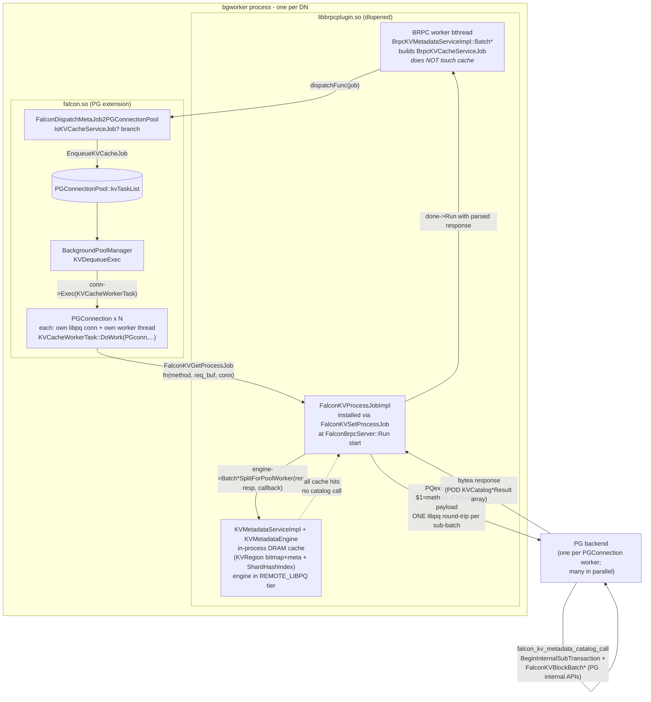
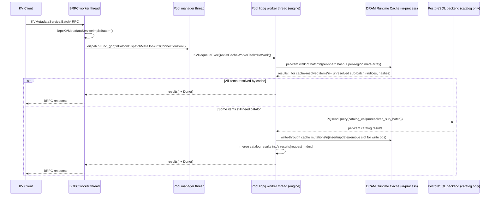

# FalconFS KV Cache Memory Pool Design (v6 Full)

## Document Info

| Item | Value |
|---|---|
| Version | v6.6.4 full design |
| Date | 2026-05-18 |
| Status | Full implementation design |
| Transport | BRPC only |
| Proto files | `kv_common.proto`, `kv_metadata_service.proto`, `kv_data_service.proto` |
| Scope | FalconFS KV cache metadata + memory pool + Store data path + vLLM integration |

This document is self-contained. It does not depend on any previous design document.

### Changelog (v6.1)

1. Service hosting model clarified: DN BRPC runs **inside** the PostgreSQL extension and dispatches jobs to the existing PG connection-pool workers, mirroring `BrpcMetaServiceImpl` → `PGConnectionPool::DispatchMetaServiceJob`.
2. Transaction lifecycle made explicit: catalog access uses `BeginInternalSubTransaction` / `ReleaseCurrentSubTransaction` exactly like `FalconCreateHandle`, and reuses `BATCH_OPERATION_GROUP_SIZE = 8` for the inner sub-batch.
3. Bitmap and lease map (legacy auxiliary state) moved to **PostgreSQL shared memory** (LWLock-protected, like `ShardTableShmemInit`) where still used by older hooks; v6.4 runtime cache is in-process in the pool worker (see changelog v6.4).
4. Recovery rules differentiated: DN restart preserves Store DRAM (rollback `EVICTING -> STORED` is valid), while Store restart loses DRAM (DRAM-only blocks must transition to `FAILED`).
5. vLLM integration aligned with the upstream `OffloadingManager` API surface: external methods stay singular (`lookup`, `prepare_load`, `complete_load`, `prepare_store`, `complete_store`, `touch`); batching happens inside the C++ client.
6. Reader race against eviction explicitly closed: hot-path lookups must use `renew_lease_on_hit=true`.
7. Added GUC plan, init sequencing, and a code-mapping appendix tying every component to existing FalconFS files (BRPC server, perf macros, shard table cache, connection pool, etc.).

### Changelog (v6.2)

1. Lease semantics corrected: leases protect DRAM blocks from eviction during access and are **not client-owned**. Removed `owner_client_id` / owner-claim semantics from the design.
2. Concurrent tuple update handling made explicit: `CatalogTupleUpdateWithInfo` may raise a PostgreSQL concurrent-update error; handlers convert it into retryable `CAS_CONFLICT` for the client.
3. Store registration redesigned: each Store partitions its DRAM pool into per-DN continuous regions and registers one region with each DN. DN bitmaps manage only the region assigned to that DN.
4. Epoch semantics clarified: epochs fence stale metadata/location/lease observations after DN or Store restart; they are not ownership markers.
5. Store failure handling expanded: heartbeat-based drain/offline/quarantine states temporarily remove slow or failed Stores from allocation while recovery/restart proceeds.

### Changelog (v6.3)

1. Metadata runtime model aligned with implementation: durable block rows remain in `falcon_kvblock_table`, while DRAM-resident per-block runtime state (status mirror, lease token/expiry, CLOCK `ref_bit`) is kept in PG shared memory (`KVDramMeta*`).
2. Eviction candidate source updated from process-local LRU abstraction to shared `KVDramMetaColdCandidates` CLOCK scan over the DRAM-meta hash table.
3. Eviction lifecycle clarified: successful `EVICTING -> EVICTED` removes DRAM-meta entry and frees bitmap slot; persistent catalog row remains and records `EVICTED` state/path.
4. Runtime wiring clarified: `KVMetadataEngine` prefers `KVShmemRuntimeOps.dram_meta_*`; legacy `lease_*` hooks are fallback-only when full DRAM-meta ops are unavailable.
5. Added `falcon_kv.dram_meta_max_entries` sizing guidance (current max 100,000,000; high values require large add-in shared memory budget).

### Changelog (v6.4)

This release re-architects the metadata engine to **cleanly decouple DRAM runtime state from persistent catalog state**, and to **co-locate DRAM runtime state with the libpq worker pool** so all worker threads share it as plain in-process memory rather than through PG shared memory + LWLocks.

Summary of the shift:

1. **Two metadata tiers, explicitly separated**:
   - **DRAM Runtime Cache** (volatile): bitmap + per-block meta entry + per-shard hash index + lease + CLOCK `ref_bit`. Lives **inside the BackgroundPoolManager process** that hosts the BRPC server and the libpq connection pool. Owned and mutated by pool-worker threads using C++ atomics / `std::shared_mutex` / striped locks. Indexes only blocks that are currently in DRAM.
   - **Persistent Catalog** (durable): `falcon_kvblock_table` rows. Indexes **every** block (DRAM-resident, EVICTED to SSD, FAILED). Mutated only through libpq SQL calls into PG backends.
2. **DRAM cache is a write-through cache before the catalog**: every cache-side mutation (insert / status update / free) is paired with a catalog mutation issued through libpq; the cache mutation only commits if the catalog mutation succeeds.
3. **Each meta entry represents exactly one DRAM block**. When the block is evicted to SSD (`EVICTING -> EVICTED`), its meta entry is freed and its bitmap bit is cleared in the same critical section. Catalog row remains and records `EVICTED` + `evicted_path`.
4. **Per registered DRAM region**: one fixed bitmap of `total_blocks` bits and one fixed meta array of `total_blocks` entries, sharing the same index space (bit `i` ↔ slot `i`). No allocator metadata fragmentation; the bitmap is the meta-slot allocator.
5. **Per catalog shard**: one concurrent hash map `block_hash -> (region_id, slot_idx)` that is the only block-hash → DRAM-slot index. Sharded so different shards do not contend.
6. **Recovery is parallel by shard**: pool-worker threads each scan one shard via libpq and repopulate their own per-shard hash maps and the per-region meta arrays/bitmaps. Recovery completes before BRPC starts accepting requests.
7. **CLOCK LRU recycles DRAM blocks and meta space together**: candidate scan is per-region over the dense meta array; eviction success releases the bitmap bit, the meta slot, and the per-shard hash map entry atomically.
8. **Lookup/update path**:
   - Lookup hit (per-shard hash map finds slot): pool-worker returns directly without touching the PG backend.
   - Lookup miss: pool-worker issues a libpq `SELECT` against `falcon_kvblock_table`; an `EVICTED` row returns the SSD path and stays out of DRAM cache; a missing row returns `NOT_FOUND`.
   - Insert/update: pool-worker first reserves bitmap+slot or finds the existing slot, then issues the catalog SQL (INSERT/UPDATE with CAS on `version`); on catalog success the cache mirror is finalized; on catalog failure the cache reservation is rolled back.
9. **Removed**: PG-shmem `KVDramMeta*` hash, `KVLease*` shmem hash, and `KVBitmap*` shmem segment. `falcon_kv_metadata_call_by_serialized_shmem_internal` is reduced to a thin **catalog-only RPC** (the engine no longer runs in the PG backend at all).
10. **Process model invariant**: there is exactly one BackgroundPoolManager process per DN; therefore exactly one DRAM cache instance per DN. Multiple PG backends remain as catalog executors but do not own runtime cache state.
11. **Per-item split-and-combine for mixed-hit/miss batches**: handlers with a catalog fast-path — `BatchLookupWithLease` **and `BatchAllocateWithLease`** — first walk each item over the in-process cache and write resolved-by-cache results into their original `results[i]` slot. Only the unresolved items are collected into a single libpq sub-batch (preserving each item's original index), dispatched to the PG backend in one libpq round-trip, and merged back into `results[]`. **`BatchRenewLease`** is **not** in this set: it is **DRAM-only** per §11.3 (no catalog `SELECT` on miss; miss ⇒ `LEASE_EXPIRED(retryable=true)` and the client refreshes via `BatchLookupWithLease`). The response is returned in the original request order. The catalog SQL function therefore receives a sub-batch whose size is `<= request_items`, never larger, and cache-resolved items pay zero PG round-trip cost. For `BatchAllocateWithLease` specifically: an item whose `block_hash` is already present in the cache (because a prior allocate or recovery seeded it) does **not** re-reserve a bitmap slot and does **not** re-issue a catalog `INSERT`; it returns the existing slot/lease with `reused_existing_allocation = true`.
12. **Conflict semantics on the same logical block hash**: the metadata DN treats the per-shard hash index as the single source of truth for *which* DRAM slot holds a given `block_hash`, and uses it to make concurrent operations on the same hash idempotent rather than fatal. Two race classes are explicitly defined (full pseudocode in §7.11):
    - **Lookup races allocate/store**: a `BatchLookupWithLease` may see `NOT_FOUND` (no row yet), `ALLOCATED` (catalog row + DRAM reservation exist, **committed bytes not yet visible** for readers), `STORED` (bytes committed and safe for `BatchReadBlock`), `EVICTING` (in-flight evict), or `EVICTED` (durable row on SSD with `evicted_path`). For **tensor load (`prepare_load`)**: treat **`STORED` and `EVICTED` as usable byte hits** (DRAM vs SSD leg of `LoadStoreSpec` respectively); treat **`ALLOCATED` as not a DRAM read hit** — return an **empty / no-DRAM** load spec so clients never call `BatchReadBlock` on a slot that can still be empty or torn until `ALLOCATED → STORED`. For **prefix existence only** (`lookup` returning a boolean), `ALLOCATED` may still be considered “present” so a caller can wait or coordinate; it must not imply safe DRAM reuse. **`EVICTED` is not the same as `NOT_FOUND`**: bytes exist on SSD and are loaded via `BatchReadFromSSD`, not recomputed from the prompt. The DN never lies about state (§7.3, §7.11.2, §12.3.1).
    - **Allocate races allocate (same `block_hash`)**: at most one allocate wins the bitmap+catalog `INSERT`. Concurrent losers fold onto the winner's slot via the per-shard hash index (cache pre-step) or via the catalog primary key (catalog pre-step), free their reserved bitmap bit, and return `reused_existing_allocation = true` with the winner's `(store_node_id, pool_offset, lease_token, version)`. The DN never returns two distinct DRAM slots for the same `block_hash`.
    - **Store races store (same `block_hash`)**: because KV blocks are immutable after `ALLOCATED -> STORED`, the *second* `BatchUpdateBlockStatus(ALLOCATED -> STORED)` on a row that is already `STORED` is treated as a no-op success when the request sets `allow_noop_if_already_target=true`; the corresponding `BatchWriteBlock` byte payload from the redundant client is dropped at the OffloadingManager (§16) before it reaches the Store. From vLLM's perspective: identical content + identical `block_hash` ⇒ at most one Store write actually lands.
    - **Lookup vs allocate is OK; concurrent stores must be deduplicated**: lookup is allowed to return `null`/`NOT_FOUND` so vLLM may recompute; redundant stores of the same `block_hash` are dropped client-side (§16.1, §13.2) so the cluster never absorbs two payloads for one logical block.
13. **`ALLOCATED` vs `STORED` vs `EVICTED` for reads**: `BatchLookupWithLease` / cache pass must not treat `ALLOCATED` as a `BatchReadBlock` hit; `EVICTED` is an SSD read hit for `prepare_load`, not a prompt recompute. **`BatchReadFromSSD`** stays metadata-neutral; rehydration to DRAM `STORED` is an explicit DN + Store sequence (§12.3.1).
14. **Promote-on-read for `EVICTED` blocks**: hot blocks drift back into DRAM via an **asynchronous, best-effort** promote pipeline owned by the OffloadingManager (§12.3.2 / §12.3.3 / §13.4). Foreground load reads SSD via **`KVDataService.ReadFromSSD` / `BatchReadFromSSD`** on the owning Store (v6.6.2 — no FalconFS client Direct I/O shortcut) and returns immediately; a background worker pool then issues the standard `BatchAllocateWithLease(hint=PROMOTE_FROM_EVICTED) + BatchWriteBlock + BatchUpdateBlockStatus(ALLOCATED → STORED)` triple to repopulate DRAM with catalog transition `EVICTED → ALLOCATED → STORED` and a fresh `version`. Promote is bounded (drop-on-full queue, no infinite retry), gated by an admission policy (hot-key sketch + DRAM-pressure watermark + per-DN inflight cap), and never extends foreground latency. New GUCs: `falcon_kv.promote_enabled`, `falcon_kv.promote_queue_capacity`, `falcon_kv.promote_max_inflight`, `falcon_kv.promote_min_access_count`, `falcon_kv.promote_when_pressure_below`. ~~`falcon_kv.promote_via_falconfs_direct_io`~~ retired in v6.6.2 (see §25).

### Changelog (v6.4 implementation lock-in)

The §4.1.1 / §4.1.3 / §4.2 / §4.2.1 / §4.7 prose now matches the actual code in `falcon/connection_pool/`, `falcon/metadb/`, `falcon/brpc_comm_adapter/`, and `vllm_kv_cache/src/metadata/`. Locked-in implementation choices (subset that diverged from earlier drafts of this document):

1. **Catalog SQL surface is `falcon_kv_metadata_catalog_call(int method, bytea payload) RETURNS bytea`**, not a shmem-shift handle. The whole sub-batch fits in one `bytea` parameter; `PQexecParams` with binary format issues exactly one PG-protocol message per sub-batch. The earlier draft `falcon_kv_metadata_catalog_call_by_serialized_shmem_internal(method, shmem_shift, request_size, signature)` was dropped because the BRPC plugin is the only catalog client and does not need cross-process shmem visibility into FalconShmemAllocator (FalconFS-meta `SingleWorkerTask` / `BatchWorkerTask` keep using their existing shmem path).
2. **Wire format is POD struct arrays defined in `kv_catalog_wire.h`**, not protobuf. This keeps `falcon.so` free of KV protobuf descriptors so duplicate descriptor registration (which crashes the bgworker at plugin load) is structurally impossible. Plugin-side packers/unpackers are in `falcon/brpc_comm_adapter/kv_runtime_register.cpp`.
3. **Engine ↔ pool worker hand-off is one C function pointer**, registered at plugin startup via `FalconKVSetProcessJob` (declared in `falcon/include/connection_pool/falcon_kv_runtime_bridge.h`, exported from `falcon.so` with default visibility). The pool worker (`falcon.so`) calls the pointer with its own `PGconn`; the implementation (`libbrpcplugin.so`) does protobuf parsing, engine call, catalog round-trip, response serialization. There is no protobuf in `falcon.so` and no engine code in `falcon.so`.
4. **`PGConnectionPool` carries a dedicated `kvTaskList`** and `KVDequeueExec` dispatches each KV job to a distinct `PGConnection` worker. Concurrent KV BRPC calls therefore execute against different PG backends in parallel — not serialized through one shared libpq connection.
5. **Catalog accessor is `falcon/metadb/kvblock_table.{c,h}`** with C functions `FalconKVBlockBatchLookup` / `FalconKVBlockBatchInsertAllocated` / `FalconKVBlockBatchCASStatusUpdate` / `FalconKVBlockBatchDelete`. They use PG internal APIs (`table_open`, `systable_beginscan` with `F_BYTEAEQ`, `heap_modify_tuple`, `CatalogTupleInsertWithInfo`, `CatalogTupleUpdateWithInfo`, `simple_heap_delete`). No raw SQL on the hot path; the only SQL the plugin emits is the call to `falcon_kv_metadata_catalog_call`.
6. **`falcon_kvblock_table` is one table per DN**, not sharded by `range_point`. The schema is created by `pg_catalog.falcon_create_kvblock_table()` (`falcon/distributed_backend/distributed_backend_falcon.c`, idempotent), invoked once per DN by the plugin at startup. Only the `(status, updated_at_ms)` btree index is materialized; `(store_node_id, pool_offset)` is not, because runtime resolution goes through the DRAM shard hash index (§7.1).
7. **Recovery driver and `EVICTING` reconcile scan are implemented for DN startup.** `KVRecoveryRunner::Run()` calls the catalog scan path, bumps `dn_epoch`, applies `ScanShardForRecovery` rows to `KVMetadataEngine`, reconciles `EVICTING -> STORED`, and parks rows until Store regions register. Store restart runtime fencing is also implemented on epoch bump; remaining release work is catalog-row reconciliation / SSD GC hardening, not basic DN recovery.

The remainder of this document is rewritten where the architecture changed; sections that were unaffected (proto contract, error model, vLLM integration) are unchanged.

### Changelog (v6.6.1)

v6.6 introduced parallelism on **both** sides of the data plane — the Client's `_data_stage_pool` fans out per block, and the Store handlers `BatchWriteBlock` / `BatchReadBlock` *also* fanned items out across an internal worker pool. Three issues followed: (a) the two layers of parallelism duplicate work and obscure ownership, (b) the §13 flow text used "libpq" next to client-visible steps, blurring the wire boundary between Client→DN (BRPC) and DN-internal catalog access (libpq), and (c) the lock-vs-lease description leaned on the wrong invariant ("the DN-issued lease guarantees no concurrent writer on the same slot"). v6.6.1 fixes all three:

1. **Data-plane RPCs are unary (historical v6.6.1 rule; superseded by v6.6.3 bounded micro-batches below).** The KV data Store exposes single-block `WriteBlock`, `ReadBlock`, `ReadFromSSD` (one item per RPC). All parallelism on the data plane lives on the **Client**: the data stage pool fires N concurrent unary RPCs, and stripe-splitting (one large block → multiple stripe-sized RPCs) is decided client-side. The Store handler is naturally parallel because BRPC dispatches each RPC on its own bthread; no second worker pool, no internal item fan-out, no internal stripe-splitting on the server. The legacy `BatchWriteBlock` / `BatchReadBlock` / `BatchReadFromSSD` names are kept on the wire for one release as **thin compatibility wrappers** (`items_size() == 1` is the recommended call shape; multi-item batches are deprecated and processed sequentially), so existing builds still link, but no new Store-side parallelism logic depends on them. See §12.1 / §12.2 / §12.3 / §29.3.
2. **Client→DN is BRPC end-to-end. libpq is intra-DN only.** The §13 flow steps now keep "libpq" strictly under the **DN pool-worker** lane (the worker thread inside `BackgroundPoolManager` that holds a libpq connection to its **own local PG backend** and runs the catalog SQL on `falcon_kvblock_table`). The Client never opens a libpq connection to a DN. Every Client → DN call — `BatchLookupWithLease`, `BatchAllocateWithLease`, `BatchUpdateBlockStatus`, `BatchFreeAllocated`, `BatchRenewLease` — is a BRPC call against the DN's `KVMetadataService`. The `pg_catalog.falcon_dn_node` row carries `pg_host`/`pg_port` only so DBAs can connect for ops; the hot path uses `kv_brpc_port`. See §11, §13.1, §13.2, §29.5.1.
3. **Stripe lock protects both reads and writes; leases protect against eviction, not concurrent writers.** The DN-issued lease is an **eviction shield**: while the lease is valid, the DN's eviction worker will not reclaim the slot. It is **not** a single-writer guarantee — recovery, lease takeover, racing allocators across a `STALE_EPOCH`, and reader-vs-writer on a slot that just transitioned all admit physical concurrency on the same `pool_offset`. The DRAM stripe lock therefore protects both reads and writes for byte-level integrity. v6.6.1 changes the per-stripe primitive from `std::mutex` to **`std::shared_mutex`**: writers take the stripe in **exclusive** mode, readers take it in **shared** mode, so concurrent readers do not serialize but every reader still sees a consistent payload relative to any writer on the same stripe. The DN's CAS on `version` provides the **logical** "one publisher per `block_hash`" guarantee independently. See §29.2, §27.

These three corrections do not change the wire layout, the catalog schema, the client API, or any GUC that controls the metadata stage. They only correct the body of §12 / §13 / §27 / §29 where the v6.6 first cut over-promised. The same memcpy-only Store and the same two-stage Client pipeline remain.

### Changelog (v6.6.2)

1. **SSD reads use `KVDataService` uniformly.** Earlier text described an optional **FalconFS client Direct I/O** leg that read `evicted_path` by bypassing the Store BRPC server. That is **removed from the contract**: foreground `prepare_load`, promote-on-read staging, and any parallel data-stage task for `EVICTED` keys must call **`KVDataService.BatchReadFromSSD` / `ReadFromSSD`** (unary in v6.6.1) on the **Store that owns the spill file** (the same `store_node_id` the DN returned in metadata). The Store daemon continues to read bytes from local disk via `SSDSpillManager` under `<ssd_root>` (§12.4); whether that path is backed by a FalconFS mount is a **deployment detail inside the Store host**, not a second client I/O stack. **Implementation alignment:** [`FalconFSOffloadingManager._load_one_key_bytes`](vllm_kv_cache/python/falconfs_kv/offloading_manager.py) already uses `cluster.store.read_from_ssd` → BRPC `BatchReadFromSSD`; [`LocalKVStoreShmFacade::BatchReadFromSSD`](vllm_kv_cache/src/store/kv_store_facade.cpp) forwards to the Store stub over `ssd_ch_`, not `open(2)` on the client. §12.3.2 / §12.6.3 / §13 / §25 / §29 are updated to match.
2. **`falcon_kv.promote_via_falconfs_direct_io` retired.** The knob implied a client-side FalconFS read leg; with the uniform Store service rule it is **reserved / ignored** (always use Store `ReadFromSSD`). Remove from new installs; keep reserved in proto/GUC tables for one release if already shipped.

### Changelog (v6.6.4)

Design-alignment follow-up after the measured performance work:

1. **Store restart now fences stale DN runtime metadata, reconciles durable catalog rows, and validates preserved SSD paths.** When `RegisterStoreRegion` observes the same Store geometry with a higher `store_epoch`, the DN quarantines the region, erases that Store's shard-index entries, clears the region bitmap/meta/free counters, drops pending restores for the old Store image, and then publishes the new epoch as `HEALTHY`; a lower epoch is rejected as `STALE_EPOCH`. The successful epoch bump invokes `KVRecoveryRunner::ReconcileStoreRestart`, whose phase 1 scans `falcon_kvblock_table` for that `store_node_id`, deletes DRAM-only rows, and preserves only `EVICTED` rows with a non-empty `evicted_path`. Phase 2 calls the Store-hosted `KVStoreAdminService.ValidateEvictedPaths` RPC in bounded chunks and deletes invalid preserved rows through the catalog recovery path. Validation failure is conservative: rows are kept and `validation_failed` is logged. Regression: `KVMetadataEngine.StoreEpochRestartClearsStaleDramRuntime`, the cluster fault scenario `store-restart-reconcile`, and `FalconKvStoreSmoke.ValidateEvictedPathsChecksStoreLocalSSD`.
2. **Metadata BRPC channel cache observability and regression coverage are exported.** The pybind extension exposes `metadata_channel_stats()` and `metadata_channel_stats_reset()` for cache size, hits, misses, failures, and failure-driven evictions. Python unittest coverage asserts repeated calls reuse the channel and failed endpoints are evicted.
3. **Promote-on-read is explicitly asynchronous and admission-controlled.** The promote worker is a bounded background queue with drop-on-full backpressure, configurable worker parallelism, memory-pressure admission (`FALCON_KV_PROMOTE_WHEN_PRESSURE_BELOW`), and hotness admission (`FALCON_KV_PROMOTE_MIN_ACCESS_COUNT`). Foreground SSD loads enqueue best-effort promotion work and do not wait for the allocate/write/status triple.
4. **Adaptive batching is flag-gated and observable.** Static defaults remain read batch 8 and write batch 1. With `FALCON_KV_CLIENT_ADAPTIVE_BATCHING=1`, selected local/remote read/write batch sizes are capped by configured maxima and target bytes, and the chosen policy/reason is persisted in mixed E2E metrics JSON.

### Changelog (v6.6.3)

Measured mixed-colocation and Store micro-benchmark runs changed the performance contract without changing the metadata semantics or public OffloadingManager API:

1. **Data-plane call shape is bounded micro-batch, not unary-only.** v6.6.1 made the important ownership correction that the Store must not run an internal worker pool and the Client owns parallelism. v6.6.3 keeps that ownership but supersedes the strict unary recommendation: each data-stage task may carry a small `(dn_id, store_id)` group, bounded by `FALCON_KV_CLIENT_BATCH_{READ,WRITE}_MAX_BLOCKS` and target bytes. This reduces BRPC scheduling and Python/native crossing overhead while preserving parallelism because many bounded groups are still issued concurrently. Current default: reads batch up to 8 blocks, writes default to 1 block unless explicitly enabled.
2. **Large payloads use BRPC attachment paths.** Remote `WriteBlock` / `BatchWriteBlock` send block bytes outside protobuf `bytes`; remote `ReadBlock` / `BatchReadBlock` return payloads in response attachments, framed for batch reads. Protobuf keeps metadata, status, and checksums; the 1-2 MiB tensor bytes use `butil::IOBuf` attachment transfer. Store service attachment handlers pass payload buffers directly to `KVStoreEngine` instead of reconstructing per-item protobuf payload strings.
3. **DRAM hot-path checksums are opt-in.** Store DRAM writes/reads no longer compute CRC by default because TCP/BRPC and hardware already protect transport integrity and the duplicate CPU cost is visible in the hot path. `verify_checksum=true` and `FALCON_KV_STORE_COMPUTE_CHECKSUMS=1` still force checksum computation/validation. SSD spill/readback keeps integrity checks.
4. **Benchmark timers exclude payload generation.** Throughput tests pre-generate payloads when memory budget permits and report whether generation was timed. The default pre-generation cap allows 1 MiB / 512 KiB block tests on memory-limited machines while keeping phase throughput focused on Store + metadata offloading work.
5. **Regression harness is part of the design.** The pre-commit gate is `scripts/falcon_kv_regression.sh`; it now restarts the cluster after destructive fault drills before Python metadata/offloading tests, aligns Python block size with `FALCON_KV_STORE_BLOCK_SIZE`, and waits for all CN/DN BRPC pooler ports. The documented gate lives in `docs/falcon_kv_precommit_regression.md`.

### Changelog (v6.6)

> **Superseded in part by v6.6.1** — items 2/3/4 below are the v6.6 first cut.
> Read v6.6.1 (above) for the corrected stripe-lock primitive
> (`std::shared_mutex`, protects R+W), the unary data plane (no Store-side
> internal worker pool or stripe-splitting), and the BRPC-vs-libpq wire
> clarification.

v6.5 left two architectural duplications that capped throughput well below DRAM / NIC ceilings on the byte-moving path. v6.6 removes both and introduces an **explicit two-stage parallel pipeline** on the Client side. The wire contracts (§10–§12) are unchanged; what changes is who owns metadata, where locks live, and how the OffloadingManager schedules work.

1. **Store data plane is fully metadata-free.** `KVStoreEngine` no longer keeps a per-`block_hash` `Entry` map or a per-engine global mutex. The DN's `KVMetadataEngine` is the **single source of truth** for `(block_hash → store_node_id, pool_offset, version, status, store_epoch)`; the Store only validates `store_epoch`, bounds-checks the `(pool_offset, length)` against the registered region, and does the memcpy. CAS on `version` lives only at the DN. The legacy per-engine `mu_` and `meta_` are removed; SSD spill book-keeping remains under a small dedicated lock because the Store owns SSD paths (§29.2).
2. **Per-stripe DRAM locking, not a global one.** `DramPool` exposes byte-level read/write **without a global mutex**. A **stripe lock array** indexed by `slot = pool_offset / block_size` (size configurable, e.g. 64 stripes per region) protects writers and readers against physical race on the same stripe; disjoint stripes never serialize. *(Superseded by v6.6.1: the primitive is `std::shared_mutex`, writers exclusive, readers shared; the lock is load-bearing, not defensive — leases protect against eviction reclaim, not against physical reader-vs-writer races; §29.2.)*
3. **Internal parallelism inside `BatchWriteBlock` / `BatchReadBlock`.** Both Store-side handlers fan items out across a bounded **C++/bthread worker pool** of size `min(items, falcon_kv.store_data_workers, store_max_inflight)`; items target disjoint `pool_offset`s so they run truly in parallel, each bumping at most one stripe lock. For very large blocks an item is further split into **stripes** (`falcon_kv.store_stripe_bytes`, default 512 KiB) so a single block can saturate multiple memory channels. *(Superseded by v6.6.1: the data plane is **unary** — `Store.WriteBlock` / `Store.ReadBlock` carry one block per RPC; BRPC dispatches each on its own bthread, so no internal worker pool is needed. Stripe-splitting moves to the client; `falcon_kv.store_data_workers` and `falcon_kv.store_stripe_bytes` are retired; §29.3.)*
4. **Local SHM facade is parallel.** `LocalKVStoreShmFacade::BatchWriteBlock` / `BatchReadBlock` partition items across a native worker pool and `memcpy` on disjoint offsets concurrently. The Python extension releases the GIL for the whole call. No global lock; same stripe contract as remote. *(Superseded by v6.6.1: the facade exposes single-block `WriteBlock` / `ReadBlock`; the data stage pool fans out, not the facade. `falcon_kv.client_local_facade_workers` is retired; §29.4.)*
5. **OffloadingManager: explicit two-stage pipeline (metadata stage + data stage), with parallel store *and parallel load*.** The hardcoded `min(8, len(groups))` ThreadPool is removed. Two independently sized pools run with a clear pipeline:
   - **Metadata stage:** one worker per DN, all DNs in parallel (`falcon_kv.client_meta_parallelism_max`, default `num_dns`). Carries `BatchLookup` / `BatchAllocate` / `BatchUpdateBlockStatus` / `BatchFreeAllocated` / `BatchRenewLease` — small messages stay batched per DN.
   - **Data stage:** one task per block (or per stripe, for large blocks), all blocks across all stores in parallel (`falcon_kv.client_data_parallelism_max`, default `min(64, hw_concurrency * 2)`). Used by **both** `complete_store` and `prepare_load` — the load path is no longer serial. As soon as a DN's metadata reply arrives, its data tasks dispatch; the slowest DN bounds wall-clock latency, not the sum.
6. **Group becomes a routing index, not a parallelism unit.** `(dn_id, store_id)` is still the smallest co-locatable unit for a single combined "data + metadata" round-trip, but it is **not** the unit of concurrency. Concurrency is decoupled: metadata fans out per **DN**, data fans out per **block / stripe** (§29.5).

These changes turn the data path into a byte mover whose ceiling is **DRAM bandwidth on the local SHM path** and **NIC bandwidth on the remote BRPC path**, not the global mutex / fixed-8 ThreadPool that capped v6.5.

Detailed contract in §29. Cross-referenced from §12.1, §12.2, §12.6.3, §13.1, §13.2, §16.1, §25, §27.

### Changelog (v6.5)

Three design considerations that were under-specified in v6.4 are now made explicit:

1. **Topology generality.** The cluster supports an arbitrary, configurable number of DN, Store, and Client instances, deployed in any colocation pattern. The 2-DN harness is a test convenience, not an architectural assumption. Each role is identified only by its `dn_id` / `store_node_id` / process identity, never by the count of peers; every configuration parameter that names a peer (DN endpoints on a Store, Store endpoints on a Client, etc.) is a list whose length is decided at deploy time. See §2.6 for the deployment matrix.

2. **Colocation-aware data plane (Client↔Store ONLY, via POSIX shared memory).** The Store is **always a standalone daemon process** — never embedded in a Client (vLLM worker, FUSE process, future framework integrations). What "colocation" means in v6.5 is **same-host**, not same-process: the Store allocates its DRAM pool with `shm_open` + `mmap(MAP_SHARED)` and publishes a small discovery descriptor (segment name + region geometry + `store_epoch` + `brpc_address`) under a well-known runtime path. Any Client process running on the same host can mmap the same segment and access the Store's DRAM region directly as shared memory; Clients running off-host fall back to BRPC. Both reads and writes use the shared-memory path when available, exactly mirroring FalconFS's `StoreNode::IsLocal(nodeId)` shortcut for `ReadFile` / `WriteFile` in [`falcon_store/src/falcon_store/falcon_store.cpp`](../../falcon_store/src/falcon_store/falcon_store.cpp). The runtime selection between shared-memory and BRPC happens at exactly one place (`KVStoreFacadeRegistry`) and is identical for every Client caller — vLLM via the pybind11 API library, FUSE via `falcon_client`, or any future application. Detailed contract in §12.6 (`IKVStoreFacade` + `KVStoreFacadeRegistry` + the shared-memory discovery protocol).

   **DN↔Store colocation is intentionally NOT optimized.** DN↔Store traffic is admin-only (`RegisterStoreRegion`, `Heartbeat`, `SpillBlockToSSD`) and never on the latency-critical path: registration runs once at startup, heartbeats are seconds-cadence, and spill runs at eviction-cycle frequency only. For simplicity the DN always reaches its registered Stores over BRPC, regardless of whether the Store happens to share a host. This keeps the DN code path topology-independent and reduces the surface area of `KVStoreFacadeRegistry` to one consumer (the Client).

3. **Store admin RPCs are first-class.** A new BRPC service `KVStoreAdminService` hosted on the DN side carries `RegisterStoreRegion`, `Heartbeat`, and `SpillBlockToSSD`. v6.4 left `KVMetadataEngine::RegisterStoreRegion` as an in-process call only; v6.5 makes registration a network operation issued by every Store at startup, so the DN never assumes a hardcoded region geometry. `SpillBlockToSSD` is invoked by the DN's eviction worker against the Store that owns the eviction candidate; it is BRPC even if Store and DN happen to share a host (per the previous bullet). Detailed wire contract in §5.4.

4. **CN is the single source of truth for cluster membership; KV cache shares DN identities with FalconFS file metadata.** The KV cache does not introduce a parallel DN list; it reuses `server_id` from the existing [`pg_catalog.falcon_foreign_server`](../../falcon/falcon--1.0.sql) and the existing `pg_catalog.falcon_shard_table(range_point, server_id)` for `block_hash → DN` routing. v6.5 adds two CN tables: `pg_catalog.falcon_dn_node` (one row per DN replication group, with **denormalized** `(host_node_name, pg_host, pg_port, kv_brpc_port, dn_epoch, healthy)` so a single `SELECT` suffices for routing — no JOIN on the hot path), and `pg_catalog.falcon_store_node` (one row per `falcon_kv_store` daemon — Stores have no FalconFS analogue). Physical-host identity uses the **`NODE_NAME`** environment variable already standardized by FalconFS CM and docker-compose configs (`cloud_native/falcon_cm/cm/falcon_cm.py:51`, `tests/regress/docker-compose-*.yaml`); `/etc/machine-id` is **not** used because it is unreliable in containers and has no FalconFS adoption. Each Client maintains the **full** DN and Store list locally and runs a **membership refresh loop (§3.4.7)** with three triggers — periodic (every `falcon_kv.membership_refresh_period_ms`, default 5000ms), reactive (on any DN/Store RPC failure / `STALE_EPOCH` / `STORE_NOT_REGISTERED`), and on-demand (`KVStoreFacadeRegistry::RefreshNow()` / `OffloadingManager.refresh_membership()`) — plus an optional `LISTEN/NOTIFY` push channel for sub-second propagation. The loop handles **late-joining Stores** (registered after the Client started — common in autoscale and ops-driven Store roll-out) and **rejoining Stores** (restart bumps `store_epoch` → Client `munmap`s the old segment and `shm_open`s the new one). Same-host Stores (matched by `host_node_name`) use the SHM fast path (§12.6), all others use BRPC. **DN replica handling** inherits FalconFS's CM-driven primary-failover pattern: CM elects a new primary, atomically updates both `falcon_foreign_server` and `falcon_dn_node` in one transaction, clients refresh and retry — `server_id` is stable, hash routing never changes. **Store failure model** is differentiated: stores are single-instance (volatile DRAM cannot be replicated cheaply), unhealthy/unreachable Stores cause client reads to return cache miss (vLLM tolerates miss → recompute), permanently dead Stores are removed from the cluster and DNs purge their KV-meta rows; on Store restart `store_epoch` bumps and DNs delete rows that were DRAM-only on the old epoch. All details in §3.4 (schemas, RPCs, refresh model, watchdog, failover semantics).

5. **Allocation drops the `allow_fallback_store` knob.** v6.4 had a per-request `allow_fallback_store=true|false` flag on `BatchAllocateWithLease`. v6.5 removes it: allocation is always best-effort with the §5.3 priority order and automatic fallback to any healthy Store. The proto field is retired (kept reserved for one release for compatibility) and ignored by the engine.

These additions do not change the hot-path metadata flow described in v6.4; they refine the deployment model, the data-plane affinity policy, and the topology discovery contract.

The remainder of this document is rewritten where the architecture changed; sections that were unaffected (proto contract, error model, vLLM integration) are unchanged.

---

## 1. Goals, Non-Goals, and Core Decisions

### 1.1 Goals

1. Provide a FalconFS-backed external KV cache for vLLM prefix/offloading workflows.
2. Keep common cache-hit load path to two network RTTs:
   - Client -> Metadata DN for metadata and lease.
   - Client -> Store for block bytes.
3. Keep allocation fast by managing bitmap state inside the Metadata DN.
4. Support batch-first APIs for lookup, allocation, lease renewal, status update, read, write, and SSD readback.
5. Preserve correctness under partial write failure, retry, timeout, DN restart, Store restart, and failover.
6. Align implementation with existing FalconFS metadata patterns:
   - shard grouping,
   - relation/index opened once per group,
   - bounded batch group size,
   - shared-cache invalidation/reload,
   - fine-grained latency instrumentation.

### 1.2 Non-Goals

1. The KV cache path does not require cross-DN distributed transactions.
2. CN is not in the hot path for normal KV cache lookup/load/store.
3. Strong global ordering across unrelated KV blocks is not required.
4. Persistent lease storage is optional; the default design reconstructs leases on recovery.

### 1.3 Core Decisions

1. **BRPC only** for both metadata and data service RPCs.
2. **Client direct-to-DN routing** based on `block_hash`.
3. **Metadata DN splits state into two tiers**: a **DRAM Runtime Cache** (volatile, in pool-worker process memory) and a **Persistent Catalog** (durable, in PG `falcon_kvblock_table`). Allocation, lease, and CLOCK decisions are taken on the cache; durability comes from the catalog.
4. **DRAM cache is write-through to the catalog**: every cache mutation that changes block identity or status is paired with a libpq SQL mutation. Cache state is committed only after catalog state is committed.
5. **One meta entry per DRAM-resident block**: the cache only indexes blocks currently in DRAM. Eviction to SSD frees the meta entry and its bitmap bit; the catalog row stays as `EVICTED`.
6. **Bitmap is the meta-slot allocator**: bit `i` in a region's bitmap directly identifies meta slot `i` in that region's meta array. No separate allocator state.
7. **Per-shard hash index**: each catalog shard owns one concurrent hash map `block_hash -> (region_id, slot_idx)`. Recovery scans shards in parallel.
8. **Store owns bytes only** and does not decide allocation.
9. **Every batch response is per-item**, never implicitly all-or-nothing.
10. **Mutating APIs are safe under retry** without a server-side response cache: catalog `INSERT`/CAS `UPDATE`/`DELETE`, per-block `expected_version`, `reused_existing_allocation` on duplicate `block_hash`, and optional `deduplicate_in_request` cover correctness; `request_id` is for tracing only.
11. **Status updates use CAS** by `expected_version`.
12. **Eviction is two-phase**: `STORED -> EVICTING -> EVICTED`.
13. **Lease tokens include epoch semantics** to fence stale metadata/location observations after DN or Store restart/failover.

---

## 2. System Architecture

### 2.1 Logical Components

```
vLLM Scheduler / Block Manager
        |
        v
FalconFS KV OffloadingManager (Python)
        |
        | BRPC metadata calls
        v
+-----------------------------------------------------+
| Metadata DN (PostgreSQL extension)                   |
|                                                      |
|  +---------------------------------------------+     |
|  | BackgroundPoolManager process (1 per DN)    |     |
|  |  - BRPC server (KV metadata service)        |     |
|  |  - libpq connection pool (N worker threads) |     |
|  |  - DRAM Runtime Cache (in-process)          |     |
|  |      * per-region bitmap (1 bit / block)    |     |
|  |      * per-region meta array (1 slot/block) |     |
|  |      * per-shard hash index                 |     |
|  |      * per-region CLOCK hand                |     |
|  |      * leases (inside meta slot)            |     |
|  |  - Eviction coordinator (background thread) |     |
|  +---------------------------------------------+     |
|                  ^         |                         |
|                  | libpq   | libpq SQL on            |
|                  |         v falcon_kvblock_table    |
|  +---------------------------------------------+     |
|  | PostgreSQL backend(s) (catalog executors)   |     |
|  |  - falcon_kvblock_table (durable rows)      |     |
|  |  - shard table / OID cache                  |     |
|  |  - per-call sub-transaction lifecycle       |     |
|  +---------------------------------------------+     |
+-----------------------------------------------------+
        |
        | BRPC data calls
        v
Falcon Store
  - DRAM block pool
  - SSD spill files
  - Batch read/write service
```

Component ownership rules (v6.4):

1. **DRAM Runtime Cache, bitmaps, leases, CLOCK, and eviction coordinator** all live in the BackgroundPoolManager process and are shared across its libpq pool worker threads using C++ concurrency primitives.
2. **Catalog state** lives in `falcon_kvblock_table` and is touched only via libpq SQL.
3. **PG shared memory** is no longer used for KV cache runtime state. The only PG shmem we keep is the existing FalconFS shard cache (`ShardTableShmemInit`) for hash → DN routing.
4. The pool-worker thread that handles a request does the engine work itself: cache lookup/mutation, then issuing libpq SQL when a catalog touch is required.

### 2.2 Client Responsibilities

The Python OffloadingManager:

1. receives vLLM block hashes,
2. groups requests by target DN,
3. calls DN BRPC metadata APIs,
4. groups returned locations by Store,
5. calls Store BRPC data APIs,
6. updates metadata status only for successful writes,
7. maintains a local lease-aware cache.

### 2.3 Metadata DN Responsibilities

The DN is the metadata authority for its shard range. Internally it is split into two subsystems:

**BackgroundPoolManager (cache tier)**

1. hosts the KV BRPC service and dispatches each batch into a libpq pool-worker thread,
2. owns the DRAM Runtime Cache: per-region bitmap, per-region meta array, per-shard hash index, per-region CLOCK hand,
3. allocates DRAM offsets by setting bitmap bits (which simultaneously claim the meta slot),
4. grants and renews anti-eviction leases inside the meta slot,
5. maintains CLOCK eviction hints (`ref_bit`) in the meta slot,
6. runs the eviction coordinator,
7. drives recovery after DN restart by issuing parallel per-shard libpq scans.

**PostgreSQL backend(s) (catalog tier)**

1. stores durable KV block metadata in `falcon_kvblock_table`,
2. executes catalog SQL invoked from pool-worker threads via libpq (`SELECT`, `INSERT`, CAS-style `UPDATE`, recovery scans),
3. enforces row-level concurrency through sub-transactions and `CatalogTupleUpdateWithInfo`,
4. exposes batch-friendly internal helpers usable from a `falcon_kv_metadata_catalog_*` SQL surface (catalog-only; no runtime state).

This split is the key invariant of v6.4: the cache tier never blocks on the catalog tier inside a hot lookup-hit path, and the catalog tier never holds DRAM cache locks.

### 2.4 Store Responsibilities

The Store:

1. owns the DRAM memory region,
2. reads/writes block payloads at DN-assigned offsets,
3. spills DRAM blocks to SSD on eviction,
4. validates size/checksum,
5. returns per-item success/failure.

### 2.5 Normal Hot Path

Cache hit load:

```
Client -> DN:    BatchLookupWithLease(keys)
DN -> Client:    status/location/lease/version
Client -> Store: BatchReadBlock(offsets) or BatchReadFromSSD(paths)
Store -> Client: block payloads
```

Store path:

```
Client -> DN:    BatchAllocateWithLease(keys)
DN -> Client:    store_id/pool_offset/lease/version
Client -> Store: BatchWriteBlock(payloads)
Store -> Client: per-key write result
Client -> DN:    BatchUpdateBlockStatus(success_keys, ALLOCATED -> STORED)
```

### 2.6 Deployment topology

Each role can be replicated and colocated independently. The cluster has three counts (`N_DN`, `N_STORE`, `N_CLIENT`) and the operator picks any colocation pattern per host.

A few invariants the runtime relies on:

- The Store is **always a standalone daemon** (`falcon_kv_store`). It is never embedded in a Client process. This keeps the Store framework-agnostic so multiple Client applications on the same host (vLLM worker, FUSE client, batch tool, future integrations) can all share the same local Store DRAM pool.
- The only colocation pattern the runtime **optimizes** for is **Client and Store running on the same host**, because Client↔Store is the byte-moving hot path. The optimization is **POSIX shared memory**, not same-process: the Store creates its DRAM pool with `shm_open` + `mmap(MAP_SHARED)`; same-host Clients mmap the same segment and read/write directly. Cross-host Clients use BRPC.
- Every other pattern (DN-only, Store-only, Client-only, DN+Store, all-three) works correctly via BRPC. The DN never branches on whether a Store is on the same host.

| Pattern | Notes |
|---|---|
| DN-only host | a host dedicated to PG + bgworker; no DRAM pool, no FUSE mount, no local fast path. |
| Store-only host | a host that contributes only DRAM (and SSD) to the cluster, e.g. a dedicated CXL / large-RAM node. Off-host Clients reach it via BRPC. |
| Client-only host | runs vLLM workers but has no local Store; every `BatchWriteBlock` / `BatchReadBlock` goes BRPC. |
| **Client(s) + Store same host (recommended for vLLM workers)** | One standalone `falcon_kv_store` daemon owns a `mmap(MAP_SHARED)` DRAM segment sized to fit the host's KV cache budget. Each Client process on the same host (vLLM worker, FUSE client, ...) discovers that segment and mmaps it via `LocalKVStoreShmFacade` (§12.6). Both `BatchWriteBlock` and `BatchReadBlock` against the local `store_node_id` reduce to bounds-checked `memcpy` against the shared segment — zero serialization, zero brpc iobuf copy, zero socket round-trip. Reads/writes against any other Store stay BRPC. |
| DN + Store same host | a valid topology, but DN↔Store traffic is **always BRPC** (admin-only, not perf-critical); see v6.5 changelog point 2. |
| All three on one host | small-scale dev/test; the harness `falcon_distributed_test.sh` uses this mode at small scale. |

Component counts come from configuration, never from constants:

- DN list per Store: `--dn HOST:PORT` (repeated; one entry per DN this Store partitions its DRAM pool for).
- Store list per Client: client config carries `store_table[store_node_id] -> brpc_endpoint`, populated either from a CN-maintained registry table (future) or a bootstrap config file.
- A **Client process** that finds a local Store discovery descriptor (§12.6) calls `RegisterLocal(store_id, shm_facade)` on its own `KVStoreFacadeRegistry`; every peer (off-host) Store is registered via `RegisterRemote(store_id, endpoint)`.
- The **DN process** does not participate in the local fast path: its eviction worker resolves Store endpoints via the admin map populated by `RegisterStoreRegion` (§5.4) and always issues `SpillBlockToSSD` over BRPC.

The metadata DN's allocator supports affinity via `preferred_store_id` (§5.3): a same-host Client passes its own host's `store_node_id` as `preferred_store_id`, so freshly allocated blocks land on the local Store's DRAM region whenever capacity permits. Allocation is always best-effort: if the preferred Store has no space, the DN automatically falls back to the next-best candidate. This makes the Client-side shared-memory fast path the typical case rather than the exception, while still guaranteeing forward progress under pressure.

---

## 3. Persistent Metadata Model

### 3.0 Distribution Model

`falcon_kvblock_table` is created on **every DN** (not on CN). Routing is computed client-side from `block_hash`, identical to how `falcon/metadb/shard_table.c` (`SearchShardInfoByShardValue` / `SearchShardInfoByHashValue`) routes inode operations:

1. CN owns DDL and shard-table maintenance. CN runs the equivalent of `falcon_build_shard_table` and propagates DDL to every worker.
2. Each DN owns its slice of `falcon_kvblock_table` rows (rows whose `block_hash` hashes into one of that DN's shards).
3. Hot-path KV cache requests never go through CN. They go from the Python client directly to the target DN, the same way `falcon_client/src/router.cpp` routes file-system requests through `Router::GetWorkerConnByPath`.

### 3.1 KV Block Table

Table name: `pg_catalog.falcon_kvblock_table` (one per DN).

The schema below is what `pg_catalog.falcon_create_kvblock_table()` produces in
the implementation. The function is declared in `falcon/falcon--1.0.sql` and
constructs the SQL via `ConstructCreateKvblockTableCommand` in
`falcon/metadb/kvblock_table.c`:

```sql
CREATE TABLE falcon.falcon_kvblock_table (
    block_hash      BYTEA  PRIMARY KEY,
    kv_group_idx    INT    NOT NULL DEFAULT 0,
    layer_mask      INT    NOT NULL DEFAULT 0,
    status          SMALLINT NOT NULL,
    store_node_id   INT    NOT NULL,
    pool_offset     BIGINT NOT NULL,
    evicted_path    TEXT,
    version         BIGINT NOT NULL,
    updated_at_ms   BIGINT NOT NULL
);
CREATE INDEX falcon_kvblock_status_time_idx
    ON falcon.falcon_kvblock_table USING btree(status, updated_at_ms);
ALTER TABLE falcon.falcon_kvblock_table SET SCHEMA pg_catalog;
GRANT SELECT ON pg_catalog.falcon_kvblock_table TO public;
ALTER EXTENSION falcon ADD TABLE falcon_kvblock_table;
```

Notes (matches implementation):

1. The table is moved into `pg_catalog` after creation, identical to how
   `falcon_kvmeta_table` is handled today (`falcon/metadb/kvmeta_table.c`).
2. The PK index name `falcon_kvblock_table_pkey` is what
   `KvblockRelationIndexId()` looks up (see §4.3 / §4.4).
3. Only the `(status, updated_at_ms)` btree index is created. The eviction
   coordinator (§14) walks this index when scanning candidate
   `STORED`/`EVICTING` rows; no separate `(store_node_id, pool_offset)` index
   is needed because the runtime path resolves location through the DRAM
   shard hash index, not the catalog.

### 3.2 Status Values

The database status values should match the proto enum values excluding `UNSPECIFIED`:

| DB value | Proto enum | Meaning |
|---:|---|---|
| 1 | `BLOCK_STATUS_ALLOCATED` | metadata and DRAM slot allocated, bytes not committed |
| 2 | `BLOCK_STATUS_STORED` | bytes exist in Store DRAM |
| 3 | `BLOCK_STATUS_EVICTING` | eviction in progress |
| 4 | `BLOCK_STATUS_EVICTED` | bytes moved to SSD path |
| 5 | `BLOCK_STATUS_FAILED` | unrecoverable or quarantined block |

`BLOCK_STATUS_UNSPECIFIED = 0` must never be persisted.

### 3.3 Required Invariants

1. `STORED` requires readable DRAM bytes at `(store_node_id, pool_offset)`.
2. `EVICTED` requires non-empty, sanitized `evicted_path`.
3. `ALLOCATED`, `STORED`, and `EVICTING` occupy bitmap slots.
4. `EVICTED` does not occupy DRAM bitmap slots after eviction finalization.
5. `version` increments on every successful metadata state mutation.
6. All updates that change status use `(block_hash, expected_version)` CAS.

### 3.4 CN-resident Cluster Membership

CN is the single source of truth for KV cache topology, and **the KV cache shares DN identities with FalconFS file metadata** — the same `server_id` that routes inode operations also routes KV-cache operations. Two CN-resident catalog tables drive discovery: `pg_catalog.falcon_dn_node` (one row per DN replication group, with denormalized endpoint fields so a single SELECT suffices for routing) and `pg_catalog.falcon_store_node` (one row per Store daemon — Stores are a v6.5-only concept and have no FalconFS analogue). Both reference the cluster manager (CM) for bootstrap and election; both are refreshed by clients on heartbeat cadence and on RPC error.

#### 3.4.1 Background: how FalconFS already identifies DNs

FalconFS allocates DN `server_id` at cluster init: CM (`cloud_native/falcon_cm/utils/filesystem.py:37`) maps `cn → 0`, `dn0 → 1`, `dn1 → 2`, …. Each `dnN` is a **replication group** of `replica_server_num + 1` PostgreSQL instances on distinct physical hosts; one is primary, the rest are streaming standbys. CM uses Zookeeper paths (`/falcon/falcon_clusters/dnN/{hostNodes,replicas}`, see `cloud_native/falcon_cm/cm/falcon_cm.py:686-714`) to track replicas, and on primary failure elects a new leader and writes the new endpoint into `pg_catalog.falcon_foreign_server` via `falcon_update_foreign_server(server_id, host, port)` (`cloud_native/falcon_cm/postgres/postgresql.py:143-145`). Clients then call `falcon_reload_foreign_server_cache()` on the next error to pick up the new primary; `server_id` is stable across failover, so the routing key in `falcon_shard_table` never changes.

The KV cache inherits exactly this pattern. Three concrete consequences:

- **The KV BRPC server lives on the primary only.** The bgworker that hosts it is registered with `BgWorkerStart_RecoveryFinished` (`falcon/falcon_init.c:82`), which means a standby in continuous recovery never spawns it. After CM-driven primary failover, the new primary's bgworker comes up and starts its BRPC server; the old primary (now standby or dead) is silent for KV.
- **Physical-host identity uses `NODE_NAME`, not `/etc/machine-id`.** FalconFS already standardizes on the `NODE_NAME` environment variable (set by Helm/K8s, docker-compose, or operator scripts; see `cloud_native/falcon_cm/cm/falcon_cm.py:51` and the `tests/regress/docker-compose-*.yaml` files). For bare-metal, operators set it to `$(hostname)` in the systemd unit. `/etc/machine-id` is unreliable in containers and has no FalconFS adoption — v6.5 does **not** use it.
- **Routing reuses `falcon_shard_table`.** `block_hash` hashes into the same `range_point` space as inodes, so KV cache uses `pg_catalog.falcon_shard_table(range_point, server_id)` directly. No new shard table.

#### 3.4.2 `pg_catalog.falcon_dn_node` (denormalized DN endpoint catalog)

```sql
-- One row per DN replication group. server_id is a FK to falcon_foreign_server,
-- but endpoint fields are denormalized so clients SELECT this table alone
-- (no JOIN with falcon_foreign_server on the hot path).
CREATE TABLE pg_catalog.falcon_dn_node (
    server_id          INT  PRIMARY KEY
                       REFERENCES pg_catalog.falcon_foreign_server(server_id),
    host_node_name     TEXT   NOT NULL,    -- physical host of CURRENT primary; mirrors CM's
                                           -- NODE_NAME (see cloud_native/falcon_cm/cm/falcon_cm.py:51)
    pg_host            TEXT   NOT NULL,    -- denormalized from falcon_foreign_server.host
    pg_port            INT    NOT NULL,    -- denormalized from falcon_foreign_server.port
    kv_brpc_port       INT    NOT NULL,    -- BRPC port of KVMetadataService on current primary
    dn_epoch           BIGINT NOT NULL DEFAULT 0,    -- mirrors falcon_kvblock_dn_epoch.dn_epoch;
                                                     -- written by DN on registration
    healthy            BOOL   NOT NULL DEFAULT TRUE,
    last_heartbeat_ms  BIGINT NOT NULL DEFAULT 0
);
GRANT SELECT ON pg_catalog.falcon_dn_node TO public;
```

**Why denormalize.** The file-metadata path already joins `falcon_foreign_server` (cached in shmem) with shard routing in C; the KV cache's Python and Python-loaded-C client paths would otherwise carry an extra `JOIN` on every membership refresh. Replicating five short fields per DN keeps the Client read to one statement (`SELECT * FROM falcon_dn_node WHERE healthy`) and matches FalconFS's `falcon_renew_shard_table()` shape (`falcon/falcon--1.0.sql:115`) which already returns `(range_min, range_max, host, port, server_id)` for the file-metadata side. Drift is bounded by writer discipline: the only writers are (a) the DN bgworker on its own row at startup, and (b) CM after a primary failover — both update `falcon_foreign_server` and `falcon_dn_node` in the same transaction (§3.4.4).

Self-registration / failover update functions:

```sql
-- Called by the DN bgworker on startup. Idempotent (ON CONFLICT DO UPDATE).
CREATE FUNCTION pg_catalog.falcon_dn_node_register(
    server_id        INT,
    host_node_name   CSTRING,
    pg_host          CSTRING,
    pg_port          INT,
    kv_brpc_port     INT,
    dn_epoch         BIGINT
) RETURNS INTEGER LANGUAGE C STRICT AS 'MODULE_PATHNAME', 'falcon_dn_node_register';

-- Called by the DN bgworker periodically (falcon_kv.dn_heartbeat_period_ms).
CREATE FUNCTION pg_catalog.falcon_dn_node_heartbeat(
    server_id INT, now_ms BIGINT
) RETURNS INTEGER LANGUAGE C STRICT AS 'MODULE_PATHNAME', 'falcon_dn_node_heartbeat';

-- Called by CM after a primary failover. Pairs with falcon_update_foreign_server
-- in the same transaction so both rows move together.
CREATE FUNCTION pg_catalog.falcon_dn_node_update_endpoint(
    server_id        INT,
    host_node_name   CSTRING,
    pg_host          CSTRING,
    pg_port          INT,
    kv_brpc_port     INT
) RETURNS INTEGER LANGUAGE C STRICT AS 'MODULE_PATHNAME', 'falcon_dn_node_update_endpoint';

CREATE FUNCTION pg_catalog.falcon_dn_node_unregister(server_id INT)
    RETURNS INTEGER LANGUAGE C STRICT AS 'MODULE_PATHNAME', 'falcon_dn_node_unregister';
```

`dn_epoch` is denormalized into `falcon_dn_node` for read-side convenience but its source of truth is still `pg_catalog.falcon_kvblock_dn_epoch(shard_id, dn_epoch)` — DN's bgworker writes the new value to both in a single SPI transaction during recovery (§15.1).

#### 3.4.3 `pg_catalog.falcon_store_node` (Store catalog, new)

Stores are v6.5-only; they have no FalconFS analogue and no shared `server_id` space. Each `falcon_kv_store` daemon owns one row:

```sql
CREATE TABLE pg_catalog.falcon_store_node (
    store_node_id     INT  PRIMARY KEY,
    host_node_name    TEXT   NOT NULL,    -- physical host (same NODE_NAME convention as DN)
    host              TEXT   NOT NULL,    -- routable hostname / IP for BRPC
    brpc_port         INT    NOT NULL,    -- KVDataService + KVStoreAdminService port
    runtime_dir       TEXT   NOT NULL,    -- operational hint: where the Store's runtime files live
    shm_name          TEXT   NOT NULL,    -- POSIX SHM segment name; same-host Clients shm_open this
    dram_pool_bytes   BIGINT NOT NULL,
    block_size        INT    NOT NULL,
    store_epoch       BIGINT NOT NULL,    -- bumped on every Store restart (DRAM is volatile)
    healthy           BOOL   NOT NULL DEFAULT TRUE,
    last_heartbeat_ms BIGINT NOT NULL DEFAULT 0
);
GRANT SELECT ON pg_catalog.falcon_store_node TO public;

CREATE FUNCTION pg_catalog.falcon_store_node_register(
    store_node_id INT, host_node_name CSTRING, host CSTRING, brpc_port INT,
    runtime_dir CSTRING, shm_name CSTRING,
    dram_pool_bytes BIGINT, block_size INT,
    store_epoch BIGINT
) RETURNS INTEGER LANGUAGE C STRICT AS 'MODULE_PATHNAME', 'falcon_store_node_register';

CREATE FUNCTION pg_catalog.falcon_store_node_heartbeat(
    store_node_id INT, store_epoch BIGINT, now_ms BIGINT
) RETURNS INTEGER LANGUAGE C STRICT AS 'MODULE_PATHNAME', 'falcon_store_node_heartbeat';

CREATE FUNCTION pg_catalog.falcon_store_node_unregister(store_node_id INT)
    RETURNS INTEGER LANGUAGE C STRICT AS 'MODULE_PATHNAME', 'falcon_store_node_unregister';
```

Stores are **single-instance** (no replicas). Volatile DRAM cannot meaningfully be replicated synchronously without paying memory bandwidth twice, and the cache is by definition reconstructible by recompute, so HA is achieved at the cluster level (multiple Stores, allocator skips dead ones — §3.4.5) instead of per-Store leader election.

#### 3.4.4 DN failure and replica handling (inherits FalconFS pattern)

Clients keep the **full DN list** (`SELECT * FROM falcon_dn_node` cached locally; refreshed on `falcon_kv.membership_refresh_period_ms`, default 5000ms, and on any RPC error). The list contains one row per replication group, always pointing at the current primary. Hash routing on `block_hash → server_id` is therefore stable; what changes on failover is the `(pg_host, pg_port, kv_brpc_port, host_node_name)` tuple for that `server_id`.

Failover sequence (mirrors `falcon_cm.py`'s leader-election path):

1. **Primary dies.** In-flight KV BRPC calls return `UNAVAILABLE` / `BACKEND_DOWN` / connection-refused. The local channel for that `server_id` is marked broken.
2. **CM elects a new primary** from the standbys in that replication group (the existing FalconFS code path; see `cloud_native/falcon_cm/cm/falcon_cm.py:475-493`). The new primary's bgworker comes up, recovers (§15.1), and re-registers via `falcon_dn_node_register` (which is `INSERT ... ON CONFLICT DO UPDATE`).
3. **CM atomically updates both catalog rows** in one transaction on CN:
   ```sql
   BEGIN;
     SELECT falcon_update_foreign_server(server_id, new_host, new_pg_port);
     SELECT falcon_dn_node_update_endpoint(server_id, new_node_name,
                                           new_host, new_pg_port, new_brpc_port);
   COMMIT;
   SELECT falcon_reload_foreign_server_cache();   -- existing FalconFS hook
   ```
4. **Client retry policy.** On RPC failure the client (a) immediately retries up to `falcon_kv.retry_during_failover_count` (default 3) against the same endpoint with backoff `falcon_kv.retry_backoff_ms` (default 250ms initial, exponential capped at 2s) — this absorbs short blips, (b) on continued failure refreshes `falcon_dn_node` and rebuilds the channel for that `server_id`, (c) replays the operation against the new primary. Replay is safe because DN ops are idempotent on `block_hash` (§14.4); KV writes also carry `(version, lease_token)` so replays cannot duplicate state.
5. **No KV-side leader election.** The KV cache trusts CM. There is no separate Zookeeper coordination on the KV path; CM's existing election semantics suffice because the KV bgworker rides on top of the same PG primary.

The total client-visible failover latency is dominated by CM detection (`_lost_node_time` watchdog + Zookeeper session) and the new primary's recovery time (§15.1). v6.5 contributes only the membership-refresh + retry on top.

#### 3.4.5 Store failure model

Stores fail differently from DNs because their state is volatile DRAM with no replica. The cluster handles three regimes:

- **Transient unreachability (heartbeat skip, network blip).** If `last_heartbeat_ms` for a Store exceeds `store_suspect_ms` (default 3000), CM (or a DN-side watchdog) flips `falcon_store_node.healthy=false`. Each DN's allocator immediately stops choosing this Store for new allocations. Existing rows pointing at the Store are left alone in the catalog. **Client-side reads against this Store return cache miss** — `IKVStoreFacade::Read*` returns `NOT_FOUND` rather than blocking, because vLLM tolerates miss-on-recompute and a stuck cache lookup hurts throughput more than the recompute cost. The Store may come back with the same `store_epoch` and resume serving; the watchdog flips `healthy=true` after the first fresh heartbeat.

- **Permanent unreachability (admin removal, `store_offline_ms` exceeded; default 30000).** Each DN runs a small GC pass that scans `falcon_kvblock_table WHERE store_node_id = dead_store_id` and **deletes** those rows after their leases expire (the catalog-side counterpart of §15.2.1). The dead Store row is moved to `healthy=false` permanently; an operator may `falcon_store_node_unregister` to drop the row entirely. Allocator skips it; clients drop the channel and any same-host SHM mapping.

- **Store restart (DRAM lost, hardest case).** This is the canonical "Store-restart recovery" path. The Store comes up, allocates a new SHM segment with a fresh `store_epoch`, calls `falcon_store_node_register` (which UPSERTs the new `store_epoch` and `shm_name` into the same row), and re-issues `RegisterStoreRegion` to every DN. The DN sees a `store_epoch` higher than the value cached in its local `KVStoreEndpointTable` — that delta is what triggers the reconciler. **The DN then scans `falcon_kvblock_table WHERE store_node_id == this` and purges every row that has no on-disk copy** (§15.2 made stricter in v6.5: when DRAM is gone and there is no SSD copy, the row is deleted, not just marked `FAILED`; rows with a valid `evicted_path` are kept and reset to `EVICTED`). The bitmap for that Store's region is rebuilt from the surviving rows, which in the common case is empty. Clients observe the new `store_epoch` on next refresh, `munmap` the old segment fd, and `shm_open` the new one.

The **client-side full-Store view** is therefore: one row per `store_node_id`, with `(host_node_name, host, brpc_port, shm_name, store_epoch, healthy)`. Lookup against any row with `healthy=false` short-circuits to cache-miss; lookup against a row whose `store_epoch` advanced since the last refresh triggers a re-mmap before the next read. Writes against an unhealthy Store are not attempted: the allocator never returns such a Store in the first place, and a write-amid-failover surfaces as `STORE_WRITE_FAILED` which the client maps to the same cache-miss behaviour and lets vLLM recompute.

#### 3.4.6 Lifecycle and discovery

DN startup (`FalconBrpcServer::Run` in the bgworker):

1. read `NODE_NAME` from the env (PostgreSQL inherits it; if unset, fall back to `gethostname()`). Cache as `host_node_name`.
2. read `LocalServerId` (already populated by FalconFS init from `falcon_foreign_server` where `is_local=true`; see `falcon/metadb/foreign_server.c:332-334`). This is the DN's `server_id`.
3. bump `dn_epoch` in `falcon_kvblock_dn_epoch` (existing §15.1 path).
4. open a libpq connection to CN and call `falcon_dn_node_register(server_id, host_node_name, pg_host, pg_port, kv_brpc_port, dn_epoch)`. This is the same connection pattern already used by `KVRecoveryRunner` (`falcon/include/brpc_comm_adapter/kv_recovery_runner.h`).
5. start a heartbeat loop calling `falcon_dn_node_heartbeat(server_id, now_ms)` every `falcon_kv.dn_heartbeat_period_ms`.

Store startup (`falcon_kv_store/src/main.cpp`):

1. read `NODE_NAME` from env (or `gethostname()`); cache as `host_node_name`.
2. allocate the SHM segment; choose `shm_name = /falcon_kv_store_${UID}_<store_node_id>`.
3. open a libpq connection to CN and `falcon_store_node_register(...)` with the new `store_epoch`.
4. `SELECT * FROM falcon_dn_node WHERE healthy` — single-table read, no JOIN — to learn the active DN list. For each DN, partition a slice of the SHM pool and issue the bilateral `RegisterStoreRegion` BRPC (§5.4) so the DN learns the per-region geometry.
5. start a heartbeat loop calling `falcon_store_node_heartbeat(...)` (CN side) and `KVStoreAdminService::Heartbeat` BRPC (per-DN side).

Client startup (`OffloadingManager` cluster mode, FUSE `falcon_client`, future apps):

1. read `NODE_NAME` from env (or `gethostname()`); cache as `host_node_name`.
2. open a libpq read connection to CN. Cache `SELECT * FROM falcon_dn_node WHERE healthy` for DN endpoints, `SELECT * FROM falcon_store_node WHERE healthy` for Store endpoints, and `SELECT range_min, range_max, server_id FROM falcon_renew_shard_table()` for `block_hash → server_id` routing. All three are independent single-table reads.
3. for every Store row whose `host_node_name` matches the local one, call `KVStoreFacadeRegistry::RegisterLocalShm(store_node_id, shm_name, region_layout)` which does `shm_open` + `mmap(MAP_SHARED)`. For every other Store, call `RegisterRemote(store_node_id, host:brpc_port)`. **All Stores are registered**, healthy or not — unhealthy ones are kept in the registry as a placeholder that returns cache-miss on read, matching §3.4.5.
4. start the **membership refresh loop** (§3.4.7) which keeps these three views current via three triggers (periodic / reactive / on-demand) and an optional `LISTEN/NOTIFY` push channel. The loop also handles late-joining Stores (registered after the Client was up) and Stores rejoining with a bumped `store_epoch`. Refresh is incremental — only rows whose `(server_id|store_node_id, store_epoch, healthy)` changed trigger a channel rebuild or `munmap+shm_open` (§3.4.7.4).

There is no JSON file descriptor; CN is the only place a Client looks. SHM segment names stay POSIX-namespaced (`/falcon_kv_store_<uid>_<id>`); same-host permission is enforced by file-mode `0660` on the segment plus a shared group membership.

#### 3.4.7 Membership refresh model (Client side)

A Client is rarely the first thing in the cluster to start. Stores can register with CN long after a Client process is up (a vLLM worker may start before its colocated `falcon_kv_store` daemon, an operator may scale Stores up days into a run, a crashed Store may rejoin with a fresh `store_epoch`), and DN primaries can change at any time. To make the Client view converge without restart, every Client process runs a **membership refresh loop** with three triggers and one optional push channel. The loop is owned by a single thread inside `KVStoreFacadeRegistry` (the C++ side of the facade described in §12.6); the Python `OffloadingManager` and the FUSE `falcon_client` both share that registry through the pybind11 binding.

##### 3.4.7.1 Three triggers (always on)

1. **Periodic.** A dedicated refresh thread fires every `falcon_kv.membership_refresh_period_ms` (default `5000`). It pulls three single-table snapshots from CN over a long-lived libpq read connection — `SELECT * FROM falcon_dn_node`, `SELECT * FROM falcon_store_node`, `SELECT range_min, range_max, server_id FROM falcon_renew_shard_table()` — and applies the diff (§3.4.7.4). 5s is a deliberate compromise: sub-second polling is unnecessary because reactive and push channels already cover urgency, and Stores rarely flap; 5s is also the same cadence as the existing FalconFS `falcon_reload_foreign_server_cache()` defaults so operators have one knob to tune.

2. **Reactive (error-driven).** Any DN/Store BRPC call that returns one of `{UNAVAILABLE, BACKEND_DOWN, STALE_EPOCH, STORE_NOT_REGISTERED, NOT_FOUND_AT_DN}` posts a refresh request to the loop's condition variable. The loop wakes, refreshes immediately, and retries the failed RPC against the new view. To absorb error storms (e.g. failover causing dozens of in-flight RPCs to fail at once), refreshes are rate-limited by `falcon_kv.membership_refresh_min_interval_ms` (default `500`): a request issued within that window after the previous refresh started is coalesced into the next pending refresh rather than triggering its own.

3. **On-demand (application API).** Application code may call `KVStoreFacadeRegistry::RefreshNow(timeout_ms)` (or its Python wrapper `OffloadingManager.refresh_membership(timeout_ms=2000)`) at any time. The call posts a refresh request and blocks up to `timeout_ms` for the next refresh cycle to complete; it returns the post-refresh `(num_dns, num_stores, generation)` tuple. Use cases:
   - vLLM `OffloadingManager.warmup()` before a long batch — proves the local Store is online.
   - Operator tooling that just registered a new Store and wants to verify the cluster picked it up.
   - Integration tests that need a deterministic "membership is now X" gate.
   The same rate-limit (`membership_refresh_min_interval_ms`) applies; on-demand calls are not "more privileged" than reactive ones and cannot drown out the cluster.

A small monotonically-increasing local `generation` counter ticks on every successful refresh. Application code may snapshot the generation before an operation and compare it after to detect "the view shifted under me" without parsing diffs.

##### 3.4.7.2 Optional push channel — PostgreSQL `LISTEN`/`NOTIFY`

Polling has a worst-case lag of `membership_refresh_period_ms` between a Store registering and a Client seeing it. For latency-sensitive deployments (e.g. autoscaled Store fleets) v6.5 ships an opt-in push channel built on PostgreSQL's `LISTEN`/`NOTIFY` (`falcon_kv.membership_notify_enabled`, default `true`).

- **Producer side.** Every catalog mutation function emits a notification:
  - `falcon_store_node_register`/`heartbeat`/`unregister` → `pg_notify('falcon_kv_store_membership', payload)` where `payload` is a small JSON `{"store_node_id":42,"event":"register","store_epoch":7,"healthy":true}`.
  - `falcon_dn_node_register`/`heartbeat`/`unregister` and `falcon_dn_node_update_endpoint` → `pg_notify('falcon_kv_dn_membership', payload)`.
  - The watchdog (§3.4.8) emits `event:"healthy_change"` notifications when it flips a row.
- **Consumer side.** Each Client process opens a second libpq connection (separate from the read connection used for periodic refresh) and runs `LISTEN falcon_kv_store_membership; LISTEN falcon_kv_dn_membership`. A small reader thread blocks on `PQnotifies()` and posts a refresh request on every notification. The actual refresh still goes through the rate-limited single loop, so a thousand simultaneous notifications collapse into one CN read.
- **Fallback.** If the LISTEN connection drops or the GUC is `false`, the loop silently degrades to the periodic + reactive triggers. There is no correctness dependency on `NOTIFY`; it is purely a latency optimization.

Push is recommended for Store membership (where late-join / rejoin matters most for cache hit rate) and disabled by default for shard-table changes (rare, already covered by reactive refresh on `STALE_SHARD` errors).

##### 3.4.7.3 Late join and rejoin — concrete sequences

**Late join** (Store registers after Client startup):

```text
T+0     Client starts. RefreshNow() returns: 0 stores, 1 DN.
T+0     Client::Allocate routes to DN; DN's allocator is empty for that machine
        (no Store registered) → returns STORE_UNAVAILABLE. Client returns
        cache-miss to vLLM (which falls back to recompute). [v6 baseline]
T+60    Operator starts falcon_kv_store with store_node_id=42 on the same host.
T+60    Store: shm_open + mmap, falcon_store_node_register(42, ...), and
        RegisterStoreRegion BRPC to every DN. CN emits NOTIFY
        'falcon_kv_store_membership' with event=register, store_node_id=42.
T+60.05 Client's LISTEN reader receives NOTIFY → posts refresh.
T+60.05 Refresh loop: pulls falcon_store_node, sees row 42 with
        host_node_name == local. Calls RegisterLocalShm(42, ...) on the
        registry → shm_open + mmap. generation++.
T+60.05 Next Client::Allocate routes to DN; DN allocator picks Store 42;
        Client writes via SHM fast path. Cache hit ratio recovers.
```

If `membership_notify_enabled=false`, the gap between T+60 and the Client noticing is at most `membership_refresh_period_ms` (5s default).

**Rejoin** (Store crashes and restarts with new `store_epoch`):

```text
T+0     Store id=42, store_epoch=7, healthy. Client mmap'd at /falcon_kv_store_500_42.
T+100   Store crashes (segfault, OOM, kill -9). Heartbeat stops.
T+103   Watchdog flips falcon_store_node.healthy=false (store_suspect_ms exceeded).
        CN emits NOTIFY event=healthy_change.
T+103.0 Client refresh: registry switches Store 42 to the "unhealthy" facade
        → reads/writes return cache-miss (vLLM tolerates).
T+103.0 The Client still holds the mmap fd. It is harmless — the segment is
        orphaned (refcount > 0), no other process writes to it, and no Client
        code reads it (the unhealthy facade short-circuits). The Client does
        NOT munmap eagerly: keeping the fd avoids a TOCTOU race where the
        Store comes back with the same store_epoch (rare; admin restart kept
        DRAM via SIGSTOP/SIGCONT) and the registry finds the segment gone.
T+120   Operator restarts falcon_kv_store. New process: shm_unlink(old name),
        shm_open(new name = /falcon_kv_store_500_42), bumps store_epoch=8,
        falcon_store_node_register UPSERTs (store_epoch=8, shm_name=...).
        CN emits NOTIFY event=register, store_epoch=8.
T+120.05 Client refresh: detects store_epoch 7→8 on Store 42. The registry:
        (a) replaces the unhealthy facade with a fresh LocalKVStoreShmFacade,
        (b) close(old fd), munmap(old addr, old size), shm_open(new name),
            mmap(MAP_SHARED, new size).
T+120.05 Cache traffic resumes. Old DRAM contents are GONE (not recovered);
        DN's reconciler purges the dead rows in the background (§15.2).
```

The key invariant: **the Client never trusts a cached `(store_node_id, store_epoch)` mapping after a refresh sees a new `store_epoch`**. It always tears down and rebuilds, even if the mmap fd is still open.

##### 3.4.7.4 Diff and apply

The refresh loop computes a diff against last-known state and applies these actions atomically per-row (under one short mutex on the registry):

| Change | Action |
|---|---|
| New DN row (`server_id` not in old set) | open new `brpc::Channel` for `(pg_host, kv_brpc_port)`; insert into channel cache. |
| Removed DN row | close channel; future routes to this `server_id` return `NO_DN`. Rows in `falcon_kvblock_table` for this DN are CM's problem (cluster removal). |
| DN endpoint changed (failover) | rebuild channel for the same `server_id` with the new `(pg_host, kv_brpc_port)`. |
| DN `healthy: true → false` | mark channel "soft-down"; reads return `cache-miss`, writes are not attempted (allocator skips). |
| New Store row | if `host_node_name == local`, `shm_open + mmap`, register local facade; else register remote facade. |
| Removed Store row | tear down facade; close channel or `munmap+close(fd)`. |
| Store `store_epoch` bumped | tear down old facade fully (close fd, munmap, drop channel); rebuild from the new row exactly as if it were a new row. **Never re-use a stale fd.** |
| Store `healthy: true → false` | swap to "unhealthy" facade (cache-miss reads, refused writes). Keep the fd open for the rejoin-with-same-epoch case (rare; harmless). |
| Store `healthy: false → true` | re-resolve from current row (may rebuild if `store_epoch` changed). |
| `falcon_shard_table` row changed | rebuild the `block_hash → server_id` lookup table. |

If any apply step fails (e.g. `shm_open` returns `ENOENT` because the Store died between the SQL read and the syscall), the loop logs a warning and leaves the row in "unhealthy" state; the next refresh cycle will re-attempt. The loop never throws back into application code on partial failure.

##### 3.4.7.5 Configuration

| GUC / setting | Default | Purpose |
|---|---|---|
| `falcon_kv.membership_refresh_period_ms` | `5000` | Periodic poll cadence. |
| `falcon_kv.membership_refresh_min_interval_ms` | `500` | Rate limit for reactive + on-demand refresh. |
| `falcon_kv.membership_notify_enabled` | `true` | Enable LISTEN/NOTIFY push channel. |
| `falcon_kv.membership_notify_reconnect_backoff_ms` | `1000` | Backoff before reopening the LISTEN connection after it drops. |
| `falcon_kv.refresh_apply_max_inflight` | `8` | Max parallel `shm_open`/`mmap` operations during a single apply phase (protects against fork-bomb on a 100-Store cluster). |

#### 3.4.8 Permissions and watchdog

- `falcon_dn_node` and `falcon_store_node` are written by trusted daemons (DN bgworkers, Store daemons) under their PG role; CM has additional rights to call `falcon_dn_node_update_endpoint`. Clients have `SELECT` only.
- The Store's POSIX SHM segment is created `0660` and owned by an operator-configured group; same-host Clients must run under that group. Mismatched permissions surface as a `mmap` failure that demotes the facade to `RegisterRemote` (BRPC-only).
- A watchdog thread on each DN bgworker runs every `falcon_kv.watchdog_period_ms` (default 1000ms) and `UPDATE ... SET healthy=false WHERE last_heartbeat_ms < now_ms - threshold` for both tables. The DN never deletes a peer DN's row — only CM does, atomically with foreign-server removal. The DN may delete a `falcon_store_node` row whose `store_offline_ms` threshold has been exceeded, or leave that to CM if the operator prefers a single writer. Watchdog state changes emit the same `pg_notify` events as the registration functions, so Client-side push refresh sees them too.

#### 3.4.9 Why this layout

| Dimension | v6.5 final | rejected: separate `falcon_kv_dn_membership` | rejected: thin `falcon_kv_node` companion |
|---|---|---|---|
| DN identity space | shared with file metadata via `server_id` | divergent; two DN lists drift | shared, but read needs JOIN with `falcon_foreign_server` |
| Hot-path read | one `SELECT` on `falcon_dn_node` | one `SELECT` (but identity divergence) | `SELECT ... JOIN ...` every refresh |
| Drift surface | endpoint fields denormalized; CM updates both atomically (§3.4.4) | full DN-list drift; high | minimal; bounded to the JOIN happening client-side |
| Operator surface | one DN list (`falcon_foreign_server` extended by `falcon_dn_node`) | two DN lists | one list of identities + JOIN view |
| Failover compatibility | inherits CM's `falcon_update_foreign_server` flow with one extra UPDATE | CM has to update three things | inherits cleanly but Clients pay a JOIN |

The denormalized layout is a deliberate choice: the file-metadata path already tolerates the same drift surface (its endpoint cache is refreshed on error via `falcon_reload_foreign_server_cache()`), and the KV cache consistently extends that pattern rather than inventing a parallel one.

---

## 4. PostgreSQL Internal API Design

### 4.1 Why Internal API

The Metadata DN is already a PostgreSQL process/extension. Using PostgreSQL internal APIs avoids SQL parse/plan overhead on the hot path.

Preferred pattern (matches `falcon/metadb/meta_handle.c`):

1. group items by local shard,
2. open relation/index once,
3. scan/insert/update multiple items inside a **sub-transaction** (`BeginInternalSubTransaction`),
4. commit (`ReleaseCurrentSubTransaction`) or roll back (`RollbackAndReleaseCurrentSubTransaction`) per sub-batch,
5. close relation/index once.

### 4.1.1 Service Hosting Model (BRPC inside the PG extension, engine in pool-worker process)

The DN BRPC service is hosted **inside the BackgroundPoolManager process** (a PostgreSQL background worker registered by the falcon extension). The same process owns:

1. the BRPC server thread(s) (`falcon/brpc_comm_adapter/falcon_brpc_server.cpp`, `StartFalconCommunicationServer` / `FalconBrpcServer::Run`),
2. the FalconFS connection pool (`falcon/connection_pool/pg_connection_pool.cpp`) — N `PGConnection` workers, each owning one dedicated libpq connection to its own PG backend, and
3. the DRAM Runtime Cache (`KVMetadataServiceImpl` + `KVMetadataEngine` from `vllm_kv_cache/src/metadata/`) shared by all pool-worker threads as plain process memory.

`falcon.so` (the PG extension) and `libbrpcplugin.so` (dlopened by the bgworker) are linked together at runtime. KV cache + protobuf descriptors live ONLY in `libbrpcplugin.so`; `falcon.so` carries the connection pool and the catalog accessor (`falcon/metadb/kvblock_table.c`). The two halves communicate through a single C function pointer registered at plugin start time (see §4.1.3).

Lifecycle of one KV metadata request (matches implementation):

1. `BrpcKVMetadataServiceImpl::Batch*` (BRPC worker thread, `falcon/brpc_comm_adapter/brpc_kv_service_imp.cpp`) parses the BRPC request, builds `BrpcKVCacheServiceJob` carrying the serialized request bytes + the `FalconKVServiceMethod` enum + the BRPC closure, and calls `dispatchFunc(job)`. The handler does **not** touch the cache.
2. `FalconDispatchMetaJob2PGConnectionPool` (`falcon/connection_pool/pg_connection_pool.cpp`) checks `job->IsKVCacheServiceJob()`. KV jobs are routed onto `PGConnectionPool::kvTaskList` via `EnqueueKVCacheJob`. Meta-service jobs continue to use `DispatchMetaServiceJob` (existing FalconFS path).
3. The pool-manager thread (`PGConnectionPool::BackgroundPoolManager`) drains both queues every tick; KV jobs go through `KVDequeueExec`, which dequeues up to `FalconConnectionPoolBatchSize` jobs and **dispatches each one to a distinct `PGConnection`** (`conn->Exec(make_shared<KVCacheWorkerTask>(...))`). Multiple in-flight KV BRPC calls therefore run on different PGConnection threads with different libpq connections, so catalog round-trips fan out across many PG backends in parallel — no single shared connection bottleneck (§4.1.3).
4. The PGConnection thread runs `KVCacheWorkerTask::DoWork(PGconn *conn, ...)` (`falcon/connection_pool/falcon_worker_task.cpp`). It looks up the registered process-job callback via `FalconKVGetProcessJob()` and calls it with the worker's own `PGconn` pointer.
5. Inside the registered callback (`FalconKVProcessJobImpl` in `falcon/brpc_comm_adapter/kv_runtime_register.cpp`, only present in `libbrpcplugin.so`), the request bytes are deserialized into the matching protobuf message and the engine's `KVMetadataServiceImpl::Batch*SplitForPoolWorker(req, resp, run_catalog_sub_batch)` entry point is invoked **for the whole batch**. The engine walks every item against the in-process DRAM cache.
6. **Per-item split** (lookup): items that resolve from the cache (hit, `EVICTING`, expired-lease miss-fence, etc.) are written directly into the matching `results[i]` slot. Items that miss the cache and need catalog state get their `(request_index, block_hash)` appended to a sub-batch. **`BatchRenewLease`** does not participate in catalog split-merge: each item is handled entirely in the DRAM pass (§11.3) and the callback is never invoked.
7. **Catalog dispatch**: if the sub-batch is non-empty, the engine invokes `run_catalog_sub_batch(serialized_sub_batch)`. The callback packs the items into the v6.4 wire format defined by `falcon/include/connection_pool/kv_catalog_wire.h` (POD struct array, see §4.2.1) and issues **one** libpq round-trip:
   ```
   SELECT pg_catalog.falcon_kv_metadata_catalog_call($1, $2)
   ```
   `$1` is the `FalconKVServiceMethod`-derived catalog method id (`KV_CATALOG_METHOD_LOOKUP` / `_INSERT_ALLOCATED` / `_CAS_STATUS_UPDATE` / `_DELETE`); `$2` is the binary `bytea` payload. The call is made via `PQexecParams` with binary parameters and binary result, so the entire sub-batch travels in a single PG-protocol message.
8. **Catalog tier** (PG backend): the SQL function (`falcon_kv_metadata_catalog_call` in `falcon/connection_pool/kv_backend_rpc.c`) wraps the call in `BeginInternalSubTransaction` + `PG_TRY/PG_CATCH` and dispatches to `FalconKVBlockBatch{Lookup,InsertAllocated,CASStatusUpdate,Delete}` (§4.2). Those C functions use PG internal APIs only — `table_open` / `systable_beginscan` with `F_BYTEAEQ` on `block_hash` / `heap_modify_tuple` / `CatalogTupleUpdateWithInfo` / `CatalogTupleInsertWithInfo` / `simple_heap_delete`. **No raw SQL on the hot path.**
9. **Combine**: the catalog returns the response `bytea`. The plugin-side callback unpacks the POD result array back into the matching protobuf response type, the engine merges those results into `results[request_index]`, and applies any final cache mutation (e.g. `CommitAllocatePass1AfterCatalogInsert` for allocate, `ApplyUpdateStatusAfterCatalogSuccess` for update). The final `results[]` array preserves the original request order.
10. **Write-style handlers** (`BatchAllocateWithLease`, `BatchUpdateBlockStatus`, `BatchFreeAllocated`) always need the catalog tier per item. They still build a single sub-batch of all items, run the cache pre-step per item (bitmap reservation in `AllocatePass1ReserveBitmap`, slot lookup in shard index), dispatch one libpq query, and then commit/rollback the cache mutation per item depending on the catalog answer (see §7.4–§7.6).
11. `KVCacheWorkerTask::DoWork` writes the serialized response back into the job (`SetSerializedResponse`) and calls `job->Done()`. `BrpcKVCacheServiceJob::Done` parses the bytes into the BRPC response message and runs the BRPC closure, releasing the connection back to the pool.

Architecture (process layout, matches v6.4 + inherits FalconFS metadata pattern):



Per-thread sequence (v6.4):



**Method mapping (BRPC → service-job method → engine entry point → catalog method)**

`FalconKVServiceMethod` is defined in `falcon/include/base_comm_adapter/base_kv_cache_service_job.h`. The catalog-side method ids live in `falcon/include/connection_pool/kv_catalog_wire.h` and are passed as the first parameter of `falcon_kv_metadata_catalog_call`.

| BRPC handler (`BrpcKVMetadataServiceImpl`) | `FalconKVServiceMethod` | Engine entry point (in pool worker) | Catalog method id (`kv_catalog_wire.h`) | Catalog action |
|---|---|---|---|---|
| `BatchLookupWithLease` | `BATCH_LOOKUP_WITH_LEASE` | `KVMetadataServiceImpl::BatchLookupWithLeaseSplitForPoolWorker` | `KV_CATALOG_METHOD_LOOKUP` | catalog `SELECT` only on miss |
| `BatchAllocateWithLease` | `BATCH_ALLOCATE_WITH_LEASE` | `KVMetadataServiceImpl::BatchAllocateWithLeaseSplitForPoolWorker` | `KV_CATALOG_METHOD_INSERT_ALLOCATED` | catalog `INSERT` always (write-through) |
| `BatchRenewLease` | `BATCH_RENEW_LEASE` | `KVMetadataServiceImpl::BatchRenewLeaseSplitForPoolWorker` | — | DRAM only; miss ⇒ `LEASE_EXPIRED` (§11.3), no catalog round-trip |
| `BatchUpdateBlockStatus` | `BATCH_UPDATE_BLOCK_STATUS` | `KVMetadataServiceImpl::BatchUpdateBlockStatusSplitForPoolWorker` | `KV_CATALOG_METHOD_CAS_STATUS_UPDATE` | catalog CAS `UPDATE` always |
| `BatchFreeAllocated` | `BATCH_FREE_ALLOCATED` | `KVMetadataServiceImpl::BatchFreeAllocatedSplitForPoolWorker` | `KV_CATALOG_METHOD_DELETE` | catalog DELETE (with optional version CAS) always |

Why this is safer and faster than v6.3:

1. The hot lookup-hit path no longer pays for `PQsendQuery`/parse/plan or for opening a sub-transaction in a PG backend; cache hits never leave `libbrpcplugin.so`.
2. Pool-worker threads share a single in-process engine + cache; no LWLock serialization across separate PG backend processes.
3. PG backends become stateless catalog executors — easier to restart, easier to reason about, no shmem layout concerns.
4. The single catalog SQL function (`falcon_kv_metadata_catalog_call`) wraps the entire sub-batch in `BeginInternalSubTransaction` and converts any per-item PostgreSQL error into a per-item result field, so a longjmp out of the C boundary cannot leave runtime cache state inconsistent.
5. Multiple PG backends drive multiple catalog round-trips in parallel because each PGConnection worker holds its own libpq connection. There is **no single shared connection** between the BRPC plugin and the catalog tier.

### 4.1.2 Transaction Lifecycle for Mutating Calls (catalog tier)

Mutating catalog calls run inside the PG backend reached over libpq from a pool-worker thread, and follow the FalconFS sub-transaction pattern (see `FalconCreateHandle` in `falcon/metadb/meta_handle.c`, sub-batch loop around `BeginInternalSubTransaction` ... `ReleaseCurrentSubTransaction` / `RollbackAndReleaseCurrentSubTransaction`):

```cpp
for each shard_group:
    open relation/index once
    for each chunk of BATCH_OPERATION_GROUP_SIZE items in shard_group:
        BeginInternalSubTransaction(NULL);
        PG_TRY();
        {
            for each item in chunk:
                process item;  // may set per-item errorCode, no longjmp escape
            ReleaseCurrentSubTransaction();
        }
        PG_CATCH();
        {
            FlushErrorState();
            RollbackAndReleaseCurrentSubTransaction();
            // mark items in this chunk as retryable CAS_CONFLICT/INTERNAL_ERROR
        }
        PG_END_TRY();
    close index/table
```

Notes:

1. `BATCH_OPERATION_GROUP_SIZE = 8` is the existing FalconFS constant. We keep that for the **inner** sub-batch to limit rollback blast radius. The **outer** request batch (e.g. 64 keys) is decomposed into 8-sized sub-batches.
2. Read-only handlers (catalog miss path of `BatchLookupWithLease`, recovery scans) can use a single sub-transaction over the whole shard group, since rollback is rare.
3. Per-item errors must not throw: convert PostgreSQL errors into per-item `ItemResultMeta` so the rest of the chunk continues, exactly like `MetaProcessInfo::errorCode` + `CHECK_ERROR_CODE_WITH_CONTINUE` in `meta_handle.c`.
4. The catalog SQL function does **not** touch the DRAM cache. It returns catalog state to the pool-worker, and the pool-worker decides which cache mutation to apply (see write-through rules in §7).

### 4.1.3 Runtime Bridge between `falcon.so` and `libbrpcplugin.so`

`falcon.so` carries the connection pool, the SQL functions, and the catalog accessor. `libbrpcplugin.so` carries the BRPC server, the protobuf descriptors, and the in-process engine + DRAM cache. The pool-worker thread (in `falcon.so` address space) needs to invoke the engine (in `libbrpcplugin.so` address space) without `falcon.so` linking against any KV cache C++ symbol. Implementation:

- `falcon/include/connection_pool/falcon_kv_runtime_bridge.h` declares two C entry points exported from `falcon.so` with default visibility:
  ```c
  typedef int (*FalconKVProcessJobFn)(int method,
                                      const char *req_buf, int req_size,
                                      char **out_resp, int *out_resp_size,
                                      void *pg_conn_opaque);
  void                  FalconKVSetProcessJob(FalconKVProcessJobFn fn);
  FalconKVProcessJobFn  FalconKVGetProcessJob(void);
  ```
- At plugin startup (`FalconBrpcServer::Run`), `KVRuntimeRegister::Install(impl)` constructs the engine, retains a process-shared `std::shared_ptr<KVMetadataServiceImpl>`, and registers `FalconKVProcessJobImpl` via `FalconKVSetProcessJob`. The plugin is dlopened with `RTLD_LAZY | RTLD_GLOBAL` so the registry symbols in `falcon.so` are resolvable from the plugin.
- `KVCacheWorkerTask::DoWork(PGconn *conn, ...)` looks up the callback once per task, hands it the worker's `PGconn` pointer + the serialized request bytes, and propagates the returned response back to the BRPC closure. The `PGconn` pointer is valid only for the duration of the call.
- Inside the callback, `run_catalog_sub_batch` is the closure `[conn](const std::string& payload) { return CallCatalog(conn, method, payload); }`. `CallCatalog` uses `PQexecParams` with binary `bytea` to send exactly one libpq round-trip per sub-batch.
- The bridge has zero protobuf surface inside `falcon.so`. The wire format crossing the boundary in BOTH directions is `(int method, bytea payload)`; the protobuf parsing happens only inside the plugin.

### 4.2 Catalog Accessor Module (PG backend, catalog-only)

Module: `falcon/metadb/kvblock_table.{c,h}`. Lives entirely in the PG backend (in `falcon.so`) and is invoked from the SQL function `falcon_kv_metadata_catalog_call`. It owns no runtime state, registers no protobuf descriptors, and has no link-time dependency on `libbrpcplugin.so`.

Responsibilities (each is a C function exported from `kvblock_table.h`):

1. `FalconKVBlockBatchLookup(req_buf, req_size, resp_buf, resp_size)` — looks up rows by `block_hash` (used on cache miss). Per item: `table_open(KvblockRelationId(), AccessShareLock)` + `systable_beginscan` with `F_BYTEAEQ` against `KvblockRelationIndexId()` (the `falcon_kvblock_table_pkey` index) + `heap_deform_tuple` into the result struct.
2. `FalconKVBlockBatchInsertAllocated(req_buf, req_size, resp_buf, resp_size)` — inserts new rows in `ALLOCATED` state with the worker-reserved `(store_node_id, pool_offset)` from §7.4. Pre-checks for a duplicate row by `block_hash` and returns `inserted=0` (engine surfaces `CAS_CONFLICT`) instead of letting `CatalogTupleInsertWithInfo` raise a unique-constraint error that would tear down the sub-transaction.
3. `FalconKVBlockBatchCASStatusUpdate(req_buf, req_size, resp_buf, resp_size)` — `(expected_from_status, expected_version) -> (to_status, version+1)` with optional `evicted_path`. Implementation: fetch row by PK + verify CAS + `heap_modify_tuple` + `CatalogTupleUpdateWithInfo`. The result struct echoes `(current_status, current_version)` so the engine can fold v6.4 §7.11.4 noop-on-target into success.
4. `FalconKVBlockBatchDelete(req_buf, req_size, resp_buf, resp_size)` — `simple_heap_delete`, with optional version CAS check. Used by `FreeAllocated` and reconciliation paths.

Helpers:

- `Oid KvblockRelationId(void)` — caches `RelnameGetRelid("falcon_kvblock_table")`.
- `Oid KvblockRelationIndexId(void)` — caches `RelnameGetRelid("falcon_kvblock_table_pkey")`.
- `void ConstructCreateKvblockTableCommand(StringInfo, const char *)` — builds the v6.4 §3.1 schema; called by `falcon_create_kvblock_table()` (`falcon/distributed_backend/distributed_backend_falcon.c`) the first time the plugin starts on a DN.

Recovery scans are wired for DN startup through `falcon::kv_proto::KVRecoveryRunner`: the runner opens a local libpq recovery connection, calls the catalog scan method, bumps `dn_epoch`, and applies rows to the in-process `KVMetadataEngine`. Rows whose Store region has not registered yet are parked and replayed when `RegisterStoreRegion` succeeds. Store-restart runtime fencing is implemented in `KVMetadataEngine::RegisterStoreRegion`: a higher `store_epoch` on identical geometry quarantines the region, clears that Store's DRAM shard-index entries, bitmap, meta slots, free counters, and pending restores, then publishes the new epoch. On that successful bump, the DN invokes `KVRecoveryRunner::ReconcileStoreRestart(store_node_id)`, whose recovery SQL method scans the durable catalog and deletes rows whose only copy was the lost DRAM image. `EVICTED` rows with a recorded `evicted_path` are preserved; remote SSD file validation/GC remains a Store-local hardening task because the PG backend cannot reliably stat each Store's local spill path.

Important properties:

- The accessor never calls into the DRAM cache. The pool-worker thread decides cache effects after the catalog call returns.
- Per-item errors are surfaced through fields in the corresponding `KVCatalog{Lookup,Insert,CAS,Delete}Result` struct (success / not_found / conflict / current_version / current_status / evicted_path / inserted). They are never raised as PostgreSQL `ERROR`s out of the handler.
- The whole sub-batch executes inside one `BeginInternalSubTransaction` opened by `falcon_kv_metadata_catalog_call`; on PG_CATCH the response buffer is zeroed and the caller surfaces a retryable `INTERNAL_ERROR` per item.

### 4.2.1 Wire format crossing the catalog boundary

The wire format used by the BRPC plugin (`falcon/brpc_comm_adapter/kv_runtime_register.cpp`) and the PG backend (`falcon/metadb/kvblock_table.c`) is defined in `falcon/include/connection_pool/kv_catalog_wire.h`. It is a flat POD struct array — no protobuf, no FlatBuffers — chosen so `falcon.so` does NOT need to link the protobuf descriptors that live in `libbrpcplugin.so`.

```c
/* Method id passed as $1 to falcon_kv_metadata_catalog_call. */
enum KVCatalogMethod {
    KV_CATALOG_METHOD_LOOKUP                  = 1,
    KV_CATALOG_METHOD_INSERT_ALLOCATED        = 2,
    KV_CATALOG_METHOD_CAS_STATUS_UPDATE       = 3,
    KV_CATALOG_METHOD_DELETE                  = 4,
    KV_CATALOG_METHOD_SCAN_RECOVERY           = 5,
    KV_CATALOG_METHOD_BUMP_DN_EPOCH           = 6,
    KV_CATALOG_METHOD_RECONCILE_EVICTING      = 7,
    KV_CATALOG_METHOD_SCAN_SHARD_FOR_RECOVERY = 8,
    KV_CATALOG_METHOD_RECONCILE_STORE_RESTART = 9,
};

/* $2 (request bytea) layout:
 *   [uint32_t count][KVCatalog<Op>Item * count]
 * Response bytea layout:
 *   [uint32_t count][KVCatalog<Op>Result * count]
 *
 * Each struct is __attribute__((packed)) so layout is compiler-stable across
 * the two ELF objects in the same process. */

#define KV_CATALOG_BLOCK_HASH_MAX_LEN   64
#define KV_CATALOG_EVICTED_PATH_MAX_LEN 256

typedef struct __attribute__((packed)) KVCatalogLookupItem {
    uint16_t block_hash_len;
    uint8_t  block_hash[KV_CATALOG_BLOCK_HASH_MAX_LEN];
} KVCatalogLookupItem;

typedef struct __attribute__((packed)) KVCatalogLookupResult {
    uint8_t  found;             /* 0 or 1 */
    uint8_t  status;            /* KV_CATALOG_STATUS_* */
    int32_t  store_node_id;
    int64_t  pool_offset;
    int64_t  version;
    int64_t  updated_at_ms;
    uint16_t evicted_path_len;
    char     evicted_path[KV_CATALOG_EVICTED_PATH_MAX_LEN];
} KVCatalogLookupResult;

/* …KVCatalogInsertItem / KVCatalogInsertResult,
 *   KVCatalogCASItem    / KVCatalogCASResult,
 *   KVCatalogDeleteItem / KVCatalogDeleteResult,
 *   KVCatalogRecoveryScan*, KVCatalogEvictingReconcile*,
 *   KVCatalogStoreRestartRequest / KVCatalogStoreRestartResponse … */
```

Properties:

1. **Single round-trip per sub-batch.** `count` is the number of items in the sub-batch; everything fits in one `bytea`.
2. **Order preserved.** The response is index-aligned with the request; the engine writes catalog answers into `results[unresolved[k]]` and never reorders.
3. **No protobuf in `falcon.so`.** The PG backend never parses a `BatchLookupRequest` etc. — that protobuf parsing happens once per request inside `libbrpcplugin.so` before the catalog hop and once again on the way back, both inside the plugin.
4. **Stable layout.** Each item struct has fixed size; `KVCatalogResponseSize(method, count)` returns the exact response buffer size, which `falcon_kv_metadata_catalog_call` `palloc`s once and writes into directly.

### 4.3 Lookup Pseudocode

This pseudocode runs inside a PG backend executing `falcon_kv_metadata_catalog_call`, which has already opened a sub-transaction. It is the per-item body of `FalconKVBlockBatchLookup` in `falcon/metadb/kvblock_table.c` and mirrors the `SearchAndUpdateInodeTableInfo`-style scans in `falcon/metadb/meta_handle_helper.c`.

```cpp
bool LookupKVBlockMeta(const KVCatalogLookupItem* item, KVCatalogLookupResult* out) {
    // Caller (falcon_kv_metadata_catalog_call) is already inside
    // BeginInternalSubTransaction() / PG_TRY().

    Relation rel = table_open(KvblockRelationId(), AccessShareLock);

    bytea *key_bytea = MakeByteaFromBlockHash(item->block_hash, item->block_hash_len);
    ScanKeyData key[1];
    ScanKeyInit(&key[0],
                Anum_falcon_kvblock_table_block_hash,
                BTEqualStrategyNumber,
                F_BYTEAEQ,
                PointerGetDatum(key_bytea));

    // KvblockRelationIndexId() returns RelnameGetRelid("falcon_kvblock_table_pkey").
    SysScanDesc scan = systable_beginscan(
        rel, KvblockRelationIndexId(), true /*indexOK*/, GetActiveSnapshot(), 1, key);

    HeapTuple tuple = systable_getnext(scan);
    bool found = HeapTupleIsValid(tuple);
    if (found) {
        Datum datums[Natts_falcon_kvblock_table];
        bool  isnulls[Natts_falcon_kvblock_table];
        heap_deform_tuple(tuple, RelationGetDescr(rel), datums, isnulls);
        out->found         = 1;
        out->status        = (uint8_t) DatumGetInt16(datums[Anum_falcon_kvblock_table_status - 1]);
        out->store_node_id = DatumGetInt32(datums[Anum_falcon_kvblock_table_store_node_id - 1]);
        out->pool_offset   = DatumGetInt64(datums[Anum_falcon_kvblock_table_pool_offset - 1]);
        out->version       = DatumGetInt64(datums[Anum_falcon_kvblock_table_version - 1]);
        out->updated_at_ms = DatumGetInt64(datums[Anum_falcon_kvblock_table_updated_at_ms - 1]);
        CopyEvictedPathField(datums, isnulls,
                             out->evicted_path, &out->evicted_path_len);
    } else {
        out->found = 0;
    }

    systable_endscan(scan);
    table_close(rel, AccessShareLock);
    return found;
}
```

Important correctness notes:

- `block_hash` is `BYTEA`. Scan operator must match (`F_BYTEAEQ`). Never pass a text datum for a bytea column. This is the analog of `cstring_to_text_with_len` mistakes seen in earlier drafts.
- Use `GetActiveSnapshot()` inside the open sub-transaction. `GetTransactionSnapshot()` is acceptable when the worker explicitly manages snapshots, but `GetActiveSnapshot()` is the safer default once the outer `StartTransactionCommand` has run.
- For destructive update paths, fetch the tuple inside the same sub-transaction as the update, and update it via `heap_modify_tuple` + `CatalogTupleUpdateWithInfo` (same pattern as `falcon_update_shard_table` in `shard_table.c`). See §4.4.

### 4.4 CAS Status Update

The CAS update is implemented as fetch + verify + `heap_modify_tuple` + `CatalogTupleUpdateWithInfo`, all inside the same sub-transaction. This is the per-item body of `FalconKVBlockBatchCASStatusUpdate` in `falcon/metadb/kvblock_table.c`.

Pseudocode:

```cpp
// Inside BeginInternalSubTransaction() ... ReleaseCurrentSubTransaction()

Relation rel = table_open(KvblockRelationId(), RowExclusiveLock);
CatalogIndexState istate = CatalogOpenIndexes(rel);
TupleDesc tupdesc = RelationGetDescr(rel);

ScanKeyData k[1];
ScanKeyInit(&k[0],
            Anum_falcon_kvblock_table_block_hash,
            BTEqualStrategyNumber,
            F_BYTEAEQ,
            PointerGetDatum(block_hash));

SysScanDesc scan = systable_beginscan(rel, KvblockRelationIndexId(),
                                      true, GetActiveSnapshot(), 1, k);
HeapTuple cur = systable_getnext(scan);
bool ok = false;
if (HeapTupleIsValid(cur)) {
    int16 cur_status = DatumGetInt16(...);
    int64 cur_version = DatumGetInt64(...);

    if (cur_status == expected_from_status && cur_version == expected_version) {
        Datum   values[Natts];
        bool    nulls[Natts]   = {false};
        bool    repl[Natts]    = {false};

        values[Anum_status - 1]        = Int16GetDatum(to_status);
        values[Anum_version - 1]       = Int64GetDatum(cur_version + 1);
        values[Anum_updated_at_ms - 1] = Int64GetDatum(now_ms);
        if (evicted_path != NULL) {
            values[Anum_evicted_path - 1] = CStringGetTextDatum(evicted_path);
        }
        repl[Anum_status - 1]        = true;
        repl[Anum_version - 1]       = true;
        repl[Anum_updated_at_ms - 1] = true;
        if (evicted_path != NULL) repl[Anum_evicted_path - 1] = true;

        HeapTuple new_tuple = heap_modify_tuple(cur, tupdesc, values, nulls, repl);
        PG_TRY();
        {
            CatalogTupleUpdateWithInfo(rel, &new_tuple->t_self, new_tuple, istate);
            ok = true;
        }
        PG_CATCH();
        {
            // PostgreSQL may raise "tuple concurrently updated" or a related
            // serialization/update conflict. Convert it to per-item CAS_CONFLICT.
            FlushErrorState();
            ok = false;
            item_result.error_code = CAS_CONFLICT;
            item_result.retryable = true;
        }
        PG_END_TRY();
    }
    // else: CAS conflict, return current status/version to caller for diagnostics.
}
systable_endscan(scan);
CatalogCloseIndexes(istate);
table_close(rel, RowExclusiveLock);
```

Concurrency rules:

1. Two backends racing on the same row may either observe a version mismatch before update or hit PostgreSQL's `"tuple concurrently updated"` error during `CatalogTupleUpdateWithInfo`.
2. Both cases are surfaced to clients as `CAS_CONFLICT` with `retryable=true`. The client must re-run `BatchLookupWithLease` or retry the state transition with the newer version.
3. We do **not** rely on `SnapshotDirty` here, because the sub-transaction provides a consistent read; if a racing update lands first, `expected_version` mismatch or the concurrent-update error detects it.
4. `RowExclusiveLock` on the table is the same lock level used by `CatalogTupleUpdateWithInfo` callers in FalconFS today.

### 4.5 Batch Grouping

Batch metadata handlers follow the same structure as `FalconCreateHandle` in `meta_handle.c`:

```cpp
Group items by shard_id (HTAB keyed by shardId, like `batchMetaProcessInfoListPerShard`).
For each shard group:
    open relation/index once.
    For each chunk of size BATCH_OPERATION_GROUP_SIZE in the group:
        BeginInternalSubTransaction();
        PG_TRY:
            process items in the chunk.
            ReleaseCurrentSubTransaction();
        PG_CATCH:
            FlushErrorState();
            RollbackAndReleaseCurrentSubTransaction();
            mark items in this chunk as retryable failure.
    close relation/index.
```

Sizes:

| Knob | Value | Reason |
|---|---|---|
| External batch size (per RPC) | up to 64–128 | Bounds RPC payload and worker latency. |
| `BATCH_OPERATION_GROUP_SIZE` | `8` | Reuses existing FalconFS constant (`falcon/metadb/meta_handle.c:34`). Keeps sub-transaction rollback small. |
| Outer shard group size | unbounded inside one RPC | Naturally bounded by the external batch size. |

Reason:

- reduces table/index open-close overhead,
- bounds sub-transaction rollback blast radius to 8 items,
- matches the existing FalconFS code so reviewers see one pattern.

### 4.6 Schema Distribution and DDL

DDL strategy (matches implementation):

1. `CREATE EXTENSION falcon` (already done by `scripts/falcon_distributed_test.sh start_all`) registers the KV cache extension metadata, including the SQL functions `pg_catalog.falcon_kv_metadata_catalog_call(int, bytea) RETURNS bytea` and `pg_catalog.falcon_create_kvblock_table()` declared in `falcon/falcon--1.0.sql`.
2. The first time the BRPC plugin starts on a DN, `FalconBrpcServer::Run` opens a one-shot libpq connection back to local PG and calls `pg_catalog.falcon_create_kvblock_table()`. The function is idempotent — `FalconCreateKvblockTable()` (`falcon/distributed_backend/distributed_backend_falcon.c`) returns early when the table already exists, otherwise it runs `ConstructCreateKvblockTableCommand` via SPI to build the v6.4 §3.1 schema and `ALTER EXTENSION falcon ADD TABLE`.
3. `falcon_kvblock_table` is **one row table per DN**, not sharded by `range_point` like `inode_table` or `kvmeta_table`. v6.4 §3.0 client-side routing places each row on the DN that owns its `block_hash` shard; that DN's local table holds it.
4. Per-backend OID caching: `KvblockRelationId()` and `KvblockRelationIndexId()` (`falcon/metadb/kvblock_table.c`) cache the result of `RelnameGetRelid("falcon_kvblock_table")` and `RelnameGetRelid("falcon_kvblock_table_pkey")` respectively, so the catalog call only pays the lookup cost once per backend.

### 4.7 Implementation file map

For reviewers, the v6.4 KV cache code is split between `falcon.so` (PG extension) and `libbrpcplugin.so` (BRPC plugin) along the lines below. The split exists so the dlopened plugin carries all KV cache + protobuf descriptors in exactly ONE ELF object — having them in both objects has been observed to crash the bgworker via duplicate descriptor registration during plugin static-init.

| Concern | File | Lives in |
|---|---|---|
| Wire format (POD, shared) | `falcon/include/connection_pool/kv_catalog_wire.h` | falcon.so include path; both ELF objects compile against it |
| Job class hierarchy | `falcon/include/base_comm_adapter/base_kv_cache_service_job.h` | both |
| BRPC subclass | `falcon/include/brpc_comm_adapter/brpc_kv_cache_service_job.h` | libbrpcplugin.so |
| BRPC service handlers | `falcon/brpc_comm_adapter/brpc_kv_service_imp.{cpp,h}` | libbrpcplugin.so |
| Engine + DRAM cache + LRU | `vllm_kv_cache/src/metadata/*` | libbrpcplugin.so only |
| Engine entry registration | `falcon/brpc_comm_adapter/kv_runtime_register.{cpp,h}` (`KVRuntimeRegister::Install`) | libbrpcplugin.so |
| Runtime bridge (C function-pointer registry) | `falcon/include/connection_pool/falcon_kv_runtime_bridge.h`, `.c` | falcon.so (default-visibility) |
| Pool-worker task | `falcon/connection_pool/falcon_worker_task.cpp` (`KVCacheWorkerTask::DoWork`) | falcon.so |
| Pool dispatch | `falcon/connection_pool/pg_connection_pool.cpp` (`kvTaskList`, `EnqueueKVCacheJob`, `KVDequeueExec`, `FalconDispatchMetaJob2PGConnectionPool` branch) | falcon.so |
| SQL function | `falcon/connection_pool/kv_backend_rpc.c` (`falcon_kv_metadata_catalog_call`) | falcon.so |
| Catalog accessor | `falcon/metadb/kvblock_table.{c,h}` (`FalconKVBlockBatch*`) | falcon.so |
| Schema DDL helper | `falcon/distributed_backend/distributed_backend_falcon.c` (`FalconCreateKvblockTable`) | falcon.so |
| SQL declarations | `falcon/falcon--1.0.sql` | falcon.so |

Concrete v6.4 mapping — every numbered step in §4.1.1's lifecycle to the exact code that implements it:

| §4.1.1 step | What runs | Implementation symbol | File |
|---|---|---|---|
| 1. BRPC worker builds job (no cache touch) | parses BRPC request, packs `(method, serialized_request)` into `BrpcKVCacheServiceJob`, calls `dispatchFunc(job)` | `BrpcKVMetadataServiceImpl::Batch*`, `BrpcKVCacheServiceJob` | `falcon/brpc_comm_adapter/brpc_kv_service_imp.cpp`, `falcon/include/brpc_comm_adapter/brpc_kv_cache_service_job.h` |
| 2. dispatcher routes KV jobs onto kvTaskList | `IsKVCacheServiceJob()` virtual, branches into KV path | `FalconDispatchMetaJob2PGConnectionPool`, `BaseMetaServiceJob::IsKVCacheServiceJob`, `BaseKVCacheServiceJob` | `falcon/connection_pool/pg_connection_pool.cpp`, `falcon/include/base_comm_adapter/base_meta_service_job.h`, `falcon/include/base_comm_adapter/base_kv_cache_service_job.h` |
| 3. pool manager picks each KV job, hands to a distinct PGConnection | `kvTaskList`, `BackgroundPoolManager` loop drains it, `KVDequeueExec` builds `KVCacheWorkerTask` | `PGConnectionPool::kvTaskList`, `KVDequeueExec`, `EnqueueKVCacheJob` | `falcon/connection_pool/pg_connection_pool.cpp` |
| 4. pool worker invokes engine entry point | `FalconKVGetProcessJob` returns the registered impl; pool worker passes its own `PGconn` | `KVCacheWorkerTask::DoWork`, `FalconKVProcessJobFn`, `FalconKVSetProcessJob`/`FalconKVGetProcessJob` | `falcon/connection_pool/falcon_worker_task.cpp`, `falcon/include/connection_pool/falcon_kv_runtime_bridge.h`, `falcon/connection_pool/falcon_kv_runtime_bridge.c` |
| 5. plugin-side engine impl runs | parses protobuf request, calls `Batch*SplitForPoolWorker` on shared engine | `FalconKVProcessJobImpl`, `KVRuntimeRegister::Install` | `falcon/brpc_comm_adapter/kv_runtime_register.cpp` |
| 6. per-item DRAM walk + miss collection | per-shard hash + per-region meta array; cache hits resolved in place | `KVMetadataServiceImpl::Batch*SplitForPoolWorker`, `KVMetadataEngine::LookupDramCacheOnly`, `AllocatePass1ReserveBitmap`, `RenewLeasePass1`, `UpdateStatusPass1OrCatalog`, `FreeAllocatedPass1OrCatalog` | `vllm_kv_cache/src/metadata/kv_metadata_service_impl.cpp`, `vllm_kv_cache/src/metadata/kv_metadata_engine.cpp` |
| 7. ONE libpq round-trip per sub-batch | packs items into `kv_catalog_wire.h` POD format, `PQexecParams` binary `bytea` to the SQL function | `CatalogLookup`/`CatalogInsertAllocated`/`CatalogCASStatusUpdate`/`CatalogDelete` (closures inside `FalconKVProcessJobImpl`) | `falcon/brpc_comm_adapter/kv_runtime_register.cpp`, `falcon/include/connection_pool/kv_catalog_wire.h` |
| 8. PG backend dispatch through C API | reads `(method int, payload bytea)`, opens `BeginInternalSubTransaction`, dispatches by method | `falcon_kv_metadata_catalog_call` | `falcon/connection_pool/kv_backend_rpc.c` |
| 9. catalog ops via PG internal APIs (no raw SQL) | `table_open` + `systable_beginscan` (`F_BYTEAEQ`) + `heap_modify_tuple` + `CatalogTupleUpdateWithInfo` + `CatalogTupleInsertWithInfo` + `simple_heap_delete` | `FalconKVBlockBatchLookup`, `FalconKVBlockBatchInsertAllocated`, `FalconKVBlockBatchCASStatusUpdate`, `FalconKVBlockBatchDelete` | `falcon/metadb/kvblock_table.c`, `falcon/include/metadb/kvblock_table.h` |
| 10. cache mirror commit on catalog success | publish slot in shard hash index for allocate; mirror status/version for update; DropSlot on free/finalize-evict | `KVMetadataEngine::CommitAllocatePass1AfterCatalogInsert`, `RollbackAllocatePass1Reservation`, `ApplyUpdateStatusAfterCatalogSuccess`, `ApplyFreeAfterCatalogDeleteSuccess` | `vllm_kv_cache/src/metadata/kv_metadata_engine.cpp` |
| 11. `done->Run()` from worker | parses response bytes back into BRPC response message, runs BRPC closure, returns `PGConnection` to the pool | `BrpcKVCacheServiceJob::Done` | `falcon/include/brpc_comm_adapter/brpc_kv_cache_service_job.h` |
| Schema bootstrap (one-shot, idempotent) | `pg_catalog.falcon_create_kvblock_table()` SQL function; `ConstructCreateKvblockTableCommand` builds v6.4 §3.1 schema | `falcon_create_kvblock_table` (Datum), `FalconCreateKvblockTable`, `ConstructCreateKvblockTableCommand` | `falcon/distributed_backend/distributed_backend_falcon.c`, `falcon/metadb/kvblock_table.c`, `falcon/falcon--1.0.sql` |
| KV `falcon_kv*` GUCs | port, pool size, batch size, lease TTL, store inflight, etc. | `FalconKVPoolPort`, `FalconKVPoolSize`, `FalconKVPoolBatchSize`, `FalconKVLeaseDefaultTtlMs`, `FalconKVStoreMaxInflight`, ... | `falcon/include/connection_pool/connection_pool_config.h`, `falcon/connection_pool/falcon_connection_pool.c` |

---

## 5. Store Registration and Affinity Allocation

### 5.1 Store Registry

The DN needs a local view of available Store regions. A Store does **not** register its entire DRAM pool to every DN. Instead, each Store partitions its DRAM pool into continuous regions and registers one region with each DN.

```cpp
struct StoreInfo {
    int32_t store_node_id;
    std::string hostname;
    std::string brpc_address;
    uint64_t block_size;
    int64_t store_epoch;
    bool healthy;
    bool accepting_allocations;
    int64_t last_heartbeat_ms;
};

struct StoreRegionInfo {
    int32_t store_node_id;
    int32_t owner_dn_id;
    uint64_t base_offset;       // continuous region start in Store DRAM pool
    uint64_t region_bytes;      // continuous region size
    uint64_t block_size;
    uint64_t total_blocks;
    int64_t store_epoch;
    bool healthy;
    int64_t last_heartbeat_ms;
};
```

### 5.2 Registration Flow

Store startup:

1. Store allocates one large DRAM pool: `[0, dram_pool_bytes)` as a POSIX SHM segment (§12.6.1).
2. Store reads `NODE_NAME` from env (or `gethostname()` as fallback) as its `host_node_name`, and inserts/updates its row in `pg_catalog.falcon_store_node` via `falcon_store_node_register` (§3.4). This is the public discovery surface: every Client subsequently locates this Store by reading the CN row.
3. Store reads the **current DN membership** from CN with a single-table read `SELECT * FROM pg_catalog.falcon_dn_node WHERE healthy` (§3.4 — fields are denormalized so no JOIN needed) and partitions its DRAM pool into one continuous region per healthy DN. Example with 4 DNs:

   ```
   Store DRAM pool:
     [0, 256 GiB)

   DN0 region: [0,        64 GiB)
   DN1 region: [64 GiB,  128 GiB)
   DN2 region: [128 GiB, 192 GiB)
   DN3 region: [192 GiB, 256 GiB)
   ```

4. Store sends `RegisterStoreRegion(store_node_id, store_epoch, base_offset, region_bytes, block_size, brpc_address)` to each owning DN over BRPC. This is the **bilateral region handshake**, complementary to the CN-row publication: CN tells Clients where Stores live; per-DN BRPC tells each DN which slice of which Store it owns.
5. Each DN creates/updates one `StoreRegionInfo` and initializes a bitmap only for the region assigned to that DN.
6. DN allocations return absolute `pool_offset = base_offset + block_idx * block_size`.
7. Store read/write validates that incoming offsets belong to a registered region for the requesting DN.

Region ownership invariant:

- A `(store_node_id, pool_offset)` belongs to exactly one DN at a time.
- DN bitmaps never overlap for the same Store.
- If DN membership changes, CN first marks affected regions `DRAINING`, waits for migration/expiry, then installs the new region map.

### 5.2.1 Store State Machine

Store region state per DN:

| State | Meaning | Allocation | Reads |
|---|---|---|---|
| `HEALTHY` | heartbeat fresh, region usable | allowed | allowed |
| `DRAINING` | being removed/rebalanced | disallowed | allowed |
| `SUSPECT` | missed heartbeat threshold | disallowed | best-effort |
| `OFFLINE` | store failed or unreachable | disallowed | fail fast |
| `QUARANTINED` | restarted, reconciliation in progress | disallowed | disallowed until scan finishes |

Heartbeat policy:

1. Store sends heartbeat to every DN that owns one of its regions.
2. DN marks region `SUSPECT` after `falcon_kv.store_suspect_ms` without heartbeat.
3. DN marks region `OFFLINE` after `falcon_kv.store_offline_ms`.
4. `SUSPECT`, `OFFLINE`, and `QUARANTINED` regions are removed from allocation immediately.
5. Existing blocks on `OFFLINE` regions are not marked failed immediately. A separate reconciliation job decides whether to wait, retry, or fail them based on operator policy.

### 5.3 Affinity Allocation

Allocation priority — strictly best-effort. The DN tries the candidates in order; if none of the higher-priority Stores has space, it always falls back to a less-preferred but `HEALTHY` Store region. There is no "no fallback" mode and no `allow_fallback_store` knob in v6.5.

1. preferred Store region (`preferred_store_id`) if `HEALTHY`, owned by this DN, and has space,
2. same-host Store region as the client's `host_node_name` (resolved from `pg_catalog.falcon_store_node`, §3.4),
3. least-used healthy Store region owned by this DN,
4. any other `HEALTHY` Store region owned by this DN.

If no Store can allocate:

- return `THROTTLED` if transient pressure or all suitable regions are temporarily `SUSPECT`/`DRAINING`,
- return non-retryable storage-exhaustion error code if cluster capacity is exhausted.

`BatchAllocateWithLease.AllocateItem` therefore carries only `block_hash`, `block_size`, and `preferred_store_id`. The legacy `allow_fallback_store` field is retired (kept reserved in the proto for one release for backward compatibility but is ignored by the engine).

### 5.4 Store admin BRPC contract

Hosted on the **DN** alongside `KVMetadataService` and the eviction worker. One DN handles registration calls from every Store that owns a region on that DN. The Store is the client of these RPCs.

```protobuf
service KVStoreAdminService {
  rpc RegisterStoreRegion(RegisterStoreRegionRequest) returns (RegisterStoreRegionResponse);
  rpc Heartbeat          (HeartbeatRequest)           returns (HeartbeatResponse);
  rpc SpillBlockToSSD    (SpillBlockRequest)          returns (SpillBlockResponse);
}

message RegisterStoreRegionRequest {
  CommonRequestMeta meta = 1;
  int32  store_node_id = 2;
  string store_brpc_address = 3;     // address the DN will use to call back
  int64  store_epoch = 4;
  int64  base_offset = 5;
  int64  region_bytes = 6;
  int32  block_size = 7;
  int64  dram_pool_total_bytes = 8;  // for capacity book-keeping
}

message RegisterStoreRegionResponse {
  ItemResultMeta result = 1;
  int64 dn_epoch = 2;                // current DN epoch the Store should remember
}

message HeartbeatRequest {
  CommonRequestMeta meta = 1;
  int32 store_node_id = 2;
  int64 store_epoch = 3;
  int64 now_ms = 4;
}

message HeartbeatResponse {
  ItemResultMeta result = 1;
  int64 dn_epoch = 2;                // detect DN restart by comparing epochs
}

message SpillBlockRequest {
  CommonRequestMeta meta = 1;
  int32  store_node_id = 2;          // must match this Store
  bytes  block_hash = 3;
  int64  expected_version = 4;
  int64  pool_offset = 5;
}

message SpillBlockResponse {
  ItemResultMeta result = 1;
  string evicted_path = 2;
}
```

Lifecycle:

1. **Store start.** Open KVDataService BRPC server. For each `--dn HOST:PORT` issue `RegisterStoreRegion`. The DN persists the geometry into its `StoreRegionRegistry`, allocates the `KVRegion` (zeroed bitmap + meta array), and returns the current `dn_epoch`. The Store stores the latest `dn_epoch` per DN so subsequent `BatchAllocate` responses can be reconciled with on-the-wire requests.
2. **Steady state.** Every `falcon_kv.store_heartbeat_period_ms` the Store sends `Heartbeat` to every owning DN. Missing heartbeats drive the §5.2.1 state machine: HEALTHY -> SUSPECT (`falcon_kv.store_suspect_ms`) -> OFFLINE (`falcon_kv.store_offline_ms`). A `Heartbeat` response with a higher `dn_epoch` than what the Store remembers means the DN restarted; the Store re-registers and resumes heartbeats.
3. **Eviction.** The DN's eviction worker calls `SpillBlockToSSD(store_node_id, block_hash, version, pool_offset)` whenever it picks an eviction candidate. The Store reads from its DRAM region, writes to `<ssd_root>/<store_node_id>/<hash_prefix>/<block_hash>.<version>.kv`, fsyncs, and returns the path. The DN always issues this call over BRPC — even when DN and Store share a host — because eviction is not on the latency-critical path and keeping the DN's spill code path topology-independent simplifies operations.

DN restart fencing (§15.1) bumps `dn_epoch` and clears all leases; Stores observe the new epoch on the next heartbeat response and re-register.

---

## 6. Bitmap Allocator (in-process)

### 6.1 Storage Location

The bitmap lives in **process memory of the BackgroundPoolManager**, not in PG shared memory.

Rationale:

1. There is exactly one BackgroundPoolManager process per DN. Pool-worker threads share its address space, so a process-local bitmap is naturally shared by every thread that runs the engine.
2. PG backends no longer touch runtime state, so they do not need access to the bitmap. This simplifies recovery and removes a class of shmem-init bugs.
3. Process-local bitmaps can be guarded with C++ atomics + a striped `std::shared_mutex`, which scales with thread count better than a single LWLock and avoids the round-trip cost of cross-process shared memory.

### 6.2 Layout per Store region

For each registered region (one `(store_node_id, owner_dn_id)` pair) the cache owns a `KVRegion` instance:

```cpp
struct KVRegion {
    // Identity
    int32_t  store_node_id;
    int32_t  owner_dn_id;
    uint64_t base_offset;             // start of this DN's continuous Store region
    uint64_t region_bytes;
    uint64_t block_size;
    uint64_t total_blocks;            // = region_bytes / block_size
    int64_t  store_epoch;             // bumped on Store restart

    // Bit-level allocator: 1 = occupied, 0 = free. Indexed by block_idx in [0, total_blocks).
    std::vector<std::atomic<uint64_t>> bitmap_words; // size = ceil(total_blocks / 64)

    // Meta array: meta[i] is the runtime state of bitmap slot i.
    // Allocated in a single contiguous chunk; never resized after registration.
    std::unique_ptr<DramMetaSlot[]> meta;            // length = total_blocks

    // Allocation hint (CLOCK head for both alloc and eviction).
    std::atomic<uint64_t> alloc_hint{0};
    std::atomic<uint64_t> clock_hand{0};

    // Counters.
    std::atomic<uint64_t> free_blocks;               // = total_blocks at init

    // Striped lock used for write-side serialization on per-word bitmap mutations
    // when atomic CAS alone is insufficient (e.g., cross-slot invariants).
    std::array<std::shared_mutex, 64> stripe_locks;
};
```

The pool maintains a `std::unordered_map<RegionKey, std::unique_ptr<KVRegion>>` plus a `std::shared_mutex` that is taken in shared mode for hot-path lookups and exclusive mode only when a Store registers/unregisters. `RegionKey = (store_node_id, owner_dn_id)`.

### 6.3 Allocate

Allocate is the joint claim of a bitmap bit and its co-indexed meta slot. The bit is the source of truth.

```text
1. Choose Region by affinity policy (§5.3).
2. From Region.alloc_hint, scan bitmap_words for the first 0 bit using
   atomic fetch_or on the 64-bit word.
3. If fetch_or returns a value with the chosen bit already set (race), retry next free bit.
4. On success:
     slot_idx = found bit index;
     pool_offset = base_offset + slot_idx * block_size;
5. Initialize meta[slot_idx] with state = ALLOCATED, ref_bit = true,
   lease_token = new_token, lease_expire_ms = now + ttl,
   block_hash = request.block_hash, version = 1, dn_epoch, store_epoch.
6. free_blocks.fetch_sub(1);
   alloc_hint.store(slot_idx + 1, relaxed);
7. Return (region, slot_idx, pool_offset, lease_token).
```

Step 5 is the cache-side write; step 1 of the catalog write-through (`INSERT` into `falcon_kvblock_table`) follows in §7. If the catalog `INSERT` fails (e.g., duplicate `block_hash`), the cache reservation is rolled back: clear the bitmap bit, zero the meta slot, increment `free_blocks`.

Optional optimization (deferred): two-level bitmap (group-of-words summary bits) for very large pools.

### 6.4 Free

Free is invoked when:

1. an allocation rolls back due to catalog conflict,
2. an `EVICTING -> EVICTED` transition succeeds and DRAM is given back,
3. an explicit `BatchFreeAllocated` call cleans an `ALLOCATED`/`FAILED` row.

Algorithm:

```text
1. Validate base_offset <= offset < base_offset + region_bytes.
2. slot_idx = (offset - base_offset) / block_size.
3. Atomic fetch_and(~bit) on bitmap_words[slot_idx / 64].
   If the prior value already had the bit cleared, log a corruption warning
   and return (do not double-free).
4. Wipe meta[slot_idx] (state = FREE, lease_token = 0, ref_bit = false, ...).
5. free_blocks.fetch_add(1).
```

The per-shard hash index entry is removed by the engine before calling Free (see §7.5).

### 6.5 Recovery

On DN startup or failover, recovery is driven from the BackgroundPoolManager process, not from the PG backend:

1. As Stores register their regions (BRPC `RegisterStoreRegion`), the pool allocates the corresponding `KVRegion` with all bits clear and all meta slots zeroed.
2. The pool then schedules **per-shard parallel recovery jobs** on its worker threads. Each job runs `ScanShardForRecovery(shard_id)` over libpq and, for every returned row in `ALLOCATED` / `STORED` / `EVICTING`:
   - resolve `(store_node_id, pool_offset)` to `(region, slot_idx)`,
   - atomic fetch_or to mark bitmap bit (if it was already set, the later row is marked `FAILED` via a follow-up CAS on the catalog — corruption quarantine, like inode "wrong shard" handling),
   - initialize `meta[slot_idx]` with status mirror, `ref_bit = false`, `version`, fresh `dn_epoch`, current `store_epoch`, no lease,
   - insert `(block_hash) -> (region_id, slot_idx)` into the per-shard hash index (§7.3).
3. After all shard recovery jobs complete, the pool flips the BRPC server from "warming" to "ready". Until then, KV BRPC handlers reject requests with `THROTTLED`.

Recovery can be restarted idempotently: clearing the bitmap and meta array first, then re-running the per-shard scans, produces the same final state.

---

## 7. DRAM Runtime Cache (in-process)

Runtime purpose:

The DRAM Runtime Cache is the **single source of truth for runtime state of DRAM-resident blocks**: bitmap, lease, status mirror, CLOCK `ref_bit`. It is owned by the BackgroundPoolManager process and shared by all libpq pool-worker threads.

A meta entry exists **iff the block is currently in DRAM**. Catalog rows for blocks with status `EVICTED` or `FAILED` have **no** corresponding meta entry; they are reachable only via a libpq `SELECT` against `falcon_kvblock_table`.

A lease is **not an ownership lock** and does not contain `owner_client_id`. Multiple clients may hold or renew protection for the same block. This is intentional because KV cache blocks are immutable after `ALLOCATED -> STORED`; there is no writer ownership to protect. The only safety property required from a lease is eviction exclusion.

### 7.1 Cache Layout: per region + per shard

The cache has two indexing planes:

1. **Per-region dense plane (allocator + meta state)**: each `KVRegion` (§6.2) carries a fixed-length `meta[]` array sized to `total_blocks`, paired 1:1 with the `bitmap_words[]`. Slot `i` is allocated iff bit `i` is set; `meta[i]` is then the runtime state of that DRAM block.
2. **Per-shard sparse plane (hash index)**: for each catalog shard owned by this DN we keep one striped concurrent hash map `block_hash -> (region_id, slot_idx)`. This map is the only block-hash → meta-slot index. It is populated on insert and erased on free/evict.

```cpp
struct DramMetaSlot {
    std::atomic<uint8_t>  state;         // FREE/ALLOCATED/STORED/EVICTING/FAILED
    std::atomic<uint8_t>  ref_bit;       // CLOCK second-chance
    uint16_t              shard_id;
    uint8_t               block_hash[BLOCK_HASH_LEN]; // copy of key for back-mapping
    std::atomic<uint64_t> lease_token;
    std::atomic<int64_t>  lease_expire_ms;
    int64_t               version;       // catalog version mirror
    int64_t               dn_epoch;
    int64_t               store_epoch;
};

struct ShardHashIndex {
    // Striped: N stripes, each holding a std::unordered_map and a std::shared_mutex.
    // Stripe selected by hash(block_hash) % N.
    static constexpr int kStripes = 64;
    struct Stripe {
        std::shared_mutex mu;
        std::unordered_map<BlockHashKey, SlotRef, BlockHashKeyHash> map;
    };
    std::array<Stripe, kStripes> stripes;
};

struct KVDramCache {
    std::shared_mutex region_table_mu;
    std::unordered_map<RegionKey, std::unique_ptr<KVRegion>> regions;
    std::vector<std::unique_ptr<ShardHashIndex>> shard_index;  // length = num_shards_on_this_dn
    // ... CLOCK ticker, eviction worker handle, metrics ...
};
```

`SlotRef` is a small struct `{ region_id, slot_idx }`. `BlockHashKey` is the fixed-size byte array of the block hash.

The per-region dense plane bounds total DRAM-resident meta entries to `sum(total_blocks)`. The per-shard sparse plane is only an index into the dense plane; entries in shard maps and bitmap bits are 1:1.

### 7.2 Write-Through Semantics

The cache is a write-through cache before the catalog. Every mutation that creates or destroys identity follows this order:

| Op | Cache pre-step | Catalog step (libpq) | Cache commit |
|---|---|---|---|
| Insert allocated | reserve slot via fetch_or; write `meta[i]` with `ALLOCATED`, lease | `INSERT` into `falcon_kvblock_table` | insert `block_hash → (region, slot_idx)` into shard hash index |
| Status update | locate slot via shard hash index; check expected status/version | CAS `UPDATE` on `falcon_kvblock_table` | mirror new status/version into `meta[i]` |
| Free | locate slot via shard hash index; mark intent | `UPDATE` (mark FAILED) or `DELETE` row | erase shard hash index entry; clear bitmap bit; wipe `meta[i]` |
| Evict (`STORED → EVICTING → EVICTED`) | CAS `meta.state` to `EVICTING` | catalog CAS `STORED → EVICTING`; spill to SSD; catalog CAS `EVICTING → EVICTED` with `evicted_path` | erase shard hash index entry; clear bitmap bit; wipe `meta[i]` |

Failure handling rules:

1. If the catalog step fails after a cache pre-step (e.g. `INSERT` violates a unique constraint, or CAS returns `CAS_CONFLICT`), the pool-worker thread **rolls back** the cache pre-step before returning the error, so no stale slot or hash index entry remains.
2. The catalog tier is the durable truth. After a crash, recovery reseeds the cache from the catalog (§15), so any cache change that did not commit a catalog mutation is lost — this is acceptable because the cache is volatile by design.
3. The cache pre-step holds only the bitmap bit and the per-slot atomics. It does not hold a stripe lock across the libpq round-trip; the shard index entry is published only on catalog success.

### 7.3 Lookup

A lookup batch is processed as one **per-item cache pass** followed by **one** catalog sub-batch round-trip for the items the cache could not answer. The two passes write results back into the same `results[]` array indexed by the original request position, so the final response order is identical to the request order.

```text
// Per-item probe of the in-process cache. Sets out_result[i] when the cache
// can resolve item i; otherwise appends i to misses[] for catalog dispatch.
Engine::TryLookupFromCache(items, out_results, /*out*/ misses):
    for i in 0 .. items.size():
        item   = items[i]
        shard  = ShardFor(item.block_hash)
        stripe = shard_index[shard].StripeFor(item.block_hash)
        std::shared_lock l(stripe.mu);
        auto it = stripe.map.find(item.block_hash);
        if (it == stripe.map.end()) {
            misses.push_back(i);
            continue;
        }
        slot = regions[it->region_id].meta[it->slot_idx];
        if (slot.state == STORED) {
            if (item.renew_lease_on_hit) RenewLease(slot);
            slot.ref_bit.store(1, relaxed);
            out_results[i] = HitStored(slot.store_node_id, slot.pool_offset,
                                      slot.lease_token, slot.expire_ms, slot.version);
            continue;
        }
        if (slot.state == ALLOCATED) {
            // Slot is reserved and writers may still be filling it. DRAM contents are
            // not yet committed for readers: never advertise a BatchReadBlock-safe spec.
            if (item.renew_lease_on_hit) RenewLease(slot);
            slot.ref_bit.store(1, relaxed);
            out_results[i] = AllocatedPendingStore(slot.store_node_id, slot.version);
            // No pool_offset in the load contract; optional lease fields omitted for read path.
            continue;
        }
        if (slot.state == EVICTING) {
            out_results[i] = CAS_CONFLICT(retryable=true);
            continue;
        }
        // FAILED / FREE in cache: hash-index entry is stale. Treat as miss
        // and let the catalog have the final word.
        misses.push_back(i);

// Batch entry point. Splits, dispatches only the misses, combines results.
Engine::BatchLookup(request):
    out_results = vector<Result>(request.items.size());
    misses      = vector<int>();
    TryLookupFromCache(request.items, out_results, misses);

    if (!misses.empty()) {
        sub_batch = build_catalog_lookup_request(request.items, misses);
        sub_rsp   = catalog.BatchLookupByHash(sub_batch);  // one libpq round-trip
        for (k = 0; k < misses.size(); ++k) {
            i   = misses[k];
            row = sub_rsp.results[k];                      // 1:1 with sub_batch
            if (!row.found) {
                out_results[i] = NOT_FOUND;
            } else if (row.status == EVICTED) {
                out_results[i] = EvictedHit(row.evicted_path, row.version);
            } else if (row.status == FAILED) {
                out_results[i] = NOT_FOUND;
            } else {
                // STORED/ALLOCATED in catalog but no DRAM slot here: can
                // happen only briefly during recovery race.
                out_results[i] = CAS_CONFLICT(retryable=true);
            }
        }
    }
    return out_results;
```

Important properties:

1. The catalog sub-batch is built **once** per RPC and contains **only** the cache-miss items. A request whose items are all hits results in **zero** PG backend round-trips.
2. The original per-item order is preserved: every `out_results[i]` is written exactly once, either by the cache pass or by the catalog merge pass.
3. The per-stripe `shared_lock` is dropped before the libpq round-trip; nothing in the cache layer is held across the catalog call.
4. An `EVICTED` row never enters the DRAM cache shard index, so the **cache pass** always misses for `EVICTED` and the row is resolved from the catalog sub-batch. That is a **DRAM-index miss** only: for **`prepare_load`** it is still a **metadata + byte hit on the SSD leg** (`evicted_path` → `BatchReadFromSSD`), not a prompt recompute. Do not conflate “missed the in-process hash map” with “KV miss”.
5. `BatchRenewLease` (§11.3) renews only in DRAM: hits update `lease_expire_ms` in-place and never call libpq; if the per-shard index has no slot, return `LEASE_EXPIRED(retryable=true)` so the client calls `BatchLookupWithLease` (which performs the catalog `SELECT` for `EVICTED` / `NOT_FOUND`).

### 7.4 Allocate

Allocate batches are processed with the same split-and-combine shape as lookup (§7.3). The engine does **three** passes:

1. **Per-item dedup + cache probe**: build a unique-by-`block_hash` view of the request, attempt to satisfy each item from the in-process cache, and only collect genuinely new hashes for catalog dispatch.
2. **One libpq `INSERT` sub-batch** (the `KVCatalogServiceImpl::BatchInsertAllocated` SQL function) for the genuinely new hashes, with per-item rollback on duplicate-key error.
3. **Combine**: write each item's outcome into `out_results[i]` in original request order; intra-request duplicates fan out to share the winner's slot.

```text
// Per-item helpers ---------------------------------------------------------

CacheProbeForAllocate(item) -> AllocateProbe:
    shard  = ShardFor(item.block_hash)
    stripe = shard_index[shard].StripeFor(item.block_hash)
    std::shared_lock l(stripe.mu);
    auto it = stripe.map.find(item.block_hash);
    if (it == stripe.map.end()) return MISS;
    slot = regions[it->region_id].meta[it->slot_idx];
    switch (slot.state) {
      case ALLOCATED:
      case STORED:
          return REUSE(slot.region_id, slot.slot_idx,
                       slot.store_node_id, slot.pool_offset,
                       slot.lease_token, slot.expire_ms, slot.version);
      case EVICTING:
          return CAS_CONFLICT(retryable=true);
      case FAILED:
      case FREE:
      default:
          // stale shard-index entry: treat as MISS, catalog will be authoritative
          return MISS;
    }

ReserveAndStageInsertItem(item, /*out*/ stage):
    region = pick_region(affinity)
    slot_idx, pool_offset = region.ReserveBitmapSlot()  // bitmap fetch_or
    slot = &region.meta[slot_idx];
    *slot = {
        state        = ALLOCATED, ref_bit = 1,
        shard_id     = ShardFor(item.block_hash),
        block_hash   = item.block_hash,
        lease_token  = NewToken(),
        lease_expire = now + ttl,
        version      = 1,
        dn_epoch, store_epoch,
    };
    stage.push_back({
        request_index = i,
        block_hash    = item.block_hash,
        region        = region,
        slot_idx      = slot_idx,
        pool_offset   = pool_offset,
        lease_token   = slot->lease_token,
        lease_expire  = slot->lease_expire,
    });

CommitAllocateInCache(stage_entry, /*catalog_ok*/ ok):
    if (!ok) {
        stage_entry.region.FreeBitmapSlot(stage_entry.slot_idx); // §6.4
        return false;
    }
    stripe = shard_index[stage_entry.shard].StripeFor(stage_entry.block_hash);
    std::unique_lock l(stripe.mu);
    auto [it, inserted] = stripe.map.try_emplace(
        stage_entry.block_hash,
        SlotRef{stage_entry.region_id, stage_entry.slot_idx});
    if (!inserted) {
        // Concurrent allocate winner already published. Roll our slot back
        // and let the caller fold this item onto the winner via the shard
        // hash index in the merge step.
        stage_entry.region.FreeBitmapSlot(stage_entry.slot_idx);
        return false;
    }
    return true;

// Batch entry point --------------------------------------------------------

Engine::BatchAllocate(request):
    out_results = vector<Result>(request.items.size());
    dedup       = unordered_map<block_hash, list<int>>();   // first-index -> dup indices
    misses      = vector<int>();                            // request_index list
    stage       = vector<StageEntry>();                     // per-miss reservation
    sub_batch   = vector<CatalogInsertItem>();              // 1:1 with stage

    // Pass 1: per-item cache probe and dedup. Cache hits / EVICTING / errors
    // are written directly into out_results[i].
    for i in 0 .. request.items.size():
        item = request.items[i]
        if not validate(item.block_hash, item.block_size):
            out_results[i] = INVALID_ARGUMENT; continue
        if request.deduplicate_in_request:
            existing_first = dedup.find(item.block_hash)
            if existing_first != dedup.end():
                existing_first->push_back(i)   // resolve later by copy
                continue
            dedup[item.block_hash] = [i]
        probe = CacheProbeForAllocate(item)
        if probe == REUSE:
            out_results[i] = AllocateOk(probe, reused_existing_allocation=true)
        elif probe == CAS_CONFLICT:
            out_results[i] = CAS_CONFLICT(retryable=true)
        elif probe == MISS:
            ReserveAndStageInsertItem(item, stage)         // bitmap + meta write
            misses.push_back(i)
            sub_batch.push_back(CatalogInsertItem(stage.back()))

    // Pass 2: one libpq round-trip for genuinely new items. The catalog
    // function rejects duplicate primary keys (block_hash) per item.
    if (!sub_batch.empty()):
        sub_rsp = catalog.BatchInsertAllocated(sub_batch)   // 1:1 with sub_batch

        for k in 0 .. sub_batch.size():
            i  = misses[k]
            ok = sub_rsp.results[k].success
            if (!CommitAllocateInCache(stage[k], ok)):
                // Either the catalog INSERT lost (duplicate key) OR the
                // shard-map already has a published winner. Look it up
                // and fold this item onto the winner.
                refetch = CacheProbeForAllocate(request.items[i])
                if refetch == REUSE:
                    out_results[i] = AllocateOk(refetch, reused_existing_allocation=true)
                else:
                    out_results[i] = sub_rsp.results[k].error  // CAS_CONFLICT / etc.
            else:
                out_results[i] = AllocateOk(stage[k], reused_existing_allocation=false)

    // Pass 3: fan out intra-request duplicates (deduplicate_in_request=true).
    for hash, dup_indices in dedup:
        if dup_indices.size() <= 1: continue
        first   = dup_indices[0]
        winner  = out_results[first]
        for j in dup_indices[1..]:
            if winner.success:
                out_results[j] = winner.with(reused_existing_allocation=true)
            else:
                out_results[j] = winner

    return out_results
```

Important properties:

1. **Mixed-batch cost**: a batch where every `block_hash` is already in cache (e.g. retried prepare-store) issues **zero** libpq round-trips. A batch where every item is new issues exactly **one** libpq round-trip carrying all items. A mixed batch issues **one** libpq round-trip carrying only the genuinely-new subset.
2. **No double-allocation on the same hash**: even under concurrent `BatchAllocateWithLease` from two clients, at most one of them publishes a slot in the per-shard hash index; both the bitmap slot and the catalog primary key make duplicate publishes impossible. Losers fold onto the winner via `CacheProbeForAllocate` and return `reused_existing_allocation=true` (see §7.11).
3. **Bitmap is never leaked**: the only paths that set a bitmap bit are `ReserveAndStageInsertItem` and recovery (§6.5). The only paths that clear a bit are (a) `CommitAllocateInCache` rollback when the catalog INSERT loses, (b) `DropSlot` on free/evict (§7.6), or (c) recovery rebuild. Every reservation has exactly one matching free.
4. **Intra-request dedup**: when `deduplicate_in_request=true`, repeated `block_hash` values in a single request reserve **one** slot total; duplicates fan out to share the winner's location/lease and are marked `reused_existing_allocation=true`.

### 7.5 Status Update / Free / Remove

Status update (`ALLOCATED -> STORED`, `STORED -> EVICTING`, `EVICTING -> STORED` rollback):

```text
Engine::UpdateStatus(item):
    slot_ref = shard_index[shard].Find(item.block_hash);
    if (!slot_ref) return CAS_CONFLICT(retryable=true);  // not in DRAM anymore
    slot = &regions[slot_ref.region_id].meta[slot_ref.slot_idx];
    if (slot->state.load() != item.expected_from_status) return CAS_CONFLICT;
    if (slot->version    != item.expected_version)       return CAS_CONFLICT;
    // Catalog CAS first.
    ok = catalog.CASStatus(item.block_hash, item.expected_from_status,
                           item.expected_version, item.to_status);
    if (!ok) return CatalogResult();
    // Then mirror in cache.
    slot->state.store(item.to_status, release);
    slot->version = item.expected_version + 1;
    return Ok(slot->version);
```

`EVICTING -> EVICTED` is special because it removes the meta entry:

```text
Engine::FinalizeEviction(slot_ref, evicted_path):
    ok = catalog.CASStatus(..., EVICTING, EVICTED, evicted_path);
    if (!ok) return CatalogResult();
    Engine::DropSlot(slot_ref);  // §7.6
    return Ok();
```

Free (cleanup of `ALLOCATED` after a Store write failure, or of a `FAILED` row):

```text
Engine::FreeAllocated(item):
    slot_ref = shard_index[shard].Find(item.block_hash);
    if (slot_ref) {
        slot = &regions[slot_ref.region_id].meta[slot_ref.slot_idx];
        // Optional sanity: state in {ALLOCATED, FAILED}
    }
    ok = catalog.DeleteOrMarkFailed(item.block_hash, item.policy);
    if (!ok) return CatalogResult();
    if (slot_ref) Engine::DropSlot(slot_ref);
    return Ok();
```

### 7.6 DropSlot: ordered release of cache state

`DropSlot(slot_ref)` is the only operation that breaks an existing block-hash → slot binding. The order matters:

1. Acquire the stripe's `unique_lock` and erase the shard hash index entry. After this point new lookups will miss in cache and go to catalog.
2. Wipe `meta[slot_idx]`: `state = FREE`, `lease_token = 0`, `expire_ms = 0`, `ref_bit = 0`. After this point no in-flight lookup will resolve the slot to a usable state.
3. Clear the bitmap bit (`fetch_and(~bit)`). After this point the slot is reusable by `Allocate`.
4. `region.free_blocks.fetch_add(1)`.

Reverse-order errors (e.g., clearing the bit before erasing the hash index) would let a freshly-allocated slot collide with a stale lookup. The order above is invariant.

### 7.7 Lease Grant / Renew

Grant occurs on:

- allocate (§7.4),
- lookup/prepare-load hit when `renew_lease_on_hit=true` (§7.3),
- explicit `BatchRenewLease`.

Grant semantics:

1. If no lease exists (slot freshly allocated), create a new lease token and expiry.
2. If a valid lease exists, extend `expire_ms` and rotate `lease_token` only if configured. The default is to keep the token stable until expiry to reduce client churn.
3. If an expired lease exists, replace it with a new token and expiry.
4. On successful grant/renew, set `ref_bit = 1` to mark recent use for CLOCK.

All four operations are pure cache-side mutations on `meta[slot]` using atomics; they require **no** catalog round-trip.

### 7.8 Renew Validation

Renew succeeds if:

1. the slot exists in cache and is in `STORED` state,
2. `dn_epoch` matches the current DN epoch,
3. `store_epoch` matches the current Store-region epoch,
4. `lease_token` matches the current lease token, or the request is a fresh lookup/prepare-load that asks the DN to renew on hit.

Renew fails if:

- the slot is missing in cache (the block is no longer in DRAM),
- stale DN epoch,
- stale Store epoch,
- lease token mismatch.

A cache-miss renew returns `LEASE_EXPIRED` (retryable after the client refreshes via lookup). It does **not** fall through to a catalog SELECT; lease state is purely volatile.

### 7.9 Eviction Protection

Eviction can proceed on slot `i` only if:

```
slot.lease_token == 0 OR slot.lease_expire_ms <= now
```

Active leases skip the slot during the CLOCK pass (§8).

### 7.10 Epoch Semantics

Epochs fence stale observations. They are needed because clients cache metadata locations and lease tokens.

There are two independent epochs:

1. `dn_epoch`: increments when the Metadata DN restarts/fails over and rebuilds the cache. Stored as a small catalog row so the new value survives restart, and copied into every recovered/newly-created `meta[i].dn_epoch`.
2. `store_epoch`: increments when a Store restarts and loses/recreates its DRAM pool or region map. Carried per region and copied into every `meta[i].store_epoch` for blocks in that region.

Epoch check rules:

| Request | Required epoch check | Failure |
|---|---|---|
| `BatchLookupWithLease` | client epoch hint optional; server returns current epochs | never fails solely because hint is absent |
| `BatchRenewLease` | `dn_epoch` and `store_epoch` must match meta entry/current region | `STALE_EPOCH`, retryable after lookup |
| `BatchReadBlock` | request carries expected Store epoch/version if available | `STALE_EPOCH` or `CAS_CONFLICT`, retryable after lookup |
| `BatchUpdateBlockStatus` | CAS `version`; DN epoch checked for request freshness | `CAS_CONFLICT` or `STALE_EPOCH` |

Epoch is not used for ownership. It is a stale-cache fencing mechanism.

### 7.11 Conflict semantics on the same logical block hash

KV cache blocks are immutable after `ALLOCATED -> STORED`, so the metadata DN treats two operations on the same `block_hash` as **operations on the same logical object**, not as competing claims. The rules below close every important race; together with §7.4 (allocate dedup) and §16 (vLLM client-side drop) they guarantee that the cluster never absorbs two distinct payloads for one logical block.

#### 7.11.1 State table for one `block_hash`

At any instant, one `block_hash` is in **exactly one** of:

| Snapshot                     | Cache (per-shard hash index) | Catalog (`falcon_kvblock_table`) |
|---|---|---|
| Absent                       | not indexed                  | row missing                      |
| `ALLOCATED`                  | slot `state = ALLOCATED`     | row `status = 1`                 |
| `STORED`                     | slot `state = STORED`        | row `status = 2`                 |
| `EVICTING`                   | slot `state = EVICTING`      | row `status = 3`                 |
| `EVICTED`                    | not indexed (slot was freed) | row `status = 4`, `evicted_path` |
| `FAILED`                     | optionally indexed (or not)  | row `status = 5`                 |

The per-shard hash index is the in-process source of truth for "which DRAM slot, if any, currently holds this `block_hash`"; the catalog is the durable source of truth for status/version/path. Allocate and update are write-through (cache pre-step → catalog → cache commit/rollback) so the two views can disagree only briefly during the libpq round-trip, and only in a way the engine can reconcile.

#### 7.11.2 Lookup vs allocate (same `block_hash`)

Lookup never blocks allocate, and never returns a half-state.

| Order observed by lookup                                  | Lookup result                                          |
|---|---|
| Allocate not yet in cache or catalog                      | `NOT_FOUND` (vLLM may recompute from prompt)           |
| Allocate cache pre-step done; catalog `INSERT` in flight  | `ALLOCATED` — **no safe DRAM read spec** (bytes may be empty/torn) |
| Allocate fully published, store not yet committed          | `ALLOCATED` — same: **do not** issue `BatchReadBlock` for load |
| Store committed (`UpdateStatus ALLOCATED -> STORED`)       | `STORED` — `BatchReadBlock`-eligible location + lease   |
| Eviction in progress                                       | `CAS_CONFLICT(retryable=true)`                         |
| Spilled to SSD                                             | `EVICTED` — returns `evicted_path`; **`prepare_load` byte hit via SSD** (`BatchReadFromSSD`), not prompt recompute |
| Allocate lost the race + has not yet rolled back its slot  | `ALLOCATED` for the winner's slot (loser is invisible) |

**Client interpretation (orthogonal axes):**

1. **`prepare_load` / tensor fill**: `STORED` → populate DRAM leg of `LoadStoreSpec` and call `BatchReadBlock`. `EVICTED` → populate SSD leg and call `BatchReadFromSSD`. `ALLOCATED` → **leave load spec empty** (or explicit `bytes_pending`); optionally retry lookup after a concurrent `complete_store`, or treat as miss for the tensor if no waiter — **never** assume DRAM bytes are valid.
2. **`lookup(key) -> bool`**: implementation-defined whether `ALLOCATED` counts as “prefix exists”; if `true`, callers must still not read DRAM until `STORED` or `EVICTED`.
3. **`NOT_FOUND` / `FAILED` / `EVICTING`**: not usable for immediate load; `NOT_FOUND` may trigger recompute.

The DN never lies about state.

#### 7.11.3 Allocate vs allocate (same `block_hash`)

At most one allocate ever wins the bitmap+catalog `INSERT`. Concurrent losers fold onto the winner using one of two checkpoints, in order:

1. **Cache pre-step checkpoint** (winner already published): `CacheProbeForAllocate` (§7.4) returns `REUSE`. Loser does **not** reserve a bitmap slot, does **not** dispatch a catalog `INSERT`, and returns `reused_existing_allocation = true` with the winner's `(store_node_id, pool_offset, lease_token, version)`.
2. **Catalog primary-key checkpoint** (both reached the catalog before either published in cache): the catalog primary key on `block_hash` rejects exactly one `INSERT`. The losing pool-worker calls `CommitAllocateInCache(ok=false)`, which frees the loser's bitmap bit, then re-runs `CacheProbeForAllocate` and returns `reused_existing_allocation = true`.

In both checkpoints, the loser's bitmap reservation is freed on the same code path that decides the loss, so the bitmap never leaks (see §7.4 property 3). The winner-vs-loser distinction is invisible to the client: both calls return success and the same location/lease/version; only `reused_existing_allocation` differs.

If both racers also race a third actor that has just transitioned to `EVICTING`/`EVICTED`, the catalog `INSERT` may legitimately fail with `CAS_CONFLICT`/`NOT_FOUND` after the row is already deleted; the engine surfaces that as `CAS_CONFLICT(retryable=true)` so the client can retry after refreshing through `BatchLookupWithLease`.

#### 7.11.4 Store vs store (same `block_hash`)

Two clients writing the same `block_hash` is the most common race in real workloads (two requests independently materialise the same prefix). The DN+client pair handles it without ever absorbing two payloads:

1. **OffloadingManager-side drop (preferred)** (§16.1): `prepare_store(keys)` first runs the same lookup-style probe over the local DN cache. Any `block_hash` that already resolves to `STORED` (locally cached or returned by `BatchLookupWithLease`) is **dropped from the prepared store list**; vLLM is told `success=True` for that key and no `BatchAllocateWithLease` / `BatchWriteBlock` is issued. This eliminates the redundant store before it ever reaches the cluster.
2. **DN-side allocate idempotence** (§7.4): if the redundant store still reaches `BatchAllocateWithLease` (e.g. the local cache had no entry but a peer client raced to allocate), the loser receives `reused_existing_allocation = true` and the **same** `(store_node_id, pool_offset)` as the winner. The redundant client's `BatchWriteBlock` then writes into the same DRAM slot; both writes are byte-identical content (same `block_hash`), and Store's CRC validation catches any payload corruption.
3. **DN-side update idempotence**: `BatchUpdateBlockStatus(ALLOCATED -> STORED)` with `allow_noop_if_already_target=true` returns success when the row is already `STORED`. The DN never errors out the second writer simply because it raced.
4. **Status invariants preserved**: the writer that observes `STORED` may still issue its `BatchUpdateBlockStatus` because no DRAM bytes are overwritten by re-storing identical content. The CAS on `version` ensures that **at most one** transition into `STORED` actually advances the version; the second is a no-op.

Net effect: from vLLM's perspective, identical content + identical `block_hash` ⇒ at most one Store byte transfer is initiated (when the OffloadingManager probe wins) and at most one DN row mutation is materialised (when the DN-side dedup wins). Either way, redundant stores are dropped silently and the client sees `success=True`.

#### 7.11.5 Free vs allocate / store vs evict

These are not new races; they are handled by the existing CAS rules but are worth listing here for completeness:

- **`BatchFreeAllocated` racing allocate of the same `block_hash`**: free is allowed only on `ALLOCATED`/`FAILED` rows. A concurrent allocate that has just written `STORED` will fail the free with `INVALID_ARGUMENT`; the client treats it as success-other (the row is durable).
- **Eviction racing store**: §14.4 already guarantees that a `STORED` reader observes one of `STORED` (with active lease, safe to read DRAM) or `EVICTED` (with `evicted_path`, safe to read SSD); a writer in `BatchUpdateBlockStatus(ALLOCATED -> STORED)` racing an `EVICTING` cannot exist, because eviction only selects `STORED` rows.

#### 7.11.6 Summary of what the client must do

1. **Lookup / `prepare_load`**: `STORED` and `EVICTED` are the only statuses that authorize an immediate byte fetch (`BatchReadBlock` vs `BatchReadFromSSD`). **`ALLOCATED` is not a DRAM read hit** — do not fill tensors from DRAM; use retry/backoff, wait on the in-flight store, or recompute depending on policy. Handle `NOT_FOUND`, `EVICTING`, and `STALE_EPOCH` as misses or retryable conflicts as today.
2. **prepare_store**: drop keys whose local cache or upstream `BatchLookupWithLease` already shows `STORED`.
3. **complete_store**: tolerate `CAS_CONFLICT(retryable=true)` from concurrent `STORED` transitions; treat them as success when the row is already `STORED` (DN returns `current_status = STORED`).
4. **touch / renew**: tolerate `LEASE_EXPIRED(retryable=true)` after eviction by re-running lookup.

---

## 8. CLOCK Candidate Scan (per-region, over meta arrays)

### 8.1 Scope

Candidate scan walks the dense `meta[]` array of one or more `KVRegion`s. Only `STORED` slots with no active lease are eligible. `FREE`, `ALLOCATED`, `EVICTING`, and `FAILED` slots are skipped.

The dense array layout means CLOCK scanning is cache-friendly (sequential reads through `meta[]`) and bounded by `total_blocks` per region. There is no global hash-table walk and no LWLock.

### 8.2 Per-region CLOCK state

```cpp
struct KVRegion {
    // ... bitmap, meta, ...
    std::atomic<uint64_t> clock_hand{0};   // next slot to inspect
    std::atomic<uint64_t> last_scan_ms{0}; // diagnostics
};
```

The CLOCK hand is per region. Different regions can be scanned in parallel by different threads.

### 8.3 Operations

```text
RegionCollectCandidates(region, want, now_ms, out):
    visited = 0;
    while (out.size() < want && visited < region.total_blocks * 2) {
        i = region.clock_hand.fetch_add(1) % region.total_blocks;
        slot = &region.meta[i];
        if (slot.state.load(acquire) != STORED) { ++visited; continue; }
        if (slot.lease_token != 0 && slot.lease_expire_ms.load() > now_ms) {
            ++visited; continue;                       // active lease skip
        }
        if (slot.ref_bit.exchange(0) == 1) { ++visited; continue; }  // 2nd chance
        out.push_back({region_id, i, slot.block_hash});
        ++visited;
    }
```

The eviction coordinator iterates regions in a deterministic order (e.g., by `(store_node_id, owner_dn_id)`), collecting up to `falcon_kv.eviction_chunk` candidates per cycle. It runs as a dedicated thread inside the BackgroundPoolManager process.

`Allocate`, `Lookup` (with renew on hit), and `RenewLease` all set `ref_bit = 1` on the touched slot, so newly used slots survive at least one CLOCK pass before becoming eligible.

### 8.4 Recovery interaction

After recovery (§6.5), every reseeded slot starts with `ref_bit = 0` and `lease_token = 0`. The first CLOCK pass after recovery would treat all reseeded slots as immediate candidates, which would drain a hot working set. Two mitigations:

1. **Recovery grace lease**: each reseeded slot is given `lease_expire_ms = now + falcon_kv.lease_recovery_grace_ms` with a fresh token. Any client that reads the block within the grace window naturally renews the lease.
2. **Cold-start ramp**: the eviction coordinator stays in observe-only mode for `falcon_kv.eviction_recovery_quiet_ms` after recovery, even if the free-block ratio is below the low watermark, unless allocation pressure forces it.

### 8.5 Optional future improvements

- Multi-pass CLOCK or segmented CLOCK if candidate production under heavy hot-set churn becomes too sparse.
- Per-stripe sampling instead of full sweep, parameterized by region size.

---

## 9. Retries and correctness (no response-replay cache)

Mutating RPCs must be safe under client retry after timeout or transport loss. **The implementation does not keep a server-side “replay cache” keyed by `(api_name, request_id, client_id)`.** Instead, correctness comes from durable catalog rules and the in-process DRAM mirror:

1. **`BatchAllocateWithLease`**: catalog `INSERT` is authoritative; duplicate `block_hash` collapses to one row and the engine returns `reused_existing_allocation = true` for the same logical block. A **different** `block_hash` in a retried batch is a **different** allocation, even if `request_id` repeats (clients must not reuse `request_id` to mean “alias arbitrary hashes”).
2. **`BatchUpdateBlockStatus` / `BatchFreeAllocated`**: CAS on `(status, version)` in the catalog; mismatches surface as retryable `CAS_CONFLICT` (or `NOT_FOUND` when appropriate).
3. **`deduplicate_in_request`**: optional purely in-request de-duplication of identical `block_hash` entries within one batch (service `BatchAllocateWithLease` path); unrelated to cross-RPC replay.
4. **`request_id` / `client_id`**: carried in `CommonRequestMeta` for **tracing** (e.g. `brpc::Controller::log_id()`); they do not select a cached serialized response on the DN.

Reads and renews follow the same tracing convention and do not require any replay storage.

---

## 10. BRPC Proto Contract

### 10.1 Proto Files

- `kv_common.proto`: common enums and metadata.
- `kv_metadata_service.proto`: DN service.
- `kv_data_service.proto`: Store service.

### 10.2 Common Request Metadata

`CommonRequestMeta` carries:

- `request_id`
- `client_id`
- `client_hostname`
- `trace_id`
- `request_start_ms`
- `client_epoch_hint`
- `timeout_ms`

### 10.3 Error Model

`ItemResultMeta` carries:

- `success`
- `error_code`
- `retryable`
- `error_message`

Every result item must include `ItemResultMeta`.

### 10.4 Error Codes

| Error | Retry | Meaning |
|---|---|---|
| `OK` | no | success |
| `NOT_FOUND` | no/depends | metadata or data missing |
| `INVALID_ARGUMENT` | no | malformed request |
| `CAS_CONFLICT` | yes | version/status mismatch |
| `LEASE_EXPIRED` | yes after lookup | lease no longer active |
| `LEASE_TOKEN_MISMATCH` | yes after lookup | client carried an old lease token; refresh metadata and retry |
| `STALE_EPOCH` | yes after route/epoch refresh | client token from old epoch |
| `STORE_WRITE_FAILED` | depends | transient or permanent Store write failure |
| `THROTTLED` | yes | overload/backpressure |
| `CHECKSUM_MISMATCH` | no | data corruption or wrong payload |
| `INTERNAL_ERROR` | depends | server-side unexpected failure |

---

## 11. Metadata DN BRPC Service

### 11.1 `BatchLookupWithLease`

Request:

- `CommonRequestMeta`
- repeated `LookupItem`
- `allow_partial_result`

Handler shape (executed in pool-worker thread, see §7.3 for the full pseudocode):

1. **Per-item cache pass** over the in-process DRAM cache:
   - validate block hash,
   - `STORED` slot found -> write `result[i]` with **DRAM-load-safe** location, version, lease (renew if `renew_lease_on_hit`); set `ref_bit = 1`,
   - `ALLOCATED` slot found -> write `result[i]` with `status = ALLOCATED` and **no** `pool_offset` (or equivalent) in the **read** contract so `prepare_load` cannot construct a `BatchReadBlock` request; still renew lease / set `ref_bit` if the policy protects the slot from eviction while a peer finishes `BatchWriteBlock`,
   - `EVICTING` slot found -> write `result[i] = CAS_CONFLICT(retryable=true)`,
   - cache-miss (no shard-index entry, or slot is `FAILED`/`FREE`) -> append `i` to a sub-batch of unresolved indices.
2. **Single catalog sub-batch dispatch** for the unresolved indices, only if the sub-batch is non-empty: one libpq query carries `(block_hash[k] for k in unresolved)` to `KVCatalogServiceImpl::BatchLookupByHash`, which executes one `SELECT` per chunk inside one transaction (see §4.1.2).
3. **Combine** the catalog answer back into `result[i]` for each unresolved index, mapping:
   - `EVICTED` row -> return `evicted_path`, version, no lease; **`prepare_load`** uses the SSD leg (`BatchReadFromSSD`), not recompute,
   - `STORED`/`ALLOCATED` row but no DRAM slot (recovery race) -> `CAS_CONFLICT(retryable=true)`,
   - row missing -> `NOT_FOUND`,
   - row in `FAILED` -> `NOT_FOUND`.
4. Per-item flags SHOULD distinguish **`dram_read_eligible`** (true only for `STORED`) from **`ssd_read_eligible`** (true for catalog `EVICTED` with `evicted_path`) so the OffloadingManager never maps `ALLOCATED` to `BatchReadBlock`. (If the proto uses a single `cacheable` bit, define it as “safe to satisfy `prepare_load` without recompute” and set it for **`STORED` and `EVICTED`**, and **not** for **`ALLOCATED`**.) The response preserves the request's per-item order; a request with all hits and a request with all misses both produce a result list of the same length and same ordering as `request.items`.

Cost properties:

- All-hit batch: zero libpq round-trips, no PG backend touched.
- All-miss batch: exactly one libpq round-trip carrying the full batch.
- Mixed-hit/miss batch: exactly one libpq round-trip carrying only the miss subset; the catalog sub-batch never grows to include hit items.

### 11.2 `BatchAllocateWithLease`

Handler shape (executed in pool-worker thread, see §7.4 for the full pseudocode and §7.11 for race semantics):

1. **Per-item dedup + cache probe** over the in-process DRAM cache, in original request order:
   - validate block hash and size; reject malformed items with `INVALID_ARGUMENT`,
   - if `request.deduplicate_in_request=true` and another item in this same request already mapped to this `block_hash`, record the duplicate index and resolve it after pass 2,
   - if the cache shard index already has the hash:
     - status `ALLOCATED`/`STORED` -> write `result[i]` with the existing `(store_node_id, pool_offset, lease_token, version)` and `reused_existing_allocation=true`; **no** bitmap reservation, **no** catalog INSERT for this item,
     - status `EVICTING` -> write `result[i] = CAS_CONFLICT(retryable=true)`,
   - cache-miss -> reserve a bitmap+slot pair on the chosen region (§6.3), write the meta slot (`ALLOCATED`, fresh lease, epochs, `version=1`), and append the staged item to a single sub-batch of unresolved indices.
2. **Single catalog sub-batch dispatch** for the unresolved indices, only if the sub-batch is non-empty: one libpq query carries every staged item to `KVCatalogServiceImpl::BatchInsertAllocated`, which performs one `INSERT` per item inside one transaction (see §4.1.2). Per-item duplicate-primary-key errors are returned per-item, **not** as a whole-batch failure.
3. **Combine** the catalog answer back into `result[i]` for each unresolved index:
   - catalog INSERT succeeded -> publish the slot in the per-shard hash index, write `result[i]` with the freshly allocated `(location, lease, version=1)` and `reused_existing_allocation=false`,
   - catalog INSERT lost (duplicate-key) -> free the staged bitmap slot (§6.4), re-probe the cache, and either fold onto the winner with `reused_existing_allocation=true` or surface `CAS_CONFLICT(retryable=true)` if the winner has already moved past `ALLOCATED`,
   - any other catalog error -> free the staged bitmap slot and surface the catalog error verbatim.
4. **Fan out intra-request duplicates**: every duplicate index in the request inherits the winner's `(location, lease, version)` and is marked `reused_existing_allocation=true` if the winner succeeded, or inherits the winner's error otherwise.

The response preserves the request's per-item order. A request with all hashes already cached (e.g. retried prepare-store after a transient client crash) issues **zero** libpq round-trips. A request with all genuinely-new hashes issues **one** libpq round-trip carrying every item. A mixed batch issues **one** libpq round-trip carrying only the genuinely-new subset.

Failure after bitmap reservation but before catalog insert: free bitmap before returning error (§6.4). The bitmap is never leaked — see §7.4 property 3.

Same-`block_hash` conflict semantics (full rules in §7.11):

- Two concurrent `BatchAllocateWithLease` calls for the same hash: at most one wins the catalog INSERT; both calls return success with the **same** `(store_node_id, pool_offset, lease_token, version)`; only `reused_existing_allocation` differs.
- An allocate racing an in-progress eviction of the same hash: the loser receives `CAS_CONFLICT(retryable=true)` and is expected to retry after `BatchLookupWithLease` refreshes the row.

### 11.3 `BatchRenewLease`

Pure cache-side, no catalog round-trip on success:

1. resolve slot via per-shard hash index,
2. reject stale DN epoch or stale Store epoch,
3. verify lease token if the request is a token-based renew,
4. renew TTL by atomic store of `lease_expire_ms`; set `ref_bit = 1`,
5. return new lease info.

If the slot is missing (block evicted or never present), return `LEASE_EXPIRED(retryable=true)` and let the client re-run lookup. Renew never falls through to a catalog SELECT.

No owner validation is performed. Lease renewal extends eviction protection, not client ownership.

### 11.4 `BatchUpdateBlockStatus`

Per item (write-through, see §7.5):

1. resolve slot via per-shard hash index,
2. validate `expected_version` and `expected_from_status` against the meta slot,
3. issue catalog CAS `UPDATE` over libpq,
4. on success, mirror the new status/version in the meta slot,
5. specific side effects after a successful catalog CAS:
   - `ALLOCATED -> STORED`: meta state mirror, lease may be renewed,
   - `STORED -> EVICTING`: meta state mirror,
   - `EVICTING -> EVICTED`: `DropSlot` (§7.6) — clears shard index, wipes meta, clears bitmap bit,
   - `EVICTING -> STORED`: meta state mirror back to `STORED`, lease re-grace-granted.

### 11.5 `BatchFreeAllocated`

Used to clean failed store allocations.

Allowed by default only for:

- `ALLOCATED`,
- `FAILED`,
- forced cleanup mode with strict operator/admin control.

Per item (write-through):

1. resolve slot via per-shard hash index (may be absent, e.g. row already in `FAILED`),
2. issue catalog `UPDATE`/`DELETE` over libpq depending on retention policy,
3. on success, if a slot was found, run `DropSlot` (§7.6) — releases shard index, meta slot, and bitmap bit in order.

---

## 12. Store BRPC Service

### 12.0 DRAM Memory Region

1. The KV block DRAM region is a separate aligned memory region, **not** the BRPC iobuf pool used by `RemoteIOServer::GetMemoryPool` (`std::pmr::synchronized_pool_resource` in `falcon_store/src/include/connection/brpc_server.h`).
2. Allocation: `mmap(addr, size, PROT_READ | PROT_WRITE, MAP_PRIVATE | MAP_ANONYMOUS [| MAP_HUGETLB], -1, 0)` with hugepages when available; falls back to 4 KiB pages.
3. Alignment: at least 4 KiB. The existing Store path already uses `constexpr size_t ALIGNMENT = 512` (`falcon_store/src/brpc/brpc_main.cpp`) for direct I/O; KV block alignment is independent and should be 4 KiB or larger to match GPU host buffer alignment.
4. Block size is configurable per Store (e.g. 16 KiB, 64 KiB, 128 KiB). The DN bitmap header records this so allocation math matches.
5. Compression: client compresses payloads if configured (proto field `WriteItem.compression`). Store stores opaque payload + `crc32` and does not decompress on read. This keeps Store CPU off the hot path.

### 12.1 `WriteBlock` (unary; `BatchWriteBlock` is a deprecated wrapper)

The recommended data-plane call shape in v6.6.1 is **one block per RPC**.

Per call:

1. validate `expected_store_epoch == store.store_epoch`,
2. validate payload size <= block size,
3. validate offset alignment and range against the registered region,
4. validate checksum if enabled,
5. take the **stripe lock** indexed by `slot = pool_offset / block_size` in **exclusive** mode (`std::shared_mutex::lock()`),
6. copy payload into DRAM memory region,
7. release the stripe lock,
8. return bytes written and checksum.

Important:

- Store does **not** keep a `block_hash → version` map. There is no Store-side CAS on `version`; the DN owns `version` and CASes it in `BatchUpdateBlockStatus` (see v6.6 changelog and §29.2). The wire field `WriteItem.expected_version` is **advisory** (logged for tracing); the engine does not consult it.
- Store does not update metadata.
- Store does not decide status.
- Store returns one `ItemResultMeta` per RPC.

**Parallelism (v6.6.1).** Parallelism lives on the **Client**: the client's data stage pool fires N concurrent `WriteBlock` RPCs and decides stripe-splitting for large blocks (`falcon_kv.client_stripe_bytes`). The Store handler is parallel because BRPC dispatches each RPC on its own bthread; there is **no** second internal worker pool, **no** server-side stripe-splitting, and **no** `store_data_workers` knob. Two RPCs that hit the same stripe contend on the per-stripe `std::shared_mutex`; disjoint stripes never contend. See §29.3.

**Deprecated `BatchWriteBlock`.** Kept on the wire for one release. Recommended call shape is `items_size() == 1`. If a multi-item batch arrives, the handler processes items sequentially under the stripe contract above; clients are expected to migrate to `WriteBlock` and let the data stage pool do the fan-out (§29.5.2).

### 12.2 `ReadBlock` (unary; `BatchReadBlock` is a deprecated wrapper)

Per call:

1. validate `expected_store_epoch == store.store_epoch`,
2. validate offset and size against the registered region,
3. take the **stripe lock** indexed by `slot = pool_offset / block_size` in **shared** mode (`std::shared_mutex::lock_shared()`),
4. copy bytes from DRAM,
5. release the stripe lock,
6. compute checksum,
7. return payload.

**Locking note.** The shared-mode acquire matters: a concurrent `WriteBlock` against the **same stripe** must serialize against the read for byte-level integrity. The DN-issued lease (§7) protects the slot against **eviction reclaim**, not against physical reader-vs-writer races, so the stripe lock is load-bearing on both sides — see the v6.6.1 changelog and §29.2. Concurrent readers on the same stripe do **not** serialize because they all hold the shared lock.

**Parallelism (v6.6.1).** Same model as `WriteBlock`: the **Client** fires N concurrent `ReadBlock` RPCs (one per block, or one per stripe for very large blocks), and the Store relies on BRPC's per-RPC bthread for handler-level parallelism. No internal pool, no `store_data_workers` knob. See §29.3.

**Deprecated `BatchReadBlock`.** Same deprecation contract as §12.1.

### 12.3 `ReadFromSSD` (unary; `BatchReadFromSSD` is a deprecated wrapper)

Per call:

1. validate path prefix,
2. read file,
3. verify size/checksum if metadata available,
4. return payload.

**Metadata coupling:** this RPC is **data-plane only**. It does **not** reserve a DRAM slot, does **not** talk to the metadata DN, and does **not** change catalog status (`EVICTED` stays `EVICTED` until a separate DN workflow says otherwise). Warming or repopulating Store DRAM after an SSD read is **never** implicit here.

#### 12.3.1 SSD bytes vs “DRAM warm” vs allocate / `BatchUpdateBlockStatus`

Callers use **`KVDataService.BatchReadFromSSD` / `ReadFromSSD`** (same Store `store_node_id` as in metadata) when `BatchLookupWithLease` (or catalog) has already returned a validated `evicted_path`. There is **no** alternate client leg that opens `evicted_path` through the FalconFS file client or generic `O_DIRECT` in the vLLM worker: path validation, admission control, and byte return all run in the Store process. Two distinct outcomes:

1. **Bytes only (e.g. host / staging buffer, or pipeline where tensors are filled without Store DRAM residency):** `BatchReadFromSSD` alone is enough. No allocate and no `BatchUpdateBlockStatus` run inside this RPC.
2. **Bytes must become `STORED` again in Store DRAM** (so future loads use `Store.ReadBlock`): that is a **separate orchestration** owned by the client (recommended: **asynchronous promote-on-read**, §12.3.3), not by `Store.ReadFromSSD`. A coherent minimal sequence is: **(a)** read SSD via **`Store.ReadFromSSD`** (BRPC to the owning Store) into a client buffer, **(b)** `DN.BatchAllocateWithLease` to reserve a new DRAM slot and catalog row transition appropriate for your policy (same `block_hash` while `EVICTED` requires the dedicated **`EVICTED → ALLOCATED` promote / rehydrate** CAS — see §12.3.3 step 6), **(c)** `Store.WriteBlock` into the allocated offset on the **target Store**, **(d)** `DN.BatchUpdateBlockStatus(ALLOCATED → STORED)` (and renew leases as in §13). None of **(b–d)** belong inside `Store.ReadFromSSD`; keeping the Store read pure avoids orphan DRAM slots and catalog drift if the read succeeds but a later DN step fails. (Names align with the v6.6.3 Store-service data plane: unary forms and bounded batch forms are both valid; the client policy decides grouping — see §29.3.)

**Answer to “should `Store.ReadFromSSD` also allocate/update status?” — No.** Allocate and status updates are **only** served by the **DN** BRPC (§11). The Store BRPC (§12) only moves bytes — by design the Store does not have a connection to the catalog and does not host `BatchAllocateWithLease` / `BatchUpdateBlockStatus`. SSD read returns bytes only.

##### Service ownership reminder

The KV cache cluster runs **two distinct BRPC servers** per node role; promote-on-read therefore has to interleave RPCs between them in this exact order:

| Step | RPC | Server | Module / file |
|---|---|---|---|
| metadata: reserve slot | `BatchAllocateWithLease` | **DN** (Metadata DN BRPC, §11) | `falcon` PG extension + connection pool worker |
| data: write bytes | `BatchWriteBlock` | **Store** (Store BRPC, §12) | `falcon_store` (`brpc_main.cpp`, `brpc_server.h`) |
| data: SSD read | `BatchReadFromSSD` | **Store** (Store BRPC, §12) | `falcon_store` |
| data: DRAM read | `BatchReadBlock` | **Store** (Store BRPC, §12) | `falcon_store` |
| metadata: publish | `BatchUpdateBlockStatus` | **DN** (Metadata DN BRPC, §11) | `falcon` PG extension + connection pool worker |
| metadata: lookup / lease | `BatchLookupWithLease` / `BatchRenewLease` | **DN** | `falcon` |
| metadata: cleanup | `BatchFreeAllocated` | **DN** | `falcon` |

The **DN does not host** any of `BatchWriteBlock`, `BatchReadBlock`, `BatchReadFromSSD`; the **Store does not host** any of the metadata RPCs. The OffloadingManager keeps two channel pools — one per DN (`brpc::Channel` to the DN BRPC server) and one per Store — and never tries to multiplex a metadata RPC onto a Store channel or vice versa.

#### 12.3.2 Uniform SSD read path (KVDataService only)

**Contract:** every client that needs bytes for an `EVICTED` row issues **`KVDataService.BatchReadFromSSD` / `ReadFromSSD`** to the **Store identified by `store_node_id`** from metadata (same channel as DRAM reads for that Store). The Store daemon opens `evicted_path` under `<ssd_root>` using `SSDSpillManager::Read` (see [`ssd_spill_manager.cpp`](vllm_kv_cache/src/store/ssd_spill_manager.cpp)) — prefix validation, no `..` traversal — and returns opaque payload bytes only.

**Same-host colocation:** `LocalKVStoreShmFacade` does **not** read spill files with `open(2)` in the client. It keeps a second BRPC channel (`ssd_ch_` in [`kv_store_facade.cpp`](vllm_kv_cache/src/store/kv_store_facade.cpp)) and **`BatchReadFromSSD` forwards to the local Store** so path policy and admission stay identical to the remote-client case. DRAM still uses the mmap’d SHM fast path; SSD always hits the Store service.

**Why not a FalconFS client “Direct I/O” shortcut:** bypassing the Store would skip Store-side `ValidatePath`, `store_max_inflight` admission, metrics, and any future `expected_store_epoch` / auth checks on the SSD leg. One data-plane API surface (`KVDataService`) keeps observability and back-pressure uniform (v6.6.2 changelog).

#### 12.3.3 Promote-on-read (asynchronous DRAM rehydration of `EVICTED` blocks)

Hot blocks should drift back into DRAM so subsequent prefix matches pay one RTT, not an SSD seek. The recommended design is **read-fast / promote-async**, fully decoupled from the load critical path:

1. **Foreground load (latency-critical):**
   - `BatchLookupWithLease` returns a mix of `STORED` (DRAM) and `EVICTED` (`evicted_path`) hits.
   - For `EVICTED` items, the OffloadingManager fills tensors using **`Store.ReadFromSSD`** (BRPC to the owning Store — same as [`BrpcKVStore.read_from_ssd`](vllm_kv_cache/python/falconfs_kv/store_client.py) / facade-forwarded `BatchReadFromSSD` in [`kv_store_facade.cpp`](vllm_kv_cache/src/store/kv_store_facade.cpp)). The client buffer that receives those bytes is the same staging buffer used to fan tensors out to GPU HBM.
   - The foreground path does **not** wait on any DN allocate or Store write. The user-visible load latency is `lookup + max(SSD read, DRAM read)`.
2. **Background promote (best-effort):** Right after the buffer is filled, the OffloadingManager hands `(block_hash, version, buffer)` to a small **promote queue** owned by a background coroutine pool. The promote worker interleaves RPCs across **two distinct BRPC servers** (DN for metadata, Store for bytes — see the ownership table above):
   - Calls **`DN.BatchAllocateWithLease`**`({block_hash, version, hint=PROMOTE_FROM_EVICTED})` on the DN that owns the shard for `block_hash`. The DN treats `PROMOTE_FROM_EVICTED` exactly like a normal allocate request: `EVICTED` rows are eligible for re-allocation, and the catalog transition is **`EVICTED → ALLOCATED`** (with the new DRAM region/offset, fresh `dn_epoch` / `store_epoch`, **`version` bumped by 1**, and `evicted_path` cleared on the eventual `STORED` write). If the row is no longer `EVICTED` (e.g. another client already promoted it, or it was deleted), the DN returns `reused_existing_allocation=true` or `CAS_CONFLICT(retryable=true)`; in both cases the promote worker drops the buffer and proceeds to the next item.
   - Issues **`Store.WriteBlock`**`(pool_offset, buffer, version)` against the **Store** node selected by the DN response (the Store, not the DN, copies bytes into its own DRAM region — §12.0). One bounded data-stage task per block or group (§29.3).
   - Issues **`DN.BatchUpdateBlockStatus`**`(ALLOCATED → STORED, allow_noop_if_already_target=true)` back on the DN to publish.
3. **Failure handling (background, non-fatal):**
   - Any error (`CAS_CONFLICT`, `THROTTLED`, allocate refused due to memory pressure, Store write failure) is logged and the promote attempt is **abandoned**. The block stays `EVICTED`; the next access reads SSD again. The promote worker never retries forever; it does not block foreground reads.
   - Backpressure: the promote queue is **bounded** (`falcon_kv.promote_queue_capacity`, default e.g. 1024). When full, new items are **dropped** rather than blocking the load path. Drops are counted in metrics.
4. **Admission policy (configurable):** Not every SSD read deserves a promote. Sensible knobs:
   - `falcon_kv.promote_min_access_count` — only promote a block whose recent SSD read frequency exceeds a threshold; cheap on the OffloadingManager side via a small Bloom/CMS sketch keyed by `block_hash`.
   - `falcon_kv.promote_when_pressure_below` — skip promote when DRAM free ratio is below the eviction watermark (avoid amplifying eviction churn).
   - `falcon_kv.promote_max_inflight` — cap concurrent in-flight `BatchAllocate+Write+Update` triples per Store/DN.
5. **Concurrency / race semantics**:
   - Two clients promoting the same `block_hash` concurrently fold onto the winner via §7.11.3 (allocate dedup); the loser drops its buffer in step 2.
   - Promote racing eviction: if a `STORED → EVICTING` is in-flight when promote tries to read SSD via the Store, that is impossible because eviction selects only `STORED`, not `EVICTED`. If promote loses the allocate to a concurrent normal store of the same hash, both end at the same DRAM slot — drop the buffer.
   - Promote racing delete (`BatchFreeAllocated` of an old `EVICTED` row in maintenance): allocate fails with `NOT_FOUND` / `CAS_CONFLICT`; promote abandons.
6. **Catalog transition for promote (`EVICTED → ALLOCATED → STORED`)**: this is the **only** path that legally re-uses an `EVICTED` row's `block_hash` for a new DRAM slot. Required catalog rules (full SQL in `KVCatalogServiceImpl::BatchInsertAllocated` / a dedicated `BatchPromoteFromEvicted`):
   - Pre-image: `status = EVICTED`, `version = v_old`.
   - Post-image: `status = ALLOCATED`, `store_node_id = new`, `pool_offset = new`, `evicted_path = NULL`, `version = v_old + 1`, `dn_epoch = current`, `store_epoch = current`.
   - CAS on `(block_hash, version)` so concurrent promoters / evictions are serialized; the loser observes `CAS_CONFLICT(retryable=true)`.
   - On a later `BatchUpdateBlockStatus(ALLOCATED → STORED)`, `evicted_path` remains `NULL` and the SSD file is **not** automatically deleted in this design release (left for §14 SSD GC), so a crashed promote between `ALLOCATED` and `STORED` is recoverable: recovery (§15) sees `ALLOCATED` with no fresh `STORED` write and may re-evict / re-promote based on policy without losing the original SSD copy.

**Answer to the design question — “should evicted blocks move back to DRAM as they become hot?”** Yes, via **promote-on-read**: foreground reads stay fast (**`Store.ReadFromSSD`** on the owning Store), and a background queue rehydrates DRAM through the standard **two-server** triple `DN.BatchAllocateWithLease + Store.WriteBlock + DN.BatchUpdateBlockStatus` with the `EVICTED → ALLOCATED → STORED` catalog transition. The Store BRPC remains pure data-plane (no catalog connection, no metadata RPCs); the DN BRPC remains the only place catalog state mutates.

### 12.4 SSD Spill Support

Eviction coordinator may use an internal Store API or BRPC API:

```
SpillBlockToSSD(pool_offset, block_hash, version) -> evicted_path
```

Path format:

```
<ssd_root>/<store_node_id>/<hash_prefix>/<block_hash>.<version>.kv
```

`<ssd_root>` is restricted by configuration; the Store rejects any path outside `<ssd_root>` to prevent traversal.

### 12.5 Backpressure and Admission Control

1. The Store maintains a bounded inflight-request queue per BRPC service. When the queue is full, new requests are rejected with `THROTTLED` (retryable).
2. Per-Store concurrency knob: `falcon_kv.store_max_inflight` (default e.g. 256).
3. Per-DN connections to Store reuse `brpc::ChannelOptions { connection_type = "pooled", connect_timeout_ms = 5000, timeout_ms = 10000 }`, identical to `falcon_store/src/connection/node.cpp:CreateIOConnection`.

### 12.6 Local fast-path facade (`IKVStoreFacade`) — Client↔Store, shared memory

The byte-moving hot path is the Client's batch read/write of KV blocks. Every Client process holds one `KVStoreFacadeRegistry` that resolves `store_node_id -> IKVStoreFacade`. This is the v6.5 generalization of the existing FalconFS shortcut `StoreNode::IsLocal(nodeId)` (used by both `ReadFile` and `WriteFile` in [`falcon_store/src/falcon_store/falcon_store.cpp`](../../falcon_store/src/falcon_store/falcon_store.cpp)): a single pluggable callable whose two implementations are POSIX shared memory or BRPC, transparent to higher-level code.

Crucially, the **Store is always a standalone daemon (`falcon_kv_store`)**. It is never embedded in a Client. The "local fast path" is achieved by having the Client mmap the Store daemon's DRAM segment from the same host. This keeps the Store framework-agnostic — multiple Client applications on the same host (vLLM, FUSE, batch tools, future integrations) can each open the same shared segment and share the cached blocks.

The DN does **not** use this registry. DN↔Store traffic (`RegisterStoreRegion`, `Heartbeat`, `SpillBlockToSSD` — §5.4) is admin-only, not latency-critical, and always BRPC. Restricting the facade to Client callers keeps the registry's surface area small and removes a class of cross-process invariants from the DN bgworker.

#### 12.6.1 Store-side: shared memory segment + CN row publication

At Store startup, before issuing `RegisterStoreRegion` to each DN (§5.4):

1. Allocate the DRAM pool as a POSIX shared-memory segment. The segment name is `${UID}`-scoped so multiple uids on the same machine do not collide:

   ```cpp
   const std::string shm_name =
       "/falcon_kv_store_" + std::to_string(getuid()) + "_" + std::to_string(store_node_id);
   int fd = shm_open(shm_name.c_str(), O_CREAT | O_RDWR, 0660);
   ftruncate(fd, dram_pool_bytes);
   void* base = mmap(nullptr, dram_pool_bytes,
                     PROT_READ | PROT_WRITE,
                     MAP_SHARED | MAP_HUGETLB /* fall back to MAP_SHARED on EINVAL */,
                     fd, 0);
   ```

2. Read `NODE_NAME` from env (or `gethostname()` fallback) as `host_node_name`. Open a libpq connection to CN and call `pg_catalog.falcon_store_node_register(store_node_id, host_node_name, host, brpc_port, runtime_dir, shm_name, dram_pool_bytes, block_size, store_epoch)` (§3.4). This is the only public discovery surface — there is no per-host JSON descriptor in v6.5 final. Bump `store_epoch` and re-register if the Store restarts; Clients observe the new value through CN.

3. Per-DN region partitioning still flows through the bilateral `RegisterStoreRegion` BRPC (§5.4) so each DN learns its slice of the segment. The DN's `KVStoreEndpointTable` is independent of CN — it is fed by these BRPC calls. CN's `falcon_store_node` is the directory; per-DN `RegisterStoreRegion` is the region handshake. Heartbeats hit both (`falcon_store_node_heartbeat` SQL on CN, `KVStoreAdminService::Heartbeat` BRPC on each owning DN).

4. Spill files use the FS-path layout from §12.4 (`<ssd_root>/...`). **Clients never open these paths directly**; they always read through **`KVDataService.ReadFromSSD` / `BatchReadFromSSD`** on the owning Store. The Store process performs local file I/O after `SSDSpillManager::ValidatePath`.

5. On clean shutdown the Store calls `falcon_store_node_unregister`, then `shm_unlink`s the segment. A crashed Store leaves the row `healthy=true` until the watchdog (§3.4.8) flips it.

#### 12.6.2 Client-side: facade interface and discovery

```cpp
namespace falconfs::kv {

class IKVStoreFacade {
public:
    virtual ~IKVStoreFacade() = default;
    virtual int32_t StoreNodeId() const = 0;
    virtual bool    IsLocal()      const = 0;

    // v6.6.1 canonical unary data plane (one block per call).
    // The data stage pool (§29.5.2) fires N of these concurrently;
    // each call hits the Store's DRAM segment via shared memory when
    // IsLocal() returns true and goes unary BRPC otherwise. Identical
    // observable result modulo latency.
    virtual void WriteBlock  (const WriteBlockRequest&,
                              WriteBlockResponse*)  = 0;
    virtual void ReadBlock   (const ReadBlockRequest&,
                              ReadBlockResponse*)   = 0;
    virtual void ReadFromSSD (const ReadFromSSDRequest&,
                              ReadFromSSDResponse*) = 0;

    // Deprecated; retained for one release as thin compatibility wrappers
    // that loop sequentially over `items()`. New code must not rely on
    // these for parallelism — see §29.3 / §29.4 and the v6.6.1 changelog.
    virtual void BatchWriteBlock (const BatchWriteBlockRequest&,
                                  BatchWriteBlockResponse*)  = 0;
    virtual void BatchReadBlock  (const BatchReadBlockRequest&,
                                  BatchReadBlockResponse*)   = 0;
    virtual void BatchReadFromSSD(const BatchReadFromSSDRequest&,
                                  BatchReadFromSSDResponse*) = 0;
};

class LocalKVStoreShmFacade : public IKVStoreFacade {
    // Holds: mmap base pointer + length, block_size, per-DN region map
    // (base_offset, region_bytes), store_epoch, fd handle.
};

class RemoteKVStoreFacade : public IKVStoreFacade {
    // Holds: pooled brpc::Channel + endpoint.
};

class KVStoreFacadeRegistry {
public:
    // One-shot bootstrap. After this call returns, the periodic refresh
    // thread is running and the LISTEN connection is established
    // (if membership_notify_enabled). Idempotent.
    void Start(const std::string& local_host_node_name,
               const std::string& cn_libpq_conninfo);
    void Stop();   // joins the refresh thread + closes LISTEN connection.

    // ---- Membership refresh (§3.4.7) ----
    //
    // Three triggers feed one refresh loop:
    //   - periodic   (membership_refresh_period_ms, default 5000)
    //   - reactive   (call sites post on RPC failure / STALE_EPOCH)
    //   - on-demand  (RefreshNow below)
    //
    // All three are coalesced through the same rate-limited cycle
    // (membership_refresh_min_interval_ms, default 500).

    // Application-callable. Triggers a refresh and waits up to timeout_ms
    // for the next cycle to complete. Returns the post-refresh
    // (num_dns, num_stores, generation) tuple. Used by:
    //   - vLLM OffloadingManager.warmup() before a long batch,
    //   - operator tools verifying a freshly-registered Store appeared,
    //   - integration tests that want a deterministic gate.
    struct RefreshResult { int num_dns; int num_stores; uint64_t generation; };
    RefreshResult RefreshNow(int32_t timeout_ms);

    // Posted by RPC call sites on transport-level failures so the loop
    // wakes immediately. Coalesced; cheap to call from the hot path.
    void NotifyRpcFailure(int32_t store_or_dn_id, RpcFailureKind kind);

    // Generation counter; ticks after every successful refresh.
    // Use to gate "view shifted under me" application logic.
    uint64_t Generation() const noexcept;

    // ---- Internal ----
    void RegisterLocalShm (int32_t store_id, LocalShmHandle handle);
    void RegisterRemote   (int32_t store_id, const std::string& brpc_endpoint);
    std::shared_ptr<IKVStoreFacade> Resolve(int32_t store_id);
};

}  // namespace falconfs::kv
```

#### 12.6.3 Fast-path semantics

The local SHM facade mirrors the unary data-plane contract from §12.1 / §12.2: parallelism lives on the **client**, not inside the facade. The facade exposes `WriteBlock(item)` / `ReadBlock(item)` (single-item entry points) and the `_data_stage_pool` (§29.5.2) fires N of them concurrently — exactly the same shape as remote BRPC `WriteBlock` / `ReadBlock` calls. The legacy `BatchWriteBlock` / `BatchReadBlock` entry points remain for one release as deprecated wrappers that loop sequentially over `items()`; they are **not** the fan-out point.

1. **Write.** `LocalKVStoreShmFacade::WriteBlock(item)`:
   - bounds-check `pool_offset + payload.size() <= shm_bytes` and `pool_offset` falls inside one of the registered regions on this Client's DN;
   - check `expected_store_epoch == cached_store_epoch` (refreshed from the descriptor on each `Heartbeat` cycle);
   - acquire the **stripe lock** for `slot = pool_offset / block_size` in **exclusive** mode (`std::shared_mutex::lock()` on the per-region stripe array);
   - `memcpy(shm_base + pool_offset, payload.data(), payload.size())` — direct bytes-into-DRAM, no serialization, no brpc iobuf, no socket;
   - release the stripe lock;
   - optionally compute crc32 and return it.

2. **Read.** `LocalKVStoreShmFacade::ReadBlock(item)` is symmetric: bounds-check + acquire stripe lock in **shared** mode (`std::shared_mutex::lock_shared()`) + `memcpy(dst, shm_base + pool_offset, size)` + release.

   **Why both legs lock.** The lease (§7) protects the slot against eviction reclaim, not against physical reader-vs-writer races on the same `pool_offset`. The stripe lock therefore protects both reads and writes for byte-level integrity; concurrent readers do not serialize because they all hold the shared mode (§29.2). Same primitive, same stripe table as the Store BRPC handler — both Local SHM and Remote BRPC paths share the **same** per-region stripe `std::shared_mutex` array, so a remote `WriteBlock` and a local `ReadBlock` to the same slot still serialize correctly.

   **Parallelism (v6.6.3).** The pybind11 entry releases the GIL around native facade calls, so the data stage pool's concurrent tasks run on native threads. A task may be unary or a bounded batch. There is no internal facade-level worker pool and no facade-side stripe-splitting; grouping and concurrency are decided by OffloadingManager (see §29.4).

3. **SSD read.** `LocalKVStoreShmFacade::ReadFromSSD` / `BatchReadFromSSD` **forwards to the Store BRPC stub** on `ssd_ch_` (same validation and admission as any remote client). DRAM uses SHM; SSD does not use a client-side `open(2)` fast path — see §12.3.2 and v6.6.2 changelog.

4. **Remote.** `RemoteKVStoreFacade::*` issues the matching `KVDataService_Stub::*` over a pooled `brpc::Channel`. Same observable surface modulo latency.

5. **Resolve.** `KVStoreFacadeRegistry::Resolve(store_id)` returns the local facade if CN discovery (§3.4.6) found a same-`host_node_name` Store row for that id and the `shm_open` + `mmap` succeeded; otherwise the remote facade. If the Store row is `healthy=false` the resolver returns a special "unhealthy" facade that short-circuits reads to cache-miss and refuses writes — matching §3.4.5. The registry's view is kept current by the **membership refresh model in §3.4.7** (periodic + reactive-on-error + on-demand `RefreshNow()`, optional `LISTEN/NOTIFY` push channel). Late-joining Stores and Stores that rejoin with a bumped `store_epoch` are absorbed by that loop; resolve-time semantics here are intentionally simple — the registry is always pointing at the most recent applied state.

#### 12.6.4 Coherence and isolation

The shared-memory path is byte-level only. All metadata correctness still flows through the DN:

- The Client trusts the `(pool_offset, expected_version, expected_store_epoch)` triple returned by `BatchAllocateWithLease` / `BatchLookupWithLease`. Version + status are validated by the metadata catalog (CAS in `BatchUpdateBlockStatus`); the Store does not track per-block versions in v6.
- `expected_store_epoch` is checked client-side against the cached `store_epoch` of the CN row; a mismatch fails fast with `STALE_EPOCH (retryable)` and the Client re-reads `falcon_store_node`. This catches Store restart even if the heartbeat watchdog has not yet flipped `healthy`.
- The Store daemon's BRPC service still enforces admission control / inflight limits / version checks for **remote** Clients; a same-host Client doing direct SHM access does not consume the Store's BRPC inflight budget (it is not BRPC traffic), so admission is purely a Client-side responsibility — sized by `falcon_kv.client_max_inflight_per_store` already declared in §27.
- Permissions: the SHM segment is created `0660` and owned by the operator-configured group; all Client processes intended to share it must run under that group. The Store rejects (or warns) on a permission mismatch at startup.

#### 12.6.5 Application integrations

- **vLLM via the pybind11 KV API library**: the C++ extension owns the `KVStoreFacadeRegistry` and the discovery scan. The Python `OffloadingManager` calls into the extension with batch (`block_hash`, `pool_offset`, `payload`) tuples; the extension picks the local SHM facade for any local `store_node_id` and copies bytes between Python `bytes`/`memoryview` and the SHM segment in one `memcpy`. No Python↔C++ payload duplication for local Stores.
- **FUSE / `falcon_client`**: same registry, no extra discovery. The existing `StoreNode::IsLocal` shortcut continues to work for file traffic; the KV cache uses its parallel `KVStoreFacadeRegistry`.
- **Other applications**: any C/C++/Python process that wants to participate just needs to read the descriptor and `mmap` the segment. No framework lock-in.

#### 12.6.6 Performance and affinity

Savings on the fast path are roughly `payload_size × items × 2` (write + read) bytes of brpc iobuf copies plus one round-trip's latency. For 64 KiB blocks at typical batch sizes this is 4-8 MiB of memcpy and ~100 us round-trip per batch on the read leg alone. Affinity at allocation time (§5.3 `preferred_store_id`) makes the shared-memory fast path the typical case rather than the exception:

- A same-host Client passes `preferred_store_id = my_host_local_store_id` to `BatchAllocateWithLease`; freshly allocated blocks land on the local Store's DRAM region whenever capacity permits.
- For loads, the Client passes the `store_node_id` returned by `BatchLookupWithLease` to `Resolve()`; if the block happens to live on the same-host Store, the read is direct memory access; otherwise it's BRPC.
- The promote-on-read worker (§13.4) uses the same registry: writes the buffer to the local Store if the DN's promote allocate response selected it, otherwise BRPC.
- The DN's eviction worker is **outside** this registry; it always uses BRPC `KVStoreAdminService::SpillBlockToSSD` (§5.4) regardless of host colocation.

---

## 13. End-to-End Flows

### 13.1 Lookup + Load Flow

> v6.6.1 wire reminder: every Client → DN call below is **BRPC** against the
> DN's `KVMetadataService` (§11). "libpq" only appears under the **DN
> pool-worker** lane — that worker is inside the DN process and uses libpq to
> talk to its **own local PG backend** for catalog SQL on
> `falcon_kvblock_table`. The Client never opens a libpq connection.
>
> v6.6 update: the **metadata stage** fans out across DNs in parallel, and the
> **data stage** (DRAM read + SSD read) fans out **per block** across all
> stores in parallel — not per `(dn_id, store_id)` group. See §29.5.

```
vLLM -> OffloadingManager.batch_lookup(keys)
OffloadingManager groups keys by DN
[META STAGE — wire: BRPC] Client -> {DN_i.BatchLookupWithLease for each DN_i in parallel}
   (one worker per DN, up to falcon_kv.client_meta_parallelism_max;
    each DN replies independently, slowest DN bounds wall-clock)
   (DN-internal: BRPC handler dispatches to a pool-worker thread that holds
    a libpq connection to the local PG backend; the Client does NOT see libpq.
      1. per-item cache pass over the in-process DRAM cache
         STORED hits -> resolved in place (DRAM-safe location, lease, version)
         ALLOCATED in-cache -> success but no DRAM read spec for load (see §7.3)
         miss / EVICTED -> recorded into an unresolved sub-batch (request_index, block_hash)
      2. if unresolved sub-batch is non-empty, ONE libpq SELECT
         (intra-DN, against the local PG backend) against falcon_kvblock_table
         carries the entire sub-batch in one round-trip
      3. combine: catalog rows fill in the unresolved result slots
         (EVICTED -> evicted_path for SSD read, missing/FAILED -> NOT_FOUND,
          STORED w/o DRAM slot -> CAS_CONFLICT retryable)
      4. results returned in the original per-item request order via BRPC)
DN returns locations / SSD paths per §7.11.2
OffloadingManager indexes byte fetches by (store_id, pool_offset, length)
[DATA STAGE — parallel load, wire: bounded BRPC attachment batch or local SHM]
Client groups STORED keys by (dn_id, store_id), splits each group by configured
batch caps / target bytes, and dispatches bounded data tasks:
   STORED  -> Store_i.ReadBlock/BatchReadBlock
              (LocalKVStoreShmFacade if same-host, else RemoteKVStoreFacade over
               BRPC response attachments — §12.2 / §29.3)
   EVICTED -> Store_i.ReadFromSSD / BatchReadFromSSD
              (Store service on owning Store; no client direct file I/O)
   One task = one bounded Store data RPC. The Store does not run an internal
   worker pool. Concurrency is min(num_tasks, falcon_kv.client_data_parallelism_max),
   where num_tasks depends on batch caps and path mix. The native facade releases
   the GIL for the entire call.
OffloadingManager joins all data tasks and returns LoadStoreSpec to vLLM
   (foreground load latency = max over (per-DN lookup) + max over (per-block read),
    not the sum — DNs and blocks are independent)

[Async, off the load critical path — see §12.3.3 / §13.4]
OffloadingManager enqueues each EVICTED (block_hash, version, buffer) into the
   bounded promote queue. Background workers drain the queue:
      Client -> DN.BatchAllocateWithLease(hint=PROMOTE_FROM_EVICTED)   # BRPC
         (catalog CAS EVICTED -> ALLOCATED, version+1, via intra-DN libpq;
          loser of any race gets reused_existing_allocation=true and is dropped
          silently)
      Client -> Store.WriteBlock(pool_offset, buffer, new_version)     # BRPC or SHM
      Client -> DN.BatchUpdateBlockStatus(ALLOCATED -> STORED,
                                          allow_noop_if_already_target=true) # BRPC
   Failures (CAS_CONFLICT / THROTTLED / queue full) are dropped, never retried
   forever; the block stays EVICTED until the next access reconsiders promote.

OffloadingManager.BatchRenewLease after successful use                  # BRPC
   (renew on hit is cache-only, no catalog round-trip on the DN; renew on miss
    falls through the same split-and-combine pattern with at most one
    intra-DN libpq round-trip for the unresolved subset)
```

### 13.2 Store Flow

> v6.6.1 wire reminder: same as §13.1 — Client→DN is BRPC end-to-end; "libpq"
> only appears under the **DN pool-worker** lane (intra-DN against the local
> PG backend). The Client never opens a libpq connection to a DN.
>
> v6.6 update: allocate / update-status are issued **per DN in parallel**,
> writes are issued **per block in parallel**, and as soon as one DN's allocate
> reply arrives its data writes start (no barrier across DNs). See §29.5.

```
vLLM provides new KV block bytes
OffloadingManager.batch_prepare_store(keys)
   1. local lookup probe over OffloadingManager.local_cache and DN cache
      (one BatchLookupWithLease per DN over BRPC, all DNs in parallel —
       §13.1 META STAGE)
   2. drop keys whose status is already STORED (or whose local lease is
      still valid): mark them success=True client-side, do NOT issue
      BatchAllocateWithLease, do NOT issue WriteBlock — these are
      "redundant stores" and never reach the cluster (§7.11.4)
   3. forward only the surviving keys (genuinely new or in-flight) to
      BatchAllocateWithLease, batched per DN
[META STAGE — wire: BRPC] Client -> {DN_i.BatchAllocateWithLease in parallel}
   (DN-internal pool-worker, split-and-combine §7.4/§11.2:
      per-item cache probe -> hits return existing slot with
                              reused_existing_allocation=true (no INSERT)
      misses               -> reserve bitmap+slot, write meta slot, then
                              ONE libpq INSERT batch (intra-DN, against the
                              DN's local PG backend) carries only the
                              genuinely-new items; merge per-item.
   The "libpq INSERT batch" here is strictly inside the DN process; it is
   NOT how the Client talks to the DN.)
Each DN returns locations + lease + version independently over BRPC
   (winners and losers of any concurrent allocate of the same block_hash
    receive the SAME (store_node_id, pool_offset); only
    reused_existing_allocation differs — see §7.11.3)
[DATA STAGE — parallel store, wire: bounded BRPC attachment batch or local SHM]
As soon as a DN's allocate reply arrives, group surviving blocks by (dn_id,
store_id), split by configured batch caps / target bytes, and dispatch bounded
write tasks:
      Client -> Store.WriteBlock/BatchWriteBlock
                (LocalKVStoreShmFacade if same-host, else RemoteKVStoreFacade
                 over BRPC request attachments — §12.1 / §29.3)
   No Store-side internal worker pool and no Store-side batch fan-out.
   Concurrency: min(num_tasks, falcon_kv.client_data_parallelism_max), where
   num_tasks depends on batch caps and path mix. Tasks for different DNs do not
   wait on each other; the native facade releases the GIL for the entire call.
   (only for keys that came back with reused_existing_allocation=false;
    redundant losers skip the byte transfer because the winner's payload
    will land at the same DRAM offset)
Store returns per-RPC result
[META STAGE — wire: BRPC] Client -> {DN_i.BatchUpdateBlockStatus in parallel}
   (success_keys, ALLOCATED -> STORED, allow_noop_if_already_target=true;
    DN-internal pool-worker: catalog CAS UPDATE via intra-DN libpq, then mirror
    state in the meta slot; a redundant transition on an already-STORED row
    returns success with current_status=STORED — see §7.11.4)
Failed keys -> BatchFreeAllocated (drop slot + delete row) or TTL cleanup,
all over BRPC.
```

### 13.3 Touch Flow

```
vLLM marks cached blocks as recently used
Client -> DN.BatchRenewLease
DN renews lease and sets meta_slot.ref_bit = 1
   (no PG backend touched on hit)
```

### 13.4 Promote-on-Read Flow (asynchronous DRAM rehydration of `EVICTED`)

Triggered by §13.1 whenever the load returned one or more `EVICTED` rows. Runs entirely off the load critical path (full semantics in §12.3.3).

```
[Foreground load already returned bytes to vLLM via Store.ReadFromSSD
 (KVDataService on the owning Store); load latency was NOT extended.]

OffloadingManager.promote_queue.enqueue(block_hash, version, buffer)
   (admission policy in §12.3.3 step 4: hot-key sketch, free-DRAM watermark,
    in-flight cap; buffer reuses the staging buffer, refcounted to keep
    promote from doubling memory pressure.)

Background promote worker (per-DN coroutine; uses two BRPC channel pools —
DN channel for metadata, Store channel for bytes — never mixes them):
   batch_drain N items from promote_queue
   [metadata leg]
   Client -> DN.BatchAllocateWithLease(items, hint=PROMOTE_FROM_EVICTED)
       (catalog CAS EVICTED -> ALLOCATED, version+1; new region/offset;
        evicted_path retained on the row until §14 SSD GC, NOT cleared by
        this RPC, so a crash before STORED is recoverable from SSD.)
       per-item outcomes:
         success, reused_existing_allocation=false -> proceed to Write+Update
         success, reused_existing_allocation=true  -> drop buffer (winner
                                                      already promoted)
         CAS_CONFLICT / THROTTLED                  -> drop buffer (no retry)
   [data leg — different BRPC server, unary per block]
   Client -> Store.WriteBlock(pool_offset, buffer, new_version)   # one RPC / block
       (Store node selected from the DN response; Store copies bytes into
        its own DRAM region under the per-stripe shared_mutex (§29.2).
        Failure -> DN.BatchFreeAllocated to release the slot and drop the
        buffer; the SSD copy on evicted_path remains.)
   [metadata leg again]
   Client -> DN.BatchUpdateBlockStatus(ALLOCATED -> STORED,
                                       allow_noop_if_already_target=true)
       (success -> block is now DRAM-resident; subsequent
        DN.BatchLookupWithLease returns STORED and load takes the fast DRAM
        path on Store.ReadBlock.)

Drop conditions (any of):
  - promote_queue full (bounded), per §12.3.3 step 3
  - admission rejected (cold key, or DRAM near eviction watermark)
  - any RPC error in allocate / write / update
```

The whole flow is **best effort**. Whether or not promote succeeds, foreground correctness is unchanged because the SSD copy on `evicted_path` survives until SSD GC.

---

## 14. Eviction Design

### 14.1 Trigger

Eviction starts when:

- free blocks below `falcon_kv.eviction_low_watermark`,
- background periodic scan,
- operator-triggered pressure mode.

A dedicated `KVEvictionWorker` thread inside the BackgroundPoolManager runs the loop. It uses pool-worker libpq connections to issue catalog CAS, and Store BRPC channels to spill bytes.

### 14.2 Candidate Selection

1. iterate over `KVRegion`s in deterministic order, for each region call `RegionCollectCandidates(region, want, now_ms, out)` (§8.3) until `out.size() == falcon_kv.eviction_chunk` or all regions are exhausted,
2. each candidate is `(region_id, slot_idx, block_hash)` with `state == STORED`, `ref_bit` cleared, and no active lease,
3. abandon any candidate whose state changes between selection and CAS (handled in §14.3).

### 14.3 Two-Phase Eviction

Per candidate:

1. **Cache pre-mark**: CAS `meta[slot].state` from `STORED` to `EVICTING`. If this fails (concurrent renew/update), drop the candidate.
2. **Catalog CAS** (write-through): libpq CAS `STORED -> EVICTING` on the catalog row. If catalog CAS fails, revert cache state to `STORED` and drop candidate.
3. **Store spill**: Store copies DRAM block to SSD and fsyncs.
4. On Store success:
   - libpq CAS `EVICTING -> EVICTED` with `evicted_path`,
   - `DropSlot(region_id, slot_idx)` (§7.6): erases shard hash index entry, wipes meta slot, clears bitmap bit.
5. On Store failure (or catalog CAS to `EVICTED` fails):
   - libpq CAS `EVICTING -> STORED` to revert,
   - mirror `meta[slot].state = STORED`,
   - leave the slot indexed and the bitmap bit set.

The reverse-order rule (cache before catalog when going into `EVICTING`, catalog before cache when going to `EVICTED`/back to `STORED`) is intentional: it ensures that a crash between any two steps leaves either both tiers consistent or only the catalog ahead, which recovery (§15.3) can reconcile.

### 14.4 Reader Behavior During Eviction

Two protections together close the read-vs-evict race:

1. Hot-path lookups must set `LookupItem.renew_lease_on_hit = true`. The DN renews/grants the lease atomically with the metadata read. The eviction worker skips any block whose lease is still active (§7.5).
2. If a lookup sees status `EVICTING`, the DN returns the item with `error_code = CAS_CONFLICT`, `retryable = true`. The client retries after short backoff.

A naked probe-only lookup (`renew_lease_on_hit = false`) is allowed for vLLM `lookup()` calls that must be side-effect-free. In that case the location is **not** safe to use for a subsequent read; the client must call `prepare_load` (which sets `renew_lease_on_hit = true`) before reading bytes.

Do not return a half-transition location.

---

## 15. Recovery and Failover

The recovery rules are different for DN restart and Store restart, because DRAM ownership is split.

### 15.1 DN Restart Recovery (Store DRAM intact)

Steps:

1. start PostgreSQL and extension; PG backends become available for catalog SQL.
2. start BackgroundPoolManager; pool-worker threads connect via libpq and the empty DRAM cache is constructed (no regions yet, no shard maps yet beyond shape).
3. assign new `dn_epoch` by atomically bumping a small catalog row (single libpq CAS).
4. load Store registry (heartbeats); for each Store that re-registers a region, allocate the corresponding `KVRegion` (zeroed bitmap and meta array, fresh `store_epoch`).
5. **Parallel per-shard recovery scan**: for every catalog shard owned by this DN, schedule a recovery job on the pool-worker thread pool. Each job runs:

   ```text
   rows = libpq SELECT * FROM falcon_kvblock_table
            WHERE block_hash IN this_shard
              AND status IN (ALLOCATED, STORED, EVICTING)
   for row in rows:
       region, slot_idx = LocateSlot(row.store_node_id, row.pool_offset)
       if !region: row -> FAILED via catalog CAS; continue
       prev = atomic_fetch_or(region.bitmap_words[slot_idx/64], bit)
       if prev had bit set:
           # duplicate occupant for this slot -> mark this row FAILED
           catalog.MarkFailed(row.block_hash); continue
       region.meta[slot_idx] = {
           state         = row.status,
           ref_bit       = 0,
           shard_id      = ShardFor(row.block_hash),
           block_hash    = row.block_hash,
           lease_token   = NewToken(),                 // grace lease, see §8.4
           lease_expire  = now + recovery_lease_grace_ms,
           version       = row.version,
           dn_epoch      = current_dn_epoch,
           store_epoch   = region.store_epoch,
       }
       region.free_blocks.fetch_sub(1)
       shard_index[meta.shard_id].StripeFor(block_hash).map.try_emplace(...)
   ```

6. After all shard jobs finish, run the `EVICTING` reconciliation (§15.3) using the same parallel pool; every `EVICTING` row was already marked in the cache, so reconciliation is a small follow-up pass.
7. Mark the BRPC server "ready" (it stops returning `THROTTLED` for KV calls).

Ordering invariants:

1. BackgroundPoolManager starts the BRPC server in "warming" mode that accepts connections but rejects KV ops with `THROTTLED` until recovery completes.
2. Recovery never holds shard-index stripe locks across libpq round-trips; rows are bulk-fetched first then bulk-applied.
3. Different shards are mutually independent: a shard's recovery job only writes into its own `shard_index[shard]` and into the meta slots it touches. Region bitmap fetch_or is atomic, so cross-shard slot collisions (which should not happen if rows are well-formed) are safely detected.

### 15.2 Store Restart Recovery (DRAM lost)

When a Store restarts, every block on that Store whose status was `ALLOCATED`, `STORED`, or `EVICTING` is no longer recoverable from DRAM. v6.5 sharpens the v6 reconciliation: rows that have **no on-disk copy** are **deleted**, not just marked `FAILED`. The cache is reconstructible by recompute (vLLM tolerates miss), so deleting reclaims catalog space and keeps the bitmap honest with reality. Rows already marked `EVICTED` are preserved only when they carry a non-empty `evicted_path`; after the fast catalog pass, the DN asks the Store to validate those paths under its configured `ssd_root` and deletes rows whose files are missing, outside the root, non-regular, unreadable, or fail available SSD integrity checks.

Steps:

1. Store comes up, allocates a fresh SHM segment with a new `store_epoch`, calls `pg_catalog.falcon_store_node_register(...)` (UPSERT) so CN reflects `(shm_name, store_epoch)`.
2. Store re-issues `RegisterStoreRegion` BRPC to every DN it serves. DN side first performs runtime fencing for that `store_node_id`: same geometry plus a higher `store_epoch` moves the region to `QUARANTINED`, erases only that Store's hash-index entries, clears the region bitmap/meta/free counters, drops pending restores from the old Store image, and then publishes the new epoch as `HEALTHY`; same-geometry lower epochs are rejected as stale. This step is in-process and does not wait for libpq.
3. **DN's catalog reconciler is triggered by `RegisterStoreRegion` carrying a new `store_epoch`** (different from the value cached in DN-local `KVStoreEndpointTable`). Runtime cache serving has already been fenced by step 2. The reconciler calls `KVRecoveryRunner::ReconcileStoreRestart(store_node_id, store_brpc_endpoint)`, which dispatches `KV_CATALOG_METHOD_RECONCILE_STORE_RESTART` through `falcon_kv_metadata_recovery_call`. The PG backend scans `falcon_kvblock_table WHERE store_node_id == restarted_store_id` (the kvblock table itself does not carry a `store_epoch` column — DN-local state is the source of truth for "fresh restart") and applies one transaction:
   - `EVICTED` + non-empty `evicted_path` → **preserve for Store validation**.
   - `EVICTED` + empty `evicted_path` → **delete row**.
   - `STORED` / `ALLOCATED` / `EVICTING` → **delete row** (the DRAM is gone; nothing to recover).
   The phase-1 reconciler is idempotent and reports scanned/deleted/preserved counts.
4. **Phase-2 Store validation** scans the preserved `EVICTED` rows with `KV_CATALOG_METHOD_SCAN_STORE_EVICTED`, calls `KVStoreAdminService.ValidateEvictedPaths` on the Store, and deletes invalid rows with `KV_CATALOG_METHOD_DELETE_STORE_EVICTED_INVALID` using the expected row version. The Store validates that each path is under `ssd_root`, exists, is a regular readable file, and matches existing spill metadata when that metadata is available. If the Store is unreachable or validation RPC fails, no row is deleted; the DN logs `validation_failed` so an operator can rerun repair.
5. DN runtime stays empty for the restarted Store after fencing. `EVICTED` rows are durable SSD metadata, not DRAM slots, so they do not repopulate the bitmap until a later promote-on-read sequence explicitly allocates DRAM again.
6. Clients observing a vanished row get `NOT_FOUND` on the next lookup, exactly the cache-miss path. Their next refresh of `falcon_store_node` will see the new `store_epoch` and trigger a `munmap`/`shm_open` of the new segment.

### 15.2.1 Store Temporary Removal

Store restart can be slow. The cluster must remove the Store from allocation before full reconciliation finishes.

Policy:

1. If heartbeat is missed for `store_suspect_ms`, each DN marks the Store region `SUSPECT` and immediately stops allocating new blocks there.
2. If heartbeat is missed for `store_offline_ms`, each DN marks the Store region `OFFLINE`. New reads fail fast with retryable `STORE_WRITE_FAILED`/`THROTTLED` depending operation. Existing metadata rows are not rewritten immediately.
3. If the Store later returns with the same `store_epoch` and passes a health check, DN can move region back to `HEALTHY`.
4. If the Store returns with a new `store_epoch`, DN marks the region `QUARANTINED`, runs Store-restart recovery (§15.2), then moves it to `HEALTHY`.
5. Operator can force `DRAINING` for maintenance. Draining means no new allocations, but existing reads continue while data is evicted or naturally expires.

This prevents a long Store restart from blocking unrelated allocations and gives the cluster a clean path to continue using other Stores.

### 15.3 EVICTING Reconciliation

For each `EVICTING` row encountered during recovery:

| Scenario | DRAM status | SSD status | Action |
|---|---|---|---|
| DN restart only, Store DRAM intact | usable | valid | finalize to `EVICTED`, free bitmap |
| DN restart only, Store DRAM intact | usable | missing/invalid | rollback to `STORED`, keep bitmap occupied |
| Store restart, DRAM lost | gone | valid | finalize to `EVICTED`, free bitmap |
| Store restart, DRAM lost | gone | missing/invalid | delete row, free bitmap |

In other words, rolling back to `STORED` is allowed only when DRAM is still authoritative.

### 15.4 Lease Recovery

Recovered leases use:

```
lease_token = newly generated token
dn_epoch    = current DN epoch
store_epoch = current Store-region epoch
expire_ms   = now + recovery_lease_grace_ms
```

The grace TTL serves a second purpose under the new architecture: it prevents the CLOCK eviction worker from immediately evicting the entire reseeded working set on the first pass after recovery (§8.4).

There is no owner claim step. Any client that obtains the current token through `BatchLookupWithLease` or `prepare_load` can renew the anti-eviction lease. All requests carrying old `dn_epoch` or old `store_epoch` are rejected with `STALE_EPOCH` (retryable after the client refreshes metadata through lookup).

---

## 16. vLLM OffloadingManager Integration

### 16.1 Required Methods

The Python manager implements the upstream vLLM `OffloadingManager` interface (`vllm/v1/core/offloading_manager.py`). External method names stay singular; internal batching is hidden behind the C++ client.

Externally exposed methods (must match upstream):

1. `lookup(key: str, req_context) -> bool | None`
2. `prepare_load(keys: list[str], req_context) -> LoadStoreSpec`
3. `complete_load(keys: list[str])`
4. `prepare_store(keys: list[str], req_context) -> Optional[PrepareStoreOutput]`
5. `complete_store(keys: list[str], success: bool = True)`
6. `touch(keys: list[str])`

Internal helpers (implementation detail, not part of the upstream contract):

- `_batch_lookup_impl(keys, req_context)` – groups by DN, then dispatches one `BatchLookupWithLease` per DN **in parallel** through the **metadata stage pool** (§29.5). Returns the per-key status (`STORED`/`EVICTED`/`ALLOCATED`/`EVICTING`/`NOT_FOUND`) so callers can short-circuit redundant stores.
- `_meta_stage_pool` – per-DN ThreadPool of size `min(num_dns, falcon_kv.client_meta_parallelism_max)`, drained by `_batch_lookup_impl` / `_batch_prepare_store_impl` / `_batch_complete_store_impl` / `_batch_renew_impl` / `_free_allocated_for_keys`. Carries small protobuf RPCs only.
- `_data_stage_pool` – CPU-aware ThreadPool of size `min(num_tasks, falcon_kv.client_data_parallelism_max, hw_concurrency * 2)`, drained by both **`prepare_load`** (parallel `Store.ReadBlock` / `BatchReadBlock` / `ReadFromSSD`) **and** `complete_store` (parallel `Store.WriteBlock` / `BatchWriteBlock`). **One task = one bounded Store data RPC** or one local SHM facade call; grouping is capped by read/write batch-size and target-byte knobs. SSD always uses **`ReadFromSSD`** to the owning Store (see §12.3.2, v6.6.2). The Store does not run an internal worker pool. All tasks call into the native facade with the GIL released. See §29.5 for dispatch rules and pipeline ordering against `_meta_stage_pool`.
- `_batch_prepare_store_impl(keys, req_context)` – **drop-redundant-store wrapper around `BatchAllocateWithLease`**. Pseudocode:

  ```python
  def _batch_prepare_store_impl(keys, req_context):
      # 1) Consult the local OffloadingManager cache first (fastest path).
      local_hits = local_cache.lookup_many(keys)         # status per key
      candidates = [k for k in keys if local_hits[k] != STORED]

      # 2) For keys not locally STORED, ask the DN. This batch RPC follows
      #    §13.1: cache hit short-circuit + libpq SELECT only on miss.
      remote_hits = batch_lookup_with_lease(candidates, req_context)

      # 3) Drop every key that is already STORED (locally or remotely).
      #    These are "redundant stores": the cluster already holds the
      #    bytes, so we report success without issuing a Store write.
      to_allocate = []
      already_stored = []
      for k in keys:
          if local_hits[k] == STORED or remote_hits.get(k) == STORED:
              already_stored.append(k)
          else:
              to_allocate.append(k)

      # 4) For everything else, issue exactly ONE BatchAllocateWithLease per
      #    DN. The DN will return reused_existing_allocation=true for any
      #    key that lost a concurrent allocate race; we still treat that
      #    case as "no Store write needed" (§7.11.3).
      alloc_rsp = batch_allocate_with_lease(to_allocate, req_context)

      will_write   = []
      drop_silently = list(already_stored)
      for item in alloc_rsp.results:
          if item.success and not item.reused_existing_allocation:
              will_write.append(item)            # caller must Store-write
          elif item.success and item.reused_existing_allocation:
              drop_silently.append(item.block_hash)
          else:
              # CAS_CONFLICT / THROTTLED / etc. — surface to caller for retry
              ...
      return PrepareStoreOutput(will_write=will_write,
                                drop_silently=drop_silently)
  ```

  The two drops together implement §7.11.4: redundant stores are eliminated **before** any Store byte transfer, and any that still slip through are folded onto the winner's slot at the DN.

- `_batch_complete_store_impl(keys, success_keys, fail_keys)` – issues `BatchUpdateBlockStatus` **per DN in parallel** through `_meta_stage_pool` for `success_keys` with `allow_noop_if_already_target=true` so a concurrent winner that already moved the row to `STORED` does not turn this client's transition into an error. Optionally calls `BatchFreeAllocated` (also per-DN parallel) for `fail_keys`. Treats DN-returned `current_status == STORED` as success even when `success=false`/`error_code=CAS_CONFLICT`. Note that the **byte writes themselves** are dispatched by `_data_stage_pool` per block; `_batch_complete_store_impl` only handles the trailing metadata CAS.
- `_batch_load_impl(keys)` – v6.6.3 **parallel load**. After `_batch_lookup_impl` returns the per-key status, group DRAM-resident keys by `(dn_id, store_id)`, split each group by configured batch caps, and dispatch bounded data tasks into `_data_stage_pool`. Each task issues one unary or batch facade call; there is no Store-side worker pool and no Store-side stripe-splitting:
  - **`STORED`** keys → `KVStoreFacadeRegistry::Resolve(store_id).ReadBlock(item)` (LocalKVStoreShmFacade if same-host, else Remote BRPC `ReadBlock`) — disjoint `pool_offset`s run truly in parallel (§29.4 / §12.6.3).
  - **`EVICTED`** keys → `Store.ReadFromSSD(item)` on the owning Store (§12.3.2, v6.6.2). SSD reads are dispatched per block so multiple Store RPCs overlap.
  - **`ALLOCATED`** keys → skipped or deferred (empty spec / retry / policy) per §7.11.6.
  - Does **not** call allocate or `BatchUpdateBlockStatus` inside the SSD read (§12.3.1). After each successful `EVICTED` read, hands `(block_hash, version, buffer)` to the **promote queue** (§12.3.3 / §13.4) so the block can be asynchronously rehydrated to DRAM without extending foreground load latency.
  - Foreground load latency = `max_dn(BatchLookupWithLease) + max_block(ReadBlock or SSD read)`, **not** the sum across DNs and **not** the sum across blocks.
- `_promote_worker()` – background coroutine pool that drains the bounded promote queue. Talks to **two** distinct BRPC servers (DN for metadata, Store for bytes — see the ownership table in §12.3.1). For each batch drained it issues:
  1. `DN.BatchAllocateWithLease(items, hint=PROMOTE_FROM_EVICTED)` against the per-key **DN** (Metadata DN BRPC, §11); treats `reused_existing_allocation=true` and `CAS_CONFLICT(retryable=true)` as **drop without retry**;
  2. `Store.WriteBlock` / `BatchWriteBlock` against the **Store** (Store BRPC, §12) selected by the DN response, for items whose allocate succeeded with a fresh slot. Failures call `DN.BatchFreeAllocated` to release the slot and drop the buffer;
  3. `DN.BatchUpdateBlockStatus(ALLOCATED → STORED, allow_noop_if_already_target=true)` back on the **DN** to publish; treats `current_status=STORED` as success.

  Admission filter applied **before** enqueue (§12.3.3 step 4): hot-key access sketch (`promote_min_access_count`), free-DRAM watermark (`promote_when_pressure_below`), and inflight cap (`promote_max_inflight`). When the queue is full the new item is dropped, not blocked, so the load path is never throttled by promote backpressure.
- `_batch_renew_impl(keys)` – calls `BatchRenewLease`. On `LEASE_EXPIRED(retryable=true)`, falls through `_batch_lookup_impl` to refresh and may re-renew.

The upstream `lookup(key)` is implemented as: maintain a small request-coalescing buffer; flush when full or when `prepare_load` is called, so the per-key `lookup` cost amortizes across one batch RPC. The same buffering applies to `_batch_prepare_store_impl`'s lookup probe, so the drop-redundant-store check costs at most one extra RPC per flush window.

### 16.2 Local Cache

Cache entry:

```python
KVBlockLocation(
    block_hash,
    status,
    store_node_id,
    pool_offset,
    evicted_path,
    lease_token,
    lease_expire_ms,
    version,
    dn_epoch,
    store_epoch,
)
```

Cache is valid only if:

```
now < lease_expire_ms - safety_margin_ms
```

### 16.3 Longest Prefix Lookup

vLLM can call batch lookup for all candidate hashes, then compute longest contiguous hit prefix locally.

This avoids one lookup RTT per block.

---

## 17. Implementation File Layout

Recommended layout:

```text
vllm_kv_cache/
  proto/
    kv_common.proto
    kv_metadata_service.proto
    kv_data_service.proto
  python/falconfs_kv/
    __init__.py
    offloading_manager.py
    dn_client.py
    store_client.py
    router.py
  src/
    metadata/
      kv_metadata_service_impl.h/.cpp        # BRPC handler shells (BRPC threads)
      kv_metadata_engine.h/.cpp              # Engine running in pool-worker threads
      kv_dram_cache.h/.cpp                   # KVDramCache, KVRegion, ShardHashIndex, DropSlot
      kv_bitmap_allocator.h/.cpp             # Per-region bitmap (paired with meta[] in KVRegion)
      kv_lease.h/.cpp                        # Lease op helpers on DramMetaSlot
      kv_clock_evictor.h/.cpp                # CLOCK candidate scan + eviction coordinator thread
      kv_meta_catalog_accessor.h/.cpp        # PG-backend-side catalog SQL helpers (catalog only)
      kv_catalog_rpc.h/.cpp                  # libpq client + falcon_kv_metadata_catalog_call_by_serialized_shmem_internal binding
    store/
      kv_data_service_impl.h/.cpp
      dram_block_pool.h/.cpp
      ssd_spill_manager.h/.cpp
      checksum.h/.cpp
    common/
      kv_types.h
      error_codes.h
      time_utils.h
      hash_utils.h
  test/
    test_bitmap_allocator.cpp
    test_lease_manager.cpp
    test_metadata_dn.cpp
    test_store_kv_memory_pool.cpp
    test_dn_brpc_service.cpp
    test_offloading_manager.py
```

---

## 18. Development Phases

### Phase 1: Proto and build integration

1. finalize proto,
2. generate BRPC/protobuf code,
3. compile empty DN/Store services,
4. add basic service startup tests.

### Phase 2: Store memory pool

1. implement DRAM block pool,
2. implement batch write/read,
3. implement checksum validation,
4. implement SSD read/write helpers.

### Phase 3: DN DRAM Runtime Cache (in-process)

1. `KVRegion` with bitmap + dense `meta[]` array,
2. per-shard `ShardHashIndex` (striped),
3. lease + CLOCK on `DramMetaSlot`,
4. `DropSlot` and ordered free path.

### Phase 4: PostgreSQL catalog accessor + libpq client

1. table OID resolution,
2. catalog `BatchLookupByHash` / `BatchInsertAllocated` / `BatchCASStatusUpdate` / `BatchDeleteOrMarkFailed`,
3. `ScanShardForRecovery` SQL,
4. catalog-only SQL function `falcon_kv_metadata_catalog_call_by_serialized_shmem_internal`,
5. pool-worker-side libpq client wrapping the SQL function.

### Phase 5: DN BRPC service + engine wiring

1. connect service handlers to engine running in pool-worker threads,
2. cache-hit short-circuit + cache-miss libpq fallback,
3. write-through for allocate/update/free,
4. add per-item results,
5. add latency metrics.

### Phase 6: Python client/offloading manager

1. DN client pool,
2. Store client pool,
3. router,
4. vLLM-facing batch APIs.

### Phase 7: eviction/recovery

1. eviction worker,
2. restart recovery,
3. EVICTING reconciliation,
4. Store restart handling.

### Phase 8: performance hardening

1. chunk tuning,
2. queue/backpressure tuning,
3. p99 regression tests,
4. fault injection.

---

## 19. Test Plan

### 19.1 Unit Tests

1. bitmap allocate/free/recover,
2. lease renew/expire/stale-epoch handling,
3. CLOCK candidate selection semantics (`ref_bit` second-chance + lease skip),
4. CAS update conflict and duplicate-`block_hash` allocate semantics (`reused_existing_allocation`).

### 19.2 Store Tests

1. batch write/read,
2. checksum mismatch,
3. out-of-range offset,
4. SSD spill/readback,
5. concurrent write/read.

### 19.3 DN Tests

1. batch allocate,
2. batch lookup hit/miss,
3. batch renew,
4. status transition legality,
5. partial failure result handling.

### 19.4 End-to-End Tests

1. store -> lookup -> load,
2. partial Store write failure updates only successful keys,
3. DN restart and recovered lease renewal,
4. stale epoch rejection and retry,
5. eviction rollback,
6. Store restart handling,
7. large batch chunking.

### 19.4.1 Topology generality drills (v6.5)

The harness must demonstrate that no count is hardcoded and that the SHM fast path lights up on a per-Client basis according to `host_node_name`.

1. **Minimal**: `1 CN + 1 DN + 1 Store + 1 Client`, all on one host. Smoke check that everything wires up; the Client should hit the SHM fast path for every block.
2. **Cross-host BRPC**: `1 CN + 1 DN + 2 Stores + 2 Clients` where the two Clients have different `host_node_name`s and each Store sits with one Client. Each Client must hit SHM only on its colocated Store and BRPC on the other.
3. **Multi-DN with single Store host**: `1 CN + 3 DNs + 1 Store + 1 Client` (Store partitions its DRAM into 3 regions, registers one with each DN). Client always uses SHM regardless of which DN allocated the block; proves DN count does not change Client-side discovery.
4. **Reference v6.5 mixed colocation**: `1 CN + 3 DNs + 4 Stores + 4 Clients`, every Client paired with one Store on a distinct `host_node_name`. Each Store partitions its DRAM into 3 regions (one per DN). For every key:
   - the DN that owns the key's shard runs `BatchAllocateWithLease`; `preferred_store_id` carries the requesting Client's local Store id;
   - if that local Store has space the alloc lands on it (Client uses SHM facade); otherwise the alloc falls back to another healthy Store and the Client uses BRPC;
   - the test asserts via the per-Client `local_writes` / `remote_writes` / `local_reads` / `remote_reads` counters that affinity won the typical case (~75%+ traffic is local) but that fallback exercised every cross-host pair at least once.
5. **Membership churn**: under load, restart one Store; CN row is updated on re-register with a new `store_epoch`; Clients refresh and re-mmap; every in-flight call observes either `STALE_EPOCH (retryable)` or success on the new epoch.
6. **DN dynamic add**: with the cluster running, start a 4th DN replication group; CM creates the `pg_catalog.falcon_foreign_server` row and the new bgworker inserts the matching `pg_catalog.falcon_dn_node` row on startup; `pg_catalog.falcon_shard_table` is renewed so a fraction of `block_hash` space now routes to the new `server_id`; existing Stores re-read `falcon_dn_node` (single-table SELECT) and (re-)issue `RegisterStoreRegion` to the new DN with the next slice of their DRAM pool; subsequent allocations route through the new DN. A second sub-drill **DN primary failover** kills the current primary of `dn0`; CM elects a new primary, atomically updates `falcon_foreign_server` and `falcon_dn_node`, clients refresh on the next RPC error, replay succeeds against the new primary, and the test asserts that no key was lost and `server_id` mapping in `falcon_shard_table` did not change.
7. **Late-joining Store** (§3.4.7.3): start `1 CN + 1 DN + 1 Client`, no Store. Run a vLLM-style workload — every lookup is cache-miss (vLLM recomputes), every alloc returns `STORE_UNAVAILABLE`. After T+30s start `falcon_kv_store` on the Client's host. Three sub-assertions:
   - **Push path** (`membership_notify_enabled=true`, default): Client receives `pg_notify` within `< 200ms` of `falcon_store_node_register`; refresh loop applies the new row; the next allocation lands on the Store using the SHM facade.
   - **Polling fallback** (run with `membership_notify_enabled=false`): same scenario; assert Client picks the Store up within `<= membership_refresh_period_ms + jitter` (≤ 5.5s in default config).
   - **On-demand path**: a second variant calls `OffloadingManager.refresh_membership(timeout_ms=2000)` immediately after the operator confirms the Store registered, and asserts the call returns within budget with `num_stores=1`.
8. **Store rejoin with bumped `store_epoch`** (§3.4.7.3): start `1 CN + 1 DN + 1 Store + 1 Client`. After 1k successful writes, `kill -9` the Store. Watchdog flips `healthy=false` within `store_suspect_ms`; Client reads return cache-miss. After 5s restart the Store (same `store_node_id`, new `store_epoch`). Assert:
   - the old `shm_name` is `shm_unlink`'d cleanly;
   - the Client tears down the old facade (close fd, munmap), `shm_open`s the new segment, and `mmap`s it;
   - the DN reconciler purges `falcon_kvblock_table` rows for that Store that have no SSD copy (verified via SQL `SELECT COUNT(*) WHERE store_node_id=...`);
   - subsequent writes succeed and use the new SHM segment (verified via `local_writes` counter).
9. **`RefreshNow()` rate-limit and coalescing** (§3.4.7.1): from a single Client, fire 1000 `RefreshNow()` calls in parallel from 100 threads with `timeout_ms=2000`. Assert that fewer than `(elapsed_ms / membership_refresh_min_interval_ms) + 2` actual CN reads happened (verified by counting `pg_stat_activity` queries against `falcon_store_node`), but every caller eventually returned with a generation `>=` the generation seen at call entry.

### 19.5 Performance Tests

Measure:

- p50/p95/p99 latency by API,
- throughput by batch size,
- lock contention,
- CAS conflict rate,
- eviction throughput,
- recovery time for N metadata rows.

---

## 20. Observability

### 20.1 Metrics

Per API:

- QPS,
- p50/p95/p99,
- success count,
- retryable error count,
- non-retryable error count,
- per-error-code counts.

DN-specific:

- bitmap free ratio per Store,
- DRAM cache active slots (per region),
- DRAM cache shard-index size (per shard),
- active leases / expired leases,
- CLOCK candidates per scan cycle,
- eviction success/rollback count,
- recovery duration.

Store-specific:

- DRAM used/free,
- read/write throughput,
- checksum failures,
- SSD spill/read latency.

### 20.2 Logs

Log fields:

- `request_id`,
- `trace_id`,
- `client_id`,
- `block_hash`,
- `status`,
- `version`,
- `dn_epoch`,
- `store_node_id`,
- `pool_offset`,
- `error_code`.

---

## 21. Performance Model

### 21.1 RTT Budget

Lookup hit:

- one DN metadata RTT,
- one Store data RTT.

Store:

- one DN allocation RTT,
- one Store write RTT,
- one DN status update RTT.

### 21.2 Batch Scaling

Batching reduces RTT count from `O(N)` to `O(number_of_DNs + number_of_Stores)`.

Expected improvements:

- lookup: 5-10x for 10 blocks,
- allocation: 5-10x,
- Store read/write: 5-10x depending payload size.

### 21.3 Tail-Latency Risks

1. oversized batch,
2. long bitmap lock hold,
3. Store queue saturation,
4. SSD spill contention,
5. PostgreSQL relation/index contention.

Mitigations:

- chunking,
- bounded worker pools,
- backpressure via `THROTTLED`,
- metrics-driven tuning.

---

## 22. Design Decisions and Reasons

1. **BRPC only**
   - avoids dual RPC implementation and schema drift.

2. **DN-local bitmap**
   - keeps allocation one metadata RTT and avoids Store-side allocation races.

3. **Store does not update metadata**
   - keeps metadata authority centralized in DN.

4. **Per-item batch result**
   - enables safe partial retry and precise failure handling.

5. **CAS versioning**
   - prevents stale clients from overwriting newer state.

6. **Epoch-fenced leases**
   - protects failover/restart boundaries.

7. **Ownerless anti-eviction leases**
   - matches the real purpose of leases: protect DRAM blocks during access without inventing client ownership.

8. **Two-phase eviction**
   - prevents half-evicted visibility and supports rollback.

9. **No DN response-replay cache**
   - retries are made deterministic by catalog CAS, `expected_version`, and per-`block_hash` rules instead of caching serialized responses by `request_id`.

10. **Shard-grouped metadata operations**
   - follows FalconFS metadata patterns and reduces table/index overhead.

---

## 23. Acceptance Criteria

The implementation is acceptable when:

1. partial Store write failures never mark failed keys as `STORED`,
2. DN restart rebuilds bitmap/DRAM-cache/lease state correctly via parallel per-shard recovery,
3. Store restart correctly invalidates DRAM-only blocks and preserves SSD-backed blocks,
4. Store failure/offline state removes affected regions from allocation before long restart/recovery completes,
5. recovered leases can be renewed after clients refresh metadata,
6. stale epoch requests are fenced,
7. PostgreSQL concurrent tuple updates are returned to clients as retryable `CAS_CONFLICT`,
8. `EVICTING` rows are reconciled per the rules in §15.3,
9. all mutating APIs are correct under retry (CAS / duplicate-key / `reused_existing_allocation`; no response cache required),
10. p99 latency remains stable under target batch sizes,
11. metrics and logs are sufficient to debug correctness and performance issues.

---

## 24. Implementation Alignment with FalconFS

This appendix maps every architectural concept to existing FalconFS code so a reviewer can verify pattern reuse without guesswork. Paths are relative to the repo root.

### 24.1 BRPC service hosting

| Concept | FalconFS reference | Notes |
|---|---|---|
| BRPC server inside PG extension | `falcon/brpc_comm_adapter/falcon_brpc_server.cpp` (`StartFalconCommunicationServer`, `FalconBrpcServer::Run`) | Reuse the same bootstrap; add a new service type for KV cache. |
| Service implementation | `falcon/brpc_comm_adapter/brpc_meta_service_imp.cpp` (`BrpcMetaServiceImpl::MetaCall`) | The KV cache service mirrors this pattern: build a `KVCacheJob`, call `m_jobDispatchFunc(job)`. |
| Job dispatcher | `falcon/connection_pool/pg_connection_pool.cpp` (`PGConnectionPool::DispatchMetaServiceJob`) | KV cache adds a parallel dispatcher or extends this one with a new opcode group. |
| Per-job latency reporting | `falcon/include/brpc_comm_adapter/brpc_meta_service_job.h` (`Done`, `e2eTimer`, `GetOpcodeE2ELatencyData`) | Add new opcodes for KV cache and corresponding `LatencyData` slots. |

### 24.2 Routing and shard cache

| Concept | FalconFS reference | Notes |
|---|---|---|
| Shared-memory shard cache | `falcon/metadb/shard_table.c` (`ShardTableShmemInit`, `ShardTableShmemCache`, `ShardTableShmemCacheInvalid`) | Reuse the cache for KV cache routing if the shard column is the same; otherwise add a parallel shmem cache with the same invalidation pattern (`pg_atomic_uint32` flag + LWLock). |
| Lookup helpers | `SearchShardInfoByShardValue`, `SearchShardInfoByHashValue` | Reused by KV metadata handlers to map `block_hash` → DN. |
| Client-side routing | `falcon_client/src/router.cpp` (`Router::FetchShardTable`, `Router::GetWorkerConnByPath`) | The KV client uses an analogous router built on top of the BRPC channel cache. |

### 24.3 Catalog access patterns

| Concept | FalconFS reference | Notes |
|---|---|---|
| Cached relation OID | `falcon/utils/utils.c` (`CachedRelationOid[]`, `GetRelationOid`) | Add `CACHED_RELATION_KVBLOCK` and a wrapper `KVBlockRelationId()` like `ShardRelationId()`. |
| Sub-transaction batched updates | `falcon/metadb/meta_handle.c` (`FalconCreateHandle`, lines around `BeginInternalSubTransaction` / `ReleaseCurrentSubTransaction` / `RollbackAndReleaseCurrentSubTransaction`) | Mirror this exact structure for `BatchAllocateWithLease`, `BatchUpdateBlockStatus`, `BatchFreeAllocated`. |
| Per-item error propagation | `falcon/include/metadb/meta_process_info.h` (`MetaProcessInfoData::errorCode`) and macros `CHECK_ERROR_CODE_WITH_CONTINUE` (`meta_handle.c:57-67`) | Use the same pattern internally; translate to `ItemResultMeta` at the BRPC boundary. |
| `heap_modify_tuple` + `CatalogTupleUpdateWithInfo` | `falcon/metadb/shard_table.c:falcon_update_shard_table` (lines 126–129) | Apply for CAS status updates. |
| `systable_beginscan` patterns | `falcon/metadb/shard_table.c:falcon_update_shard_table` (lines 111–118), `falcon/metadb/meta_handle.c:FalconFetchSliceIdHandle` (lines 2649–2656) | Use `BTEqualStrategyNumber` + `F_BYTEAEQ` for `block_hash`. |
| Background worker registration | `falcon/falcon_init.c:FalconStart2PCCleanupWorker`, `FalconStartConnectionPoolWorker` | KV eviction worker and KV recovery worker register the same way. |

### 24.4 Connection pool, perf macros, store

| Concept | FalconFS reference | Notes |
|---|---|---|
| PG connection-pool GUCs | `falcon/falcon_init.c` (`falcon_connection_pool.pool_size`, `.batch_size`, `.port`), defaults in `falcon/include/connection_pool/connection_pool_config.h` (`FALCON_CONNECTION_POOL_SIZE_DEFAULT 32`, `BATCH_SIZE_DEFAULT 512`, `MAX_CONCURRENT_SOCKET 4096`) | Reuse the same pool for KV; add parallel knobs `falcon_kv_pool.size`, `.batch_size`, `.port`. The DRAM cache is in-process, so no `.shmem_size` knob is needed. |
| Perf macros | `falcon/include/perf_counter/perf_macros.h` (`PERF_LATENCY_BEGIN`, `PERF_LATENCY_END`, `PERF_SCOPED_TIMER`) | Use these directly inside KV cache handlers. |
| Store BRPC channel options | `falcon_store/src/connection/node.cpp:CreateIOConnection` (`connection_type = "pooled"`, `connect_timeout_ms = 5000`, `timeout_ms = 10000`) | Use the same defaults for the new Store BRPC channel. |
| Existing Store memory pool (for BRPC iobufs) | `falcon_store/src/include/connection/brpc_server.h` (`std::pmr::synchronized_pool_resource`) | Do **not** reuse for KV DRAM. Allocate KV DRAM via `mmap` (with optional `MAP_HUGETLB`). |

### 24.5 DRAM Runtime Cache + catalog accessor wiring

| Concept | FalconFS reference | Notes |
|---|---|---|
| Pool-worker process | `falcon/connection_pool/pg_connection_pool.cpp`, `falcon/connection_pool/background_pool_manager.*` | The BackgroundPoolManager process that owns the libpq worker pool also owns `KVDramCache`. |
| DRAM cache data model | `vllm_kv_cache/src/metadata/kv_dram_cache.h` (`KVDramCache`, `KVRegion`, `DramMetaSlot`, `ShardHashIndex`) | Pure C++ in-process structures; no PG shmem. |
| DRAM cache ops | `vllm_kv_cache/src/metadata/kv_dram_cache.cpp` (`Allocate`, `LookupHit`, `UpdateStatus`, `RenewLease`, `DropSlot`, `Free`) | Uses `std::atomic`, `std::shared_mutex`, striped locks. |
| CLOCK eviction thread | `vllm_kv_cache/src/metadata/kv_clock_evictor.cpp` (`KVClockEvictor`) | Dedicated thread inside BackgroundPoolManager; iterates `KVRegion`s and calls catalog CAS via libpq. |
| Catalog SQL boundary | `falcon/connection_pool/kv_backend_rpc.cpp` (`falcon_kv_metadata_catalog_call_by_serialized_shmem_internal`) | Catalog-only SQL function; reduced to table accessor calls. |
| Catalog accessor | `vllm_kv_cache/src/metadata/kv_meta_catalog_accessor.cpp` (`BatchLookupByHash`, `BatchInsertAllocated`, `BatchCASStatusUpdate`, `BatchDeleteOrMarkFailed`, `ScanShardForRecovery`) | Runs entirely inside PG backend; no runtime cache state. |
| Engine integration | `vllm_kv_cache/src/metadata/kv_metadata_engine.cpp` | Runs in pool-worker threads; calls `KVDramCache::*` first and uses `KVCatalogClient` (libpq) only on miss/write-through paths. |
| Recovery driver | `vllm_kv_cache/src/metadata/kv_metadata_recovery.cpp` | Schedules per-shard `ScanShardForRecovery` jobs in parallel on the pool, populates `KVDramCache` before BRPC turns ready. |

---

## 25. Configuration GUCs

Proposed GUCs (mirroring `falcon_connection_pool.*`):

| GUC | Default | Meaning |
|---|---|---|
| `falcon_kv_pool.size` | 32 | KV BRPC dispatch worker pool size. |
| `falcon_kv_pool.batch_size` | 512 | Max items per batch handled by one worker. |
| `falcon_kv_pool.port` | (e.g. 56660) | KV BRPC listening port. |
| `falcon_kv.max_stores` | 64 | Max number of distinct Store nodes per DN. |
| `falcon_kv.shard_count_per_dn` | (computed) | Number of shards owned by this DN (drives the size of `shard_index[]`). |
| `falcon_kv.shard_hash_stripes` | 64 | Number of stripes per shard hash index. |
| `falcon_kv.recovery_workers` | (= pool_size) | Parallelism of per-shard recovery scans. |
| `falcon_kv.lease_default_ttl_ms` | 5000 | Default lease TTL granted by allocate/lookup. |
| `falcon_kv.lease_recovery_grace_ms` | 5000 | Grace TTL for recovered anti-eviction leases. |
| `falcon_kv.eviction_low_watermark` | 0.10 | Free-block ratio that triggers eviction. |
| `falcon_kv.eviction_high_watermark` | 0.20 | Free-block ratio at which eviction stops. |
| `falcon_kv.eviction_chunk` | 64 | Number of candidates per eviction cycle. |
| `falcon_kv.eviction_recovery_quiet_ms` | 30000 | Suppress eviction for this long after recovery completes. |
| `falcon_kv.store_max_inflight` | 256 | Max in-flight RPCs accepted by a Store. |
| `falcon_kv.store_suspect_ms` | 3000 | Heartbeat gap before Store region leaves allocation. |
| `falcon_kv.store_offline_ms` | 10000 | Heartbeat gap before Store region is treated as offline. |
| `falcon_kv.client_max_inflight_per_dn` | 32 | Client-side cap on concurrent batches per DN. |
| `falcon_kv.client_meta_parallelism_max` | `num_dns` | v6.6 metadata stage pool size (one worker per DN, all DNs in parallel). See §29.5. |
| `falcon_kv.client_data_parallelism_max` | `min(64, hw_concurrency * 2)` | v6.6 data stage pool size; one task = one **unary** `Store.WriteBlock` / `Store.ReadBlock` / `Store.ReadFromSSD` (or local SHM facade `WriteBlock` / `ReadBlock`). Used by both parallel store and parallel load. See §29.5 and the v6.6.1 changelog. |
| `falcon_kv.client_stripe_bytes` | reserved / future | v6.6.3 tunes current 512 KiB / 1 MiB / 2 MiB KV blocks by bounded batch count and data-stage parallelism. Client-side stripe-splitting remains a future very-large-block option, not the default path. See §29.3 / §29.5. |
| `falcon_kv.store_dram_stripes_per_region` | 64 | Number of `std::shared_mutex` stripe locks per DRAM region; protects both reads (shared) and writes (exclusive) on overlapping `pool_offset`s. See §29.2 and the v6.6.1 changelog. |
| `falcon_kv.compress` | `none` | Optional client-side compression (none/lz4/zstd). |
| `falcon_kv.promote_enabled` | `true` | Master switch for promote-on-read of `EVICTED` blocks (§12.3.3 / §13.4). |
| `falcon_kv.promote_queue_capacity` | 1024 | Bound on the OffloadingManager promote queue; overflow drops new items. |
| `falcon_kv.promote_max_inflight` | 16 | Cap on concurrent in-flight Allocate+Write+Update triples per (DN, Store). |
| `falcon_kv.promote_min_access_count` | 2 | Minimum recent SSD-read frequency before a key is admitted to the promote queue. |
| `falcon_kv.promote_when_pressure_below` | 0.30 | Skip promote when DRAM free ratio is below this; prevents amplifying eviction churn. |
| `falcon_kv.promote_via_falconfs_direct_io` | *(retired, v6.6.2)* | **Removed from the contract.** Previously toggled a FalconFS client Direct I/O leg for SSD reads; SSD bytes must always flow through `KVDataService.ReadFromSSD` / `BatchReadFromSSD`. If the symbol still exists in a branch, treat as **no-op / reserved** — always use the Store path. |

Sizing note (v6.4):

- Total DRAM cache memory is bounded by `sum(region.total_blocks) * (sizeof(DramMetaSlot) + sizeof(bitmap bit))` plus per-shard hash index overhead. There is no separate `dram_meta_max_entries` GUC because the bound is structurally `total_blocks` per region.
- Removed: `falcon_kv_pool.shmem_size`, `falcon_kv.dram_meta_max_entries` (no longer applicable; runtime cache is process memory, not PG shmem).

GUC registration follows `RegisterFalconConfigVariables` in `falcon/falcon_init.c`.

---

## 26. Init Sequencing

The init flow has two phases under v6.4: the PG-side `_PG_init` (catalog OID + GUC + a couple of bgworkers) and the BackgroundPoolManager-side runtime init (DRAM cache + recovery + BRPC).

PG `_PG_init` phase (in `falcon/falcon_init.c`), in order:

1. `RegisterFalconConfigVariables()` – add KV cache GUCs alongside existing ones.
2. `InitializeFalconShmemStruct()` – existing FalconFS shmem only (shard table). KV cache no longer registers anything here.
3. `RegisterFalconTransactionCallback()` – existing.
4. `ForeignServerCacheInit()` and `ShardTableShmemInit()` – existing.
5. `FalconStart2PCCleanupWorker()` – existing.
6. `FalconStartConnectionPoolWorker()` – existing; starts the BackgroundPoolManager bgworker.

BackgroundPoolManager startup phase (inside the bgworker process, after libpq pool comes up):

a. Read KV GUCs and the Store registry from CN (or from a small KV registry catalog).
b. Construct empty `KVDramCache` with one `ShardHashIndex` per shard owned by this DN.
c. Bind catalog SQL callable: prepare `falcon_kv_metadata_catalog_call_by_serialized_shmem_internal` on every libpq connection.
d. Bump `dn_epoch` via a libpq CAS on the small KV epoch row.
e. Start `KVStoreRegistryListener` so Stores can register regions; on each `RegisterStoreRegion`, allocate the corresponding `KVRegion` (zeroed bitmap + meta array, fresh `store_epoch`).
f. Once at least one healthy region is registered, start `KVMetadataRecoveryDriver`: schedule one `ScanShardForRecovery(shard)` job per shard (§15.1, §6.5). The driver is idempotent and can re-run.
g. After all shard recovery jobs finish, mark `KVDramCache::ready = true`.
h. Start `KVClockEvictor` thread (initially in observe-only mode, releases after `eviction_recovery_quiet_ms`).
i. Flip the BRPC KV service from "warming" to "ready". Until step i, `BrpcKVMetadataServiceImpl::Batch*` returns `THROTTLED` for KV operations.

If any step in `a–g` fails, the BRPC service stays in "warming" and only health/admin RPCs are served. Recovery may be re-driven without restarting the process.

---

## 27. Concurrency and Locking Model

Under v6.4 all runtime synchronization happens inside the BackgroundPoolManager process. PG LWLocks are no longer used for KV cache state.

In-process synchronization:

| Subject | Mechanism | Notes |
|---|---|---|
| Per-region bitmap word | `std::atomic<uint64_t> fetch_or` / `fetch_and` | No lock for single-bit alloc/free; one CAS retry loop on contention. |
| Per-region meta slot | `std::atomic` fields inside `DramMetaSlot` | `state`, `ref_bit`, `lease_token`, `lease_expire_ms` are atomics. Compound transitions use the slot's `state` CAS as the source of truth. |
| Region table | `std::shared_mutex KVDramCache::region_table_mu` | Shared on hot lookups; exclusive only when a Store registers/unregisters a region. |
| Per-shard hash index stripe | `std::shared_mutex Stripe::mu` | Shared on lookup hit; exclusive on insert / erase. |
| CLOCK hand | `std::atomic<uint64_t> KVRegion::clock_hand` | Lock-free `fetch_add` modulo `total_blocks`. |
| Store registry | `std::shared_mutex KVStoreRegistry::mu` | Shared on read, exclusive on register/unregister. |
| Store DRAM byte buffer | per-stripe **`std::shared_mutex`** array sized by `falcon_kv.store_dram_stripes_per_region` | v6.6.1: replaces the old per-engine `KVStoreEngine::mu_` and the global `DramPool::mu_`. Stripe = `slot_index % N`, `slot_index = pool_offset / block_size`. Writers (`WriteBlock`) take the stripe **exclusively** (`lock()`); readers (`ReadBlock`) take it in **shared** mode (`lock_shared()`). This actively protects both reads and writes for byte-level integrity — leases (§7) protect against eviction reclaim only, not against physical reader-vs-writer races, so the stripe lock is load-bearing on both sides. Disjoint stripes never serialize; multiple concurrent readers on the same stripe never serialize either. Same primitive used by `LocalKVStoreShmFacade` (§12.6.3) so a remote `WriteBlock` and a same-host SHM `ReadBlock` against the same slot still coordinate. See §29.2. |
| Store SSD spill metadata | dedicated `std::mutex` (small, low-traffic) | v6.6: only `ssd_meta_` and `ssd_data_` (in-memory test fallback) live here; the DRAM path is no longer covered by this lock. |

Catalog tier (PG backend) keeps its existing locking discipline: `RowExclusiveLock` on `falcon_kvblock_table`, sub-transaction lifecycle, `CatalogTupleUpdateWithInfo` semantics (§4.4).

Rules:

1. Acquire in-process locks in a fixed global order to avoid deadlocks: `region_table_mu` (shared) → shard stripe → store_registry. Bitmap and per-slot atomics are lock-free and may be touched at any point in this order.
2. Never hold any in-process lock across a libpq round-trip. The engine releases stripe locks before calling into the catalog and re-acquires them only briefly to publish/erase the index entry.
3. Never hold a PostgreSQL row lock while waiting on a BRPC reply (unchanged from v6.3).
4. The CLOCK eviction worker uses the same lock order as the engine; it acquires stripe locks only inside `DropSlot` after catalog CAS to `EVICTED` succeeds.
5. The recovery driver bulk-reads catalog rows over libpq before taking any stripe lock; per-row apply takes the stripe in exclusive mode for the minimum window required to publish one shard hash index entry.

---

## 28. Schema and Sharding Plan

1. Schema is identical on all DNs; CN owns DDL.
2. `block_hash` is the shard key. The shard column passed to `SearchShardInfoByShardValue` is computed from `block_hash` (e.g. first 8 bytes interpreted as `uint64`).
3. Indexes:
   - primary on `block_hash`,
   - `(status, updated_at_ms)` for eviction/recovery scans,
   - `(store_node_id, pool_offset)` for consistency audits.
4. CN provides a maintenance function (similar to `falcon_renew_shard_table`) to:
   - rebuild KV cache shard mapping if cluster topology changes,
   - move ranges between DNs when stores are added/removed.
5. KV cache and inode metadata can share or split shard tables. Default: share `falcon_shard_table` to minimize operational surface; split only if hashing distributions diverge in production.

---

## 29. Parallel Data Plane and Per-DN Metadata Fan-out (v6.6 / v6.6.1 / v6.6.2 / v6.6.3)

This section is the contract behind the v6.6 + v6.6.1 + **v6.6.2 (SSD uniform Store service)** + **v6.6.3 (bounded attachment micro-batches)** changelogs. It is a unification of the design rules that already appear (in shorter form) in §12.1 / §12.2 / §12.6.3 / §13.1 / §13.2 / §16.1 / §25 / §27.

> v6.6.1 corrections (read first if you compare against the v6.6 first cut):
>
> - v6.6.1 established the ownership rule: **parallelism lives on the client**,
>   and the Store must not run a second internal worker pool or Store-side
>   stripe splitter. v6.6.3 supersedes the strict unary call-shape rule with
>   **bounded attachment micro-batches**: one data-stage task may carry a small
>   `BatchWriteBlock` / `BatchReadBlock` group, while the client still issues
>   many groups in parallel. `ReadFromSSD` remains Store-service based.
> - **Stripe locks protect both reads and writes.** Per-stripe primitive is
>   `std::shared_mutex`: writers exclusive, readers shared. The DN-issued
>   lease is an **eviction shield** (§7), not a single-writer guarantee, so
>   the stripe lock is load-bearing on both sides — concurrent reads do not
>   serialize, but a reader and a writer on the same stripe do.
> - **Client→DN is BRPC end-to-end**, **DN-internal catalog access is libpq.**
>   Wherever this section says "ONE libpq INSERT/SELECT batch", that step
>   runs **inside** the DN process — the BRPC handler thread holds a libpq
>   connection to its **own local PG backend**. The client never opens a
>   libpq connection to a DN.
>
> The rest of §29 reads as updated below; §29.2 / §29.3 / §29.4 / §29.5.1 /
> §29.5.2 / §29.7 are the sections that changed.

> **v6.6.2 add-on:** SSD bytes for `EVICTED` keys always use **`KVDataService.ReadFromSSD` /
> `BatchReadFromSSD`** on the owning Store — no FalconFS client Direct I/O bypass
> (§12.3.2, changelog v6.6.2).

### 29.1 Why this section exists

Two architectural duplications in v6.5 capped throughput:

1. **`KVStoreEngine` carried a shadow metadata map (`meta_`)** with its own version CAS and a per-engine global mutex, even though the DN's `KVMetadataEngine` is already the source of truth for `(block_hash → store_node_id, pool_offset, version, status, store_epoch)` and already runs the authoritative CAS in `BatchUpdateBlockStatus` (§11.4).
2. **`OffloadingManager` parallelism was driven by `(dn_id, store_id)` groups capped at 8 threads.** A "group" is the smallest **co-locatable unit** for one round-trip ("data write at this store + metadata CAS at this DN"), but it is the **wrong unit of concurrency**: metadata wants to fan out **per DN**, data wants to fan out **per block**, and the two axes are independent.

v6.6 removes both duplications. The wire contracts (§10–§12) are unchanged.

### 29.2 Stateless data plane in `KVStoreEngine`

**Removed from `KVStoreEngine`:**

- The `std::unordered_map<std::string, Entry> meta_` keyed by `block_hash`.
- The per-engine global `mu_` covering all reads / writes.
- The Store-side version CAS (`expected_version != cur_version`) inside `Write` / `Read`.

**Kept in `KVStoreEngine`:**

- The `DramPool` byte buffer (one mmap'd region per store).
- `StoreRegionRegistry` and `store_epoch` checks (read-mostly, `std::shared_mutex`).
- SSD spill book-keeping (`ssd_meta_` and the test-only `ssd_data_`) under a small dedicated mutex; the Store owns SSD paths under `<ssd_root>` and must keep this state.
- `HeartbeatSender` book-keeping.

**Engine surface for DRAM (byte-only):**

```
StoreWriteResult Write(int64_t pool_offset,
                       const std::string& payload,
                       int32_t compression,
                       int32_t original_size,
                       int32_t block_size,
                       int64_t expected_store_epoch,
                       bool verify_checksum,
                       uint32_t checksum_hint);

StoreReadResult Read(int64_t pool_offset,
                     int32_t block_size,
                     int64_t expected_store_epoch);
```

`block_hash` is **no longer required by the engine**. It is still carried on the wire (§10.1) so log lines and crash dumps stay traceable, but the engine never indexes by it.

**Locking model on the byte buffer (`DramPool`) — v6.6.1:**

- A **stripe lock array** of `falcon_kv.store_dram_stripes_per_region` `std::shared_mutex` instances (default 64). Stripe index = `(pool_offset / block_size) % N`.
- Writers (`WriteBlock`) acquire the stripe in **exclusive** mode (`lock()`); readers (`ReadBlock`) acquire it in **shared** mode (`lock_shared()`). Concurrent readers on the same stripe do **not** serialize. A reader and a writer on the same stripe **do** serialize, which is exactly what byte-level integrity requires.
- Disjoint stripes never serialize; with 64 stripes the probability that two unrelated tasks collide on the same stripe is ≈ 1/64 even when they aim at unrelated `pool_offset`s.
- The same per-region stripe array is shared by `LocalKVStoreShmFacade` (§12.6.3); a same-host SHM read against slot `S` and a remote BRPC `WriteBlock` against the same slot serialize through the same shared_mutex.

**Why the lease is *not* the right invariant to lean on for byte-level integrity (correction over the v6.6 first cut):**

- DN leases (§7) are an **eviction shield**: while a lease is valid, the DN's eviction worker will not reclaim the slot. The lease does **not** guarantee a single physical writer.
- Recovery and lease takeover, racing allocators across a `STALE_EPOCH`, promote-on-read with a parallel late writer, and reader-vs-writer on a slot that just transitioned all admit physical concurrency on the same `pool_offset` even when the catalog is fully consistent.
- The DN's CAS on `version` (in `BatchUpdateBlockStatus`, §11.4) provides a separate **logical** "one publisher per `block_hash`" guarantee. That is sufficient for catalog consistency but says nothing about whether two threads can be touching the same byte address at the same instant.
- Therefore: the stripe lock is **load-bearing**, not defensive. It serializes any concurrent physical access to the same stripe regardless of what the catalog says.

**Why this is safe without the old per-engine `mu_`:**

- The old `mu_` synchronized two things: (a) `meta_` mutations, and (b) the memcpy. (a) is gone with `meta_` itself. (b) is replaced by per-stripe `std::shared_mutex` locking on the buffer.
- `version` ordering is enforced at the **DN**: the DN's CAS in `BatchUpdateBlockStatus` admits exactly one publisher per `block_hash`. The Store does not need to track or check `version` on the data plane.
- `store_epoch` mismatch is checked in O(1) under a shared lock on `StoreRegionRegistry`.

### 29.3 Bounded attachment data plane on the Store (v6.6.3)

The KV data Store remains a **stateless byte mover** and still does not own an
internal worker pool. The current measured-performance contract is bounded
micro-batch RPCs issued in parallel by the client:

```protobuf
service KVDataService {
  rpc WriteBlock      (WriteBlockRequest)      returns (WriteBlockResponse);
  rpc ReadBlock       (ReadBlockRequest)       returns (ReadBlockResponse);
  rpc ReadFromSSD     (ReadFromSSDRequest)     returns (ReadFromSSDResponse);
  rpc BatchWriteBlock (BatchWriteBlockRequest) returns (BatchWriteBlockResponse);
  rpc BatchReadBlock  (BatchReadBlockRequest)  returns (BatchReadBlockResponse);
  rpc BatchReadFromSSD(BatchReadFromSSDRequest) returns (BatchReadSSDResponse);
}
```

`WriteBlock` / `ReadBlock` are the one-block forms. `BatchWriteBlock` /
`BatchReadBlock` are no longer merely deprecated wrappers; they are the
**bounded micro-batch forms** used by the v6.6.3 client policy when measurement
shows that grouping reduces fixed RPC and Python/native overhead. The Store
processes batch items in the calling BRPC bthread under the same per-item stripe
locking and admission rules; it still does **not** fan items into a second
worker pool. Parallelism comes from the client issuing many bounded batch tasks
concurrently.

Payload encoding rule:

- Large block bytes use BRPC attachments / `butil::IOBuf`.
- Protobuf carries metadata: `block_hash`, `pool_offset`, `block_size`,
  `store_epoch`, status, error code, and optional checksum fields.
- `WriteBlock` attachment: request attachment is the raw payload when
  `item.payload` is empty.
- `BatchWriteBlock` attachment: request attachment is a length-prefixed frame
  sequence aligned with `items[]`; the service passes decoded payload buffers
  directly to `KVDataServiceImpl::BatchWriteBlockPayloads`.
- `ReadBlock` / `BatchReadBlock`: responses clear protobuf payload fields and
  place bytes in response attachments (raw for unary, framed for batch).

Why bounded micro-batching replaced unary-only:

- 1-2 MiB blocks are large enough that protobuf byte fields and per-call BRPC
  scheduling overhead are visible, but small enough that one giant batch can
  monopolize a channel and reduce parallelism.
- A bounded group size lets the client balance grouping and parallelism. Current
  defaults favor read grouping (`FALCON_KV_CLIENT_BATCH_READ_MAX_BLOCKS=8`) and
  conservative writes (`FALCON_KV_CLIENT_BATCH_WRITE_MAX_BLOCKS=1`) because write
  throughput was already near the measured Store upper bound while reads paid
  more fixed overhead.
- The default is a policy, not a semantic rule. Operators may tune local/remote
  read batch sizes and write batch size independently. Adaptive batching is
  exposed but remains experimental until the controller is proven stable.

Checksum rule on DRAM hot path:

- By default, DRAM `Write` / `Read` do not compute CRC. This removes duplicate
  CPU work because BRPC/TCP/hardware already protect transport and the cache is
  reconstructible.
- `verify_checksum=true` or `FALCON_KV_STORE_COMPUTE_CHECKSUMS=1` restores CRC
  computation and validation. SSD spill/readback integrity remains enabled.

### 29.4 Local SHM facade and remote facade batching (v6.6.3)

`KVStoreFacadeRegistry` is the single Store data-path resolver. It returns either
a same-host `LocalKVStoreShmFacade` or a remote `RemoteKVStoreFacade`; callers do
not branch on transport after resolution.

Facade contract:

```cpp
class IKVStoreFacade {
 public:
  void WriteBlock(...);
  void ReadBlock(...);
  void BatchWriteBlock(...);
  void BatchReadBlock(...);
  void BatchWriteBlockPayloads(...);
  void BatchReadBlockPayloads(...);
};
```

Local SHM:

- Same-host reads/writes reduce to bounds-check + `store_epoch` check + stripe
  lock + `memcpy` against the Store's POSIX shared-memory DRAM segment.
- Batch forms loop over items without a separate worker pool; parallelism comes
  from the OffloadingManager data stage issuing multiple batch tasks.
- The pybind11 calls release the GIL around native facade work.

Remote BRPC:

- Remote writes use request attachments for payload bytes, including framed
  payloads for batch writes.
- Remote reads decode response attachments into Python payloads without forcing
  the protobuf `bytes` field to carry the tensor block.
- Long-lived Store channels live inside the registry; no Python endpoint lock is
  held across `facade_*` native calls.

SSD reads still use the Store service (`ReadFromSSD` / `BatchReadFromSSD`) rather
than client-side direct file I/O.

### 29.5 Two-stage parallel pipeline in `OffloadingManager`

The hardcoded `min(8, len(groups))` ThreadPool is removed. Two **independently sized** pools run with a clear pipeline:

```text
                     ┌────────────────────────────────────────────┐
                     │           OffloadingManager                │
                     │                                            │
       Python keys → │  ┌──────────────────┐   ┌───────────────┐  │
                     │  │ _meta_stage_pool │   │ _data_stage   │  │
                     │  │  one worker /DN  │──▶│  _pool        │  │
                     │  │  all DNs         │   │  one task     │  │
                     │  │  in parallel     │   │  /block (or   │  │
                     │  └──────────────────┘   │  /stripe)     │  │
                     │       │ │ │             │  all stores   │  │
                     │       ▼ ▼ ▼             │  in parallel  │  │
                     │   BatchLookup           │  BatchRead    │  │
                     │   BatchAllocate         │  BatchWrite   │  │
                     │   BatchUpdateStatus     │  SSD read     │  │
                     │   BatchFreeAllocated    │  GIL released │  │
                     │   BatchRenewLease       └───────────────┘  │
                     └────────────────────────────────────────────┘
```

#### 29.5.1 Metadata stage pool (`_meta_stage_pool`)

- **Wire transport.** Every metadata call is **BRPC** to the DN's `KVMetadataService` (§11). `libpq` does **not** appear on this wire — it is the **DN's internal mechanism** for the BRPC handler to talk to the local PG backend (see §13.1 / §13.2). The client never opens a libpq connection to a DN; the DN row in `pg_catalog.falcon_dn_node` carries `pg_host`/`pg_port` only so DBAs can connect for ops, not because the hot path uses them.
- **Size:** `min(num_dns, falcon_kv.client_meta_parallelism_max)`. Default `num_dns`.
- **Unit of work:** one DN's protobuf RPC. Carries small batched messages only (`BatchLookupWithLease`, `BatchAllocateWithLease`, `BatchUpdateBlockStatus`, `BatchFreeAllocated`, `BatchRenewLease`). Metadata stays **batched** because each row is tiny and one BRPC round-trip to a DN is the dominant cost.
- **Why `num_dns`:** DNs are independent; one worker per DN already saturates the metadata path. More than `num_dns` workers cannot speed up metadata (each DN has at most one outstanding batch from this client).
- **Per-DN inflight cap:** still `falcon_kv.client_max_inflight_per_dn` (§25). Pipelined retries / lease renewals from inside one batch op respect this cap.

#### 29.5.2 Data stage pool (`_data_stage_pool`)

- **Wire transport.** Each task issues one bounded Store data RPC: either unary `WriteBlock` / `ReadBlock` / `ReadFromSSD`, or a small `BatchWriteBlock` / `BatchReadBlock` group against one `(dn_id, store_id)`. Same-host Stores use `LocalKVStoreShmFacade`; remote Stores use BRPC attachments. The Store does not run an internal worker pool; grouping is decided here on the client.
- **Size:** `min(num_tasks, falcon_kv.client_data_parallelism_max, hw_concurrency * 2)`. Default `min(64, hw_concurrency * 2)`.
- **Unit of work:** one bounded group of blocks for a single `(dn_id, store_id)`, capped by batch count and target bytes. If grouping is disabled, the group size is 1. Stripe-splitting is reserved for future very-large-block work; current 512 KiB / 1 MiB / 2 MiB KV blocks are tuned primarily by batch count and data-stage parallelism.
- **What it carries:**
  - **Parallel store:** `Store.WriteBlock(item)` per task via `KVStoreFacadeRegistry::Resolve(store_id)` (Local SHM if same-host, else Remote BRPC).
  - **Parallel load:** `Store.ReadBlock(item)` for `STORED` keys; `Store.ReadFromSSD(item)` for `EVICTED` keys (§12.3.2).
- **GIL handling:** every task calls into a native facade entry that releases the GIL for the duration; Python threads do not bottleneck the memcpy / I/O.
- **Locality affinity:** when `store_locality()` reports a same-host Store, the task uses the local SHM facade (§29.4) and no BRPC traffic is generated.
- **Why this is the only place parallelism is decided:** because the Store data plane has no internal worker pool (§29.3) and the local SHM facade has no internal worker pool (§29.4), `_data_stage_pool` is the **single source of fan-out** on the data plane. Batching changes payload grouping, not ownership of parallelism.

#### 29.5.3 Pipeline ordering (no global barriers)

Both `complete_store` and `prepare_load` follow the same pattern: **the data stage is started per DN as soon as that DN's metadata reply arrives**, not after all DNs finish.

`complete_store(keys, data)` (parallel store):

```text
1. _meta_stage_pool dispatches BatchAllocateWithLease per DN (in parallel).
2. As DN_i replies, for each surviving key (reused_existing_allocation=false)
   _data_stage_pool dispatches bounded WriteBlock/BatchWriteBlock tasks.
3. After all of DN_i's data tasks for that DN finish, _meta_stage_pool
   dispatches BatchUpdateBlockStatus(ALLOCATED → STORED) for DN_i.
4. Failed keys → BatchFreeAllocated for DN_i, also via _meta_stage_pool.
   Different DNs do not wait on each other.
   Wall-clock = max_dn ( BatchAllocate + max_block(BatchWrite) + BatchUpdateStatus ).
```

`prepare_load(keys)` (parallel load):

```text
1. _meta_stage_pool dispatches BatchLookupWithLease per DN (in parallel).
2. As DN_i replies, _data_stage_pool dispatches one task per resolved key:
      STORED  → ReadBlock/BatchReadBlock(local SHM or remote BRPC attachment)
      EVICTED → ReadFromSSD / BatchReadFromSSD (KVDataService on owning Store)
   Different DNs do not wait on each other.
3. _data_stage_pool joins; LoadStoreSpec is returned to vLLM.
4. Asynchronously, EVICTED reads are handed to the promote queue
   (§12.3.3 / §13.4) — never blocks the foreground load.
   Wall-clock = max_dn(BatchLookupWithLease) + max_block(BatchReadBlock or SSD read).
```

#### 29.5.4 Failure semantics

- A failed `_meta_stage_pool` task fails **only the keys belonging to that DN**. Other DNs' work proceeds. The OffloadingManager surfaces per-key results as before; `success_keys` and `fail_keys` are still computed at the end.
- A failed `_data_stage_pool` task fails **only that block / stripe**. For `complete_store`, the failed key joins `fail_keys` and is freed via `BatchFreeAllocated`. For `prepare_load`, the failed key surfaces as a load miss (vLLM tolerates miss → recompute).
- THROTTLED responses from a Store (`falcon_kv.store_max_inflight`) cause that block's task to retry within the data stage according to standard backoff; the metadata stage is not blocked.
- `STALE_EPOCH` from a Store triggers a `KVStoreFacadeRegistry::RefreshNow()` and a one-shot retry of the data task; if the second attempt also returns `STALE_EPOCH`, the key is dropped to the load miss / store fail path.

### 29.6 What "group" means in v6.6

`(dn_id, store_id)` is still the smallest **co-locatable unit** for a single combined "data + metadata" round-trip — it is how the OffloadingManager indexes which DN owns the catalog row and which Store owns the bytes. **It is no longer a unit of concurrency.** Concurrency is decoupled along the two axes that actually scale:

- **Metadata** scales with **number of DNs** (`_meta_stage_pool`).
- **Data** scales with **number of blocks (or stripes)** across **all** stores (`_data_stage_pool`).

A single hot store with 1000 blocks gets 1000 parallel data tasks (capped by `client_data_parallelism_max`), not 1.

### 29.7 Migration order (low risk → high gain) — v6.6.1

1. **Drop `meta_` and version CAS** from `KVStoreEngine`; rely on DN CAS + lease + `store_epoch`. Keep the same wire surface so all existing tests (§19.2 Store Tests) still pass.
2. **Replace `DramPool::mu_` and per-engine `KVStoreEngine::mu_`** with the per-stripe `std::shared_mutex` array (§29.2). Add `falcon_kv.store_dram_stripes_per_region`. Writers acquire exclusive, readers shared.
3. **Keep unary data-plane RPCs and bounded batch RPCs** in `kv_data_service.proto` (§29.3). Batch forms are valid performance paths when capped by client policy; the Store still processes them without an internal worker pool.
4. **Split `OffloadingManager`** into `_meta_stage_pool` and `_data_stage_pool` (§29.5). Remove the hardcoded 8. Add `falcon_kv.client_meta_parallelism_max` and `falcon_kv.client_data_parallelism_max`. Each `_data_stage_pool` task issues one bounded Store data RPC (or one SHM facade call); batch caps and target bytes tune grouping.
5. **Retire** the v6.6 first-cut GUCs `falcon_kv.store_data_workers`, `falcon_kv.store_stripe_bytes`, `falcon_kv.client_local_facade_workers`. They are not needed because the Store/facade has no internal worker pool and the only fan-out point is `_data_stage_pool`.
6. **Pipeline metadata and data per DN** so the slowest DN bounds wall-clock instead of the sum.
7. **Extend `prepare_load`** to dispatch read tasks through `_data_stage_pool` (parallel load) — the same pool as `complete_store`. No new wire RPCs.

After (1)–(3) the Store becomes a stateless byte mover with one stripe lock per region and unary per-block RPCs; after (4)–(7) the Client stops bottlenecking on a single 8-thread group pool, and **load** becomes as parallel as **store**.

### 29.8 Test plan additions

Append to §19:

- §19.2 Store Tests:
  - `test_kv_store_no_meta` — verify `KVStoreEngine` no longer indexes by `block_hash`; reads / writes only require `(pool_offset, length, store_epoch)`.
  - `test_kv_store_stripe_locks_disjoint` — concurrent `WriteBlock`s on disjoint stripes run in parallel (no serialization).
  - `test_kv_store_stripe_locks_shared_read` — concurrent `ReadBlock`s on the **same** stripe run in parallel (`std::shared_mutex` shared mode); a `WriteBlock` against the same stripe waits for all in-flight readers.
  - `test_kv_store_writer_blocks_reader_same_stripe` — interleave one `WriteBlock(slot=S)` and one `ReadBlock(slot=S)` and assert they serialize (the read either completes fully before the write or fully after — no torn payload).
  - `test_kv_store_unary_data_plane_parallel` — measure `WriteBlock` / `ReadBlock` throughput vs `falcon_kv.client_data_parallelism_max ∈ {1, hw_concurrency, hw_concurrency*2}`; expect linear-ish scaling up to memory / NIC bandwidth (parallelism comes from the client, not the Store).
  - `test_kv_store_bounded_batch_attachment` — `BatchWriteBlock` / `BatchReadBlock` with `items_size > 1` use attachment payloads, preserve result order, and do not spawn a Store-side worker pool.
- §19.4 End-to-End Tests:
  - `test_offloading_manager_parallel_load_e2e` — 64 keys across 3 DNs and 4 stores; assert `prepare_load` issues N concurrent unary `Store.ReadBlock` RPCs (count overlapping spans in instrumentation), and that wall-clock ≈ `max_dn + max_block`, not the sum.
  - `test_offloading_manager_parallel_store_e2e` — symmetric assertion for `complete_store` issuing N concurrent unary `Store.WriteBlock` RPCs.
  - `test_libpq_is_intra_dn_only` — packet-capture / strace sanity check that the client process never opens a TCP connection to any DN's `pg_port`; all traffic goes to `kv_brpc_port`. The DN's own `pg_port` only sees connections from inside the same host (the BRPC handler's libpq pool).
- §19.5 Performance Tests:
  - GB/s targets on a single-host setup with same-host Store: local SHM `prepare_load` and `complete_store` should approach a measured fraction (e.g. ≥ 50%) of `memcpy` peak between two `mmap`'d regions on the same DDR. The exact target depends on hardware; the test checks **scaling vs `client_data_parallelism_max`** rather than absolute throughput.

### 29.9 Cross-references

- §12.1 / §12.2 / §12.3 — wire contract is now unary (`WriteBlock` / `ReadBlock` / `ReadFromSSD`); deprecated batch wrappers documented.
- §12.6.3 — local SHM facade exposes the same unary and bounded-batch contract.
- §13.1 — parallel load flow; client→DN is BRPC, libpq is intra-DN.
- §13.2 — parallel store flow; same wire reminder.
- §16.1 — `_meta_stage_pool`, `_data_stage_pool`, parallel `_batch_load_impl`; one task = one bounded Store data RPC.
- §25 — GUC list trimmed (no `store_data_workers`, no `store_stripe_bytes`, no `client_local_facade_workers`).
- §27 — concurrency table uses `std::shared_mutex` per stripe.
- v6.6.1 changelog — top of doc; the three corrections.

### 29.10 Measured performance follow-up optimizations (implemented + remaining)

The mixed-colocation E2E performance dashboard (§19.5) separates three layers:

1. **End-to-end wall throughput** — complete `prepare_store` / `complete_store` /
   `prepare_load` / `complete_load` phase time as seen by the OffloadingManager.
2. **Python/OM data boundary** — request construction, Python/native crossing,
   future scheduling, and native facade call time.
3. **C++ facade timing** — the cleanest SHM-vs-BRPC comparison, timed around
   `LocalKVStoreShmFacade` / `RemoteKVStoreFacade` inside `falconfs_kv_brpc`.

The current implementation matches the v6 architectural invariants: leases are
DRAM anti-eviction structures, Store DRAM is a metadata-free byte plane, metadata
BRPC fan-out is per DN, data fan-out is client-owned and CPU-aware, and same-host
Store access uses the local SHM facade. The measured follow-up work changed the
performance policy from unary-only to bounded attachment micro-batching.

#### 29.10.1 Implemented optimizations

- **Real metadata fan-out.** Lookup, allocate, status update, free, and renew
  group by DN and dispatch over `_meta_stage_pool` instead of serial DN loops.
- **Data endpoint lock removal in facade mode.** `BrpcKVStore` no longer holds a
  Python endpoint lock across registry facade calls; native code and BRPC channel
  concurrency provide the safety boundary.
- **Split / attachment batch reads.** `_cluster_batch_load` groups STORED DRAM
  reads by `(dn_id, store_id)`, caps each group by local/remote batch limits, and
  calls `facade_batch_read_payloads_fast` when available. The Store service
  frames response attachments directly from result payloads.
- **Split / attachment batch writes.** Write grouping is configurable and the
  remote facade sends framed request attachments. Store-side attachment handlers
  pass payload buffers to `WriteBlockPayload` / `BatchWriteBlockPayloads` without
  rebuilding protobuf payload fields.
- **Checksum opt-out for DRAM hot path.** CRC on DRAM read/write is off by
  default (`FALCON_KV_STORE_COMPUTE_CHECKSUMS=0`), with explicit verification
  still supported.
- **Payload generation excluded from throughput phases.** Mixed E2E tests record
  `payloads_pregenerated_outside_phase_timers`, `payload_generation_timed`, and
  the pre-generation memory cap.
- **Metadata channel cache observability.** `falconfs_kv_brpc` exposes
  `metadata_channel_stats()` / `metadata_channel_stats_reset()` for metadata
  channel cache size, hits, misses, and evictions.
- **Asynchronous promote-on-read.** `PromoteWorker.enqueue()` is nonblocking and
  feeds a bounded background queue controlled by `FALCON_KV_PROMOTE_QUEUE_CAPACITY`,
  `FALCON_KV_PROMOTE_MAX_INFLIGHT`, and `FALCON_KV_PROMOTE_MIN_ACCESS_COUNT`.
- **Persisted metrics.** Mixed E2E metrics JSON includes end-to-end throughput,
  local/remote ratios, metadata timings, OM data timings, C++ facade timings,
  byte counts, operation counts, batch sizes, wave count, and configured
  parallelism.
- **Store micro-benchmark.** `vllm_kv_cache/test/kv_store_microbench.py` measures
  Store facade read/write upper bounds with configurable block size, store set,
  allocation mode, and multi-threaded client parallelism. It also prints a local
  Python copy bound for perspective.
- **Regression gate hardening.** `scripts/falcon_kv_regression.sh` runs the KV
  smoke gate, restarts after destructive fault drills before Python E2E, aligns
  Python block size with Store block size, and `scripts/falcon_distributed_test.sh`
  waits for all BRPC pooler ports before declaring the cluster ready.

#### 29.10.2 Current default policy

Default policy is deliberately conservative and tunable:

```text
FALCON_KV_CLIENT_DATA_PARALLELISM_MAX   default min(64, cpu_count * 2)
FALCON_KV_CLIENT_META_PARALLELISM_MAX   default num_dns in cluster mode
FALCON_KV_CLIENT_READ_GROUPING          default 1
FALCON_KV_CLIENT_WRITE_GROUPING         default 1
FALCON_KV_CLIENT_BATCH_READ_MAX_BLOCKS  default 8
FALCON_KV_CLIENT_BATCH_READ_LOCAL_MAX_BLOCKS  default read max
FALCON_KV_CLIENT_BATCH_READ_REMOTE_MAX_BLOCKS default read max
FALCON_KV_CLIENT_BATCH_WRITE_MAX_BLOCKS default 1
FALCON_KV_CLIENT_BATCH_WRITE_LOCAL_MAX_BLOCKS  default write max
FALCON_KV_CLIENT_BATCH_WRITE_REMOTE_MAX_BLOCKS default write max
FALCON_KV_CLIENT_BATCH_READ_TARGET_BYTES  default 8 MiB
FALCON_KV_CLIENT_BATCH_WRITE_TARGET_BYTES default 4 MiB
FALCON_KV_CLIENT_ADAPTIVE_BATCHING      default 0 (experimental)
```

Trade-off:

- Larger batches reduce per-RPC and Python/native overhead.
- Smaller batches preserve parallelism, reduce tail latency, and avoid single
  giant responses monopolizing a BRPC path.
- Reads currently benefit more from grouping because the response path otherwise
  pays fixed BRPC/protobuf/Python allocation overhead per block. Writes were
  already closer to the Store upper bound, so the default write batch remains 1
  until workload-specific measurements prove a larger value wins.

#### 29.10.3 Target interpretation

A 2 MiB `memcpy` should take roughly:

```text
2 MiB / 100 GB/s ~= 0.021 ms
2 MiB / 20 GB/s  ~= 0.105 ms
2 MiB / 2 GB/s   ~= 1.05 ms
```

Therefore multi-millisecond per-block read/write latency is not raw DRAM copy
time. It includes one or more of: Python bytes allocation, protobuf parse/serialize,
BRPC scheduling, loopback TCP, Store handler dispatch, attachment copy, and queue
contention. The correct throughput target is hierarchical:

1. **Native copy upper bound** from the micro-benchmark copy-bound printout.
2. **Store facade upper bound** from `kv_store_microbench.py` with multi-threaded
   client parallelism and the same block size.
3. **End-to-end offloading** as a percentage of the Store facade upper bound,
   including metadata.

For a local development machine, the useful commit target is not a hard 100 GB/s
DRAM number; it is that end-to-end offloading should remain within an explicitly
reported percentage of the measured Store facade upper bound, and must not
regress against the saved baseline JSON.

#### 29.10.4 Remaining design gaps

- **Adaptive batching controller.** The flag-gated implementation now applies
  per-path configured caps and target-byte bounds and persists the selected
  policy. The remaining release-tuning work is the closed-loop controller that
  changes those caps from measured wall MB/s, p95 latency, error/throttle rate,
  CPU count, data parallelism, and inflight bytes, with cooldown/hysteresis and
  rollback on regression. Static defaults stay active until that loop proves no
  loss against the saved baseline.
- **Zero-copy read handoff limit.** Attachments reduce protobuf copies but Python
  still materializes `bytes` for vLLM. A future integration should pass native
  buffers or tensors directly where the vLLM API allows it.
- **Recovery stress scale.** Smoke covers Store restart reconciliation and Store
  SSD validation. The full profile still needs larger-row DN recovery, late Store
  registration parking/replay, and interrupted-eviction stress variants before
  release signoff.
- **Full-profile regression.** Smoke is the required pre-commit gate; the full
  topology/failover/mixed/promote gate must run before declaring a release.

#### 29.10.5 Required metrics for every performance run

Every performance test that exercises offloading must print and optionally
persist:

- End-to-end store/load wall throughput.
- Metadata latency by operation: lookup, allocate, update-status, renew/free.
- Data-path latency and throughput split by local SHM vs remote BRPC.
- C++ facade latency and throughput split by local SHM vs remote BRPC.
- Operation and byte counts for local reads, remote reads, local writes, remote
  writes.
- Parallelism: CPU count, data pool max, metadata pool max, wave count, wave
  chunk size, batch sizes, and inflight byte target.
- Payload-generation policy: whether payloads were pre-generated outside phase
  timers and the memory cap used.
- Baseline comparison: previous saved JSON path, percentage of Store facade
  upper bound, and percentage change vs previous end-to-end run.

The mixed E2E dashboard is the reference format. It must make clear whether a
number is **wall time**, **summed instrumented intervals**, or **C++ facade time**,
because those answer different performance questions.

---

## 30. Next Moves to Finish the Full Design

This plan is ordered by risk and dependency. Do not start later throughput tuning
until the earlier correctness and observability gates are stable.

### 30.1 Close correctness and design-alignment gaps

1. **Metadata BRPC channel reuse regression — DONE.** The channel cache exposes
   stats/reset hooks and Python unittest coverage checks successful reuse plus
   failure-driven eviction.
2. **Harden Store restart SSD preservation — DONE for smoke.** Runtime fencing,
   durable catalog reconciliation, Store-hosted `ValidateEvictedPaths`, and
   invalid-row catalog cleanup are implemented. Full profile should add larger
   spill-root GC stress, but the correctness path is no longer a design gap.
3. **Promote-on-read metrics/admission — DONE for smoke.** Foreground SSD load
   returns before promote completion; queue-full, pressure, hotness, and failure
   metrics are exposed and tested.
4. **Recovery stress — REMAINING FULL-PROFILE WORK.** DN startup recovery scans
   are implemented; add large-row, late-Store-registration, and interrupted
   eviction stress variants to the full profile.

### 30.2 Make performance policy adaptive but safe

1. **Implement adaptive batching behind `FALCON_KV_CLIENT_ADAPTIVE_BATCHING=1`.**
   Keep defaults static until the controller is proven. Tune independently for
   local read, remote read, local write, and remote write.
2. **Controller inputs:** wall MB/s, p95 latency, error/throttle rate, CPU count,
   data parallelism, batch size, inflight bytes, local/remote path, and block
   size.
3. **Controller guardrails:** min/max batch size, max inflight bytes, hysteresis,
   cooldown window, and rollback to the last-good policy on throughput drop or
   p95 spike.
4. **Default promotion rule:** adopt a new default only if it improves both read
   and write aggregate throughput, does not regress p95, and stays within the
   measured Store facade upper-bound percentage target.

### 30.3 Strengthen benchmark and regression gates

1. **Persist baselines.** Every mixed offloading run must write JSON under
   `logs/` with baseline path, current policy, Store micro-bench upper bound,
   percent of upper bound, and percent change vs baseline.
2. **Run both block sizes under memory pressure.** Use 1 MiB as the default local
   smoke size and 512 KiB for low-memory fallback; keep 2 MiB release coverage
   when DRAM allows.
3. **Promote the micro-benchmark into the gate.** Add a non-flaky, bounded
   `kv_store_microbench.py` smoke mode that verifies true multi-threaded client
   parallelism and catches severe read/write regression without hard-coding a
   machine-specific GB/s number.
4. **Full profile before release.** `REGRESSION_PROFILE=smoke` is the pre-commit
   gate; `REGRESSION_PROFILE=full` is required before declaring the full design
   done because it covers failover/topology/mixed-colocation/promote drills.

### 30.4 Final performance targets

Use measured upper bounds, not theoretical DRAM bandwidth alone:

1. Native copy bound from the micro-benchmark.
2. Store facade bound from multi-threaded local/remote Store micro-benchmark.
3. End-to-end offloading throughput including metadata.

Release target:

- End-to-end store and load must not regress vs the saved baseline.
- End-to-end throughput should reach a documented percentage of the Store facade
  upper bound for the same block size, path mix, and parallelism.
- Read throughput should no longer be structurally worse than write throughput
  unless metrics show the difference is due to response payload materialization
  or a specific BRPC/attachment copy that is documented in the run output.

### 30.5 Commit gate

Before commit, run the explicit gate documented in
`docs/falcon_kv_precommit_regression.md`. At minimum this is the smoke wrapper:

```bash
env REGRESSION_PROFILE=smoke \
  KV_THREE_DNS=1 STORE_COUNT=4 \
  FALCON_KV_STORE_BLOCK_SIZE=1048576 \
  FALCON_MIX_KV_BLOCK_BYTES=1048576 \
  FALCON_KV_STORE_MIN_LOGICAL_SLOTS=512 \
  FALCON_POOL_SHMEM_MB=512 \
  KEEP_LOGS=1 PYTHON_BIN=python3 \
  bash scripts/falcon_kv_regression.sh
```

The basic FalconFS FS test inside `scripts/falcon_distributed_test.sh test` is
required; do not commit if it is skipped or stale-mounted.
